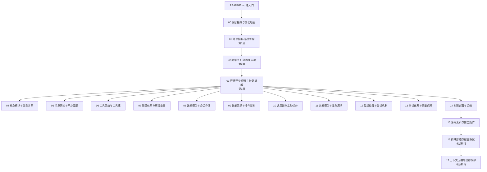

# 阅读指南与文档地图

> 层：第 0 层（导航与约定）
> 状态：已按 `cc0a679f14` 复核
> 复核日期：2026-09-22
> 生成日期：2026-08-19
> 基准提交：`cc0a679f14`（2026-09-21）
> 上一版基准：`8f97ae9aec`（2026-08-17）/ `aff5125f`（2026-08-29 复核时）
> 源码范围：全仓库
> 生成方式：源码静态分析（未运行测试套件）

## 快速摘要

### 架构总览（模块与依赖）

本文件是文档库的"目录中的目录"：定义四层推进规则、核心术语、源码入口索引、定位记法。它本身不参与运行时调用链，其加载顺序即阅读顺序（00 → 01 → 02 → 03 → 04…17）。

**一句话架构**：一个无头的 Python Agent 核心（`AIAgent`），被四种前端形态（CLI / TUI / 桌面端 / Web Dashboard）与一个消息网关（22 个平台插件）复用；核心保持"窄腰"，能力从边缘（skill / plugin / MCP）接入。

### 核心调用序列（逐步逻辑）

无运行时调用。本文件的"消费顺序"为：

1. 读者先读 `README.md` 了解定位与覆盖矩阵；
2. 再读本文件的术语表、定位记法与四层规则；
3. 按 `01 → 02 → 03 → 04…17` 顺序进入后续文档。

### 易错点与边界条件

- 不要跳级：第 3、4 层文档大量引用第 2 层建立的符号与路径，先读前文可显著降低理解成本；
- 术语"session"与"turn"严格区分（见下），混用会导致对持久化与预算机制的误读；
- **四大核心类都是 Mixin 组装**（`AIAgent` 14 / `HermesCLI` 17 / `SessionDB` 14 / `GatewayRunner` 17 个 Mixin）：
  在 `run_agent.py` / `cli.py` / `hermes_state.py` / `gateway/run.py` 里 grep 方法名常常找不到，
  方法体在对应的 `*Mixin` 文件里。**这是本版最容易踩的坑。**
- 文档中所有路径均为**仓库相对路径**；本机绝对路径不进入文档。

## 一、四层推进规则（为什么这样写）

Hermes 代码量巨大（`agent/` 301 个 py、`tools/` 316 个 py、`hermes_cli/` 536 个 py、`plugins/` 245 个 py，
另有约 4789 个 `test_*.py`），一次性平铺所有细节会让新手直接迷失。因此本库强制按四层推进：

| 层 | 问题 | 产出 |
|---|---|---|
| 1 简单框架 | 这个项目是干什么的？运行时有几块？ | 骨架图、边界、主路径 |
| 2 全路径小例子 | 一个真实请求怎么从入口走到返回？ | 一个可跟读的例子 + 全路径时序图 |
| 3 逐步详解 | 每一跳的参数/返回/错误/状态怎么变？ | 逐跳拆解 + Mermaid 对照真实符号 |
| 4 补齐全部 | 其余入口、模块、分支、配置、部署？ | 按模块的深度文档，达可重实现深度 |

## 一点五、定位记法（本版最重要的约定）

**本库不使用绝对行号。** 上一版把绝对行号作为主要定位依据，在 2026-09-21 的一次上游合并
（16321 个 commit）后，全库 117 处行号引用 **100% 失效**，另有 4 个核心符号直接消失。

现行记法：

| 场景 | 写法 |
|---|---|
| 函数/方法 | `agent/turn_facade.py` · `TurnFacadeMixin.run_conversation` `+0` |
| 函数体内某段 | `agent/turn_facade.py` · `TurnFacadeMixin.run_conversation` `+35~+40` |
| 类 | `agent/turn_facade.py` · `class TurnFacadeMixin` `+0` |
| 模块级常量 | `Module:tools/registry.py` · `Const:_MAX_TOOL_ERROR_CHARS` |
| 调用关系 | `cli.py` · `HermesCLI.chat` ↓ `agent/turn_facade.py` · `TurnFacadeMixin.run_conversation` |

其中 `+0` = 符号定义行，`+N` = 符号体内第 N 行。**行号由读者用工具实时获取**：

```bash
python3 docs/sourceReader/.progress/sr_tools.py locate SYM [SYM ...]   # 定位符号
python3 docs/sourceReader/.progress/sr_tools.py outline FILE --top     # 文件骨架
python3 docs/sourceReader/.progress/sr_tools.py offset  FILE SYM       # 符号定义行
python3 docs/sourceReader/.progress/sr_tools.py verify  docs/sourceReader/*.md         # 校验文档引用
```

维护本库前请先读 `docs/sourceReader/.progress/UPDATE-SPEC.md`。

## 二、核心术语表

| 术语 | 定义 | 代码锚点 |
|---|---|---|
| **AIAgent** | 核心对话引擎类，由 **14 个 Mixin** 组装；封装 LLM 调用循环、工具执行、预算、中断 | `run_agent.py` · `class AIAgent` |
| **Mixin 组装** | 本版核心类的组织方式：god-file 拆成若干 `*Mixin`，主类只保留类定义与少量内联逻辑，方法经 MRO 继承 | 见 [04](./04-核心模块与类型关系.md) |
| **turn** | 一次"用户消息 → 多轮 LLM 调用+工具执行 → 最终回复"的完整往返 | `agent/conversation_loop.py` · `run_conversation` |
| **session** | 长期对话上下文（可跨天），持久化在 SQLite | `hermes_state.py` · `class SessionDB` |
| **task_id** | 一次 turn 内工具隔离的标识（terminal/browser 会话按 task 隔离） | `model_tools.py` · `handle_function_call` |
| **toolset** | 一组工具的能力门控单元（如 `desktop_ui`、`project`），**per-session** 生效 | `toolsets.py`、`toolset_distributions.py` |
| **check_fn** | 工具可用性检查函数。**不是**进程级 TTL 缓存，而是 `(check_fn, scope)` 键的 profile 维度缓存 + 30s TTL + 60s 失败宽限；仍**不能**表达 per-session 状态 | `tools/registry.py` · `ToolRegistry.register` |
| **tool_search bridge** | 延迟工具目录的三件套（tool_search / tool_describe / tool_call），把大工具集折叠成可搜索入口 | `tools/tool_search.py` |
| **durable turn lease** | 跨 Hermes 进程对"读会话→运行→回写"区段的串行化租约；探针失败 fail-closed | `agent/turn_facade_lease.py` · `admit_durable_turn_lease` |
| **relay** | `agent/relay_runtime.py` 的会话协调器（`SESSION_COORDINATOR`），负责 turn 的会话租约与逻辑轮次记账。**注意**：它与消息平台连接器中继（`gateway/relay/`）不是一回事 | `agent/relay_runtime.py` |
| **profile** | 独立的 `HERMES_HOME`（`~/.hermes` 或自定义），配置、会话、技能互相隔离 | `hermes_constants.py` · `get_hermes_home` |
| **skill** | Markdown 指令包，以 **user message** 注入（非 system prompt）以保护缓存；`skills.auto_load` / `hermes -s` 预加载是例外（走 system prompt 稳定前缀） | `agent/skill_commands.py` |
| **plugin** | 运行期发现的扩展包；本版起**消息平台适配器也是插件**（`plugins/platforms/`） | `plugins/plugin_loader.py` |
| **contract（契约）** | TUI/桌面前端与后端之间的 JSON-RPC 契约，**单源在 Python 侧**（`tui_gateway/contracts/`），生成 TS 客户端 | 见 [16](./16-前端形态与宿主协议.md) |
| **fast chat launch** | `hermes` / `hermes -z` 的快速启动路径，绕过部分初始化 | `hermes_cli/main.py` |
| **oneshot（-z）** | 只输出最终文本的脚本模式 | `hermes_cli/_parser.py`（`-z` / `--oneshot`） |
| **skin** | 数据驱动的 CLI 主题引擎 | `hermes_cli/skin_engine.py` |
| **MoA** | Mixture of Agents，多模型槽位聚合 | `hermes_cli/moa_cmd.py` |
| **fallback chain** | 主模型失败时按序重试的提供方链 | `agent/agent_init.py` · `_init_fallback_chain`、`agent/credential_pool.py` |
| **compaction（压缩）** | 唯一被允许破坏 prompt 缓存的操作 | 见 [17](./17-上下文压缩与缓存保护.md) |

## 三、源码入口索引（正向追踪起点）

记法：`文件` · `符号` `+0`。

| 入口形态 | 入口文件 | 关键符号 |
|---|---|---|
| 启动器 | `hermes` | 模块级转发到 `hermes_cli.main:main` |
| CLI 主入口 | `hermes_cli/main.py` | `main` `+0` |
| chat 子命令 | `hermes_cli/main.py` | `cmd_chat` `+0` |
| gateway 子命令 | `hermes_cli/main.py` | `cmd_gateway` `+0` |
| dashboard 子命令 | `hermes_cli/main.py` | `cmd_dashboard` `+0` |
| 顶层 parser | `hermes_cli/_parser.py` | `build_top_level_parser` `+0` |
| REPL 编排器 | `cli.py` | `class HermesCLI` `+0`（17 Mixin） |
| 单轮 chat | `hermes_cli/cli_chat_turn_mixin.py` | `CLIChatTurnMixin.chat` `+0` |
| 斜杠命令 | `cli.py` | `HermesCLI.process_command` `+0` |
| Agent 装配（CLI 侧） | `hermes_cli/cli_agent_setup_mixin.py` | `CLIAgentSetupMixin._init_agent` `+0` |
| Agent 初始化实现 | `agent/agent_init.py` | `init_agent` `+0` |
| Agent 门面（turn 准入） | `agent/turn_facade.py` | `TurnFacadeMixin.run_conversation` `+0` |
| 真实对话循环 | `agent/conversation_loop.py` | `run_conversation` `+0` / `_run_conversation_turn` `+0` |
| 每轮上下文装配 | `agent/turn_context.py` | `build_turn_context` `+0` |
| 工具分发 | `model_tools.py` | `handle_function_call` `+0` |
| 工具注册表 | `tools/registry.py` | `ToolRegistry.register` `+0` |
| 会话库 | `hermes_state.py` | `class SessionDB` `+0`（14 Mixin） |
| 消息读写 | `hermes_state_messages.py` | `append_message` `+0` / `get_messages` `+0` |
| 配置（通用） | `hermes_cli/config.py` | `load_config` `+0` |
| 配置（经典 CLI） | `hermes_cli/cli_config_load.py` | `load_cli_config` `+0` |
| 常量/路径 | `hermes_constants.py` | `get_hermes_home` `+0` |
| 日志 | `hermes_logging.py` | `setup_logging` `+0` |
| 网关运行时 | `gateway/run.py` | `class GatewayRunner` `+0`（17 Mixin） |
| 网关进程入口 | `gateway/run.py` | `main` `+0` / `start_gateway` `+0` |
| TUI 后端 | `tui_gateway/` | JSON-RPC 方法目录（见 [16](./16-前端形态与宿主协议.md)） |
| TUI 渲染 | `ui-tui/src/app.tsx` | Ink 主组件 |
| 桌面端 | `apps/desktop/` | 见 `apps/desktop/AGENTS.md` |
| Web Dashboard | `web/` | 内嵌 TUI PTY |

## 四、文档地图（含层级标注）



## 五、与仓库权威文档的关系

- 仓库根 `AGENTS.md` 是**贡献规范**（什么能合并、Footprint Ladder、prompt 缓存规则、测试哲学）——
  本库引用其设计意图，不复制全文。**它是设计意图的权威来源**；
- `gateway/platforms/ADDING_A_PLATFORM.md` 是新增平台指南的权威文件。**注意**：该文件内容已滞后
  （仍描述核心目录下的 telegram/discord/whatsapp 模块，而它们已迁到 `plugins/platforms/`），
  引用时需自行判断；
- `apps/desktop/AGENTS.md` 与 `apps/desktop/DESIGN.md` 是桌面端架构的权威文档，[16](./16-前端形态与宿主协议.md) 引用之；
- `plugins/AGENTS.md` 是插件侧的规范；
- `website/docs/` 是面向最终用户的文档，本库是面向**重新实现者**的源码级文档，两者互补；
- **上游 `docs/` 目录已清空**：上一版引用的 `docs/ADR.md`、`docs/observability/*`、`docs/rfcs/*`、
  `docs/session-lifecycle.md`、`docs/micro-compaction.md` 等 18 个文件在 HEAD 中已不存在。

## 六、验证与可信度约定

- 所有定位以**符号名 + 文件归属**为准；行号请用第一节的工具实时获取。若你检出的提交不同，
  符号名与文件归属通常仍成立，**行号一定漂移**；
- 标注「当前源码无法确定」的结论是基于代码静态推理后的刻意保留，不是遗漏；
- 本库生成与复核过程**未运行测试套件**（仅静态分析），因此对"测试是否通过"不作声明；
  测试策略本身见 [13](./13-测试体系与质量保障.md)；
- 本版更新过程中，逐篇核对时发现并修正了上一版的大量错误描述（含 4 个已消失符号、
  若干错误常量与错误文件归属），这些修正在各篇的正文中就地标注。

---

**导航**：[上一篇 · 总目录](./README.md) ｜ [总目录](./README.md) ｜ [下一篇 · 01-简单框架-系统骨架](./01-简单框架-系统骨架.md)
