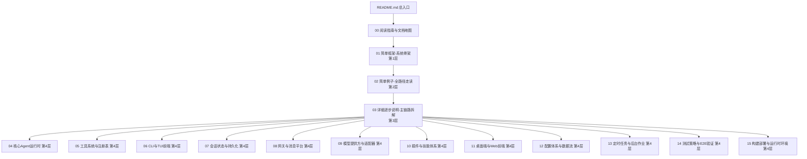

# 阅读指南与文档地图

> 状态：已复核（全部行号/符号与基准提交一致）
> 复核日期：2026-08-29
> 生成日期：2026-08-19
> 基准提交：`8f97ae9aec729bcbbad17da462115e1ec1398421`
> 工作区：dirty（与文档无关的 contributors 邮件文件改动）
> 源码范围：全仓库
> 生成方式：源码静态分析

## 快速摘要

### 架构总览（模块与依赖）

本文件是文档库的"目录中的目录"：定义四层推进规则、核心术语、源码入口索引。它本身不参与运行时调用链，其加载顺序即阅读顺序（00 → 01 → 02 → 03 → 04…15）。

### 核心调用序列（逐步逻辑）

无运行时调用。本文件的"消费顺序"为：
1. 读者先读 `README.md` 了解定位与覆盖矩阵；
2. 再读本文件的术语表与四层规则；
3. 按 `01 → 02 → 03 → 04…15` 顺序进入后续文档。

### 易错点与边界条件

- 不要跳级：第 3、4 层文档大量引用第 2 层建立的符号与路径，先读前文可显著降低理解成本；
- 术语"session"与"turn"严格区分（见下），混用会导致对持久化与预算机制的误读；
- 文档中所有路径均为**仓库相对路径**；本机绝对路径不进入文档。

## 一、四层推进规则（为什么这样写）

Hermes 代码量巨大（核心 Python 约 5 万行、121 个工具文件、20 个平台适配器、约 223 个 tests 子目录条目），一次性平铺所有细节会让新手直接迷失。因此本库强制按四层推进：

| 层 | 问题 | 产出 |
|---|---|---|
| 1 简单框架 | 这个项目是干什么的？运行时有几块？ | 骨架图、边界、主路径 |
| 2 全路径小例子 | 一个真实请求怎么从入口走到返回？ | 一个可跟读的例子 + 全路径时序图 |
| 3 逐步详解 | 每一跳的参数/返回/错误/状态怎么变？ | 逐跳拆解 + Mermaid 对照真实符号 |
| 4 补齐全部 | 其余入口、模块、分支、配置、部署？ | 按模块的深度文档，达可重实现深度 |

## 二、核心术语表

| 术语 | 定义 | 代码锚点 |
|---|---|---|
| **AIAgent** | 核心对话引擎类，封装 LLM 调用循环、工具执行、预算、中断 | `run_agent.py:412 class AIAgent` |
| **turn** | 一次"用户消息 → 多轮 LLM 调用+工具执行 → 最终回复"的完整往返 | `run_agent.py:8333 run_conversation` |
| **session** | 长期对话上下文（可跨天），持久化在 SQLite | `hermes_state.py:3093 class SessionDB` |
| **task_id** | 一次 turn 内工具隔离的标识（terminal/browser 会话按 task 隔离） | `model_tools.py:1192 handle_function_call` |
| **toolset** | 一组工具的能力门控单元（如 `desktop_ui`、`project`），per-session 生效 | `toolsets.py`、`gateway/run.py` |
| **check_fn** | 工具可用性检查函数，**进程级 TTL 缓存**，只回答"是否配置/可达"，不能表达 per-session 状态 | `tools/registry.py:737 register` |
| **tool_search bridge** | 延迟工具目录的三件套（tool_search/tool_describe/tool_call），把大工具集折叠成可搜索入口 | `tools/tool_search.py` |
| **durable turn lease** | 跨 Hermes 进程对"读会话→运行→回写"区段的串行化租约 | `run_agent.py:run_conversation`（#84234） |
| **relay** | 桌面端/网关把 turn 状态转发到前端 UI 的事件通道（turn_id 驱动） | `agent/relay_runtime.py`、`gateway/relay/` |
| **profile** | 独立的 `HERMES_HOME`（`~/.hermes` 或自定义），配置、会话、技能互相隔离 | `hermes_constants.py:114 get_hermes_home` |
| **skill** | Markdown 指令包，以 **user message** 注入（非 system prompt）以保护缓存 | `agent/skill_commands.py` |
| **plugin** | 运行期发现的扩展包（memory/model-providers/platforms 等） | `plugins/`、`hermes_cli/agent_plugins.py` |
| **fast chat launch** | `hermes`/`hermes -z` 的快速启动路径，绕过部分初始化 | `hermes_cli/main.py:_try_fast_chat_launch` |
| **oneshot（-z）** | 只输出最终文本的脚本模式，审批自动旁路 | `hermes_cli/_parser.py`（`-z/--oneshot`） |
| **skin** | 数据驱动的 CLI 主题引擎 | `hermes_cli/skin_engine.py` |
| **MoA** | Mixture of Agents，多模型槽位聚合 | `hermes_cli/moa_cmd.py` |
| **fallback chain** | 主模型失败时按序重试的提供方链 | `hermes_cli/fallback_cmd.py`、`agent/credential_pool.py` |

## 三、源码入口索引（正向追踪起点）

| 入口形态 | 入口文件 | 关键符号 |
|---|---|---|
| CLI 主入口 | `hermes_cli/main.py` | `main()` @12084 |
| chat 子命令 | `hermes_cli/main.py` | `cmd_chat()` @2916 |
| gateway 子命令 | `hermes_cli/main.py` | `cmd_gateway()` @3198 |
| dashboard 子命令 | `hermes_cli/main.py` | `cmd_dashboard()` @10984 |
| REPL 编排器 | `cli.py` | `class HermesCLI` @4666、`process_command()` @11110 |
| Agent 门面 | `run_agent.py` | `class AIAgent` @412、`run_conversation()` @8333、`chat()` @8804 |
| 真实对话循环 | `agent/conversation_loop.py` | `run_conversation()` @1691 |
| 工具分发 | `model_tools.py` | `handle_function_call()` @1192 |
| 工具注册表 | `tools/registry.py` | `register()` @737 |
| TUI 前端 | `ui-tui/src/app.tsx` | Ink 主组件 |
| TUI 后端 | `tui_gateway/server.py` | JSON-RPC 方法目录 |
| 网关运行时 | `gateway/run.py` | `class GatewayRunner` @6411、`run_sync()` @5074 |
| 会话库 | `hermes_state.py` | `class SessionDB` @3093 |
| 配置 | `hermes_cli/config.py` | `load_config()` @3305、`cli.py:load_cli_config()` @411 |
| 常量/路径 | `hermes_constants.py` | `get_hermes_home()` @114 |
| 日志 | `hermes_logging.py` | `setup_logging()` @259 |

## 四、文档地图（含层级标注）

## 五、与仓库权威文档的关系

- 仓库自带 `AGENTS.md`（本目录上级）是**贡献规范**（什么能合并、Footprint Ladder、缓存规则）——本库引用其设计意图，不复制全文；
- `gateway/ADDING_A_PLATFORM.md` 是平台适配器的权威契约，08 篇引用而不重述；
- `apps/desktop/AGENTS.md` 是桌面端架构的权威文档，11 篇引用之；
- `website/docs/` 是面向最终用户的文档，本库是面向**重新实现者**的源码级文档，两者互补。

## 六、验证与可信度约定

- 所有函数行号以基准提交 `8f97ae9` 为准；若你检出的提交不同，行号可能漂移，请以符号名 grep 为准；
- 标注"推断"的结论是基于代码静态推理，未经运行验证；
- 本库生成过程**未运行测试套件**（仅静态分析），因此对"测试是否通过"不作声明；测试策略本身见 14 篇。
