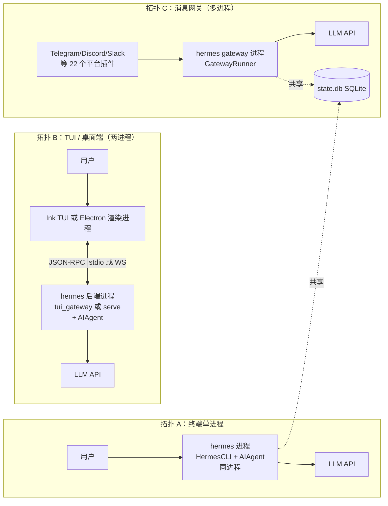
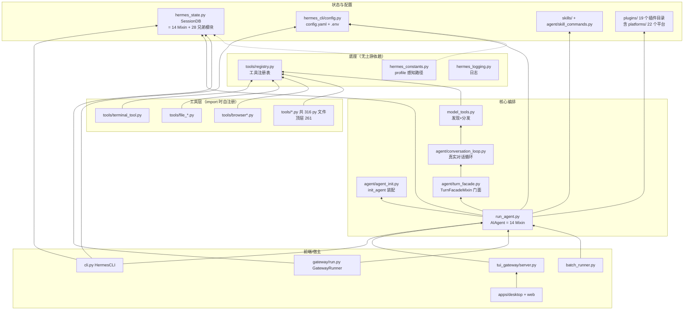
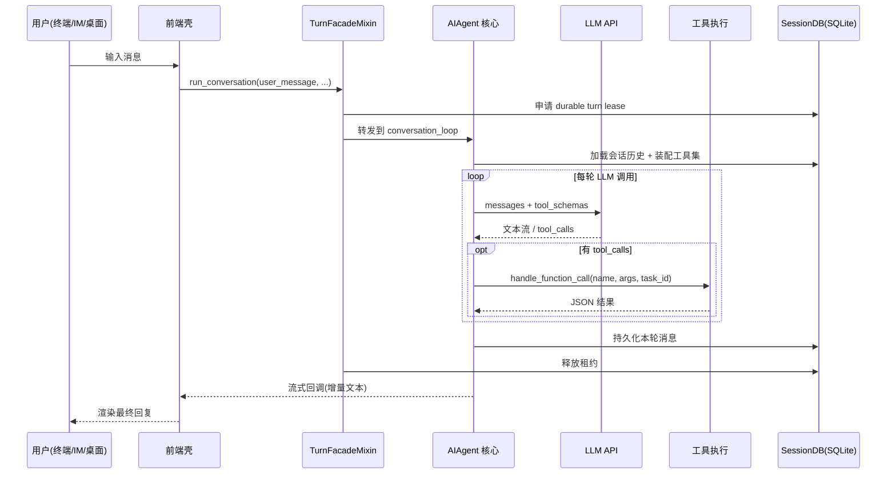

# 01 · 简单框架 — 系统骨架（第 1 层）

> 层：第一层（简单框架）
> 状态：已按 `cc0a679f14` 复核
> 复核日期：2026-09-22
> 生成日期：2026-08-19
> 基准提交：`cc0a679f14`（2026-09-21）
> 上一版基准：`aff5125f`（2026-08-29 复核时）
> 源码范围：全仓库（本篇只展开边界与主路径）
> 生成方式：源码静态分析（未运行测试套件）

## 快速摘要

### 架构总览（模块与依赖）

Hermes 运行时由**一个核心 + 多个前端/宿主**组成。核心是无头（headless）的 Python Agent 运行时；前端是薄壳，通过 stdin、WebSocket JSON-RPC 或 HTTP 与核心通信。

| 部件 | 进程形态 | 职责 |
|---|---|---|
| **核心 Agent 运行时** | Python（`hermes` 启动器 → `hermes_cli.main:main`） | LLM 循环、工具执行、会话持久化、技能/插件加载 |
| **经典 REPL** | 同进程 | `cli.py` · `class HermesCLI`，prompt_toolkit 输入 + Rich 渲染 |
| **TUI** | Node(Ink) 进程 + Python 后端进程 | `ui-tui/`（499 文件）渲染，`tui_gateway/`（91 py）提供 JSON-RPC over stdio |
| **桌面端** | Electron 渲染进程 + `hermes serve` 后端进程 | `apps/desktop/`（2894 文件）经 `apps/shared/`（43 文件）的 WS JSON-RPC 连接无头后端 |
| **Web Dashboard** | 浏览器 + `hermes dashboard` 后端 | `web/`（206 文件）内嵌 TUI 的 PTY（xterm.js），不是重写 |
| **消息网关** | 独立 Python 进程（可装成 systemd/s6 服务） | `gateway/`（169 py）+ **`plugins/platforms/`（22 个平台插件）** 把平台事件转成 turn |
| **外部 LLM API** | 远程 | OpenAI 兼容 / Anthropic / Codex Responses / Bedrock 等，经 `agent/*_adapter.py` |
| **持久化** | 本地文件 | `~/.hermes/state.db`（SQLite FTS5）、`config.yaml`、`.env`、日志、skills、plugins |

> **本版最大的结构变化**：`AIAgent`、`SessionDB`、`GatewayRunner` 三个核心类都已从「god-file 单体类」改造为
> **Mixin 组装类**（分别 14 / 14 / 17 个 Mixin）；消息平台适配器从 `gateway/platforms/` **插件化**到
> `plugins/platforms/`。详见 [04](./04-核心模块与类型关系.md)、[05](./05-消息网关与平台适配.md)、[08](./08-数据模型与会话存储.md)。

### 核心调用序列（逐步逻辑）

最小骨架（细节在 [02](./02-简单例子-全路径走读.md) / [03](./03-详细逐步说明-主链路拆解.md) 篇）：

1. `hermes` 启动器 → `hermes_cli/main.py` · `main` `+0`，解析参数后分发到 `cmd_chat` / `cmd_gateway` / `cmd_dashboard` 等；
2. 前端壳（`HermesCLI` / Ink / Electron）把用户消息交给核心：`agent/turn_facade.py` · `TurnFacadeMixin.run_conversation` `+0`；
3. 该门面做 turn 准入（跨进程租约、relay 作用域、计量上下文）后转发给 `agent/conversation_loop.py` · `run_conversation` `+0`；
4. 循环：调 LLM → 有 `tool_calls` 就经 `model_tools.py` · `handle_function_call` `+0` 执行 → 结果回填消息 → 再调 LLM，直到无 `tool_calls`；
5. 最终文本经流式回调回前端；消息经 `agent/session_persistence.py` 写入 `SessionDB`（SQLite）。

### 易错点与边界条件

- **一个核心，多种"表面"（surface）**：桌面端、TUI、CLI、网关看到的工具集不同——工具可用性是**会话属性**（平台、toolset），不是进程环境变量；
- **缓存优先**：任何前端不得在同一会话中途更换工具集/系统提示（唯一例外是上下文压缩）；
- **网关是独立进程**：并发多平台会话共享同一个 `state.db`，靠 **durable turn lease**（`agent/turn_facade_lease.py`）串行化；
- **Mixin 组装 ≠ 单文件定位**：在 `run_agent.py` / `hermes_state.py` / `gateway/run.py` 里 grep 方法名常常找不到——
  实现体在对应的 `*Mixin` 文件里。定位时先查本层第三节的映射表。

## 一、为什么是这个形状（Why）

Hermes 的设计目标是"**一个 Agent 核心，处处可用**"：同一套工具调用能力要在终端、聊天软件、桌面 App、定时任务里表现一致。因此架构上把 LLM 循环、工具、会话、记忆做成**与前端无关的核心**，前端只负责"输入渲染 + 事件转发"。两条硬约束塑造了具体形态（均见仓库根 `AGENTS.md`）：

1. **Prompt 缓存神圣**：核心循环必须保证同一会话的 system prompt、工具 schema、历史字节稳定 → 所以工具集按会话一次性装配，中途不重装配；会改动 system-prompt 状态的斜杠命令（skills/tools/memory）必须**缓存感知**——默认延迟失效（下个会话生效），配 `--now` 才立即生效；
2. **窄腰核心，能力在边缘**：每个核心工具都随每次 API 调用发送 → 新能力优先做成 skill/plugin/MCP，而不是新核心工具。

这两条也解释了本版观察到的两个重构方向：**平台适配器插件化**（`plugins/platforms/`）与 **god-file 拆成 Mixin**
（`run_agent.py` 从 8800+ 行降到 1609 行、`cli.py` 从 11000+ 行降到 1820 行）。仓库 `AGENTS.md` 明确把
"Refactor god-files into clean modules" 列为**受欢迎**的工作，与"扩展边缘"并列。

## 二、进程与模块骨架（What）

### 2.1 三种典型部署拓扑

要点：

- **拓扑 A** 最简单：`cli.py` 与核心 Agent 同进程，直接方法调用；
- **拓扑 B**：渲染层（TS）与 Agent（Python）分离。TUI 用 stdio JSON-RPC（`tui_gateway/`），桌面端用 WebSocket JSON-RPC（`apps/shared/` 的 `JsonRpcGatewayClient`）；
- **拓扑 C**：网关进程与 CLI/桌面端**共享同一个 SQLite 会话库**，因此有跨进程租约（durable turn lease）与"平台会话 ↔ 本地会话"路由。

### 2.2 核心模块依赖图（谁依赖谁）

读图规则：箭头方向 = "依赖/调用"。`tools/registry.py` 在依赖链最底部（零上游依赖），保证循环 import 安全。

### 2.3 数据从哪进、到哪出（主路径）

## 三、真实代码映射（本层最小映射）

本层只做骨架，但每个边界都必须能落到真实符号。**记法：`文件` · `符号` `+N`，`+0` = 定义行。**

| 边界 | 真实文件 | 真实符号 |
|---|---|---|
| 启动器 | `hermes` | 模块级转发到 `hermes_cli.main:main` |
| CLI 进程入口 | `hermes_cli/main.py` | `main` `+0` |
| CLI 子命令入口 | `hermes_cli/main.py` | `cmd_chat` `+0` |
| 顶层 parser | `hermes_cli/_parser.py` | `build_top_level_parser` `+0` |
| REPL 编排器 | `cli.py` | `class HermesCLI` `+0` |
| 每轮状态载体 | `cli.py` | `class _ChatTurn` `+0` |
| Agent 装配（CLI 侧） | `hermes_cli/cli_agent_setup_mixin.py` | `_init_agent` `+0` |
| Agent 类 | `run_agent.py` | `class AIAgent` `+0`（14 Mixin 组装） |
| Agent 初始化实现 | `agent/agent_init.py` | `init_agent` `+0` |
| Agent 门面（turn 准入） | `agent/turn_facade.py` | `TurnFacadeMixin.run_conversation` `+0` |
| 真实对话循环 | `agent/conversation_loop.py` | `run_conversation` `+0` |
| 每轮上下文装配 | `agent/turn_context.py` | `build_turn_context` `+0` |
| 工具分发 | `model_tools.py` | `handle_function_call` `+0` |
| 工具参数强转 | `tools/arg_coercion.py` | `coerce_tool_args` `+0` |
| 工具注册表 | `tools/registry.py` | `ToolRegistry.register` `+0` |
| 会话存储 | `hermes_state.py` | `class SessionDB` `+0`（14 Mixin 组装） |
| 配置加载（通用） | `hermes_cli/config.py` | `load_config` `+0` |
| 配置加载（经典 CLI） | `hermes_cli/cli_config_load.py` | `load_cli_config` `+0` |
| profile 路径 | `hermes_constants.py` | `get_hermes_home` `+0` |
| 日志初始化 | `hermes_logging.py` | `setup_logging` `+0` |
| 网关运行时 | `gateway/run.py` | `class GatewayRunner` `+0`（17 Mixin 组装） |
| 网关进程入口 | `gateway/run.py` | `main` `+0` / `start_gateway` `+0` |
| 单轮执行器 | `gateway/run_turn_runner.py` | `TurnRunner.run_sync` `+0` |
| 批处理 | `batch_runner.py` | 离线数据集评测入口（**不是**运行时并发路径） |

## 四、模块职责速查（边界，不展开内部）

| 模块 | 一句话职责 | 关键入口符号 |
|---|---|---|
| `hermes_cli/main.py` | CLI 进程入口、argparse、子命令分发、启动自愈（3637 行） | `main` `+0` |
| `hermes_cli/_parser.py` | 顶层 parser 与 chat subparser 构建 | `build_top_level_parser` `+0` |
| `cli.py` | REPL 编排器：输入、命令、皮肤、Agent 装配（1820 行） | `class HermesCLI` `+0` |
| `hermes_cli/cli_agent_setup_mixin.py` | `HermesCLI` 的 Agent 装配逻辑 | `_init_agent` `+0` |
| `run_agent.py` | AIAgent 类定义与少量内联逻辑（1609 行，**已大幅拆薄**） | `class AIAgent` `+0` |
| `agent/agent_init.py` | Agent 装配主体：provider 路由、client 构建、fallback 链、工具加载（2466 行） | `init_agent` `+0` |
| `agent/turn_facade.py` | turn 准入门面：跨进程租约、relay 作用域、计量上下文 | `TurnFacadeMixin.run_conversation` `+0` |
| `agent/conversation_loop.py` | 真实同步对话循环（1745 行） | `run_conversation` `+0` |
| `agent/turn_context.py` | 每轮上下文装配（1246 行） | `build_turn_context` `+0` |
| `model_tools.py` | 工具发现与分发（987 行） | `handle_function_call` `+0` |
| `tools/registry.py` | 中央注册表：schema、handler、toolset、check_fn | `ToolRegistry.register` `+0` |
| `tools/*.py` | 316 个工具实现文件（顶层 261），import 时自注册 | — |
| `toolsets.py` / `toolset_distributions.py` | toolset 定义与抽样分发 | — |
| `hermes_state.py` + 28 个 `hermes_state_*.py` | 会话 SQLite 库（FTS5 搜索、schema、迁移、租约、锁） | `class SessionDB` `+0` |
| `hermes_cli/config.py` / `hermes_cli/cli_config_load.py` | config.yaml + .env 两条独立加载链 | `load_config` / `load_cli_config` `+0` |
| `hermes_constants.py` | profile 感知的 `HERMES_HOME` | `get_hermes_home` `+0` |
| `hermes_logging.py` | `agent.log` / `errors.log` / `gateway.log`(mode 门控) / `gui.log` | `setup_logging` `+0` |
| `hermes_startup_watchdog.py` | 启动看门狗 | 见 [11](./11-并发模型与生命周期.md) |
| `gateway/run.py` | 网关运行时：平台事件 → turn（17 Mixin 组装） | `class GatewayRunner` `+0` |
| `gateway/platforms/` | 网关侧**基础设施** + 9 个内置适配器 | 见 [05](./05-消息网关与平台适配.md) |
| `plugins/platforms/` | **22 个平台适配器插件**（a2a/buzz/dingtalk/discord/email/feishu/google_chat/homeassistant/irc/line/matrix/mattermost/ntfy/photon/raft/simplex/slack/sms/teams/telegram/wecom/whatsapp） | 各插件目录入口 |
| `tui_gateway/server.py` | TUI 后端 JSON-RPC 方法目录 | — |
| `ui-tui/src/` | Ink(React) 渲染层 | 主组件 `ui-tui/src/app.tsx` |
| `apps/desktop/` | Electron 桌面端（独立聊天面） | 见 `apps/desktop/AGENTS.md` |
| `apps/shared/` | 桌面端+Web 共用的 WS JSON-RPC 客户端 | `JsonRpcGatewayClient` |
| `web/` | Dashboard 前端（内嵌 TUI PTY） | — |
| `acp_adapter/` | ACP（Agent Client Protocol）适配（14 py） | — |
| `agent/*_adapter.py` | 各 LLM 提供方适配（anthropic/codex/bedrock/azure…） | — |
| `agent/credential_pool.py` | 凭据池 + fallback | — |
| `agent/skill_commands.py` | skill 斜杠命令扫描 | — |
| `plugins/` | 19 个插件目录（memory / model-providers / platforms / kanban / observability / image_gen / …） | 各插件的 `plugin.yaml` 清单 |
| `cron/` | 定时任务（31 py，已拆为 `scheduler_*.py` 一族） | 见 [10](./10-调度器与定时任务.md) |
| `batch_runner.py` | 离线数据集评测批处理 | — |
| `evals/` | 评测套件（211 文件），与 `tests/` 分工不同 | 见 [13](./13-测试体系与质量保障.md) |
| `skills/`、`optional-skills/` | 内置 58 / 可选 150 个技能包 | 各技能包内的 SKILL.md |
| `compat_manifest.json` / `COMPAT_MANIFEST.md` | 兼容性清单 | 见 [14](./14-构建部署与运维.md) |

## 五、扩展点的"脚注阶梯"（Footprint Ladder 速记）

新增能力时从**低脚注**往高选（详见仓库 `AGENTS.md`）：

1. 扩展已有代码 → 2. CLI 命令 + skill → 3. `check_fn` 门控工具 → 4. 插件（`~/.hermes/plugins/`）→ 5. 目录内 MCP server → 6. 新核心工具（最后手段）

这解释了为什么 `tools/` 里有 261 个顶层文件却只有一部分进核心工具集：很多是 `check_fn` 门控（如 Home Assistant、memory provider），默认不随每次 API 调用发送。

> **注意**：仓库 `AGENTS.md` 同时规定**第三方产品类插件**（可观测后端、厂商 SaaS 连接器、分析面板）**不落在本仓库
> `plugins/` 下**，而要作为独立插件仓库发布。本仓库 `plugins/` 里的是第一方能力。

## 六、本层结论

读完本层你应能回答：

- **干什么**：一个核心 Agent 引擎 + 4 种前端 + 22 个平台插件的个人 AI 代理；
- **几块**：核心运行时、前端壳（REPL/TUI/桌面/Web）、网关、LLM API、SQLite 状态；
- **请求怎么走**：前端 → `TurnFacadeMixin.run_conversation`（turn 准入）→ 对话循环（LLM ↔ 工具）→ 流式回前端 + 落库；
- **改代码时去哪找**：三大核心类都是 Mixin 组装，先查第三节映射表再 grep。

下一步进入 [02-简单例子-全路径走读](./02-简单例子-全路径走读.md)，用一个真实最小例子把这条主路径走完。

---

**导航**：[上一篇 · 00-阅读指南与文档地图](./00-阅读指南与文档地图.md) ｜ [总目录](./README.md) ｜ [下一篇 · 02-简单例子-全路径走读](./02-简单例子-全路径走读.md)
