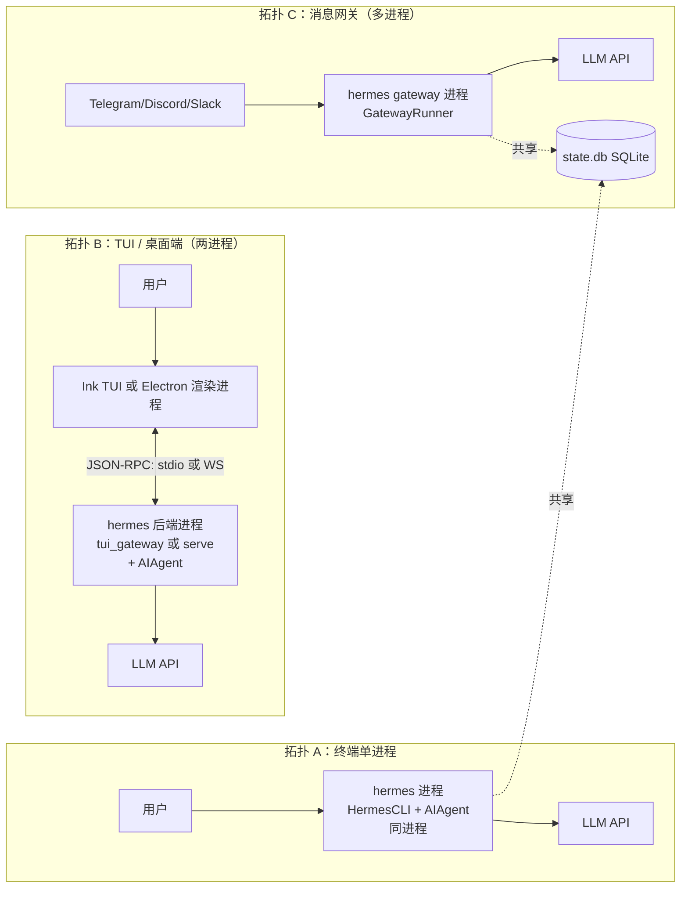
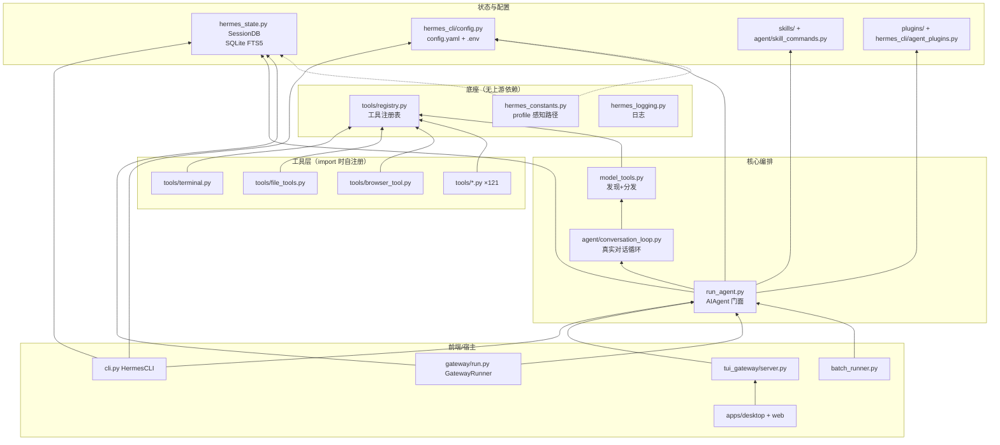
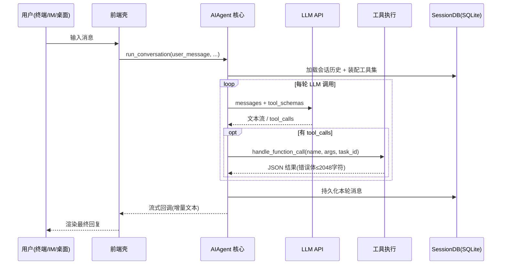

# 01 · 简单框架 — 系统骨架（第 1 层）

> 状态：已复核（全部行号/符号与基准提交一致）
> 复核日期：2026-08-29
> 生成日期：2026-08-19
> 基准提交：`8f97ae9aec729bcbbad17da462115e1ec1398421`
> 复核方式：2026-08-29 逐一 grep 校验全部带行号符号与被引用文件，全部命中
> 源码范围：全仓库（本篇只展开边界与主路径）
> 生成方式：源码静态分析

## 快速摘要

### 架构总览（模块与依赖）

Hermes 运行时由**一个核心 + 多个前端/宿主**组成。核心是无头（headless）的 Python Agent 运行时；前端是薄壳，通过 stdin、WebSocket JSON-RPC 或 HTTP 与核心通信。

| 部件 | 进程形态 | 职责 |
|---|---|---|
| **核心 Agent 运行时** | Python（`hermes` 可执行） | LLM 循环、工具执行、会话持久化、技能/插件加载 |
| **经典 REPL** | 同进程（`hermes` 直接跑） | `cli.py` 的 `HermesCLI`，prompt_toolkit 输入 + Rich 渲染 |
| **TUI** | Node(Ink) 进程 + Python 后端进程 | `ui-tui/` 渲染，`tui_gateway/` 提供 JSON-RPC over stdio |
| **桌面端** | Electron 渲染进程 + `hermes serve` 后端进程 | `apps/desktop/` 通过 `apps/shared` 的 WS JSON-RPC 连接无头后端 |
| **Web Dashboard** | 浏览器 + `hermes dashboard` 后端 | `web/` 内嵌 `hermes --tui` 的 PTY（xterm.js），不是重写 |
| **消息网关** | 独立 Python 进程（可装成 systemd/s6 服务） | `gateway/` 对接 Telegram/Discord/Slack 等，把平台事件转成 turn |
| **外部 LLM API** | 远程 | OpenAI 兼容 / Anthropic / Codex Responses 等，经 `agent/*_adapter.py` |
| **持久化** | 本地文件 | `~/.hermes/state.db`（SQLite FTS5）、`config.yaml`、`.env`、日志、skills、plugins |

### 核心调用序列（逐步逻辑）

最小骨架（细节在 02/03 篇）：

1. `hermes_cli/main.py:main()` 解析参数 → 分发到 `cmd_chat` / `cmd_gateway` / `cmd_dashboard` 等；
2. 前端壳（`HermesCLI` / Ink / Electron）把用户消息交给核心：`AIAgent.run_conversation()`；
3. `agent/conversation_loop.py:run_conversation()` 循环：调 LLM → 有 tool_calls 就经 `model_tools.handle_function_call()` 执行 → 结果回填消息 → 再调 LLM，直到无 tool_calls；
4. 最终文本经流式回调回前端；消息写入 `SessionDB`（SQLite）。

### 易错点与边界条件

- **一个核心，多种"表面"（surface）**：桌面端、TUI、CLI、网关看到的工具集不同——工具可用性是**会话属性**（平台、toolset），不是进程环境变量；
- **缓存优先**：任何前端不得在同一会话中途更换工具集/系统提示；
- **网关是独立进程**：并发多平台会话共享同一个 `state.db`，靠 durable turn lease 串行化。

## 一、为什么是这个形状（Why）

Hermes 的设计目标是"**一个 Agent 核心，处处可用**"：同一套工具调用能力要在终端、聊天软件、桌面 App、定时任务里表现一致。因此架构上把 LLM 循环、工具、会话、记忆做成**与前端无关的核心**，前端只负责"输入渲染 + 事件转发"。两条硬约束塑造了具体形态：

1. **Prompt 缓存神圣**：核心循环必须保证同一会话的 system prompt、工具 schema、历史字节稳定 → 所以工具集按会话一次性装配，中途不重装配；
2. **窄腰核心**：每个核心工具都随每次 API 调用发送 → 新能力优先做成 skill/plugin/MCP，而不是新核心工具。

## 二、进程与模块骨架（What）

### 2.1 三种典型部署拓扑

要点：
- **拓扑 A** 最简单：`cli.py` 与 `run_agent.py` 同进程，直接方法调用；
- **拓扑 B**：渲染层（TS）与 Agent（Python）分离。TUI 用 stdio JSON-RPC（`tui_gateway/server.py`），桌面端用 WebSocket JSON-RPC（`apps/shared/src/json-rpc-gateway.ts:95 JsonRpcGatewayClient`）；
- **拓扑 C**：网关进程与 CLI/桌面端**共享同一个 SQLite 会话库**，因此有跨进程租约（durable turn lease）与"平台会话 ↔ 本地会话"路由（`gateway/profile_routing.py`、`gateway/session.py`）。

### 2.2 核心模块依赖图（谁依赖谁）

读图规则：箭头方向 = "依赖/调用"。`tools/registry.py` 在依赖链最底部（零上游依赖），保证循环 import 安全（见 `tools/registry.py` 头部注释）。

### 2.3 数据从哪进、到哪出（主路径）

## 二点五、真实代码映射（本层最小映射）

本层只做骨架，但每个边界都必须能落到真实符号：

| 边界 | 真实文件 | 真实符号 |
|---|---|---|
| CLI 进程入口 | `hermes_cli/main.py` | `main()` @12084 |
| CLI 子命令入口 | `hermes_cli/main.py` | `cmd_chat(args)` @2916 |
| 顶层 parser | `hermes_cli/_parser.py` | `build_top_level_parser()` @87 |
| REPL 编排器 | `cli.py` | `HermesCLI` @4666 |
| Agent 门面 | `run_agent.py` | `AIAgent` @412 |
| Agent 门面转发 | `run_agent.py` | `AIAgent.run_conversation()` @8333 |
| 真实对话循环 | `agent/conversation_loop.py` | `run_conversation()` @1691 |
| 每轮上下文装配 | `agent/turn_context.py` | `build_turn_context()` @431 |
| 工具分发 | `model_tools.py` | `handle_function_call()` @1192 |
| 工具注册表 | `tools/registry.py` | `register()` @737 |
| 会话存储 | `hermes_state.py` | `SessionDB` @3093 |
| 配置加载 | `hermes_cli/config.py` | `load_config()` @3305 |
| profile 路径 | `hermes_constants.py` | `get_hermes_home()` @114 |
| 日志初始化 | `hermes_logging.py` | `setup_logging()` @259 |
| 网关运行时 | `gateway/run.py` | `GatewayRunner` @6411 |
| 网关同步入口 | `gateway/run.py` | `run_sync()` @5074 |
| 批处理 | `batch_runner.py` | 模块级并行批处理入口 |

## 三、模块职责速查（边界，不展开内部）

| 模块 | 一句话职责 | 关键入口符号 |
|---|---|---|
| `hermes_cli/main.py` | CLI 进程入口、argparse、子命令分发、启动自愈 | `main()` @12084 |
| `hermes_cli/_parser.py` | 顶层 parser 与 chat subparser 构建 | `build_top_level_parser()` |
| `cli.py` | REPL 编排器：输入、命令、皮肤、Agent 装配 | `HermesCLI` @4666、`process_command()` @11110、`load_cli_config()` @411 |
| `hermes_cli/cli_agent_setup_mixin.py` | `HermesCLI` 的 Agent 装配逻辑 | `_init_agent()` @339 |
| `run_agent.py` | AIAgent 门面：参数、预算、中断、转发到循环 | `AIAgent` @412、`run_conversation()` @8333、`chat()` @8804 |
| `agent/conversation_loop.py` | 真实同步对话循环（LLM 调用 + 工具执行 + 预算/中断） | `run_conversation()` @1691 |
| `model_tools.py` | 工具发现（`get_tool_definitions`）与分发（`handle_function_call`） | `handle_function_call()` @1192 |
| `tools/registry.py` | 中央注册表：schema、handler、toolset、check_fn | `register()` @737 |
| `tools/*.py` | 121 个工具实现，import 时自注册 | — |
| `toolsets.py` | toolset 定义与 `_HERMES_CORE_TOOLS` | — |
| `hermes_state.py` | 会话 SQLite 库（FTS5 搜索、schema、portability） | `SessionDB` @3093 |
| `hermes_cli/config.py` | config.yaml + .env 加载 | `load_config()` @3305 |
| `hermes_constants.py` | profile 感知的 `HERMES_HOME` | `get_hermes_home()` @114 |
| `hermes_logging.py` | agent.log / errors.log / gateway.log | `setup_logging()` @259 |
| `gateway/run.py` | 网关运行时：平台事件 → turn | `GatewayRunner` @6411、`run_sync()` @5074 |
| `gateway/platforms/*` | 每平台一个适配器（telegram/discord/slack/…） | 见 `gateway/ADDING_A_PLATFORM.md` |
| `tui_gateway/server.py` | TUI 后端 JSON-RPC 方法目录 | — |
| `ui-tui/src/*` | Ink(React) 渲染层 | `app.tsx` |
| `apps/desktop/` | Electron 桌面端（独立聊天面） | 见 `apps/desktop/AGENTS.md` |
| `apps/shared/src/json-rpc-gateway.ts` | 桌面端+Web 共用的 WS JSON-RPC 客户端 | `JsonRpcGatewayClient` @95 |
| `web/` | Dashboard 前端（内嵌 TUI PTY） | `ChatPage.tsx` |
| `agent/*_adapter.py` | 各 LLM 提供方适配（anthropic/codex/bedrock/…） | — |
| `agent/credential_pool.py` | 凭据池 + fallback | — |
| `agent/skill_commands.py` | skill 斜杠命令扫描（以 user message 注入） | — |
| `plugins/` | memory / model-providers / platforms / kanban / … | 各插件 `register()` |
| `cron/` | 定时任务 | `scheduler.py`、`jobs.py` |
| `batch_runner.py` | 并行批处理 | — |
| `skills/`、`optional-skills/` | 内置/可选技能包 | 各 `SKILL.md` |

## 四、扩展点的"脚注阶梯"（Footprint Ladder 速记）

新增能力时从**低脚注**往高选（详见仓库 `AGENTS.md`）：

1. 扩展已有代码 → 2. CLI 命令 + skill → 3. `check_fn` 门控工具 → 4. 插件（`~/.hermes/plugins/`）→ 5. 目录内 MCP server → 6. 新核心工具（最后手段）

这解释了为什么 `tools/` 里有 121 个文件却只有一部分进 `_HERMES_CORE_TOOLS`：很多是 `check_fn` 门控（如 Home Assistant、memory provider），默认不随每次 API 调用发送。

## 五、本层结论

读完本层你应能回答：
- **干什么**：一个核心 Agent 引擎 + 4 种前端 + 20+ 消息平台的个人 AI 代理；
- **几块**：核心运行时、前端壳（REPL/TUI/桌面/Web）、网关、LLM API、SQLite 状态；
- **请求怎么走**：前端 → `AIAgent.run_conversation` → 循环（LLM ↔ 工具）→ 流式回前端 + 落库。

下一步进入 [02-简单例子-全路径走读](./02-简单例子-全路径走读.md)，用一个真实最小例子把这条主路径走完。
