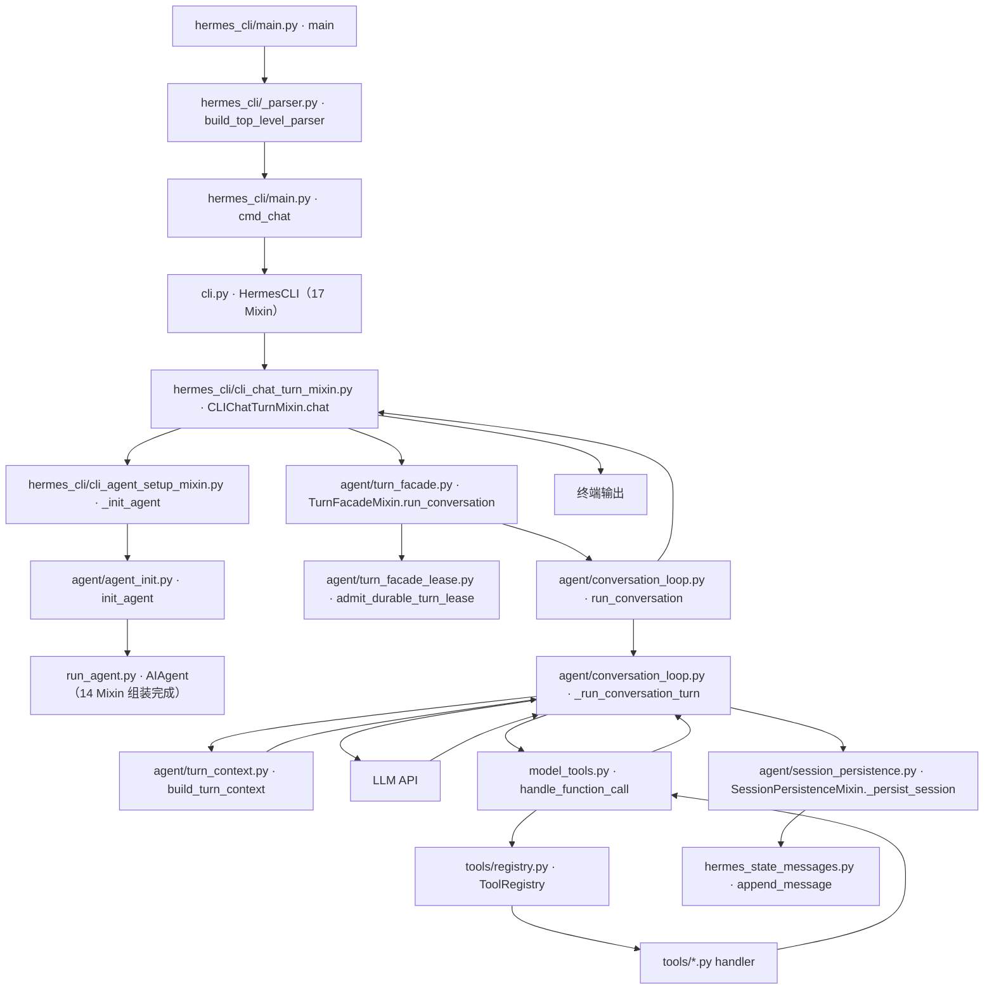

# 03 详细逐步说明：主链路拆解

> 层：第三层（详细逐步说明）
> 状态：已按 `cc0a679f14` 复核
> 复核日期：2026-09-22
> 生成日期：2026-08-19
> 前置阅读：[02-简单例子-全路径走读](./02-简单例子-全路径走读.md)
> 后续阅读：第四层模块文档（[04](./04-核心模块与类型关系.md) 起）

> **记法约定**：`文件路径` · `符号名` `+N`，`+0` = 定义行，`+N` = 符号体内第 N 行。
> 不使用绝对行号。

## 一、本层目标

在第二层已经走通 `hermes -z "hello"` 主路径之后，本层把每一跳拆开，讲清：

- 谁调用谁；
- 参数如何传递；
- 返回值如何消费；
- 错误如何传播；
- 状态如何变化。

本层仍以**主成功路径**为主。失败、重试、压缩、并发、插件钩子、缓存失效等复杂分支只标注"第四层展开"，不在这里铺开。

## 二、主链路总览



**与上一版的差异**：新增了第 6 跳（`agent_init.init_agent` 装配）与第 8 跳的分层
（`run_conversation` 薄壳 + `_run_conversation_turn` 实现）；`AIAgent` 的方法不再在 `run_agent.py` 里。

## 三、逐跳拆解

### 跳 1：`hermes_cli/main.py` · `main` `+0`

#### 谁调用谁

- `hermes` 启动器脚本（仓库根 `hermes`，模块级 `from hermes_cli.main import main`）调用 `main()`；
- 操作系统启动 Python 进程。

#### 参数

- 无显式参数；读 `sys.argv`，例如 `["hermes", "-z", "hello"]`。

#### 返回值

- 通常 `None` 或进程退出码；正常路径由子命令函数返回。
- 一次性模式（oneshot）有独立硬退出路径：`_exit_after_oneshot` `+0` / `_run_and_exit_oneshot` `+0` /
  `_cleanup_oneshot_runtime` `+0`（都在本文件）。

#### 状态变化

1. `_set_process_title` `+0`：设置进程标题；
2. `_warn_if_unsupervised_pid1` `+0`：PID 1 无 reaper 时告警；
3. `_apply_profile_override` `+0`：**导入重量级模块之前**预解析 `--profile` / `-p`，设置 `HERMES_HOME`；
4. 启动自愈：清理旧更新残留、过期 bytecode、半成品 venv；
5. `_is_termux_startup_environment` `+0` 分支下的 Termux 专用处理；
6. `_config_default_interface_early` `+0` / `_wants_tui_early` `+0`：argparse 之前判定界面；
7. 构建 parser 后进入子命令。

#### 错误传播

- 启动自愈类操作基本 `try/except` 吞掉，不阻断主流程；
- 致命错误由子命令或 Python 异常向上传播；
- `_require_tty` `+0`：stdin 非终端时 `exit 1`（避免 curses/`input()` 提示在非 TTY 上 100% CPU 空转）。

### 跳 2：`hermes_cli/_parser.py` · `build_top_level_parser` `+0`

#### 谁调用谁

- `main()` 调用 `build_top_level_parser()`。

#### 参数

- 无显式参数。

#### 返回值

- `(parser, subparsers, chat_parser)`。

#### 状态变化

- 创建 argparse 对象；
- 注册 chat 子命令参数，包括 `-z` / `--oneshot`（`metavar="PROMPT"`）、`-m` / `--model`、
  `--provider`、`--reasoning`、`-t` / `--toolsets`、`-s` / `--skills`、`-c` / `--continue`、
  `-r` / `--resume`、`--in`、`--usage-file` 等；
- 模块级 `_KNOWN_FLAGS` 集合登记全部已知 flag（`+0` 附近），供早期 argv 扫描使用。

#### 错误传播

- parser 构建错误直接抛出，属启动期配置错误。

### 跳 3：`hermes_cli/main.py` · `cmd_chat` `+0`

#### 谁调用谁

- `main()` 通过 `args.func(args)` 调用 `cmd_chat(args)`。

#### 参数

- `args`：argparse Namespace，含 `-z` 对应的消息文本、`--in`、`--resume`、`--continue` 等。

#### 返回值

- 正常路径返回 `None` 或退出码；**首次运行且无 provider 时提前 return**。

#### 状态变化（按源码顺序）

1. `_apply_safe_mode(args)` `+0`；
2. `_apply_user_config_bypass(args)` `+0`、`_guard_noninteractive_user_config(args)` `+0`；
3. `stream_json_requested(args)` `+0`（`hermes_cli/stream_json.py`）——结构化 stdout 会覆盖
   `HERMES_TUI` / `display.interface`；否则用 `_resolve_use_tui(args)` `+0`
   （定义在 `hermes_cli/main_tui_launch.py`）；
4. `_resolve_chat_session_args(args, use_tui)` `+0`：归一化 `--in` / `--resume` / `--continue`；
5. `_warn_retired_xai_models()` `+0`；
6. `run_bootstrap(announce=False)` `+0`（`hermes_cli/free_tier_bootstrap.py`）：首跑身份引导；
7. `_has_any_provider_configured()` `+0` 为假 → `_first_run_setup_guard(args)` `+0` 并 return；
8. `_start_chat_background_prefetch()` `+0`：后台预取；
9. 进入 CLI 运行路径。

#### 错误传播

- `--in` 目录不存在时打印错误并 `sys.exit(1)`；
- 会话恢复失败时打印错误并退出；
- 其他异常向上传播。

### 跳 4：`cli.py` · `class HermesCLI` `+0`（17 个 Mixin）

#### 谁调用谁

- `cmd_chat()` 构造并驱动 `HermesCLI`。

#### 关键事实

`HermesCLI` 是 **17 个 Mixin 组装**，方法体分散在 `hermes_cli/cli_*_mixin.py`。
完整映射表见 [02 篇 5.4 节](./02-简单例子-全路径走读.md)。

#### 关键方法

- `CLIChatTurnMixin.chat` `+0`（`hermes_cli/cli_chat_turn_mixin.py`）：执行一次用户消息；
- `HermesCLI.process_command` `+0`（`cli.py`）：处理斜杠命令；
- `CLIAgentSetupMixin._init_agent` `+0`（`hermes_cli/cli_agent_setup_mixin.py`）：装配 `AIAgent`；
- `load_cli_config` `+0`（`hermes_cli/cli_config_load.py`）：合并默认配置和用户 `config.yaml`；
- `CLIInitMixin.__init__` `+0`（`hermes_cli/cli_init_mixin.py`）：构造；
- 每轮状态载体 `class _ChatTurn` `+0`（`cli.py`）。

#### 参数

- 一次性消息路径传入用户文本 `"hello"`。

#### 返回值

- 最终响应文本或状态。

#### 状态变化

- `_claim_active_session` `+0`（`hermes_cli/cli_session_mixin.py` 一族）：抢占全局 active-session 槽位；
- 加载皮肤、注册命令、构造 Agent 实例；
- 将用户消息交给 Agent（经 `_ChatTurn` 承载本轮状态）；
- 接收最终响应并打印；
- 退出时 `_run_cleanup` `+0` 保证资源清理**恰好执行一次**。

#### 错误传播

- Agent 初始化失败阻止进入对话；
- 对话异常向上传播给 CLI 层处理。

### 跳 5：`hermes_cli/cli_agent_setup_mixin.py` · `CLIAgentSetupMixin._init_agent` `+0`

#### 谁调用谁

- `HermesCLI` 调用 `_init_agent()`。

#### 参数

- `model_override`、`runtime_override`、`request_overrides` 等可选参数。

#### 返回值

- `bool`，表示 Agent 是否成功初始化。

#### 状态变化

- 解析 provider / model / api_mode；
- 构造 `AIAgent`（构造本身是转发，见跳 6）；
- 设置 CLI 回调、工具集、会话上下文。

#### 错误传播

- 配置缺失、凭据缺失、模型解析失败时返回 `False` 或抛出，由 CLI 提示用户。

### 跳 6：`agent/agent_init.py` · `init_agent` `+0`（本版新增的一跳）

#### 谁调用谁

- `run_agent.py` · `class AIAgent` `+0` 的 `__init__` 是**纯转发器**：收集 `locals()` 去掉 `self`
  与已废弃的 `tool_delay`，然后 `from agent.agent_init import init_agent; init_agent(self, **init_kwargs)`。

#### 参数

- `agent`（正在构造的实例）+ `AIAgent.__init__` 的全部关键字参数（`base_url` / `api_key` /
  `provider` / `api_mode` / `model` / 各种 callback / `session_db` / `iteration_budget` /
  `fallback_model` / `credential_pool` / `capabilities` / `cwd` 等数十项）。

#### 返回值

- `None`（就地初始化 `agent` 的属性）。

#### 状态变化

`agent/agent_init.py` 有 2466 行，装配按有序相位推进（相位清单见
[04-核心模块与类型关系](./04-核心模块与类型关系.md)），主路径上依次包含：

1. provider / api_mode 解析：`_resolve_api_mode` `+0`、`_finalize_routing` `+0`；
2. 默认值装配：`_set_defaults` `+0`；
3. prompt cache 配置：`_init_prompt_cache_config` `+0`；
4. 日志：`_setup_logging` `+0`；
5. client 构建：按 api_mode 分派到 `_init_anthropic_client` `+0` / `_init_moa_client` `+0` /
   `_init_bedrock_client` `+0` / `_init_openai_client` `+0`；
6. fallback 链：`_init_fallback_chain` `+0`（`_fallback_entries` `+0` 归一化旧格式）；
7. 工具加载：`_load_tools` `+0`；
8. 会话状态：`_init_session_state` `+0`、`_publish_session_id` `+0`（把 session id 通过
   ContextVar 暴露给工具，保留 `os.environ` 兼容回退）。

#### 错误传播

- 路由解析失败、凭据缺失在此阶段抛出，由 CLI 层捕获并提示；
- `_warn_memory_provider_unavailable` `+0`：memory provider 不可用时**只告警一次**，不阻断。

### 跳 7：`agent/turn_facade.py` · `TurnFacadeMixin.run_conversation` `+0`

#### 谁调用谁

- `CLIChatTurnMixin.chat()` 调用 `AIAgent.run_conversation()`；
- 该方法由 `AIAgent` 经 MRO 从 `TurnFacadeMixin` 继承——**符号不在 `run_agent.py` 中**。

#### 参数

```python
run_conversation(
    self,
    user_message,
    system_message=None,
    conversation_history=None,
    task_id=None,
    stream_callback=None,
    persist_user_message=None,
    persist_user_timestamp=None,
    persist_user_display_kind=None,
    persist_user_display_metadata=None,
    persist_user_platform_id=None,   # 本版新增
    moa_config=None,
    turn_author=None,                # 本版新增
    relay_metadata=None,             # 本版新增
)
```

#### 返回值

- `Dict[str, Any]`，至少包含 `final_response`。

#### 状态变化（turn 准入，本版大幅扩展）

1. `cancel_background_review_for_live_turn(self)`：review 与 live turn 共享 session_id（缓存一致性），
   必须先取消或等其退出；
2. 生成 `effective_task_id`、`relay_turn_id`，写入 `self._relay_pending_turn_id`；
3. 组装 `task_context = {session_id, task_id, platform}`；`platform == "subagent"` 时带上
   `relay_parent_session_id`；
4. `admit_durable_turn_lease(...)`（`agent/turn_facade_lease.py`）：申请跨进程持久化租约。
   **返回 `early_result` 时提前返回**（取消 / 超时），并用 `carry_unadmitted_user_message` 把
   用户消息带出，避免丢失；
5. `relay_runtime.SESSION_COORDINATOR.acquire_conversation(...)` 申请 relay 会话租约；
6. `begin_turn(...)` + `start_task_run(...)`（后者仅在 `relay_turn.relay_enabled` 时）；
7. 设置三个 ContextVar：会话上下文、亲和作用域（`declared_conversation_scope_safe`）、
   计量上下文（`set_accounting_context`）——**计量上下文的引入是为了让辅助调用（压缩、vision、MoA）
   的 token 消耗也能记入 `session_model_usage`**；
8. 在 `bind_subagent_parent(self)` + `scoped_runtime_main({})` + `track_in_interrupt_scope(self)`
   内：`lease.start()` → 调用跳 8；
9. `finally` 中的清理顺序（**不可颠倒**）：`stop_refresher()` → `join_threads()` →
   `clear_interrupt()`（必须在 join 之后）→ `release()`；随后重置各 ContextVar、
   `_reset_activity_labels_after_turn()`、`_review_queue.note_turn_finished()`。

#### 错误传播

- `BaseException` 捕获后分类 `relay_outcome`（`cancelled` / `timed_out` / `failed`），
  结束 relay 逻辑轮次与计量后**原样 raise**；
- 租约相关的 fail-closed 语义见 [11-并发模型与生命周期](./11-并发模型与生命周期.md)。

### 跳 8：`agent/conversation_loop.py` · `run_conversation` `+0`（薄壳）与 `_run_conversation_turn` `+0`（实现）

#### 谁调用谁

- `TurnFacadeMixin.run_conversation` 导入并调用 `agent.conversation_loop.run_conversation`；
- 后者把实际工作交给同文件的 `_run_conversation_turn`。

#### 参数

```python
run_conversation(
    agent,
    user_message,
    system_message=None,
    conversation_history=None,
    task_id=None,
    stream_callback=None,
    persist_user_message=None,
    persist_user_timestamp=None,
    persist_user_display_kind=None,
    persist_user_display_metadata=None,
    persist_user_platform_id=None,
    moa_config=None,
    turn_author=None,
)
```

#### 返回值

- `Dict[str, Any]`，包含 `final_response`、`messages` 等。

#### 状态变化

`run_conversation` 本身只做两件事（源码 docstring 明确）：

1. 在 `native_turn_images(user_message)` 上下文内调用 `_run_conversation_turn(...)`
   ——本轮原生附带的图片在 turn 内对 `vision_analyze` 保持可见，避免同一批像素被二次嵌入同一请求；
2. 调用 `export_current_turn_boundary(agent, result, user_message)` `+0`
   （`agent/turn_context.py`）：把 `{turn_id, current_turn_user_idx}` 盖在**离开循环的每一个结果信封**上
   （成功、部分/错误、中断、重试耗尽、工具上限、预检超时、codex runtime 都走这里），
   且在**所有历史重写之后**（含 turn 后 micro-compaction）。

`_run_conversation_turn` 里的主路径：

1. 处理 MoA 消息解码；
2. 清理上一轮压缩状态；
3. 取消可能仍在运行的 background review；
4. 刷新 `.env` 凭据；
5. 调用跳 9 的 `build_turn_context()`；
6. 组装 `messages` / `api_messages` / `tool_schemas`；
7. 调用 LLM API（跳 11）；
8. 若返回 `tool_calls` → 跳 12；
9. 追加 `tool` 消息后再次调用 LLM，直到得到最终文本；
10. 持久化（跳 13）并返回结果。

#### 错误传播

- 循环内部有大量重试/恢复分支（`FailoverReason` 分类、凭据池轮换、fallback 链激活），
  见 [12-错误处理与重试机制](./12-错误处理与重试机制.md)；
- 主成功路径中，异常向上传播回 `TurnFacadeMixin.run_conversation`。

### 跳 9：`agent/turn_context.py` · `build_turn_context` `+0`

#### 谁调用谁

- `_run_conversation_turn()` 调用 `build_turn_context()`。

#### 参数

```python
build_turn_context(
    agent, user_message, system_message, conversation_history, task_id, stream_callback,
    persist_user_message, persist_user_timestamp=None, persist_user_platform_id=None, *,
    persist_user_display_kind=None, persist_user_display_metadata=None, turn_author=None,
    restore_or_build_system_prompt,
    install_safe_stdio, sanitize_surrogates, summarize_user_message_for_log,
    set_session_context, set_current_write_origin, ra, moa_active=False,
) -> TurnContext
```

**注意两个设计点**（均来自该函数 docstring）：

- 辅助函数是**注入**进来的（`restore_or_build_system_prompt` / `install_safe_stdio` 等），
  目的是避免与 `agent.conversation_loop` 形成 import cycle；
- **顺序敏感**：DB session row 只在 system prompt 构建**之后**创建（否则会把
  `system_prompt` 持久化成 NULL，造成一次缓存 miss），且在 preflight 压缩**之前**。

#### 返回值

`agent/turn_context.py` · `class TurnContext` `+0`，包含：

- `user_message` / `original_user_message`
- `messages` / `conversation_history`
- `active_system_prompt`
- `effective_task_id` / `turn_id` / `current_turn_user_idx`
- `should_review_memory`
- `plugin_user_context`
- `ext_prefetch_cache`
- `preflight_compression_blocked`

#### 状态变化（按源码顺序，本文件 1246 行）

1. `install_safe_stdio()`：防 broken pipe 的 `OSError`（systemd / headless / daemon）；
2. `parse_turn_author(turn_author)` 并写 `agent._turn_author`：**先重置**——缓存复用的 gateway agent
   绝不能把上一轮的 bot 作者带进人类轮次；
3. 恢复被轮换的会话（在绑定日志/turn id 与复制 client history **之前**，保证本轮一切归属规范子会话）；
4. `_bind_turn_identity` `+0`：生成 task / turn id；
5. `_reset_per_turn_agent_state` `+0`：重置重试计数器、guardrails、迭代与运行预算；
6. `_stage_turn_user_message` `+0`、`_hydrate_from_history` `+0`；
7. `_tick_memory_nudge` `+0`：推进基于轮次的记忆提醒计数；
8. `_emit_reaction` `+0`：检测情感反应（宿主可播放心形动效）；
9. `_ensure_session_row` `+0`：**在 system prompt 构建后**创建 DB 行；
10. `_collect_pre_llm_call_context` `+0`、`_merge_gateway_notes` `+0`；
11. `_bind_interrupt_scope` `+0`：记录执行线程，使 `interrupt()` / `clear_interrupt()` 作用域化工具级锁；
12. `_memory_turn_start_and_prefetch` `+0`：外部记忆预取；
13. `_stamp_api_content_sidecar` `+0`；
14. `_persist_turn_start` `+0`；
15. `_refresh_mcp_tools_between_turns` `+0`：晚连接的 MCP server 落在**本轮**快照里，赶在首次 API 调用前。

#### 错误传播

- 多数 setup 步骤 fail-open，记录日志；
- 关键失败向上传播；
- 预检压缩超时走 `PreflightCompressionTimedOut` 异常 + `_fail_closed_after_preflight_timeout` `+0`
  （**宁可停住这一轮，也不把未改动的超窗载荷发给 provider**）。

### 跳 10：system prompt 恢复/构建

真实符号：

- `agent/conversation_loop.py` · `_restore_or_build_system_prompt` `+0`（恢复或构建缓存 prompt）；
- `agent/conversation_loop.py` · `_persist_system_prompt` `+0`（写回 session row）；
- `agent/conversation_loop.py` · `_stored_prompt_matches_runtime` `+0`（校验持久化的 runtime 身份行是否过期）；
- `agent/system_prompt.py` · `build_system_prompt` `+0`（实际构建实现）。

> **上一版文档写作 `run_agent.py:AIAgent._build_system_prompt()`，该符号已不存在。**

#### 主成功路径

1. 如果 `conversation_history` 存在且 `_session_db` 可用，读取已存储的 system prompt；
2. `_stored_prompt_matches_runtime` 判定可用且 runtime 匹配 → 直接复用（保护 prompt 缓存）；
3. 否则调用 `build_system_prompt()` 构建；
4. 新会话首次构建后持久化到 session row。

#### 为什么重要

- 同一会话内 system prompt 必须**字节稳定**，否则 prompt cache 失效、成本成倍；
- 外部记忆/插件上下文注入到 **user message**，而不是 system prompt；
- 唯一允许改动 system prompt 的场景是**上下文压缩**。

### 跳 11：LLM API 调用

真实位置：

- `agent/conversation_loop.py` 主循环中组装 `api_messages`；
- `agent/turn_context.py` · `build_api_messages` `+0` 负责构造；
- 经 provider adapter（`agent/anthropic_adapter.py` / `agent/codex_responses_adapter.py` /
  `agent/bedrock_adapter.py` / `agent/azure_identity_adapter.py` 等）发起调用。

#### 参数

- `messages`：OpenAI 风格消息列表（经 `_canonicalize_api_tool_calls` `+0` 规范化）；
- `tools`：工具 schema；
- 其他 provider 参数。

#### 返回值

- 文本流或 `tool_calls`。

#### 状态变化

- `api_call_count` 增加，`agent._api_call_count` 更新；
- 活动状态更新（`ActivityTrackingMixin`）。

#### 错误传播

- 网络错误、限流、空响应、截断等分支见 [12-错误处理与重试机制](./12-错误处理与重试机制.md)。

### 跳 12：工具调用分发

真实符号：

- `run_agent.py` · `AIAgent._execute_tool_calls` `+0`（判断顺序/并发执行）；
- `model_tools.py` · `handle_function_call` `+0`；
- `tools/arg_coercion.py` · `coerce_tool_args` `+0`；
- `tools/registry.py` · `ToolRegistry.register` `+0`。

#### 主成功路径

1. 模型返回 `assistant_message.tool_calls`；
2. `_execute_tool_calls()` 判断顺序/并发执行；
3. 对每个 tool call 调用 `handle_function_call()`；
4. 该函数第一件事就是 `coerce_tool_args()`（**已迁到 `tools/arg_coercion.py`**）；
5. 经 `_LEGACY_TOOL_ALIASES` 做旧工具名映射；
6. 构造 `_CallIds(task_id, session_id, tool_call_id, turn_id, api_request_id)`；
7. 处理 `tool_search` / `tool_describe` / `tool_call` 桥接；
8. pre-tool-call hook / middleware（可跳过，单发契约）；
9. 在 registry 中查找 handler；
10. 执行 handler；
11. post-tool-call hook（`_emit`）；
12. 返回 JSON 字符串结果。

#### 参数

```python
handle_function_call(
    function_name, function_args, task_id=None, tool_call_id=None, session_id=None,
    turn_id=None, api_request_id=None, user_task=None, enabled_tools=None,
    skip_pre_tool_call_hook=False, skip_tool_request_middleware=False,
    skip_tool_execution_middleware=False, tool_request_middleware_trace=None,
    enabled_toolsets=None, disabled_toolsets=None,
) -> str
```

#### 返回值

- `str`：工具结果 JSON 字符串。

#### 错误传播

- 工具错误体返回模型前截断到 **2048** 字符（`tools/registry.py` · `_MAX_TOOL_ERROR_CHARS` `+0`）；
- 日志侧保留更长（8192）；
- guardrails、middleware、approval 见 [06-工具系统与工具集](./06-工具系统与工具集.md)。

### 跳 13：会话持久化

真实符号：

- `agent/session_persistence.py` · `SessionPersistenceMixin._persist_session` `+0`；
- `hermes_state_messages.py` · `append_message` `+0`；
- `hermes_state_messages.py` · `get_messages` `+0`。

> **上一版文档把前两个方法记作 `run_agent.py:AIAgent._persist_session` 与
> `hermes_state.py:SessionDB.append_message`，均已迁走。**

#### 主成功路径

1. 循环结束前调用 `_persist_session(messages, conversation_history)`；
2. 删除尾部空响应脚手架；
3. 保存 JSON session log；
4. 调用 flush 到 session DB；
5. `append_message()` 写入 SQLite（带**门禁参数**：`compression_lock_holder` /
   `turn_lease_holder` / `turn_lease_ttl_seconds`，校验 `compression_locks` /
   `session_turn_leases` 表）；
6. 刷新 token accounting。

#### 状态变化

- `messages` 中新增 user/assistant/tool 行；
- `sessions` 行更新；
- `message_count` / `tool_call_count` 更新。

#### 错误传播

- **注意**：上一版文档称"持久化失败不阻断"。实测**增量持久化失败会中止工具执行**
  （`_incremental_persistence_failed`）；
- 锁竞争、磁盘错误、租约见 [08](./08-数据模型与会话存储.md) / [11](./11-并发模型与生命周期.md)。

## 四、主成功路径时序图（源码级）

```mermaid
sequenceDiagram
    autonumber
    participant CLI as HermesCLI
    participant CT as CLIChatTurnMixin.chat
    participant TF as TurnFacadeMixin.run_conversation
    participant LEASE as turn_facade_lease
    participant LOOP as conversation_loop
    participant CTX as turn_context.build_turn_context
    participant SP as _restore_or_build_system_prompt
    participant LLM as LLM API
    participant MT as model_tools.handle_function_call
    participant REG as tools/registry
    participant DB as SessionDB

    CLI->>CT: chat("hello")
    CT->>TF: run_conversation(user_message="hello")
    TF->>LEASE: admit_durable_turn_lease(...)
    LEASE-->>TF: admission(lease, conversation_history)
    alt admission.early_result
        TF-->>CT: early_result（取消/超时，用户消息已带走）
    end
    TF->>LOOP: run_conversation(agent, user_message, ...)
    LOOP->>LOOP: native_turn_images(user_message)
    LOOP->>CTX: build_turn_context(...)
    CTX->>SP: restore_or_build_system_prompt(...)
    SP-->>CTX: active_system_prompt
    CTX-->>LOOP: TurnContext(messages, task_id, turn_id, ...)
    loop 每轮 LLM 调用
        LOOP->>LLM: api_messages + tool_schemas
        LLM-->>LOOP: response
        opt tool_calls
            LOOP->>MT: handle_function_call(name, args, task_id)
            MT->>MT: coerce_tool_args（tools/arg_coercion.py）
            MT->>REG: 查找 ToolEntry
            REG-->>MT: handler
            MT-->>LOOP: JSON 工具结果
            LOOP->>LOOP: append tool message
        end
    end
    LOOP->>LOOP: export_current_turn_boundary(...)
    LOOP-->>TF: {"final_response": ..., "messages": [...]}
    TF->>DB: 释放租约 / 结束 relay 轮次
    TF-->>CT: 结果 dict
    CT-->>CLI: final_response
    CLI-->>CLI: 打印 final_response
```

## 五、本层结论

读完本层，你应能：

- 按调用顺序复述主链路每一跳；
- 指出每跳的真实文件、函数/方法名，并知道**方法体可能不在同名的"大文件"里**；
- 说明参数如何从 CLI 传到 Agent 循环（含 turn 准入阶段的租约与作用域）；
- 说明 LLM 返回工具调用时如何进入 `handle_function_call()`；
- 说明最终消息如何写入 `SessionDB`；
- 知道哪些复杂分支留到第四层补齐。

下一层开始进入第四层模块文档，从 [04-核心模块与类型关系](./04-核心模块与类型关系.md) 开始补齐源码中的全部逻辑与技术点。

---

**导航**：[上一篇 · 02-简单例子-全路径走读](./02-简单例子-全路径走读.md) ｜ [总目录](./README.md) ｜ [下一篇 · 04-核心模块与类型关系](./04-核心模块与类型关系.md)
