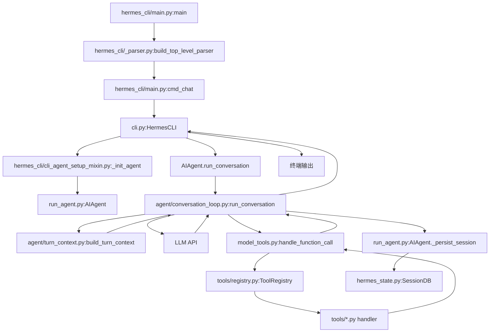

# 03 详细逐步说明：主链路拆解

> 层：第三层（详细逐步说明）
> 状态：已复核（全部行号/符号与基准提交一致）
> 复核日期：2026-08-29
> 生成日期：2026-08-19
> 前置阅读：[02-简单例子-全路径走读](./02-简单例子-全路径走读.md)
> 后续阅读：第四层模块文档（[04](./04-核心模块与类型关系.md) 起）

## 一、本层目标

在第二层已经走通 `hermes -z "hello"` 主路径之后，本层把每一跳拆开，讲清：

- 谁调用谁；
- 参数如何传递；
- 返回值如何消费；
- 错误如何传播；
- 状态如何变化。

本层仍以**主成功路径**为主。失败、重试、压缩、并发、插件钩子、缓存失效等复杂分支只标注“第四层展开”，不在这里铺开。

## 二、主链路总览



## 三、逐跳拆解

### 跳 1：`hermes_cli/main.py:main()`

#### 谁调用谁

- 操作系统启动 Python 进程；
- 入口函数是 `hermes_cli/main.py:main()`。

#### 参数

- `sys.argv`，例如 `["hermes", "-z", "hello"]`。

#### 返回值

- 通常 `None` 或进程退出码；正常路径由子命令函数返回。

#### 状态变化

- 设置进程标题；
- 设置 agent harness 环境；
- 可能清理旧更新残留、过期 bytecode、半成品 venv；
- 构建 parser 后进入子命令。

#### 错误传播

- 启动自愈类操作基本 `try/except` 吞掉，不阻断主流程；
- 真正致命错误由子命令或 Python 异常向上传播。

### 跳 2：`hermes_cli/_parser.py:build_top_level_parser()`

#### 谁调用谁

- `main()` 调用 `build_top_level_parser()`。

#### 参数

- 无显式参数。

#### 返回值

- `(parser, subparsers, chat_parser)`。

#### 状态变化

- 创建 argparse 对象；
- 注册 chat 子命令参数，包括 `-z`。

#### 错误传播

- parser 构建错误会直接抛出，属于启动期配置错误。

### 跳 3：`hermes_cli/main.py:cmd_chat(args)`

#### 谁调用谁

- `main()` 通过 `args.func(args)` 调用 `cmd_chat(args)`。

#### 参数

- `args`：argparse Namespace，包含 `-z` 对应的消息文本、`--in`、`--resume`、`--continue` 等。

#### 返回值

- 正常路径返回 `None` 或退出码。

#### 状态变化

- 判断是否使用 TUI；
- 应用安全模式；
- 处理 `--in` 工作目录；
- 处理 `--resume` / `--continue`；
- 进入 CLI 或 TUI 运行路径。

#### 错误传播

- `--in` 目录不存在时打印错误并 `sys.exit(1)`；
- 会话恢复失败时打印错误并退出；
- 其他异常向上传播。

### 跳 4：`cli.py:HermesCLI`

#### 谁调用谁

- `cmd_chat()` 构造并驱动 `HermesCLI`。

#### 关键方法

- `load_cli_config()`：合并默认配置和用户 `config.yaml`；
- `_init_agent()`：装配 `AIAgent`；
- `chat()`：执行一次用户消息；
- `process_command()`：处理斜杠命令。

#### 参数

- 一次性消息路径传入用户文本 `"hello"`。

#### 返回值

- 最终响应文本或状态。

#### 状态变化

- 加载皮肤、命令注册、Agent 实例；
- 将用户消息交给 Agent；
- 接收最终响应并打印。

#### 错误传播

- Agent 初始化失败会阻止进入对话；
- 对话异常会向上传播给 CLI 层处理。

### 跳 5：`hermes_cli/cli_agent_setup_mixin.py:_init_agent()`

#### 谁调用谁

- `HermesCLI` 调用 `_init_agent()`。

#### 参数

- `model_override`、`runtime_override`、`request_overrides` 等可选参数。

#### 返回值

- `bool`，表示 Agent 是否成功初始化。

#### 状态变化

- 解析 provider/model/api_mode；
- 构造 `AIAgent`；
- 设置 CLI 回调、工具集、会话上下文等。

#### 错误传播

- 配置缺失、凭据缺失、模型解析失败时返回 `False` 或抛出，由 CLI 提示用户。

### 跳 6：`run_agent.py:AIAgent.run_conversation()`

#### 谁调用谁

- `HermesCLI.chat()` 调用 `AIAgent.run_conversation()`。

#### 参数

```python
run_conversation(
    user_message="hello",
    system_message=None,
    conversation_history=None,
    task_id=None,
    stream_callback=None,
    persist_user_message=None,
    persist_user_timestamp=None,
    persist_user_display_kind=None,
    persist_user_display_metadata=None,
    moa_config=None,
)
```

#### 返回值

- `Dict[str, Any]`，至少包含 `final_response` 和消息历史。

#### 状态变化

- 生成 `effective_task_id`；
- 组装 `task_context`；
- 设置 `_relay_pending_turn_id`；
- 准备 durable turn lease 相关局部状态；
- 调用真实循环。

#### 错误传播

- 门面层主要做上下文准备和清理；
- 真实错误来自 `agent.conversation_loop.run_conversation()`。

### 跳 7：`agent/conversation_loop.py:run_conversation()`

#### 谁调用谁

- `AIAgent.run_conversation()` 导入并调用 `agent.conversation_loop.run_conversation()`。

#### 参数

与门面参数基本一致，但第一个参数是 `agent`：

```python
run_conversation(
    agent,
    user_message,
    system_message,
    conversation_history,
    task_id,
    stream_callback,
    persist_user_message,
    persist_user_timestamp,
    persist_user_display_kind,
    persist_user_display_metadata,
    moa_config,
)
```

#### 返回值

- `Dict[str, Any]`，包含 `final_response`、`messages` 等。

#### 状态变化

1. 解码 MoA 消息（如果启用）；
2. 清理上一轮压缩状态；
3. 取消仍在运行的 background review；
4. 刷新 `.env` 凭据；
5. 调用 `build_turn_context()`；
6. 初始化本轮计数器；
7. 进入主循环；
8. 调用 LLM；
9. 处理工具调用或最终响应；
10. 持久化会话。

#### 错误传播

- 主循环内部有大量重试/恢复分支，第四层展开；
- 主成功路径中，异常会向上传播到 `AIAgent.run_conversation()`。

### 跳 8：`agent/turn_context.py:build_turn_context()`

#### 谁调用谁

- `agent/conversation_loop.py:run_conversation()` 调用 `build_turn_context()`。

#### 参数

```python
build_turn_context(
    agent,
    user_message,
    system_message,
    conversation_history,
    task_id,
    stream_callback,
    persist_user_message,
    persist_user_timestamp,
    persist_user_display_kind,
    persist_user_display_metadata,
    restore_or_build_system_prompt,
    install_safe_stdio,
    sanitize_surrogates,
    summarize_user_message_for_log,
    set_session_context,
    set_current_write_origin,
    ra,
    moa_active,
)
```

#### 返回值

- `TurnContext`，包含：
  - `user_message`
  - `original_user_message`
  - `messages`
  - `conversation_history`
  - `active_system_prompt`
  - `effective_task_id`
  - `turn_id`
  - `current_turn_user_idx`
  - `should_review_memory`
  - `plugin_user_context`
  - `ext_prefetch_cache`
  - `preflight_compression_blocked`

#### 状态变化

- 安装安全 stdio；
- 恢复压缩轮换会话；
- 设置日志 session context；
- 恢复主 runtime；
- 刷新 MCP 工具；
- 生成 task/turn id；
- 重置重试计数器和迭代预算；
- 组装 `messages`；
- 恢复或构建 system prompt；
- 注入插件上下文和外部记忆预取。

#### 错误传播

- 多数 setup 步骤 fail-open，记录日志；
- 关键失败会向上传播。

### 跳 9：system prompt 恢复/构建

真实符号：

- `agent/conversation_loop.py:_restore_or_build_system_prompt()`，约在 `870` 行；
- `run_agent.py:AIAgent._build_system_prompt()`，约在 `4895` 行；
- 实际实现：`agent/system_prompt.py:build_system_prompt()`。

#### 主成功路径

1. 如果 `conversation_history` 存在且 `_session_db` 可用，读取 `SessionDB.get_session()`；
2. 如果存储的 `system_prompt` 可用且 runtime 匹配，直接复用；
3. 否则调用 `_build_system_prompt()` 构建；
4. 新会话首次构建后持久化到 session row。

#### 为什么重要

- 同一会话内 system prompt 必须字节稳定，否则 prompt cache 失效；
- 外部记忆/插件上下文注入到 user message，而不是 system prompt。

### 跳 10：LLM API 调用

真实位置：

- `agent/conversation_loop.py` 主循环中组装 `api_messages`；
- 通过 provider adapter 调用 LLM API。

#### 参数

- `messages`：OpenAI 风格消息列表；
- `tools`：工具 schema；
- 其他 provider 参数。

#### 返回值

- 文本流或 `tool_calls`。

#### 状态变化

- `api_call_count` 增加；
- `agent._api_call_count` 更新；
- 活动状态更新。

#### 错误传播

- 网络错误、限流、空响应、截断等复杂分支第四层展开。

### 跳 11：工具调用分发

真实符号：

- `run_agent.py:AIAgent._execute_tool_calls()`，约在 `8428` 行；
- `model_tools.py:handle_function_call()`，约在 `1240` 行；
- `tools/registry.py:ToolRegistry.register()`，约在 `763` 行。

#### 主成功路径

1. 模型返回 `assistant_message.tool_calls`；
2. `_execute_tool_calls()` 判断顺序/并发执行；
3. 对每个 tool call 调用 `handle_function_call()`；
4. `handle_function_call()` 先 `coerce_tool_args()`；
5. 在 registry 中查找 handler；
6. 执行 handler；
7. 返回 JSON 字符串结果；
8. 结果作为 `tool` 消息追加到 `messages`。

#### 参数

```python
handle_function_call(
    function_name,
    function_args,
    task_id,
    tool_call_id,
    session_id,
    turn_id,
    api_request_id,
    user_task,
    enabled_tools,
    skip_pre_tool_call_hook,
    skip_tool_request_middleware,
    skip_tool_execution_middleware,
    tool_request_middleware_trace,
    enabled_toolsets,
    disabled_toolsets,
)
```

#### 返回值

- `str`：工具结果 JSON 字符串。

#### 错误传播

- 工具错误体返回模型前截断到 2048 字符；
- 日志保留更长错误信息；
- 第四层展开 guardrails、middleware、approval 等。

### 跳 12：会话持久化

真实符号：

- `run_agent.py:AIAgent._persist_session()`，约在 `2020` 行；
- `hermes_state.py:SessionDB.append_message()`，约在 `11059` 行；
- `hermes_state.py:SessionDB.get_messages()`，约在 `11961` 行。

#### 主成功路径

1. 循环结束前调用 `agent._persist_session(messages, conversation_history)`；
2. `_persist_session()` 删除尾部空响应脚手架；
3. 保存 JSON session log；
4. 调用 `_flush_messages_to_session_db()`；
5. `SessionDB.append_message()` 写入 SQLite；
6. 刷新 token accounting。

#### 状态变化

- `messages` 中新增 user/assistant/tool 行；
- `sessions` 行更新；
- `message_count` / `tool_call_count` 更新。

#### 错误传播

- 持久化失败通常记录日志并尽量不阻断已生成响应；
- 第四层展开锁竞争、磁盘错误、租约等。

## 四、主成功路径时序图（源码级）

```mermaid
sequenceDiagram
    autonumber
    participant CLI as HermesCLI
    participant AG as AIAgent
    participant LOOP as conversation_loop.run_conversation
    participant CTX as turn_context.build_turn_context
    participant SP as _restore_or_build_system_prompt
    participant LLM as LLM API
    participant MT as model_tools.handle_function_call
    participant REG as tools/registry
    participant DB as SessionDB

    CLI->>AG: run_conversation(user_message="hello")
    AG->>LOOP: run_conversation(agent, user_message, ...)
    LOOP->>CTX: build_turn_context(...)
    CTX->>SP: restore_or_build_system_prompt(...)
    SP-->>CTX: active_system_prompt
    CTX-->>LOOP: TurnContext(messages, task_id, turn_id, ...)
    loop 每轮 LLM 调用
        LOOP->>LLM: api_messages + tool_schemas
        LLM-->>LOOP: response
        opt tool_calls
            LOOP->>MT: handle_function_call(name, args, task_id)
            MT->>REG: 查找 ToolEntry
            REG-->>MT: handler
            MT->>MT: 执行 handler
            MT-->>LOOP: JSON 工具结果
            LOOP->>LOOP: append tool message
        end
    end
    LOOP->>AG: _persist_session(messages, conversation_history)
    AG->>DB: append_message(...)
    DB-->>AG: message row id
    LOOP-->>AG: {"final_response": "...", "messages": [...]}
    AG-->>CLI: {"final_response": "...", "messages": [...]}
    CLI-->>CLI: 打印 final_response
```

## 五、本层结论

读完本层，你应能：

- 按调用顺序复述主链路每一跳；
- 指出每跳的真实文件、函数/方法名；
- 说明参数如何从 CLI 传到 Agent 循环；
- 说明 LLM 返回工具调用时如何进入 `handle_function_call()`；
- 说明最终消息如何写入 `SessionDB`；
- 知道哪些复杂分支留到第四层补齐。

下一层开始进入第四层模块文档，从 [04-核心模块与类型关系](./04-核心模块与类型关系.md) 开始补齐源码中的全部逻辑与技术点。
