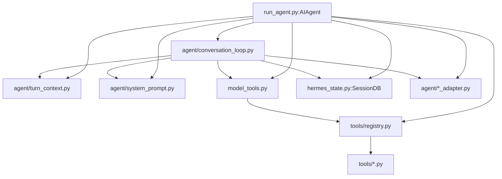
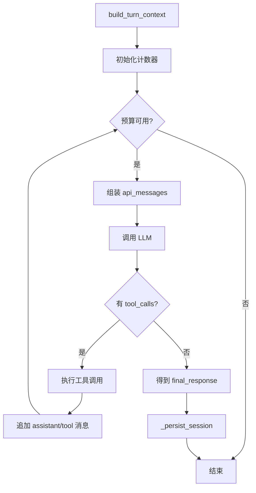
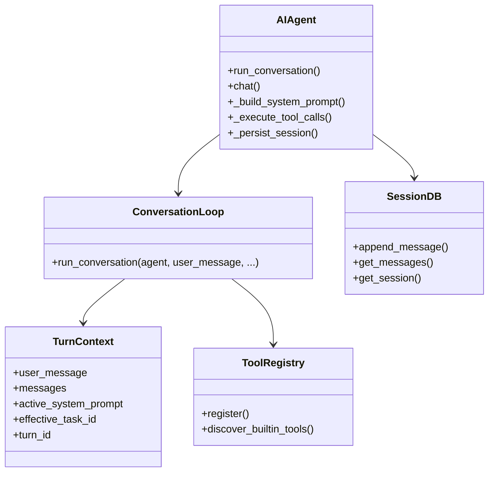
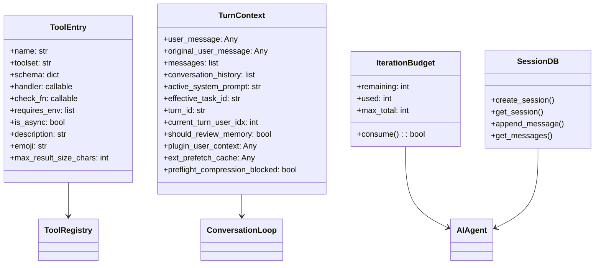

# 04 核心模块与类型关系

> 层：第四层（补齐源码逻辑与技术点）
> 状态：已复核（全部行号/符号与基准提交一致）
> 复核日期：2026-08-29
> 生成日期：2026-08-19
> 前置阅读：[03-详细逐步说明-主链路拆解](./03-详细逐步说明-主链路拆解.md)

## 一、本模块目标

本模块补齐核心运行时相关逻辑：

- `AIAgent` 类职责与关键属性；
- 真实对话循环 `agent/conversation_loop.py`；
- 模型适配器与 provider 抽象；
- 工具系统与核心工具集；
- 会话状态与持久化；
- 核心模块之间的类型/依赖关系。

## 二、核心模块地图



## 三、`AIAgent` 类

### 3.1 位置

- 文件：`run_agent.py`
- 类：`AIAgent`，约在 `412` 行

### 3.2 设计初衷

`AIAgent` 是核心门面。它把大量配置、回调、会话上下文、预算、凭据池等参数集中到一个对象，供 CLI、TUI、gateway、desktop、batch runner 等不同前端复用。

### 3.3 关键方法

| 方法 | 位置 | 作用 |
|---|---|---|
| `run_conversation()` | `run_agent.py:8333` | 转发到真实循环 |
| `chat()` | `run_agent.py:8804` | 简单接口，返回最终文本 |
| `_build_system_prompt()` | `run_agent.py:4741` | 转发到 `agent/system_prompt.py` |
| `_execute_tool_calls()` | `run_agent.py:8164` | 工具调用执行入口 |
| `_persist_session()` | `run_agent.py:1924` | 持久化会话 |
| `_invoke_tool()` | `run_agent.py:8243` | 单工具调用转发 |

### 3.4 关键属性

- `session_id`：当前会话 ID；
- `platform`：`cli` / `telegram` / `discord` / `tui` 等；
- `model` / `provider` / `api_mode`：模型路由；
- `max_iterations`：最大工具调用迭代数；
- `iteration_budget`：每轮预算对象；
- `enabled_toolsets` / `disabled_toolsets`：工具集范围；
- `_cached_system_prompt`：会话级缓存 system prompt；
- `_session_db`：`SessionDB` 实例；
- `_interrupt_requested`：中断标志；
- `_background_review_agent`：后台记忆/技能审查 agent。

## 四、真实对话循环

### 4.1 位置

- 文件：`agent/conversation_loop.py`
- 函数：`run_conversation()`，约在 `1691` 行

### 4.2 主循环结构



### 4.3 关键状态

- `api_call_count`：本轮 API 调用次数；
- `final_response`：最终响应；
- `interrupted`：是否被中断；
- `failed`：是否失败；
- `compression_attempts`：压缩尝试次数；
- `_turn_exit_reason`：退出原因诊断。

## 五、模型适配器

### 5.1 位置

- 目录：`agent/`
- 文件示例：`agent/*_adapter.py`

### 5.2 职责

- 统一不同 provider 的请求/响应差异；
- 处理 OpenAI Chat Completions、Codex Responses、Anthropic Messages 等模式；
- 处理 reasoning、tool_calls、streaming 等字段差异。

### 5.3 关键关系



## 六、工具系统

### 6.1 位置

- 注册表：`tools/registry.py`
- 分发：`model_tools.py`
- 工具实现：`tools/*.py`

### 6.2 注册流程

```mermaid
sequenceDiagram
    participant IMP as tools/*.py
    participant REG as tools/registry.py
    participant MT as model_tools.py
    participant LOOP as conversation_loop.py

    IMP->>REG: register(name, toolset, schema, handler, check_fn, ...)
    REG-->>IMP: ToolEntry 保存
    LOOP->>MT: handle_function_call(name, args, task_id)
    MT->>REG: 查找 handler
    REG-->>MT: ToolEntry
    MT->>IMP: handler(args, task_id=...)
    IMP-->>MT: 工具结果
```

### 6.3 核心工具集

- `toolsets.py` 定义 toolset；
- `_HERMES_CORE_TOOLS` 是每次 API 调用都会发送的核心工具；
- 其他工具通过 `check_fn`、toolset、插件、MCP 等方式按需暴露。

## 七、会话状态

### 7.1 位置

- 文件：`hermes_state.py`
- 类：`SessionDB`，约在 `3093` 行

### 7.2 关键能力

- SQLite 存储；
- FTS5 搜索；
- 会话创建/读取/删除；
- 消息追加/读取/分页；
- 软删除与 rewind；
- 压缩代际 dedupe；
- 可移植性导入导出。

### 7.3 关键方法

| 方法 | 位置 | 作用 |
|---|---|---|
| `create_session()` | `hermes_state.py:4714` | 创建会话 |
| `get_session()` | `hermes_state.py:7891` | 读取会话 |
| `append_message()` | `hermes_state.py:9267` | 追加消息 |
| `append_messages_batch()` | `hermes_state.py:9411` | 批量追加 |
| `get_messages()` | `hermes_state.py:10138` | 读取消息 |
| `get_messages_around()` | `hermes_state.py:10293` | 上下文窗口读取 |
| `get_messages_as_conversation()` | `hermes_state.py:10467` | 转成对话格式 |

## 八、核心类型关系



## 九、本模块结论

本模块补齐了核心运行时的骨架和关键类型关系。后续模块会继续展开：

- 消息网关与平台适配；
- 工具系统与工具集；
- 配置体系与环境变量；
- 数据模型与会话存储；
- 技能系统与插件架构；
- 调度器与定时任务；
- 并发模型与生命周期；
- 错误处理与重试机制；
- 测试体系与质量保障；
- 构建部署与运维；
- 源码索引与覆盖矩阵。
