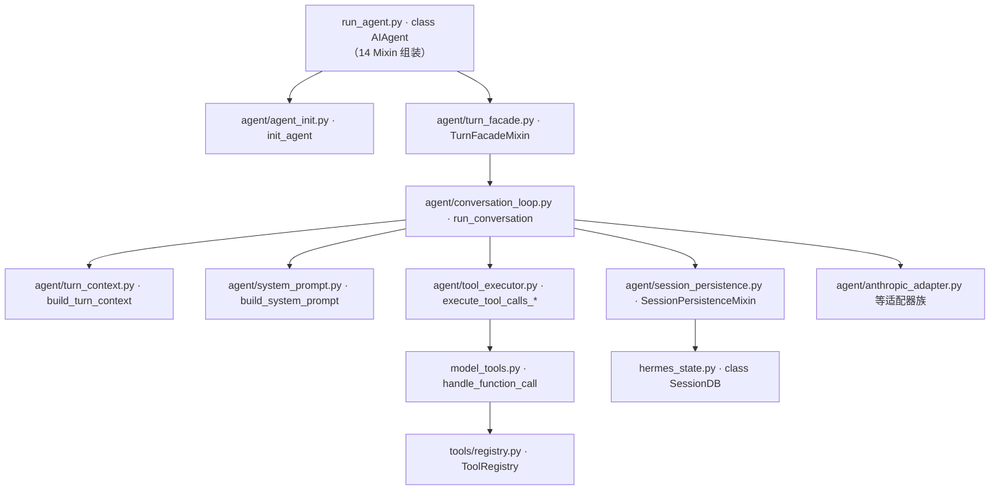
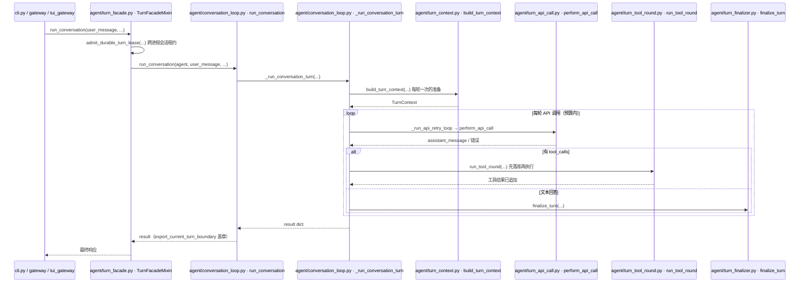
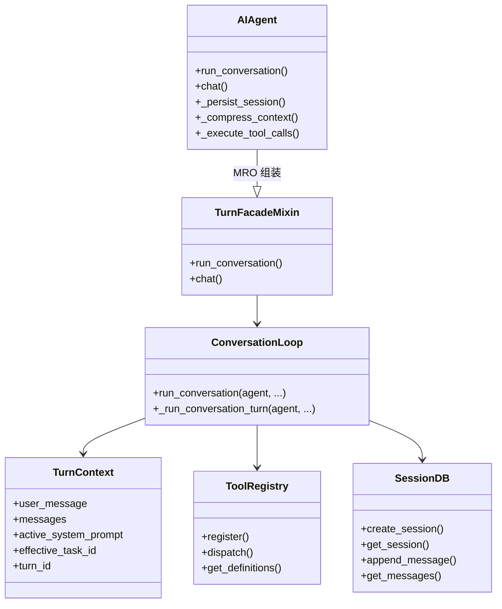
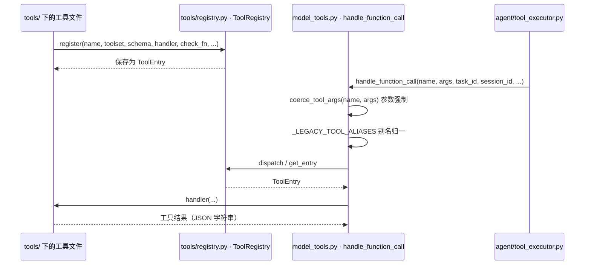
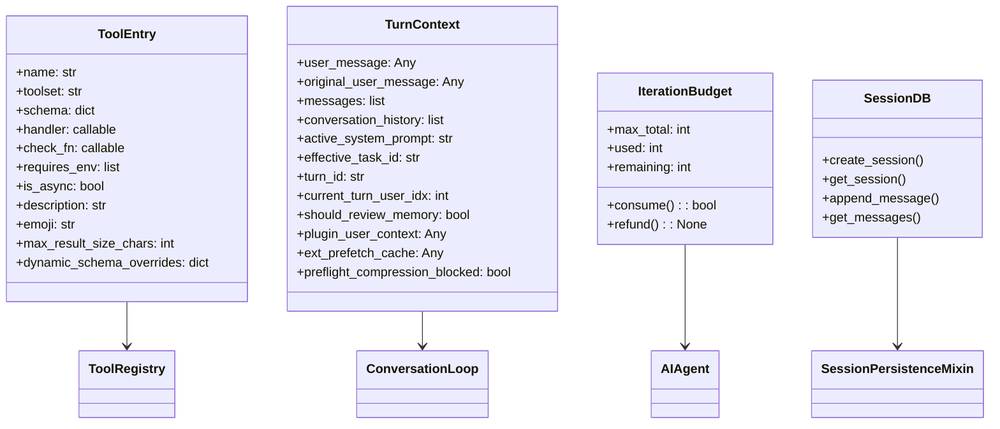

# 04 核心模块与类型关系

> 层：第四层（补齐源码逻辑与技术点）
> 状态：已按 cc0a679f14 复核
> 复核日期：2026-09-22
> 生成日期：2026-08-19
> 前置阅读：[03-详细逐步说明-主链路拆解](./03-详细逐步说明-主链路拆解.md)
> 后续阅读：[05-消息网关与平台适配](./05-消息网关与平台适配.md)

> **本版定位记法**：一律「`文件路径` · `符号名` `+N`」，`+0` = 符号定义行，`+N` = 符号体内第 N 行。
> 正文不出现绝对行号。本版基于提交 `cc0a679f14`（2026-09-21）静态分析；**未运行测试套件**，不对"测试是否通过"作声明。

## 一、本模块目标

本模块补齐核心运行时相关逻辑：

- `AIAgent` 类职责、组装方式与关键属性；
- 真实对话循环 `agent/conversation_loop.py`；
- `agent/` 目录的模块分层；
- 模型适配器与 provider 抽象；
- 工具系统与核心工具集；
- 会话状态与持久化；
- 核心模块之间的类型/依赖关系。

## 二、核心模块地图

### 2.1 顶层依赖图

`AIAgent` 本身是**薄门面**：`run_agent.py` 只剩 1609 行，类的行为由 14 个 Mixin 提供，
重活分布在 `agent/` 目录下的实现模块里。



关键点：`AIAgent.__init__` 不在 `run_agent.py` 里干活，`run_conversation` 也不在
`run_agent.py` 里干活——两者都是转发器，见第三节。

### 2.2 `agent/` 目录的模块分层

`agent/` 从上一版的 195 个文件增长到 **301 个 `.py`**（顶层 240 个 + 8 个子目录：
`agent/lsp/`、`agent/monitoring/`、`agent/pet/`、`agent/proxy_sources/`、`agent/secret_sources/`、
`agent/transports/`、`agent/vault_backends/`、`agent/verify/`）。这不是无组织的膨胀，而是
按「一个职责一个前缀」拆出来的族。挑有代表性的分组：

| 族 | 前缀/命名 | 代表文件 | 分组逻辑 |
|---|---|---|---|
| 轮次编排 | `turn_*`（31 个） | `agent/turn_facade.py`、`agent/turn_context.py`、`agent/turn_tool_round.py`、`agent/turn_finalizer.py` | 把一次 turn 拆成「准入 → 上下文 → 请求装配 → API 调用 → 响应吸收 → 工具轮 → 收尾」等相位，每相位一个模块 |
| 模型适配器 | 以 `_adapter` 结尾（6 个） | `agent/anthropic_adapter.py`、`agent/codex_responses_adapter.py`、`agent/gemini_native_adapter.py`、`agent/bedrock_adapter.py`、`agent/vertex_adapter.py`、`agent/azure_identity_adapter.py` | 每种 wire 协议（Anthropic Messages / OpenAI Responses / Gemini native / Bedrock / Vertex / Azure 身份）一个适配器 |
| 辅助客户端 | `auxiliary_` 前缀 + `agent/aux_accounting.py`（9 个） | `agent/auxiliary_client.py`、`agent/auxiliary_health.py`、`agent/auxiliary_wire.py`、`agent/auxiliary_fallback_recovery.py` | 压缩/搜索/视觉等**旁路任务**的客户端路由、健康探测、降级链、计费归属 |
| 上下文与压缩 | `context_*` / `compaction_*` / `compression_*`（9 个） | `agent/context_engine.py`、`agent/context_compressor.py`、`agent/context_compressor_summary.py`、`agent/context_breakdown.py`、`agent/compaction_display.py`、`agent/compression_facade.py` | 上下文引擎抽象、压缩器本体与摘要、占用率分解、压缩后的展示投影 |
| 计费 | `billing_*`（3 个） | `agent/billing_usage.py`、`agent/billing_links.py`、`agent/billing_view.py` | 美元口径的用量模型、账单类失败的恢复链接、`/usage` 与 `/subscription` 的展示核心 |
| 凭据 | `credential_*`（6 个） | `agent/credential_pool.py`、`agent/credential_sources.py`、`agent/credential_persistence.py` | 凭据池、来源解析、持久化、模型冷却 |
| 流式/请求 | `chat_completion_*` + `stream_*`（8 个） | `agent/chat_completion_stream_monitor.py`、`agent/stream_single_writer.py`、`agent/stream_delivery.py` | 流式单写者仲裁、非流式路径、流诊断 |

> 说明：本节只按「前缀族」给出分组逻辑，不罗列全部 301 个文件名。族内具体成员用
> `ls agent/<前缀>*.py` 即得。

## 三、`AIAgent` 类

### 3.1 位置与组装方式

- 文件：`run_agent.py`（1609 行）
- 类：`run_agent.py` · `class AIAgent` `+0`
- 基类列表（**顺序即 MRO**）：

```python
class AIAgent(
    ClientLifecycleMixin, StreamDeliveryMixin, StatusOutputMixin, ApiRequestHooksMixin, ApiErrorSummaryMixin,
    InterruptControlMixin, TurnExplainersMixin, ActivityTrackingMixin, RateLimitCreditsMixin,
    SessionPersistenceMixin, CompressionFacadeMixin, TurnFacadeMixin, VisionMessagePrepMixin, ReasoningParamsMixin,
):
    """AI Agent with tool calling capabilities."""
```

`run_agent.py` 自己只剩下：模块级辅助函数、一组与 provider 路由/超时/模型判定相关的谓词方法、
`_execute_tool_calls` 等少量方法、以及 `main()`。**其余全部方法都由 Mixin 通过 MRO 提供。**

### 3.2 设计初衷

`AIAgent` 仍是核心门面：它把配置、回调、会话上下文、预算、凭据池集中到一个对象，供 CLI、TUI、
gateway、desktop、batch runner 等不同前端复用。区别在于上一版门面是「一个 8800 行的 god-file」，
现在是「门面 + 14 个职责 Mixin」，Mixin 之间靠 `AIAgent` 的 MRO 解析方法，彼此不直接互相引用。

### 3.3 14 个 Mixin 的职责

| # | Mixin | 定义位置 | 职责（摘自各模块 docstring / 公开方法） |
|---|---|---|---|
| 1 | `ClientLifecycleMixin` | `agent/client_lifecycle.py` · `class ClientLifecycleMixin` `+0` | 工具资源回收、共享主 client 生命周期、按请求的 client 缓存（owner 线程 close vs 外来线程 abort）、凭据轮换、路由派生请求头。公开方法：`_ensure_primary_openai_client`、`_create_request_openai_client`、`_try_refresh_*_client_credentials`、`_swap_credential`、`_rebuild_anthropic_client` |
| 2 | `StreamDeliveryMixin` | `agent/stream_delivery.py` · `class StreamDeliveryMixin` `+0` | 流式单写者所有权、delta/reasoning 回调扇出、interim 助手文本去重。公开方法：`_emit_stream_start`、`_fire_stream_delta`、`_fire_reasoning_delta`、`_deliver_interim`、`_claim_stream_writer` |
| 3 | `StatusOutputMixin` | `agent/status_output.py` · `class StatusOutputMixin` `+0` | 用户可见状态/警告/notice 输出：安全打印、quiet 模式门控、去重的上下文溢出警告、仅在重试全部耗尽时显示的缓冲重试提示。公开方法：`_safe_print`、`_vprint`、`_emit_status`、`_emit_warning`、`_emit_notice`、`_flush_status_buffer` |
| 4 | `ApiRequestHooksMixin` | `agent/api_request_hooks.py` · `class ApiRequestHooksMixin` `+0` | API 请求生命周期 hook 载荷：JSON 安全转换、密钥键脱敏、大小上限、`api_request_error` hook 派发。公开方法：`_api_request_payload_for_hook`、`_api_response_payload_for_hook`、`_invoke_api_request_error_hook` |
| 5 | `ApiErrorSummaryMixin` | `agent/api_error_summary.py` · `class ApiErrorSummaryMixin` `+0` | provider API 错误摘要：权益失败识别、xAI 订阅装饰、结构化 detail 归一化、日志安全脱敏。公开方法：`_summarize_api_error`、`_is_entitlement_failure`、`_clean_error_message` |
| 6 | `InterruptControlMixin` | `agent/interrupt_control.py` · `class InterruptControlMixin` `+0` | 中断 / steer / redirect 控制面：软硬中断、工具线程中断传播、待处理 steer/redirect 队列。公开方法：`interrupt`、`hard_interrupt`、`clear_interrupt`、`steer`、`redirect` |
| 7 | `TurnExplainersMixin` | `agent/turn_explainers.py` · `class TurnExplainersMixin` `+0` | 文件改动校验页脚与「本轮为何没给出最终回答」的解释文案。公开方法：`_record_file_mutation_result`、`_format_file_mutation_failure_footer`、`_format_turn_completion_explanation` |
| 8 | `ActivityTrackingMixin` | `agent/activity_tracking.py` · `class ActivityTrackingMixin` `+0` | 轮次存活活动追踪（gateway watchdog + 会话活动落库），`_touch_activity` 是唯一写路径。公开方法：`_touch_activity`、`_persist_session_activity_if_due`、`_reset_activity_labels_after_turn` |
| 9 | `RateLimitCreditsMixin` | `agent/rate_limit_credits.py` · `class RateLimitCreditsMixin` `+0` | 解析 provider 响应头到 `_rate_limit_state` / `_credits_state`，并发出粘性 notice。公开方法：`_capture_rate_limits`、`get_rate_limit_state`、`_capture_credits`、`get_credits_state`、`get_credits_spent_micros` |
| 10 | `SessionPersistenceMixin` | `agent/session_persistence.py` · `class SessionPersistenceMixin` `+0` | 会话转写落库（SQLite flush，带 `_DB_PERSISTED_MARKER` 内在去重）、临时脚手架过滤、显式 trajectory 导出。公开方法：`_persist_session`、`_flush_messages_to_session_db`、`_save_trajectory` |
| 11 | `CompressionFacadeMixin` | `agent/compression_facade.py` · `class CompressionFacadeMixin` `+0` | 宿主侧 `_compress_context` 包装：发布 commit fence、在快照上跑压缩器、把 `_DB_PERSISTED_MARKER` 回写到活列表、重绑会话上下文。公开方法：`_compress_context` |
| 12 | `TurnFacadeMixin` | `agent/turn_facade.py` · `class TurnFacadeMixin` `+0` | 轮次准入：跨进程会话 turn lease + 续租线程 + 存活看门狗、relay/accounting/portal 作用域、成对的 start/finish 标记。公开方法：`run_conversation`、`chat` |
| 13 | `VisionMessagePrepMixin` | `agent/vision_message_prep.py` · `class VisionMessagePrepMixin` `+0` | API 消息里的图片部分处理：视觉能力探测、非视觉模型的文本回退（缓存的 `vision_analyze` 描述）、工具结果图片剥离、provider 特殊处理（Anthropic 保留点号、Qwen Portal 消息整形）。公开方法：`_model_supports_vision`、`_prepare_messages_for_non_vision_model`、`_qwen_prepare_chat_messages` |
| 14 | `ReasoningParamsMixin` | `agent/reasoning_params.py` · `class ReasoningParamsMixin` `+0` | provider reasoning 参数策略：`reasoning` extra_body 何时可发、LM Studio / Ollama / GitHub Models 能力探测、`reasoning_content` echo 家族、严格 API 的 tool_call 消毒。公开方法：`_supports_reasoning_extra_body`、`_needs_thinking_reasoning_pad`、`_sanitize_tool_calls_for_strict_api` |

**Mixin 之间的协作方式**：每个 Mixin 只依赖 `AIAgent` 上已由 `init_agent` 装好的属性，
不 import 其它 Mixin；需要跨模块调用时走 `agent/lazy_forward.py` · `forward`（每次调用重新解析目标，
既避免循环 import，也让 `patch("run_agent.X")` 继续生效）。

### 3.4 `__init__` 是转发器

- `run_agent.py` · `AIAgent.__init__` `+0`：签名与原版一致（减去已废弃的 `tool_delay`），
  函数体只做一件事——把 `locals()` 打包交给实现：

```python
"""Forwarder — see ``agent.agent_init.init_agent`` (same keyword parameters, minus ``tool_delay``)."""
```

- 真实初始化在 `agent/agent_init.py` · `init_agent` `+0`（该文件 2466 行）。它是
  「有序相位编排器」，相位**顺序是有意义的**（后面的相位读前面相位设的属性）：

| 相位（`init_agent` 内偏移） | 调用 | 作用 |
|---|---|---|
| `+60` | `agent.iteration_budget = iteration_budget or IterationBudget(max_iterations)` | 父 agent 创建、子 agent 继承的共享迭代预算 |
| `+89` | `_resolve_api_mode(agent, ...)` | 按有序阶梯决定 `agent.api_mode`，必要时改写 provider |
| `+109` | `_build_client(agent, ...)` | 构造 OpenAI-wire / Anthropic / Bedrock / MoA client |
| `+110` | `_init_fallback_chain(agent, fallback_model)` | 归一化 `fallback_model` / `fallback_providers` 并建链 |
| `+111` | `_load_tools(agent, enabled_toolsets, disabled_toolsets)` | 工具发现 + toolset 过滤 + 工具快照代次 |
| `+112` | `_init_session_state(agent, session_id, session_db, ...)` | 会话 ID 发布、DB 行延迟创建、持久化游标 |
| `+131` | `_build_context_engine(agent, ...)` | 上下文引擎（默认 `ContextCompressor`）构建 |
| `+139` | `_snapshot_primary_runtime(agent)` | 快照主运行时，供辅助客户端路由复用 |

> 注意：`init_agent` 的 `max_iterations` 默认值是 `sys.maxsize`（即默认不限制工具迭代），
> 而 `agent/iteration_budget.py` 的模块 docstring 写的是 "default 500"。以签名为准；
> 该 docstring 与签名不一致，属源码内的陈旧注释。

### 3.5 关键方法（新位置）

| 方法 | 当前位置 | 作用 |
|---|---|---|
| `run_conversation()` | `agent/turn_facade.py` · `TurnFacadeMixin.run_conversation` `+0` | 轮次准入；`+22` 处 `from agent.conversation_loop import run_conversation`，`+58` 处 `admit_durable_turn_lease` 取跨进程租约 |
| `chat()` | `agent/turn_facade.py` · `TurnFacadeMixin.chat` `+0` | 简单接口，返回最终文本；`stream_callback` 接收每个文本 delta |
| `_persist_session()` | `agent/session_persistence.py` · `SessionPersistenceMixin._persist_session` `+0` | 持久化会话；底层 `_flush_messages_to_session_db` `+0`、`_save_trajectory` `+0` |
| `_compress_context()` | `agent/compression_facade.py` · `CompressionFacadeMixin._compress_context` `+0` | 压缩入口（commit fence + 快照） |
| `_execute_tool_calls()` | `run_agent.py` · `AIAgent._execute_tool_calls` `+0` | 仍在 `run_agent.py`；`+16` 处调用 `_plan_tool_batch_segments` 分段，单段派发给顺序/并发执行器，多段派发给 `agent/tool_executor.py` · `execute_tool_calls_segmented` `+0`。两个下划线前缀方法不在 `run_agent.py` 里实现：`_execute_tool_calls_sequential` 定义在 `agent/tool_executor.py` · `_execute_tool_calls_sequential` `+0`；`_execute_tool_calls_concurrent` 是类体内的惰性转发赋值（`run_agent.py` · `class AIAgent` `+1149`），目标是 `agent/tool_executor.py` · `execute_tool_calls_concurrent` `+0` |
| `_build_system_prompt()` | **符号已不存在** | 实现为 `agent/system_prompt.py` · `build_system_prompt` `+0` |
| `_invoke_tool()` | **符号已不存在** | 单工具调用改由 `agent/tool_executor.py` 的 `_dispatch_authorized_once` 等内部函数承担；对外的统一入口是 `model_tools.py` · `handle_function_call` |

### 3.6 关键属性

属性由 `agent/agent_init.py` 的 `_set_defaults` + 若干 `_*_STATE` 字典集中定义，按用途分四组：

**控制流状态**（`agent/agent_init.py` · `Const:_CONTROL_STATE`）

- `_interrupt_requested` / `_interrupt_message` / `_hard_interrupt_requested`：中断标志；
- `_pending_steer` / `_pending_redirect`：steer 与「保留合法前缀、只取消在飞请求」的 redirect；
- `_delegate_depth` / `_active_children`：子 agent 委派深度与在跑子 agent；
- `_background_review_agent` / `_background_review_run`：后台记忆/技能审查 agent 与其运行句柄。

**轮次簿记**（`Const:_TURN_STATE`）

- `_api_call_count`：本轮 API 调用次数；
- `_run_budget_started_at` / `_run_budget_wrapup_injected`：墙钟预算与 80% 收尾提示；
- `_rate_limit_state` / `_credits_state`：限流与额度遥测；
- `_tool_snapshot_generation`：工具快照代次（拒绝过期重建）。

**会话持久化**（`Const:_SESSION_STATE`）

- `_cached_system_prompt` / `_cached_system_prompt_static`：会话级 system prompt 缓存与其跨会话稳定前缀；
- `_session_messages` / `_last_flushed_db_idx` / `_session_persist_lock`：消息列表、DB 写入游标、落库串行锁；
- `_owns_session_db` / `_end_session_on_close` / `_persist_disabled`：DB 句柄归属与会话收尾策略。

**流式投递**（`Const:_STREAM_STATE`）

- `_current_streamed_assistant_text` / `_delivered_interim_texts`：已投递文本去重；
- `_stream_writer_token` / `_stream_writer_tls`：流式单写者令牌；
- `_persist_user_message_override`：API 侧用户消息与持久化转写不一致时的覆盖（语音场景）。

此外：

- `session_id`、`platform`、`provider` / `requested_provider` / `base_url` / `api_mode`：会话与模型路由；
- `max_iterations`、`iteration_budget`（`agent/iteration_budget.py` · `class IterationBudget` `+0`）；
- `enabled_toolsets` / `disabled_toolsets`。

## 四、真实对话循环

### 4.1 位置与调用链

- 门面：`agent/turn_facade.py` · `TurnFacadeMixin.run_conversation` `+0`
- 循环本体：`agent/conversation_loop.py` · `run_conversation` `+0`
- 单轮实现：`agent/conversation_loop.py` · `_run_conversation_turn` `+0`



### 4.2 循环结构

`_run_conversation_turn` 的骨架（偏移均相对该函数 `+0`）：

- `+41`：`_ctx = build_turn_context(agent, user_message, system_message, conversation_history, task_id, ...)`
  ——每轮一次的准备，返回 `agent/turn_context.py` · `class TurnContext` `+0`；
- `+116`：`early_result = _run_api_retry_loop(agent, s)`——一次 API 调用及其重试/恢复内循环；
- `+146`：`result = finalize_turn(agent, **{...})`——收尾（预算摘要、trajectory 保存、持久化、
  诊断、响应变换、结果组装、steer drain、记忆/技能审查）。

重试内循环 `agent/conversation_loop.py` · `_run_api_retry_loop` `+0` 的相位序列：

```
nous_rate_limit_guard → build_api_request → perform_api_call → check_api_response
        （异常）→ handle_api_interrupt / handle_api_error
```

相位函数通过 `agent/conversation_loop.py` · `_run_phase` `+0` 调用：它用
`inspect.signature` 挑出相位函数声明需要的 loop 局部量传进去，再把判定字段回写到
`agent/conversation_loop.py` · `class _LoopState` `+0`。

相位模块一览（都在 `agent/` 下）：

| 相位 | 模块 | 职责 |
|---|---|---|
| 预检压缩 | `agent/turn_preflight.py`、`agent/turn_preflight_gate.py` | 每次 API 调用前测量请求压力、按需压缩、必要时增长本地窗口 |
| 请求装配 | `agent/turn_api_request.py`、`agent/turn_request_assembly.py` | 为**当前** provider 重新施加 reasoning echo pad 与 prompt-cache 装饰（fallback 会换 provider） |
| 实际调用 | `agent/turn_api_call.py` | `nous_rate_limit_guard`、`perform_api_call`、`handle_api_interrupt` |
| 响应吸收 | `agent/turn_response_intake.py`、`agent/turn_response_check.py` | 把原始响应归一成 assistant 消息、触发 `post_api_request` hook |
| 溢出恢复 | `agent/turn_overflow.py` | 413 / 上下文超长，压缩后重新发或结束 |
| 截断恢复 | `agent/turn_truncation.py` | `finish_reason == "length"`：思考预算耗尽、重复主导、内容过滤 |
| 停止门 | `agent/turn_stop_gates.py` | 文本回答停止时的三道门（可能改为 interim 行 + 合成续写） |
| 工具轮 | `agent/turn_tool_round.py` | 校验/截断/去重 tool_calls → **先落库再执行** → 执行 → 工具结果后再压缩 |
| 失败恢复 | `agent/turn_recovery.py`、`agent/turn_loop_errors.py` | 模型调用抛错时的一次性恢复链，再退化到通用重试/退避 |
| 收尾 | `agent/turn_finalizer.py`、`agent/turn_final_response.py`、`agent/turn_summary.py` | 结果组装与最终文本 |

### 4.3 关键状态

`class _LoopState`（`agent/conversation_loop.py` · `+0`）承载整轮的 loop 局部量，主要字段：

- `api_call_count`：本轮 API 调用次数；
- `final_response`：最终响应；
- `interrupted` / `failed`：是否被中断 / 是否失败；
- `compression_attempts`、`max_compression_attempts`：压缩尝试；
- `retry_count` / `max_retries`：重试计数与上限；
- `restart_count`、`_outer_error_count`、`truncated_tool_call_retries`、`length_continue_retries`；
- `finish_reason`、`response`、`assistant_message`、`api_kwargs`、`api_messages`、`tools_for_api`；
- `_turn_exit_reason`：退出原因诊断；
- `_preflight_compression_blocked`、`_provider_overflow_recovery_pending`、`_compression_timeout_exhausted`。

## 五、模型适配器

### 5.1 位置

- 目录：`agent/`
- 适配器族：`agent/anthropic_adapter.py`、`agent/codex_responses_adapter.py`、
  `agent/gemini_native_adapter.py`、`agent/bedrock_adapter.py`、`agent/vertex_adapter.py`、
  `agent/azure_identity_adapter.py`

### 5.2 职责

- 统一不同 provider 的请求/响应差异；
- 处理 OpenAI Chat Completions、Codex Responses、Anthropic Messages、Gemini native 等模式；
- 处理 reasoning、tool_calls、streaming 等字段差异。

以 Anthropic 为例：`agent/anthropic_adapter.py` 只负责 client 构造与 Messages 调用，端点谓词、
载荷转换、凭据分别在 `agent/anthropic_endpoints.py`、`agent/anthropic_message_convert.py`、
`agent/anthropic_credentials.py`——**同族按「构造 / 转换 / 凭据」再分文件**。

### 5.3 关键关系



## 六、工具系统

### 6.1 位置

- 注册表：`tools/registry.py` · `class ToolRegistry` `+0`（模块级单例 `Const:registry`）
- 编排层：`model_tools.py`（987 行，`handle_function_call` `+0`、`get_tool_definitions` `+0`）
- 工具集：`toolsets.py`（`Const:_HERMES_CORE_TOOLS`、`Const:TOOLSETS`、`get_toolset` `+0`）
- 参数强制：`tools/arg_coercion.py` · `coerce_tool_args` `+0`
- 工具实现：`tools/` 下 316 个 `.py`（顶层 261 个）

### 6.2 注册与分发



要点：

- `tools/registry.py` · `class ToolEntry` `+0` 是注册单元，字段包括 `name`、`toolset`、`schema`、
  `handler`、`check_fn`、`requires_env`、`is_async`、`description`、`emoji`、
  `max_result_size_chars`、`dynamic_schema_overrides`；
- `model_tools.py` 是**薄编排层**：导入即触发工具发现（各 `tools/` 文件在 import 时自注册）；
- `handle_function_call` 会先过 Tool Search 桥（`tool_search` / `tool_describe` / `tool_call`
  在此内联展开），保证下游 hook 看到的是真实工具名。

### 6.3 核心工具集

- `toolsets.py` · `Const:_HERMES_CORE_TOOLS`：CLI 与全部消息平台 toolset 共享的工具清单
  （web 搜索/抽取、终端、文件读写、patch、视觉、技能、浏览器族、TTS、todo、memory、
  session_search、clarify、execute_code、delegate_task、cronjob、HA、kanban、computer_use 等）；
- `toolsets.py` · `Const:TOOLSETS`：静态工具集定义，叠加注册表登记的动态 toolset；
- 其他工具通过 `check_fn`、toolset、插件、MCP 等方式按需暴露；
- 桌面 GUI 的 `desktop_ui` / `project` 刻意**不在**核心清单里，由 GUI gateway 按桌面来源会话开启。

## 七、会话状态

### 7.1 位置

- 文件：`hermes_state.py`
- 类：`hermes_state.py` · `class SessionDB` `+0`
- 异步门面：`hermes_state.py` · `class AsyncSessionDB` `+0`（每次调用走 `asyncio.to_thread`）

### 7.2 关键能力

- SQLite（WAL）存储；连接管理与写重试原语在 `hermes_state.py` 本体
  （`_read_ctx` `+0`、`_execute_write` `+0`、`_read_all` `+0`、`_read_one` `+0`）；
- FTS5 搜索（含 CJK）；
- 会话创建/读取/删除；
- 消息追加/读取/分页；
- 软删除与 rewind；
- 压缩代际与 lineage；
- 可移植性导入导出。

### 7.3 关键方法（新位置）

| 方法 | 当前位置 |
|---|---|
| `create_session()` | `hermes_state_sessions.py` · `SessionSessionsMixin.create_session` `+0` |
| `get_session()` | `hermes_state_sessions.py` · `SessionSessionsMixin.get_session` `+0` |
| `append_message()` | `hermes_state_messages.py` · `SessionMessagesMixin.append_message` `+0` |
| `append_messages_batch()` | `hermes_state_messages.py` · `SessionMessagesMixin.append_messages_batch` `+0` |
| `get_messages()` | `hermes_state_messages.py` · `SessionMessagesMixin.get_messages` `+0` |
| `get_messages_around()` | `hermes_state_messages.py` · `SessionMessagesMixin.get_messages_around` `+0` |
| `get_messages_as_conversation()` | `hermes_state_messages.py` · `SessionMessagesMixin.get_messages_as_conversation` `+0` |

> `hermes_state.py` 已不是「单文件 SessionDB」：它只是组装门面，具体职责分布在
> 28 个 `hermes_state_*.py` 兄弟模块中。完整拆分清单、表结构 DDL、读写与检索细节见
> [08-数据模型与会话存储](./08-数据模型与会话存储.md)。

## 八、核心类型关系



## 九、本模块结论

本模块补齐了核心运行时的骨架和关键类型关系：

- `AIAgent` 是「门面 + 14 Mixin」组装类，`run_agent.py` 只留 1609 行；
- `__init__` 转发到 `agent/agent_init.py` · `init_agent`，初始化是**有序相位**；
- 对话循环在 `agent/conversation_loop.py`，由 `agent/turn_*.py` 相位模块分担；
- `agent/` 已按前缀族分层（适配器 / 辅助客户端 / 上下文压缩 / 计费 / 凭据 / 流式 / 轮次）；
- 会话存储已从单文件拆成 `hermes_state_*` 一族。

后续模块会继续展开：

- 消息网关与平台适配；
- 工具系统与工具集；
- 配置体系与环境变量；
- 数据模型与会话存储；
- 技能系统与插件架构；
- 调度器与定时任务；
- 并发模型与生命周期；
- 错误处理与重试机制；
- 测试体系与质量保障；
- 构建部署与运维；
- 源码索引与覆盖矩阵。

---

[上一篇：03-详细逐步说明-主链路拆解](./03-详细逐步说明-主链路拆解.md) · [总目录](./README.md) · [下一篇：05-消息网关与平台适配](./05-消息网关与平台适配.md)
