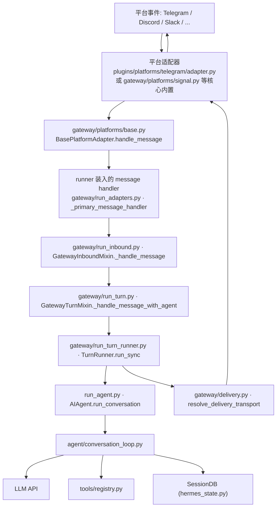
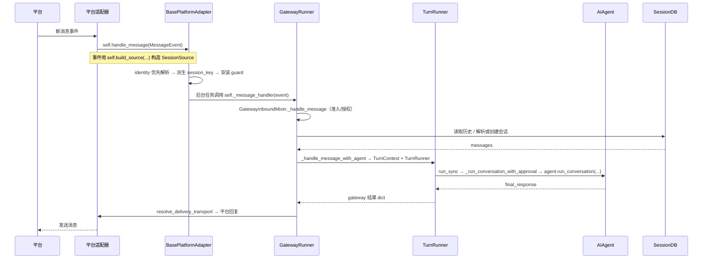
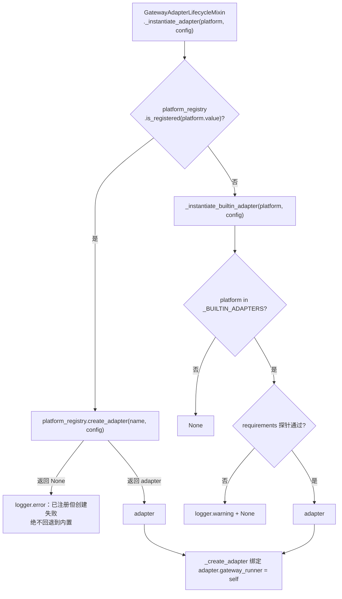
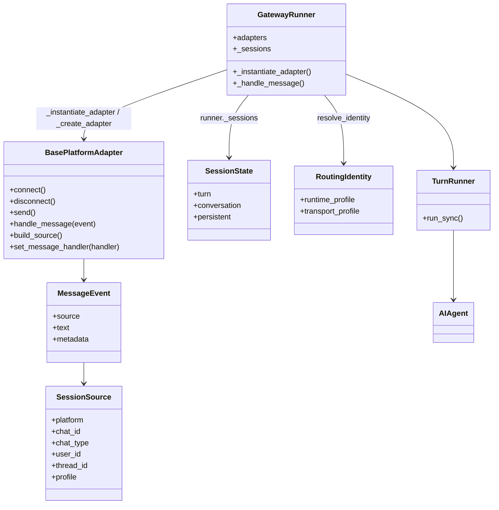

# 05 消息网关与平台适配

> 层：第四层（补齐源码逻辑与技术点）
> 状态：已按 cc0a679f14 复核
> 复核日期：2026-09-22
> 生成日期：2026-08-19
> 前置阅读：[04-核心模块与类型关系](./04-核心模块与类型关系.md)
> 后续阅读：[06-工具系统与工具集](./06-工具系统与工具集.md)

> **本版定位记法**：一律「`文件路径` · `符号名` `+N`」，`+0` = 符号定义行，`+N` = 符号体内第 N 行。
> 正文不出现绝对行号。本版基于提交 `cc0a679f14`（2026-09-21）静态分析；**未运行测试套件**，不对"测试是否通过"作声明。

## 一、本模块目标

补齐消息网关相关逻辑：

- `gateway/run.py` 运行时（门面）与 `gateway/run_*.py` 分相模块；
- 会话管理（`gateway/session*.py`）；
- 平台适配器的**两条装载路径**：插件注册表优先 + 核心内置回退；
- 平台事件如何进入 Agent；
- 响应如何回投到平台；
- 网关与 CLI/TUI/Desktop 的差异。

> 本轮（自上一版基准 `aff5125f8` 起）最需要警惕的一点：**`gateway/run.py` 已从
> 「一个几千行的 god-file」变成「门面 + 分相模块」**。`gateway/run.py` 本身仍有 5719 行，但
> `GatewayRunner` 的全部行为由 17 个 Mixin 提供，实现体分散在 `gateway/run_*.py`、
> `gateway/session*.py`、`gateway/slash_commands*.py`、`gateway/authz_mixin.py` 等文件里。
> **在 `gateway/run.py` 里找不到的方法，先去看它的 MRO**（见 2.2 表）。

## 二、网关架构

### 2.1 进程入口（原文的 `run_sync()` 入口已不存在）

| 入口 | 真实符号 |
|---|---|
| `python -m gateway.run` | `gateway/run.py` · `main` `+0`（argparse → `asyncio.run(start_gateway(config))` → `_exit_after_graceful_shutdown`） |
| 模块 docstring 声明的第二种入口 | `cli.py` · `_run_legacy_gateway` `+0`（`cli.py --gateway` 遗留入口，内部仍是 `asyncio.run(start_gateway())`） |
| 服务化入口 | `hermes_cli/gateway.py`（`hermes gateway run`）内部同样调用 `gateway/run.py` · `start_gateway` |
| 真正的启动协程 | `gateway/run.py` · `start_gateway` `+0`（重复实例守卫 `gateway.status.get_running_pid`、日志装配、构造 `GatewayRunner`、信号处理、PID 文件、控制套接字） |
| **单轮 turn 的线程体** | `gateway/run_turn_runner.py` · `TurnRunner.run_sync` `+0` —— 这才是现在叫 `run_sync` 的东西，它是**一轮对话在 executor 线程里的执行体**，返回 gateway 结果 dict，**不是网关进程入口** |

### 2.2 `GatewayRunner` 的组装方式（17 个 Mixin，顺序即 MRO）

`gateway/run.py` · `class GatewayRunner` `+0` 的基类列表：

| Mixin | 定义文件（符号记 `+0`） | 负责的分相 |
|---|---|---|
| `GatewayAuthorizationMixin` | `gateway/authz_mixin.py` | 授权、准入、intake/delivery adapter 解析 |
| `GatewayKanbanWatchersMixin` | `gateway/kanban_watchers.py` | kanban 看板 watcher |
| `GatewaySlashCommandsMixin` | `gateway/slash_commands.py` | 斜杠命令执行 |
| `GatewayVoiceMixin` | `gateway/run_voice.py` | 语音 |
| `GatewayAdapterLifecycleMixin` | `gateway/run_adapters.py` | 适配器 connect/teardown、重连 watcher、适配器工厂 |
| `GatewayTopicThreadsMixin` | `gateway/run_topics.py` | 话题/线程 |
| `GatewayTurnMixin` | `gateway/run_turn.py` | agent turn 执行、工具集解析 |
| `GatewayShutdownMixin` | `gateway/run_shutdown.py` | stop/drain/restart、scale-to-zero |
| `GatewayBusySessionMixin` | `gateway/run_busy.py` | 忙会话排队、斜杠派发表 |
| `GatewayConfigLoadersMixin` | `gateway/run_config_loaders.py` | 网关配置加载 |
| `GatewayStartupMixin` | `gateway/run_startup.py` | 启动序列、resume/restore |
| `GatewaySessionWatchersMixin` | `gateway/run_watchers.py` | 会话 watcher |
| `GatewayNotificationsMixin` | `gateway/run_notifications.py` | 进程/完成/更新通知、媒体投递 |
| `GatewayInboundMixin` | `gateway/run_inbound.py` | 入站管线（`_handle_message`、准入、插件注入） |
| `GatewayGoalsMixin` | `gateway/run_goals.py` | 目标（goals） |
| `GatewayAgentCacheMixin` | `gateway/run_agent_cache.py` | 每会话 `AIAgent` 缓存与淘汰 |
| `GatewayProfileReconcileMixin` | `gateway/run_profile_reconcile.py` | 多 profile 对账 |

`gateway/run.py` 末尾还有一段 `# ---- BEGIN PLUGIN-COMPAT ----` 区块（`_PLUGIN_COMPAT_LAZY` +
PEP 562 `__getattr__`），它把**外部插件历史上从 `gateway.run` import 的名字**惰性转发到新模块。
内部代码被 `scripts/check_compat_pointers.py` 禁止使用这些名字 —— 读代码时不要把这段当成真实实现。

## 三、`gateway/run.py`

### 3.1 位置

- 文件：`gateway/run.py`（5719 行）
- 类：`GatewayRunner` `+0`
- 启动协程：`start_gateway` `+0`
- 进程 main：`main` `+0`

### 3.2 职责

`gateway/run.py` 现在承担的是**门面 + 共享基础设施**，而不是全部逻辑：

- 进程级启动/退出（`start_gateway`、`main`、`_exit_after_graceful_shutdown`）；
- `GatewayRunner` 类声明与 17 个 Mixin 的组装、类级默认值；
- 模块级共享常量与纯函数（如 `_AGENT_CACHE_MAX_SIZE`、`_TELEGRAM_INITIAL_CONNECT_TIMEOUT_SECS_DEFAULT`、
  `_redact_gateway_user_facing_secrets`、`_sanitize_gateway_final_response`）；
- **内置适配器工厂**：`_instantiate_builtin_adapter` `+0` 与 `_BUILTIN_ADAPTERS`（见 4.2）。

具体行为职责已下沉到 2.2 表中各自的 Mixin 文件。

### 3.3 关键流程

## 三点五、真实代码映射

| 主题 | 真实文件 | 真实符号/说明 |
|---|---|---|
| 网关门面 | `gateway/run.py` | `class GatewayRunner` `+0`（17 Mixin 组装，见 2.2） |
| 进程入口 | `gateway/run.py` | `main` `+0`；启动协程 `start_gateway` `+0` |
| 遗留 CLI 入口 | `cli.py` | `_run_legacy_gateway` `+0` |
| 单轮执行体 | `gateway/run_turn_runner.py` | `class TurnRunner` `+0`、`TurnRunner.run_sync` `+0` |
| 适配器生命周期 | `gateway/run_adapters.py` | `class GatewayAdapterLifecycleMixin` `+0`；工厂 `GatewayAdapterLifecycleMixin._instantiate_adapter` `+0`、`._create_adapter` `+0` |
| 入站管线 | `gateway/run_inbound.py` | `class GatewayInboundMixin` `+0`；`GatewayInboundMixin._handle_message` `+0` |
| 准入/授权 | `gateway/run_inbound.py` · `gateway/authz_mixin.py` | `GatewayInboundMixin._hm_admit_event` `+0`；`class GatewayAuthorizationMixin` `+0` |
| turn 执行 | `gateway/run_turn.py` | `class GatewayTurnMixin` `+0`；`GatewayTurnMixin._handle_message_with_agent` `+0`；`._run_agent_build_turn_context` `+0` |
| 忙会话与命令表 | `gateway/run_busy.py` | `class GatewayBusySessionMixin` `+0`；`GatewayBusySessionMixin._command_handler_table` `+0` |
| 关闭/重启 | `gateway/run_shutdown.py` | `class GatewayShutdownMixin` `+0` |
| 启动/恢复 | `gateway/run_startup.py` | `class GatewayStartupMixin` `+0` |
| 通知与媒体投递 | `gateway/run_notifications.py` | `class GatewayNotificationsMixin` `+0` |
| 平台注册表 | `gateway/platform_registry.py` | `class PlatformRegistry` `+0`、`class PlatformEntry` `+0`、模块单例 `platform_registry` |
| 平台基类 | `gateway/platforms/base.py` | `class BasePlatformAdapter` `+0`；`BasePlatformAdapter.handle_message` `+0`、`.build_source` `+0`、`.set_message_handler` `+0` |
| 平台事件模型 | `gateway/platforms/event.py` | `class MessageEvent` `+0` |
| 跨适配器 helper | `gateway/platforms/_shared.py` | `get_scoped_secret`、`platform_gate_env`、`extra_or_secret`、`apply_yaml_bridge`、`seed_extra_from_env`、`env_is_connected`（均 `+0`） |
| 适配器通用辅助 | `gateway/platforms/helpers.py` | 消息去重、markdown 剥离、线程参与、GFM 表格转 bullets、分块 |
| 共享监听 ingress | `gateway/platforms/shared_ingress.py` | 多 profile 下由默认 profile 持有唯一 HTTP 监听，按 `/p/<profile>/<path>` 转发 |
| 会话模型 | `gateway/session.py` | `class SessionSource` `+0`、`class SessionContext` `+0` |
| 会话状态容器 | `gateway/session_state.py` | `TurnState` / `ConversationState` / `PersistentState` / `SessionState`（均 `+0`） |
| 路由身份 | `gateway/session_identity.py` | `class RoutingIdentity` `+0`、`resolve_identity` `+0` |
| 会话生命周期 | `gateway/session_lifecycle.py` | `class SessionLifecycleMixin` `+0` |
| 会话上下文变量 | `gateway/session_context.py` | `set_session_vars` / `get_session_env` 等（替代旧的 `HERMES_SESSION_*` 环境变量读写） |
| 投递目标解析 | `gateway/delivery.py` | `class DeliveryTransport` `+0`、`resolve_delivery_transport` `+0`、`class DeliveryTarget` `+0` |
| 投递义务账本 | `gateway/delivery_ledger.py` | 崩溃安全的投递义务账本（`record_obligation` / `mark_attempting` / `mark_delivered` / `mark_failed`） |
| 流式事件分发 | `gateway/stream_dispatch.py` | `class GatewayEventDispatcher` `+0` |
| 流式事件模型 | `gateway/stream_events.py` | `MessageChunk` / `MessageStop` / `Commentary` / `ToolCallChunk` / `GatewayNotice` 等 |
| 流式消费 | `gateway/stream_consumer.py` | `class GatewayStreamConsumer` `+0` |
| 斜杠命令 | `gateway/slash_commands.py` | `class GatewaySlashCommandsMixin` `+0` |
| 斜杠访问控制 | `gateway/slash_access.py` | `class SlashAccessPolicy` `+0`、`policy_for_source` `+0` |
| 钩子 | `gateway/hooks.py` | `class HookRegistry` `+0`、`class ProfileHookRegistries` `+0` |
| 内置钩子目录 | `gateway/builtin_hooks/` | 始终注册的网关钩子扩展点（当前未随包发布任何钩子，目录下只有包的初始化文件） |
| 控制套接字 | `gateway/control_socket.py` | 网关控制通道（POSIX socket / Windows named pipe） |
| 媒体策略 | `gateway/media_policy.py` | 媒体收/发策略 |
| 媒体修复 | `gateway/media_repair.py` | 媒体消息修复 |
| 会话库恢复 | `gateway/session_db_recovery.py` | `class RecoverableHandleCache` `+0` 等 state.db 异常恢复 |
| 浏览器控制代理 | `gateway/browser_control_broker.py` | 浏览器控制中转 |
| 新平台接入权威契约 | `gateway/platforms/ADDING_A_PLATFORM.md` | 该文件**仍然存在**（427 行），含「插件路径（推荐）」与「内置路径 checklist」两节 |

## 四、平台适配器

### 4.1 位置（平台已插件化）

- **核心基础设施**：`gateway/platforms/` 保留基类、事件模型、跨适配器 helper、共享行为 mixin、
  HTTP/webhook 类基础设施与**少数内置平台**。
- **平台插件目录**：`plugins/platforms/` 下共 **22** 个平台目录。每个平台目录的形态一致
  （以 Telegram 为例）：`plugins/platforms/telegram/plugin.yaml` 是 `kind: platform` 的插件清单，
  `plugins/platforms/telegram/adapter.py` 装适配器与 `register(ctx)` 入口，
  `plugins/platforms/telegram/__init__.py` 只 re-export `register`。

`gateway/platforms/` 现存基础设施（实测）：

`gateway/platforms/base.py`、`gateway/platforms/base_exec_approval.py`、
`gateway/platforms/event.py`、`gateway/platforms/_shared.py`、`gateway/platforms/helpers.py`、
`gateway/platforms/media_cache.py`、`gateway/platforms/access_policy_mixin.py`、
`gateway/platforms/_http_client_limits.py`、`gateway/platforms/shared_ingress.py`、
`gateway/platforms/tcp_site.py`、`gateway/platforms/webhook.py`、
`gateway/platforms/webhook_coalesce.py`、`gateway/platforms/webhook_filters.py`、
`gateway/platforms/api_server*.py`（6 个）、`gateway/platforms/signal.py`、
`gateway/platforms/signal_format.py`、`gateway/platforms/signal_rate_limit.py`、
`gateway/platforms/whatsapp_common.py`、`gateway/platforms/whatsapp_cloud.py`、
`gateway/platforms/weixin.py`、`gateway/platforms/yuanbao*.py`（4 个）、
`gateway/platforms/bluebubbles.py`、`gateway/platforms/msgraph_webhook.py`、
`gateway/platforms/qqbot/`。

**注意**：核心目录里已经**没有** Baileys 桥的适配器文件了 —— 它现在是
`plugins/platforms/whatsapp/adapter.py`；但 `gateway/platforms/whatsapp_common.py`
（`WhatsAppBehaviorMixin`）**留在核心**，被插件 `plugins/platforms/whatsapp/adapter.py` 与内置
`gateway/platforms/whatsapp_cloud.py` 共同 import。这正是「哪些留核心」的可证实规律之一：
**共享行为 mixin 留核心，具体传输适配器可外迁**。

### 4.2 两条装载路径（这是本模块最核心的机制）

| 环节 | 真实符号 |
|---|---|
| 插件优先、内置回退的分支 | `gateway/run_adapters.py` · `GatewayAdapterLifecycleMixin._instantiate_adapter` `+0` |
| 绑定 runner | `gateway/run_adapters.py` · `GatewayAdapterLifecycleMixin._create_adapter` `+0` |
| 注册表查询/创建 | `gateway/platform_registry.py` · `PlatformRegistry.is_registered` `+0`、`.create_adapter` `+0`、`.register` `+0`、模块单例 `platform_registry` |
| 插件侧注册入口 | `hermes_cli/plugins.py` · `PluginContext.register_platform` `+0`（写入 `PlatformEntry(source="plugin")`） |
| 插件惰性装载 | `hermes_cli/plugins_loader.py` · `_register_deferred_platform` `+0`；注册表侧 `PlatformRegistry.register_deferred` `+0` |
| 内置适配器工厂 | `gateway/run.py` · `_instantiate_builtin_adapter` `+0` |
| 内置清单常量 | `gateway/run.py` · `_BUILTIN_ADAPTERS`（模块级 dict，9 项） |

**内置适配器清单（`_BUILTIN_ADAPTERS` 全量，共 9 个）**：
WhatsApp Cloud、Signal、Weixin（微信）、API Server、Webhook、MS Graph Webhook、BlueBubbles、
QQ Bot、Yuanbao（元宝）。

**关于边界规则的诚实说明**：`gateway/platform_registry.py` 的模块 docstring 把内置路径称为
「legacy built-in path」，`_instantiate_builtin_adapter` 的 docstring 称其为「core (non-plugin)
adapter」。**但源码中没有给出「为什么恰好是这 9 个留在核心」的显式判据** ——
「端口监听型所以留核心」这类推论不成立：`gateway/platforms/shared_ingress.py` 的 docstring
明确把 LINE / Teams / WeCom / Feishu（都已是插件）也列为端口绑定型适配器，并由核心统一代持监听。
**当前源码无法确定**该划分的设计意图；可证实的只有机械事实：注册表先查、内置表兜底，
以及共享行为 mixin（如 `WhatsAppBehaviorMixin`）留在核心供两侧共同 import。

### 4.3 平台清单

**`plugins/platforms/` 平台插件（22 个，括号内为各插件清单声明的 `label`）：**

| 目录 | 平台 | 目录 | 平台 |
|---|---|---|---|
| `a2a` | A2A | `mattermost` | Mattermost |
| `buzz` | Buzz | `ntfy` | ntfy |
| `dingtalk` | DingTalk | `photon` | iMessage via Photon |
| `discord` | Discord | `raft` | Raft |
| `email` | Email | `simplex` | SimpleX Chat |
| `feishu` | Feishu / Lark | `slack` | Slack |
| `google_chat` | Google Chat | `sms` | SMS (Twilio) |
| `homeassistant` | Home Assistant | `teams` | Microsoft Teams |
| `irc` | IRC | `telegram` | Telegram |
| `line` | LINE | `wecom` | WeCom (Enterprise WeChat) |
| `matrix` | Matrix | `whatsapp` | WhatsApp |

**`gateway/platforms/` 核心内置（9 个）**：API Server、Webhook、Signal、Weixin（微信）、
WhatsApp Cloud、Yuanbao（元宝）、BlueBubbles、QQ Bot、MS Graph Webhook。

> 设计含义：平台广度（edges）按插件激进扩张，核心网关（waist）只留窄的通用骨架 ——
> 与本库 AGENTS.md 的 Footprint Ladder 一致。

### 4.4 适配器职责

- 接收平台事件，构造 `MessageEvent`；
- 用 `self.build_source(...)` 构造 `SessionSource`（**不要**直接 `SessionSource(...)`：传输来源与
  profile 路由是在这里盖上去的）；
- 处理平台特有消息 ID、附件/图片/语音、限流与重试；
- 通过 `self.handle_message(event)` 把入站事件交给网关；
- 回投文本/媒体响应。

### 4.5 如何新增一个平台（以真实平台为实证）

权威说明在 `gateway/platforms/ADDING_A_PLATFORM.md`（两节：插件路径推荐 / 内置路径 checklist），
插件侧的完整指南在 `website/docs/developer-guide/adding-platform-adapters.md`。

**推荐路径（插件）实证 —— `plugins/platforms/telegram/`：**

1. 建目录 `plugins/platforms/<平台>/`；
2. 写插件清单（`kind: platform`），用 `requires_env` / `optional_env` 声明环境变量
   （会自动进入 `hermes_cli/config.py` 的 `OPTIONAL_ENV_VARS`，被 setup 向导渲染）；
   清单字段形制见 `plugins/platforms/telegram/plugin.yaml`；
3. 写适配器模块：适配器继承 `gateway/platforms/base.py` · `BasePlatformAdapter`，并导出
   `register(ctx)` 入口；入口里调
   `ctx.register_platform(name=..., label=..., adapter_factory=..., check_fn=..., ...)`
   （见 `plugins/platforms/telegram/adapter.py` · `register` `+0`）；
4. 包的初始化模块只做 `from .adapter import register`。

**无需改动核心代码**。插件系统自动接管：适配器创建、配置解析、用户授权、cron 投递、
`send_message` 路由、系统提示词 hints、状态展示、网关 setup。

**可选 hook**（`PlatformEntry` 字段，全部可选）：`env_enablement_fn`、`apply_yaml_config_fn`、
`is_connected`、`cron_deliver_env_var`、`standalone_sender_fn`、`ensure_deps_fn`、
`send_message_handler`、`parse_target_ref_fn` 等 —— 字段含义与契约见
`gateway/platform_registry.py` · `class PlatformEntry` `+0` 的逐字段注释。

**内置路径**只对核心贡献者开放，`gateway/platforms/ADDING_A_PLATFORM.md` 给了逐项 checklist
（Platform 枚举、`_ENV_STEPS`、适配器工厂、授权映射等）。

> **陷阱**：`gateway/platforms/ADDING_A_PLATFORM.md` 的「内置路径」小节**自身已部分过时** ——
> 它仍把参考实现写成核心目录下的 telegram / discord / whatsapp 三个模块，而这三个文件在 HEAD 中
> 都已不在 `gateway/platforms/`（Telegram / Discord / WhatsApp 适配器分别在
> `plugins/platforms/telegram/adapter.py`、`plugins/platforms/discord/adapter.py`、
> `plugins/platforms/whatsapp/adapter.py`）。读它时以 `_BUILTIN_ADAPTERS` 与
> `plugins/platforms/` 的实际内容为准。

### 4.6 易错点与边界条件

- **不要按文件名猜平台归属**：`gateway/platforms/weixin.py`、
  `gateway/platforms/whatsapp_cloud.py`、`gateway/platforms/yuanbao*.py`、
  `gateway/platforms/bluebubbles.py`、`gateway/platforms/qqbot/`、
  `gateway/platforms/msgraph_webhook.py`、`gateway/platforms/signal.py`、
  `gateway/platforms/api_server*.py`、`gateway/platforms/webhook*.py`
  在核心；其余 22 个在 `plugins/platforms/`。
- **不要从 `gateway/run.py` 直接构造适配器**：必须走
  `GatewayAdapterLifecycleMixin._create_adapter`，否则 profile 路由不会在 `connect()` 前接好。
- **注册表命中后不回退**：平台已注册但 `create_adapter` 返回 `None` 时只记 error，**不会**再尝试
  内置实现 —— 依赖缺失会表现为「平台静默不启动」而不是「回退到内置」。
- **multiplex 下 env 读取必须走 `gateway/platforms/_shared.py`**：`os.environ` 持有的是
  **默认 profile** 的值，直读会把次级 profile 的 allowlist 读错（漏判 → 静默拒绝全部消息）。
- **两套消息守卫**：入站消息在 agent 运行期间要顺序穿过 (1) 适配器 `_pending_messages` 队列
  与 (2) runner 的 `/stop` `/new` `/queue` `/status` `/approve` `/deny` 拦截；新命令若要
  「agent 阻塞时仍能到达 runner」，必须**同时**绕过两层并 inline 派发。

## 五、会话管理

### 5.1 位置

- `gateway/session.py` —— `SessionSource` / `SessionContext` 等会话模型；
- `gateway/session_state.py` —— 每会话状态容器（替代原先散落在 `GatewayRunner` 上的约 19 个
  session_key 字典）；
- `gateway/session_identity.py` —— 每个入站事件一次的冻结路由身份；
- `gateway/session_lifecycle.py` / `gateway/session_context.py` / `gateway/session_persistence.py`
  / `gateway/session_recovery.py` / `gateway/session_stall.py` 等分相模块。

> **原文的 `GatewaySession` 符号已不存在**。它承担的语义现在被拆成三块：
> 每会话状态（`SessionState` 及其 `TurnState` / `ConversationState` / `PersistentState` 三个作用域）、
> 事件来源（`SessionSource`）、以及跨进程存续的路由身份（`RoutingIdentity`）。

### 5.2 关键概念

- 平台用户/群组/频道 → Hermes `session_id`；
- **每事件一次的冻结身份**：`gateway/session_identity.py` · `resolve_identity` `+0` 回答
  「哪个 bot 收到的 / 谁有权准入 / 在哪运行」，把结果钉在 source 上；所有 ingress 路径都必须
  **先**规范化身份**再**派生 session key；
- 会话状态按清理边界分三个作用域：`turn`（每轮清）、`conversation`（会话边界清）、
  `persistent`（自有生命周期）；
- 会话隔离（多 profile 下 `transport_profile ≠ runtime_profile` 是常态）；
- 平台消息 ID 与 Hermes 消息 ID 映射；
- 会话恢复与清理（resume/restore、崩溃恢复标记、修剪）。

### 5.3 关键关系

## 六、工具集门控

网关是 session 能力门控的重要场景。

- 工具集由会话平台属性决定；
- `gateway/run_turn.py` · `GatewayTurnMixin._resolve_enabled_toolsets_for_source` `+0`
  按平台折叠工具集，并支持平台适配器的 per-source override（`adapter.toolsets_for_source(source)`）；
- override 会先写进 `platform_toolsets[platform_key]`，再走**同一条** `hermes_cli/tools_config.py` ·
  `_get_platform_tools` `+0` 校验路径 —— 未知或被平台限制的工具集会被丢弃，而不是被信任；
- 例如 GUI 会话获得 `desktop_ui` / `project` 工具集；
- 不能用 `check_fn` 判断「是否由 Electron 启动」，因为 `check_fn` 是进程级 TTL 缓存。

## 七、斜杠命令

网关复用 `hermes_cli/commands.py` 的命令注册表。

| 用途 | 真实符号 |
|---|---|
| 命令注册表本体 | `hermes_cli/commands.py` · `COMMAND_REGISTRY`（`list[CommandDef]`） |
| 单个命令定义 | `hermes_cli/commands.py` · `class CommandDef` `+0` |
| 名称/别名解析 | `hermes_cli/commands.py` · `resolve_command` `+0` |
| 网关已知命令集 | `hermes_cli/commands.py` · `GATEWAY_KNOWN_COMMANDS`（frozenset，供 hook 发射） |
| 单命令判定 | `hermes_cli/commands.py` · `is_gateway_known_command` `+0` |
| `/help` 文本生成 | `hermes_cli/commands.py` · `gateway_help_lines` `+0` |
| 网关侧 handler 查表 | `gateway/run_busy.py` · `GatewayBusySessionMixin._command_handler_table` `+0` |
| 「空闲可跑」命令集 | `gateway/run_busy.py` · `GatewayBusySessionMixin._IDLE_COMMANDS` |
| 「运行中也可跑」命令集 | `gateway/run_busy.py` · `GatewayBusySessionMixin._PLAIN_COMMANDS` |
| 命令执行 | `gateway/slash_commands.py` · `class GatewaySlashCommandsMixin` `+0` |
| 访问控制 | `gateway/slash_access.py` · `SlashAccessPolicy` `+0`、`policy_for_source` `+0` |

要点：

- handler 按名字经 `_command_handler_table` 查表分发，**不再有 `if canonical == ...` 链**；
- 一个命令要么列在 `_IDLE_COMMANDS`，要么列在 `_PLAIN_COMMANDS`（后者在 agent 运行中也能生效）；
- Telegram 菜单、Slack 路由、自动补全均从同一注册表派生（平台菜单相关符号在
  `hermes_cli/commands_platforms.py`）；
- 插件可用 `PluginContext.register_command` 追加斜杠命令。

## 八、本模块结论

本模块补齐了消息网关与平台适配的主干逻辑。两个必须记住的结构性事实：

1. **`gateway/run.py` 是门面，不是实现**。找方法先看 `GatewayRunner` 的 17 个 Mixin；
2. **平台适配器插件优先、内置兜底**。`plugins/platforms/` 22 个平台插件 + `gateway/run.py` ·
   `_BUILTIN_ADAPTERS` 的 9 个内置平台。

后续模块继续展开工具系统、配置、数据模型、技能/插件、调度、并发、错误、测试、部署和源码索引。

---

[上一篇：04-核心模块与类型关系](./04-核心模块与类型关系.md) · [总目录](./README.md) · [下一篇：06-工具系统与工具集](./06-工具系统与工具集.md)
