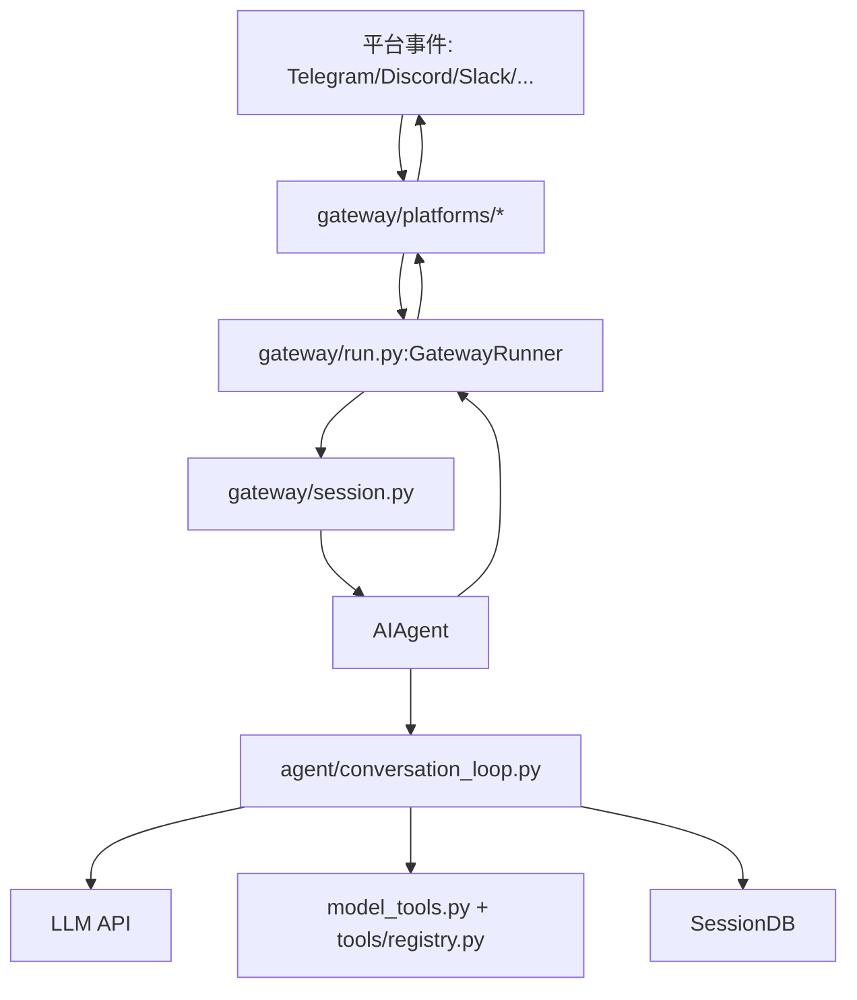
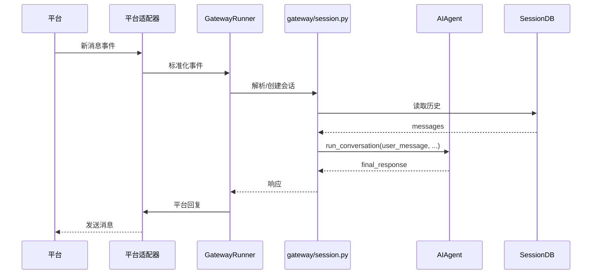
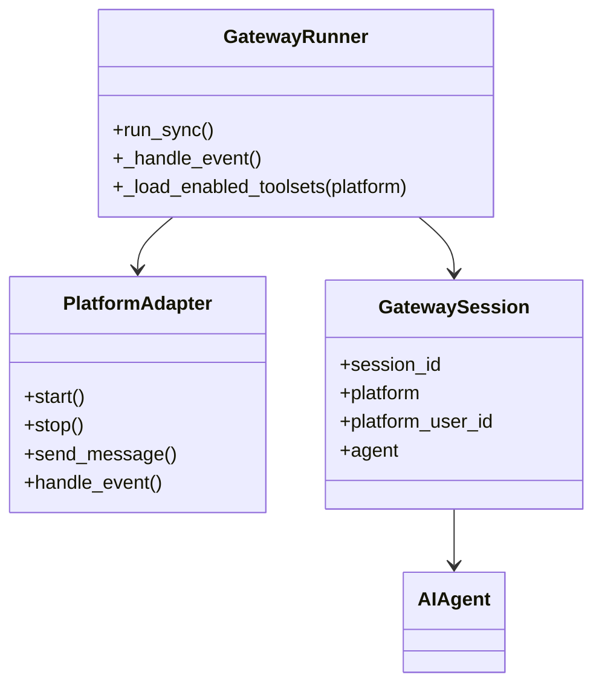

# 05 消息网关与平台适配

> 层：第四层（补齐源码逻辑与技术点）
> 状态：已复核（全部行号/符号与基准提交一致）
> 复核日期：2026-08-29
> 生成日期：2026-08-19
> 前置阅读：[04-核心模块与类型关系](./04-核心模块与类型关系.md)

## 一、本模块目标

补齐消息网关相关逻辑：

- `gateway/run.py` 运行时；
- `gateway/session.py` 会话管理；
- `gateway/platforms/` 平台适配器；
- 平台事件如何进入 Agent；
- 响应如何回投到平台；
- 网关与 CLI/TUI/Desktop 的差异。

## 二、网关架构

## 三、`gateway/run.py`

### 3.1 位置

- 文件：`gateway/run.py`
- 类：`GatewayRunner`，约在 `6411` 行
- 函数：`run_sync()`，约在 `5074` 行

### 3.2 职责

- 启动平台适配器；
- 接收平台事件；
- 将事件转换为 Agent turn；
- 管理平台会话与 Hermes 会话映射；
- 处理斜杠命令；
- 回投响应。

### 3.3 关键流程

## 三点五、真实代码映射

| 主题 | 真实文件 | 真实符号/说明 |
|---|---|---|
| 网关运行时 | `gateway/run.py` | `GatewayRunner` @6411 |
| 网关同步入口 | `gateway/run.py` | `run_sync()` @5074 |
| 网关会话 | `gateway/session.py` | 平台会话与 Hermes 会话映射 |
| 会话上下文 | `gateway/session_context.py` | 会话上下文 |
| 会话状态 | `gateway/session_state.py` | 会话状态 |
| 平台注册表 | `gateway/platform_registry.py` | 平台适配器注册 |
| 平台基类 | `gateway/platforms/base.py` | 平台适配器基类 |
| 平台辅助 | `gateway/platforms/helpers.py` | 平台通用辅助 |
| 投递 | `gateway/delivery.py` | 响应投递 |
| 投递账本 | `gateway/delivery_ledger.py` | 投递记录 |
| 流式分发 | `gateway/stream_dispatch.py` | 流式事件分发 |
| 流式事件 | `gateway/stream_events.py` | 流式事件模型 |
| 流式消费者 | `gateway/stream_consumer.py` | 流式消费 |
| 斜杠命令 | `gateway/slash_commands.py` | 网关斜杠命令 |
| 斜杠访问控制 | `gateway/slash_access.py` | 命令访问控制 |
| 钩子 | `gateway/hooks.py` | 网关钩子 |
| 内置钩子目录 | `gateway/builtin_hooks/` | 始终注册的网关钩子扩展点 |

## 四、平台适配器

### 4.1 位置

- 目录：`gateway/platforms/`

### 4.2 常见平台

- Telegram
- Discord
- Slack
- WhatsApp
- Home Assistant
- Signal
- Matrix
- Mattermost
- Email
- SMS
- DingTalk
- WeCom
- Weixin
- Feishu
- QQ Bot
- BlueBubbles
- Yuanbao
- Webhook
- API Server

### 4.3 适配器职责

- 接收平台事件；
- 标准化为 Hermes 内部事件；
- 处理平台特有消息 ID；
- 处理附件/图片/语音；
- 处理平台限流和重试；
- 回投文本/媒体响应。

## 五、会话管理

### 5.1 位置

- 文件：`gateway/session.py`

### 5.2 关键概念

- 平台用户/群组/频道 → Hermes `session_id`；
- 会话缓存；
- 会话隔离；
- 平台消息 ID 与 Hermes 消息 ID 映射；
- 会话恢复与清理。

### 5.3 关键关系

## 六、工具集门控

网关是 session 能力门控的重要场景。

- 工具集由会话平台属性决定；
- `_load_enabled_toolsets(platform)` 根据平台折叠工具集；
- 例如 GUI 会话获得 `desktop_ui` / `project` 工具集；
- 不能用 `check_fn` 判断“是否由 Electron 启动”，因为 `check_fn` 是进程级 TTL 缓存。

## 七、斜杠命令

网关复用 `hermes_cli/commands.py` 的 `COMMAND_REGISTRY`。

- `GATEWAY_KNOWN_COMMANDS` 用于 hook 发射；
- `resolve_command()` 用于分发；
- `gateway_help_lines()` 生成 `/help`；
- Telegram 菜单、Slack 路由、自动补全均从同一注册表派生。

## 八、本模块结论

本模块补齐了消息网关与平台适配的主干逻辑。后续模块继续展开工具系统、配置、数据模型、技能/插件、调度、并发、错误、测试、部署和源码索引。
