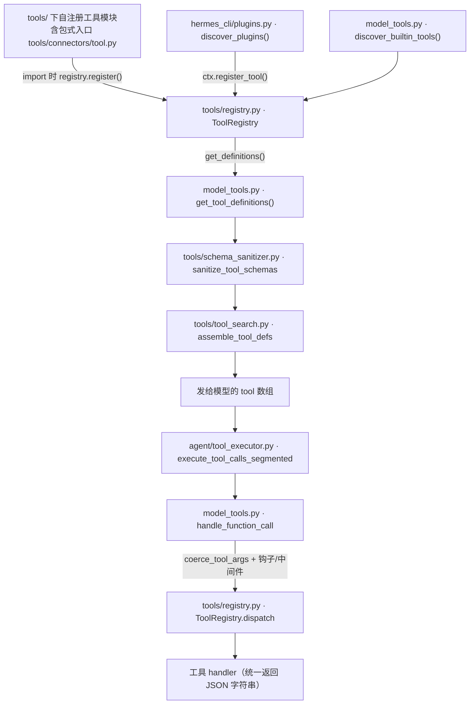
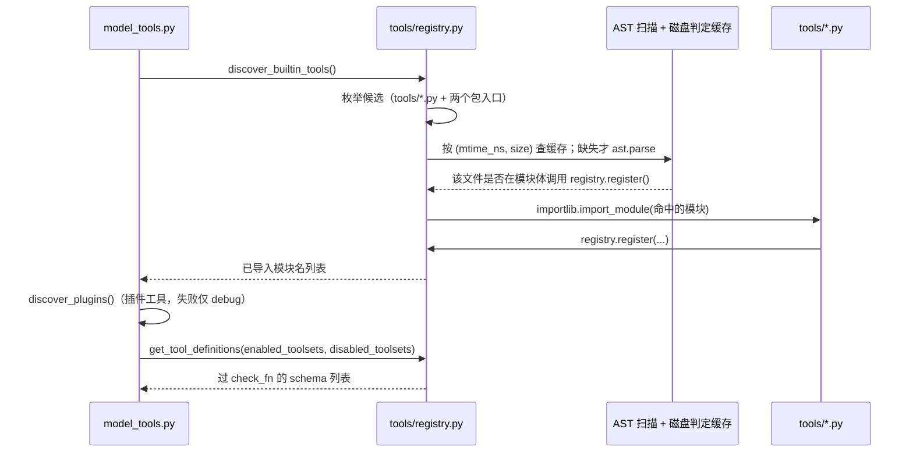

# 06 工具系统与工具集

> 层：第四层（补齐源码逻辑与技术点）
> 状态：已按 cc0a679f14 复核
> 复核日期：2026-09-22
> 生成日期：2026-08-19
> 前置阅读：[04-核心模块与类型关系](./04-核心模块与类型关系.md)
> 后续阅读：[07-配置体系与环境变量](./07-配置体系与环境变量.md)

## 一、本模块目标

补齐工具系统：

- 工具注册表；
- 工具发现（含「哪些文件才被扫描」的判定规则）；
- 工具 schema（含动态改写与净化）；
- 工具调用分发；
- 工具集与核心工具；
- 权限/门控（`check_fn` 缓存语义）；
- 环境隔离；
- 错误体截断；
- 工具搜索渐进披露（`tool_search` 桥三件套）。

## 二、工具系统架构



关键点：**注册表是唯一事实来源**，`model_tools.py` 不再持有并行的工具数据结构，只做编排（发现、过滤、动态 schema、桥接、钩子/中间件）。

## 三、注册表

### 3.1 位置

- 文件：`tools/registry.py`（零内部依赖的叶子模块，被每个工具文件 import）

### 3.2 关键符号

| 记法 | 说明 |
|---|---|
| `Module:tools/registry.py` · `Const:_MAX_TOOL_ERROR_CHARS` | `= 2048`，模型可见错误体上限 |
| `Module:tools/registry.py` · `Const:_MAX_LOGGED_ERROR_CHARS` | `= 8192`，日志侧更长但仍有界 |
| `tools/registry.py` · `discover_builtin_tools +0` | 导入自注册工具模块并返回模块名列表 |
| `tools/registry.py` · `class ToolRegistry +0` | 注册表本体（单例） |
| `tools/registry.py` · `ToolRegistry.register +0` | 工具注册入口 |
| `tools/registry.py` · `ToolRegistry.deregister +0` | 反注册（受与 `override=True` 同一套 operator opt-in 门控） |
| `tools/registry.py` · `ToolRegistry.restore_registration +0` | 身份校验式回滚（插件卸载用） |
| `tools/registry.py` · `ToolRegistry.register_plugin_override_policy +0` | 绑定「插件命名空间 → operator 是否放行覆盖」 |
| `tools/registry.py` · `ToolRegistry.get_definitions +0` | 按工具名集合产出 OpenAI 格式 schema，逐个过 `check_fn` |
| `tools/registry.py` · `ToolRegistry.dispatch +0` | 按名执行 handler，异步经 `_run_async()` 桥接，异常统一成 `{"error": ...}` |
| `tools/registry.py` · `class ToolEntry +0` | 单个工具的元数据（`dataclass(eq=False, slots=True)`，身份语义按 `is` 比较） |
| `tools/registry.py` · `tool_error +0` / `tool_result +0` | 取代遍布各处的 `json.dumps({"error": ...})` 样板 |

### 3.3 `register()` 参数

```python
ToolRegistry.register(
    self,
    name: str,
    toolset: str,
    schema: dict,
    handler: Callable,
    check_fn: Callable = None,
    requires_env: list = None,
    is_async: bool = False,
    description: str = "",
    emoji: str = "",
    max_result_size_chars: int | float | None = None,
    dynamic_schema_overrides: Callable = None,
    override: bool = False,
    scope: Optional[str] = None,
)
```

- `scope`：profile 覆盖槽。`None` 走进程级全局表 `_tools`；非 `None` 进该 profile 的 `_scoped_tools` 覆盖层。插件注册时若 `scope` 为 `None` 且能识别出插件归属，会自动落到该插件所在 profile 的槽（`ToolRegistry.register +0` 内部）。
- `dynamic_schema_overrides`：零参可调用，每次 `get_definitions()` 把返回的 dict 浅合并进 schema（例如 `delegate_task` 的描述要反映当前并发上限）。
- **schema 在注册时就被校验**：`schema` 必须是 dict，`schema["parameters"]` 若存在必须是对象，否则直接抛 `ValueError`。这是刻意的——非法 schema 会序列化进每一次 provider 请求并在离现场很远的地方 400。

### 3.4 注册冲突规则

- **同 toolset 内同名重复注册**：允许，静默覆盖（MCP 重连/刷新依赖这条）。
- **跨 toolset shadow**：默认**拒绝**，只记 `logger.error` 并 return，不抛异常；确需替换必须显式传 `override=True`。
- **插件 shadow 进程级全局工具**：没有 `override=True` 直接拒绝并记 error。
- **插件 `override=True`**：还额外受 operator 配置门控 `plugins.entries.<plugin_id>.allow_tool_override: true`；未放行时抛 `PermissionError`。
- 插件的「归属」绑定在 handler 的**定义模块**上（`handler.__globals__["__name__"]`，`ToolRegistry._plugin_owner_of +0`），随包装器/`partial`/`__wrapped__` 解析，因此插件无法用回调洗白一次覆盖。
- 反注册同样门控：插件不能反注册不属于自己的工具（否则可先删后占空位绕过覆盖检查）；`mcp-*` toolset 例外。

### 3.5 规模与文件分族

- `tools/` 实测 **316 个 `.py`**，其中顶层 `tools/*.py` **261 个**，包式子目录 3 个（`tools/connectors/` 20 个 py、`tools/environments/` 21 个、`tools/computer_use/` 14 个），另有 2 个数据目录（`tools/wakewords/`、`tools/neutts_samples/`）。
- 分族规律是**「一个主题拆成一族 `<stem>_<topic>.py` 兄弟文件」**，不是子目录。实测较大的族（按顶层文件前缀统计）：

| 族 | 顶层文件数 | 代表文件 |
|---|---|---|
| `mcp_tool_*` / `mcp_*` | 24 | `tools/mcp_tool.py`、`tools/mcp_tool_transport.py`、`tools/mcp_oauth_manager.py` |
| `browser_*` / `browser_tool_*` | 23 | `tools/browser_tool.py`、`tools/browser_tool_session.py`、`tools/browser_supervisor.py` |
| `skills_*` | 21 | `tools/skills_hub.py`、`tools/skills_sync.py`、`tools/skills_guard.py` |
| `tts_*` | 11 | `tools/tts_tool.py`、`tools/tts_tool_providers.py`、`tools/tts_streaming.py` |
| `terminal_*` | 10 | `tools/terminal_tool.py`、`tools/terminal_tool_backends.py`、`tools/terminal_tool_lifecycle.py` |
| `file_*` | 9 | `tools/file_tools.py`、`tools/file_operations.py`、`tools/file_state.py` |
| `delegate_*` | 9 | `tools/delegate_tool.py`、`tools/delegate_tool_dispatch.py` |
| `approval_*` | 8 | `tools/approval.py`、`tools/approval_gateway_wait.py` |
| `skill_*`（单数） | 7 | `tools/skill_manager_tool.py`、`tools/skill_usage.py`、`tools/skill_ledger.py` |

  注意：**只有族里的「facade」才含 `registry.register()`**，其余兄弟文件是纯库文件（见 §4.2）。
- 只有 2 个包式工具（在包内入口注册）：`tools/connectors/tool.py`、`tools/computer_use/tool.py`。

## 三点五、真实代码映射

| 主题 | 真实文件 | 真实符号/说明 |
|---|---|---|
| 工具注册表 | `tools/registry.py` | `ToolRegistry.register +0` |
| 工具发现 | `tools/registry.py` | `discover_builtin_tools +0` |
| 工具定义 | `model_tools.py` | `get_tool_definitions +0` |
| 工具分发 | `model_tools.py` | `handle_function_call +0` |
| 参数类型修复 | `tools/arg_coercion.py` | `coerce_tool_args +0`（**已从 `model_tools.py` 迁出**） |
| 工具集定义 | `toolsets.py` | `_HERMES_CORE_TOOLS` |
| 工具集分发采样 | `toolset_distributions.py` | `sample_toolsets_from_distribution +0` |
| 工具执行入口 | `run_agent.py` | `AIAgent._execute_tool_calls +0` |
| 单工具调用 | `run_agent.py` | `AIAgent._invoke_tool` 是懒转发 → `agent/agent_runtime_helpers.py` · `invoke_tool +0` |
| 工具批段规划 | `agent/tool_dispatch_helpers.py` | `_plan_tool_batch_segments +0` |
| 分段执行 | `agent/tool_executor.py` | `execute_tool_calls_segmented +0` |
| Agent 级内联工具 | `agent/inline_tool_executors.py` | `INLINE_TOOL_EXECUTORS`（`todo_list`/`memory`/`session_search`/`delegate_task` 不走 `handle_function_call` 的 handler 路径） |
| 工具护栏 | `agent/tool_guardrails.py` | 工具安全/护栏 |
| 工具结果分类 | `agent/tool_result_classification.py` | 工具结果分类 |
| 工具搜索桥 | `tools/tool_search.py` | `is_bridge_tool +0`、`resolve_underlying_call +0` |
| 桥接工具名常量 | `tools/tool_search_catalog.py` | `BRIDGE_TOOL_NAMES` |
| schema 净化 | `tools/schema_sanitizer.py` | `sanitize_tool_schemas +0` |
| 环境隔离 | `tools/environments/` | `BaseEnvironment`（`tools/environments/base.py` · `class BaseEnvironment +0`） |

## 四、工具发现

### 4.1 位置

- `tools/registry.py` · `discover_builtin_tools +0`
- `model_tools.py` · `get_tool_definitions +0`

### 4.2 流程



判定规则（都来自源码，不是约定）：

1. **候选集**：扁平 `tools/*.py` 加上各包的一层入口模块（每个包只取那一个入口文件），合并后统一排序（`_tool_module_candidates +0`）。包内**只扫入口文件**，所以同包其余文件天然是库文件。
2. **硬跳过**：包初始化文件、`tools/registry.py`、`tools/mcp_tool.py` 不参与（后者由 MCP 发现流程单独导入）。
3. **必须真的注册**：只有**模块体**（含模块级 `for` 循环）里出现 `registry.register(...)` 的文件才会被 import（`_module_registers_tools +0`）。表驱动模块在一个 `for` 里批量注册，同样算命中。
4. **包必须有包初始化文件**：缺了会 `logger.warning` 跳过——否则 checkout 里能注册、装进 wheel 后消失。
5. **判定结果有磁盘缓存**：落在 `get_hermes_home()` 的 `cache/` 子目录下（`tools/registry.py` · `_discovery_cache_path +0`），键是绝对路径，值是 `[mtime_ns, size, registers]`；缓存不一致或损坏只重扫该文件。源码注释给出的量级是「逐文件 AST 扫描约 145 ms / 约 100 个文件」，所以缓存是启动时间的关键。
6. **插件工具**：`model_tools.py` 在 import 期调用 `hermes_cli/plugins.py` · `discover_plugins +0`，插件经 `ctx.register_tool()` 注册（见 [09-技能系统与插件架构](./09-技能系统与插件架构.md)）。
7. **MCP 发现刻意不在这里**：`discover_mcp_tools()` 内部会阻塞等待最长 120 s，而 gateway 是在事件循环里懒加载 `model_tools` 的，因此它被移出模块级副作用，由各入口（`gateway/run.py`、`cli.py`、`tui_gateway`、`acp_adapter`）在启动时各自触发。

## 五、工具调用分发

### 5.1 位置

- `model_tools.py` · `handle_function_call +0`

### 5.2 主流程

1. `tools/arg_coercion.py` · `coerce_tool_args +0` 做 schema 引导的类型修复（`"42"` → `42`、`"true"` → `True`、JSON 编码的字符串 → 原生数组/对象；无法确定时保留原值）；
2. 旧工具名别名归一（`Module:model_tools.py` · `Var:_LEGACY_TOOL_ALIASES`：`todo`→`todo_list`、`cronjob`→`cronjob_manage`、`process`→`process_manage`、`tour`→`gui_tour`、`tip`→`show_tip`；schema 只广告新名）；
3. **`tool_search` 桥接**：`_dispatch_bridge_tool +0` 处理 `tool_search`/`tool_describe`（就地读目录）与 `tool_call`（解包后**递归回本函数**，让下游所有钩子看到真实工具名）。桥接目录按本次会话的 `enabled_toolsets`/`disabled_toolsets` 重新取一遍未折叠 schema，且要再校验 `scoped_deferrable_names` 与目标工具的具体 schema；
4. `tool_request` 中间件（`_apply_request_middleware +0`，fail-open）；
5. 预派发守卫 `_pre_dispatch_guards +0`：插件 `pre_tool_call` 钩子（可阻断/可改参）→ ACP/Zed 编辑审批；
6. `registry.dispatch(...)` 执行 handler；connector 工具（`connectors__<connector>__<tool>`）改走 `tools/connectors/dispatch.py` · `dispatch_connector_call +0`；
7. `tool_execution` 中间件包裹（`_execute_tool +0`）；
8. `post_tool_call` 观察钩子（`_emit_post_tool_call_hook +0`）；
9. `transform_tool_result` 钩子可整体替换结果字符串（`_apply_transform_tool_result_hook +0`，fail-open，首个字符串返回值胜出）；
10. 返回 JSON 字符串。

`_AGENT_LOOP_TOOLS`（`todo_list`、`memory`、`session_search`、`delegate_task`）被 agent loop 拦截，走到这里只会得到一句 stub 错误。

### 5.3 错误体截断

- 工具错误返回模型前截断到 **2048** 字符（`_MAX_TOOL_ERROR_CHARS`），截断标记 `… [truncated]`；
- 日志保留更长信息（`_MAX_LOGGED_ERROR_CHARS = 8192`）；
- 关键补强：handler 里直接 `json.dumps({"error": str(exc)})` 会绕过 `tool_error` 的上限，因此派发边界上还有一层 `_bound_json_error_result +0`，把 JSON 结果里超长的 `error` 字段单独裁掉——防止失败重试时错误体层层堆叠；
- `model_tools.py` · `_sanitize_tool_error +0` 另做结构性清洗：剥掉 `</tool_call>` 之类的角色标签、CDATA、代码围栏，加 `[TOOL_ERROR]` 前缀，并复用**同一个** 2048 上限（保证文本不会经过两个不同上限、带两种不同标记）；
- 目的：防止工具错误污染 prompt 与 token 成本。

## 六、工具集

### 6.1 位置

- 文件：`toolsets.py`（`TOOLSETS` 单一大字典）
- 相关：`toolset_distributions.py`（批量数据生成的工具集抽样）

### 6.2 核心工具集

- `_HERMES_CORE_TOOLS`（`Module:toolsets.py`）：每次 API 调用都发送的核心集；平台基础 toolset 默认继承它，**不是死代码**。
- 实测该列表已明显变长，除 web/terminal/file/vision/image/skills/browser/tts 之外还含：`browser_vault_*` 五件套、`browser_exec`、`computer_use`、`manage_connections`、`ha_*`、`kanban_*` 一族、`clarify`、`execute_code`、`delegate_task`、`cronjob_manage`、`todo_list`、`memory`、`session_search`。
- 工具被 `discover_builtin_tools()` 注册**不等于**会被暴露：必须有一个 toolset 点名它（`toolsets.py` · `resolve_toolset +0`）。
- 平台 bundle（`hermes-<platform>`）与 `posture` 类 toolset 会重新列出核心工具但**并不拥有它们**，所以从 `disabled_toolsets` 里减掉时只减非核心增量（`toolsets.py` · `bundle_non_core_tools +0`，`model_tools.py` · `_apply_toolset_selection +0`）。
- 插件注册的 toolset 会与静态 `TOOLSETS` 合并（`toolsets.py` · `get_all_toolsets +0`），别名由 `registry.register_toolset_alias()` 维护。

### 6.3 门控方式

- **`check_fn`（可用性门控，进程级 → 实为 profile 维度缓存）**：
  - 语义**仍然成立且被加强**：`tools/registry.py` · `_check_fn_cached +0` 仍是「TTL 缓存 + 单次装配内去重」；
  - TTL 为 **30 秒**（`Module:tools/registry.py` · `Const:_CHECK_FN_TTL_SECONDS`），理由是 `hermes tools enable` 之后一两轮内就该生效；
  - **新增失败宽限**：60 秒内刚成功过的探针失败，视为抖动，继续沿用上一次的 True 且**不写缓存**（`_CHECK_FN_FAILURE_GRACE_SECONDS`）。超过宽限仍失败才真正采纳 False；
  - **缓存键是 `(check_fn, scope)`**，`scope` 由 `check_fn_cache_scope +0` 决定：多 profile 进程按 profile 隔离；浏览器控制类请求会返回 `CHECK_FN_CACHE_BYPASS` 哨兵，连 `model_tools.py` 的外层定义缓存一起绕过（一个 Browser 会话的实时工具不能漏进另一个）；
  - `no_cache_check_fn +0` 可把「本地配置驱动」的探针标为不缓存；`invalidate_check_fn_cache +0` 在配置变更后整体清空；`get_cached_check_fn_result +0` 只读缓存、**绝不**触发探针（给 dashboard 面板用）；
  - toolset 级可用性现在由**逐工具**推导：`ToolRegistry._toolset_has_exposable_tools +0`，`_toolset_checks` 只用于 `get_toolset_requirements()` 给 banner 做「懒加载 vs 已禁用」分类，**不再门控整个 toolset**；
  - 核心工具被探针掉线时会打一次 WARNING（`_check_fn_core_drop_warned`），因为核心工具不可延迟披露，掉了就是 schema 和目录里都查不到。
- **toolset**：session 级能力门控。
- **插件**：第三方/用户特定能力。
- **MCP server**：外部工具目录。
- **工具搜索（渐进披露）**：`tools/tool_search.py` · `assemble_tool_defs +0` 在最后一步把 MCP/插件工具折叠成 `tool_search`/`tool_describe`/`tool_call` 三件套；桥接工具名集合在 `tools/tool_search_catalog.py` · `BRIDGE_TOOL_NAMES`。核心工具**永不**被延迟披露。

### 6.4 工具集分发（`toolset_distributions.py`）

这是**批量数据生成**用的独立机制，与运行时门控无关：

- `DISTRIBUTIONS`（`Module:toolset_distributions.py`）把「分布名 → {toolset: 启用概率%}」；
- `sample_toolsets_from_distribution +0` 逐项独立掷骰；键可以写成 `"browser+search"` 这种 `+` 复合组，一次掷骰决定全组（避免两次 97% 独立掷骰只剩 ~94% 共现）；
- 全部落空时回退到概率最高的那一项；未知分布抛 `ValueError`；
- 它只依赖 `toolsets.py` · `validate_toolset +0` 做校验，不读写注册表，也不影响 CLI/网关的 toolset 选择。

## 七、环境隔离

### 7.1 位置

- 目录：`tools/environments/`（一个 `BaseEnvironment` ABC，`tools/environments/base.py` · `class BaseEnvironment +0`）
- 选择器：`tools/terminal_tool_backends.py` · `_create_environment +0`，读 `TERMINAL_ENV`

### 7.2 支持环境

内置 7 种（`Module:tools/terminal_tool_backends.py` · `Const:_BUILTIN_BACKENDS`）：

- `local`
- `docker`
- `singularity`
- `modal`（直连或 Nous 托管网关两态）
- `daytona`
- `vercel_sandbox`
- `ssh`

外加**插件注册的 backend**：`_ENV_BUILDERS` 查不到时回落到插件 provider（`tools/terminal_tool_backends.py` · `_build_plugin_env +0` → `agent/terminal_env_registry.py` · `plugin_backend_names +0`）。新增 backend 的做法是往现有表里加一行，而不是写 `elif` 分支。

### 7.3 关键概念

- `task_id` 用于隔离终端/浏览器会话；
- 每个任务可有独立 cwd、环境变量、进程；docker 后端还有「会话作用域容器」（跨轮存活、会话结束/空闲超时即回收）与孤儿容器回收器；
- 取活动环境用 `tools/terminal_tool_lifecycle.py` · `get_active_env +0`（**不在** `tools/environments/` 里，原文未指明位置）；
- 后台进程收尾由 `tools/process_registry.py` 统一负责（先 SIGTERM 父进程、等它自己收掉子树，再处理幸存者）。

## 八、本模块结论

本模块补齐了工具注册、发现、分发、工具集、门控与环境隔离，并补上了两处上一版缺失的机制：**工具搜索渐进披露**与 **`toolset_distributions.py` 抽样分发**。后续模块继续展开配置、数据模型、技能/插件、调度、并发、错误、测试、部署和源码索引。

---

上一篇：[05-消息网关与平台适配](./05-消息网关与平台适配.md) ｜ 总目录：[./README.md](./README.md) ｜ 下一篇：[07-配置体系与环境变量](./07-配置体系与环境变量.md)
