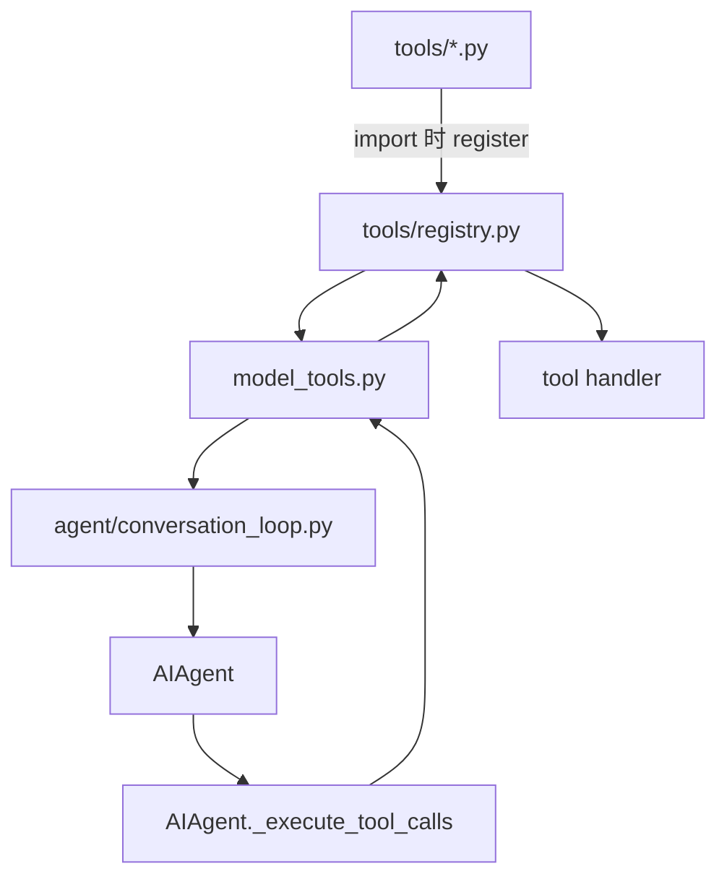
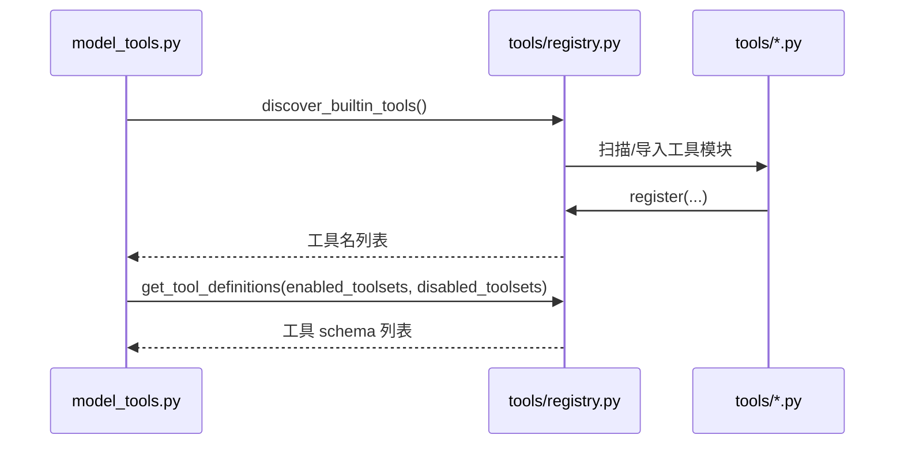

# 06 工具系统与工具集

> 层：第四层（补齐源码逻辑与技术点）
> 状态：已复核（全部行号/符号与基准提交一致）
> 复核日期：2026-08-29
> 生成日期：2026-08-19
> 前置阅读：[04-核心模块与类型关系](./04-核心模块与类型关系.md)

## 一、本模块目标

补齐工具系统：

- 工具注册表；
- 工具发现；
- 工具 schema；
- 工具调用分发；
- 工具集与核心工具；
- 权限/门控；
- 环境隔离；
- 错误体截断。

## 二、工具系统架构



## 三、注册表

### 3.1 位置

- 文件：`tools/registry.py`

### 3.2 关键符号

- `_MAX_TOOL_ERROR_CHARS = 2048`，约在 `33` 行；
- `discover_builtin_tools()`，约在 `111` 行；
- `register()`，约在 `763` 行。

### 3.3 `register()` 参数

```python
register(
    name,
    toolset,
    schema,
    handler,
    check_fn=None,
    requires_env=None,
    is_async=False,
    description=None,
    emoji=None,
    max_result_size_chars=None,
    dynamic_schema_overrides=None,
    override=False,
    scope=None,
)
```

### 3.4 注册冲突规则

- 同 toolset 内重复注册可覆盖；
- 跨 toolset shadow 默认拒绝；
- 插件覆盖内置工具必须 `override=True`；
- 插件覆盖还受 `allow_tool_override` 配置门控。

## 三点五、真实代码映射

| 主题 | 真实文件 | 真实符号/说明 |
|---|---|---|
| 工具注册表 | `tools/registry.py` | `register()` @763 |
| 工具发现 | `tools/registry.py` | `discover_builtin_tools()` @111 |
| 工具定义 | `model_tools.py` | `get_tool_definitions()` @323 |
| 工具分发 | `model_tools.py` | `handle_function_call()` @1240 |
| 工具集定义 | `toolsets.py` | `_HERMES_CORE_TOOLS` |
| 工具执行入口 | `run_agent.py` | `AIAgent._execute_tool_calls()` @8428 |
| 单工具调用 | `run_agent.py` | `AIAgent._invoke_tool()` @8507 |
| 工具批段规划 | `agent/tool_dispatch_helpers.py` | `_plan_tool_batch_segments()` |
| 分段执行 | `agent/tool_executor.py` | `execute_tool_calls_segmented()` |
| 工具护栏 | `agent/tool_guardrails.py` | 工具安全/护栏 |
| 工具结果分类 | `agent/tool_result_classification.py` | 工具结果分类 |
| 环境隔离 | `tools/environments/` | local/docker/ssh/modal/daytona/singularity |

## 四、工具发现

### 4.1 位置

- `tools/registry.py:discover_builtin_tools()`
- `model_tools.py:get_tool_definitions()`

### 4.2 流程



## 五、工具调用分发

### 5.1 位置

- `model_tools.py:handle_function_call()`，约在 `1240` 行

### 5.2 主流程

1. `coerce_tool_args()` 类型转换；
2. 处理 `tool_search` / `tool_describe` / `tool_call` 桥接；
3. pre-tool-call hook；
4. tool request middleware；
5. registry 查表；
6. handler 执行；
7. tool execution middleware；
8. post-tool-call hook；
9. 返回 JSON 字符串。

### 5.3 错误体截断

- 工具错误返回模型前截断到 2048 字符；
- 日志保留更长错误信息；
- 防止工具错误污染 prompt 和 token 成本。

## 六、工具集

### 6.1 位置

- 文件：`toolsets.py`

### 6.2 核心工具集

- `_HERMES_CORE_TOOLS`：每次 API 调用都发送；
- 其他工具集按会话/平台/配置启用。

### 6.3 门控方式

- `check_fn`：进程级 TTL 缓存，用于“是否配置/可达”；
- toolset：session 级能力门控；
- 插件：第三方/用户特定能力；
- MCP server：外部工具目录。

## 七、环境隔离

### 7.1 位置

- 目录：`tools/environments/`

### 7.2 支持环境

- local
- docker
- ssh
- modal
- daytona
- singularity

### 7.3 关键概念

- `task_id` 用于隔离终端/浏览器会话；
- 每个任务可有独立 cwd、环境变量、进程；
- 工具执行时通过 `get_active_env(effective_task_id)` 获取环境。

## 八、本模块结论

本模块补齐了工具注册、发现、分发、工具集、门控和环境隔离。后续模块继续展开配置、数据模型、技能/插件、调度、并发、错误、测试、部署和源码索引。
