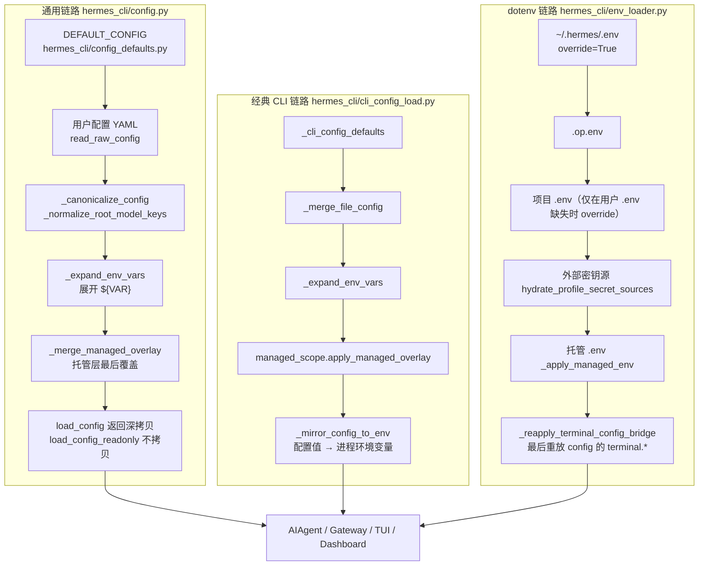

# 07 配置体系与环境变量

> 层：第四层（补齐源码逻辑与技术点）
> 状态：已按 cc0a679f14 复核
> 复核日期：2026-09-22
> 生成日期：2026-08-19
> 前置阅读：[04-核心模块与类型关系](./04-核心模块与类型关系.md)

## 一、本模块目标

补齐配置体系：

- 配置加载（两条互相独立的加载链路）；
- 配置层级与优先级（含管理员托管层）；
- 用户配置 YAML 与 `.env` 的分工**硬边界**，以及代码里贯彻到什么程度；
- profile 感知路径与多实例隔离；
- 配置项规模与 section 清单；
- 环境变量按用途分组；
- 与 `compat_manifest.json` 这类周边机制的关系。

## 二、配置架构

**关键事实：进程里存在两条独立的加载链路，它们不共享代码路径。**

1. **通用链路**（gateway / TUI / dashboard / `hermes config` / 工具与状态层都走这条）：
   `hermes_cli/config.py` · `load_config +0` → `_load_config_impl +0`。
2. **经典 CLI 链路**（`HermesCLI` 自己的 `cli.CLI_CONFIG`）：
   `hermes_cli/cli_config_load.py` · `load_cli_config +0`，随后由
   `_mirror_config_to_env +0` 把配置值投影成环境变量。

两条链路的合并顺序不同（见第四节），但都遵守同一条边界：用户 YAML 是行为配置的权威来源，`.env` 是凭据来源。

## 三、关键文件

| 文件 | 作用 |
|---|---|
| `hermes_cli/config.py` | 通用配置加载/合并/写入、托管层叠加、`hermes config` 子命令 |
| `hermes_cli/config_defaults.py` | `DEFAULT_CONFIG`（唯一 schema 真源）与 `OPTIONAL_ENV_VARS` |
| `hermes_cli/cli_config_load.py` | 经典 CLI 的默认值 + 用户 YAML 合并，以及配置→环境变量桥 |
| `hermes_cli/env_loader.py` | `.env` / `.op.env` / 项目 `.env` / 外部密钥源 / 托管 `.env` 的加载顺序 |
| `hermes_cli/config_env_routing.py` | `hermes config set` 的「写 `.env` 还是写 YAML」路由规则 |
| `hermes_cli/config_backups.py` | 配置解析失败时的 last-known-good 备份 |
| `hermes_cli/managed_scope.py` | 管理员下发的不可变配置层（默认 `/etc/hermes`） |
| `hermes_cli/profiles.py` | profile 名 ↔ `HERMES_HOME` 解析、`active_profile` 粘性文件 |
| `hermes_constants.py` | profile 感知的 `HERMES_HOME`、注册表键、默认根目录 |
| `hermes_logging.py` | 日志路径、轮转、按 home 路由 |
| `cli-config`.yaml.example | **文档化的子集样例**（非 schema 真源） |

> `cli-config`.yaml.example 与 `hermes_cli/config_defaults.py` 的关系：前者是给人读的样例，只有 25 个顶层 section；后者是代码真源，`DEFAULT_CONFIG` 有 **97 个顶层键**。样例不是穷举，`_KNOWN_ROOT_KEYS` 由 `DEFAULT_CONFIG` 派生。

## 三点五、真实代码映射

| 主题 | 真实文件 · 符号（+偏移） | 说明 |
|---|---|---|
| 通用配置加载 | `hermes_cli/config.py` · `load_config +0` | 返回深拷贝；缓存命中约 265µs |
| 只读热路径 | `hermes_cli/config.py` · `load_config_readonly +0` | 不深拷贝；**改返回值会污染进程内缓存** |
| 合并实现 | `hermes_cli/config.py` · `_load_config_impl +0` | 见第四节顺序 |
| 原始文件读取 | `hermes_cli/config.py` · `read_raw_config +0` | 不合并默认值 |
| 配置写入 | `hermes_cli/config.py` · `save_config +0` | 写用户原始配置，绝不写合并结果 |
| 解析失败兜底 | `hermes_cli/config.py` · `_last_known_good_fallback +0` | 坏 YAML 不回退到默认值 |
| 托管层叠加 | `hermes_cli/config.py` · `_merge_managed_overlay +0` | 在用户 `${VAR}` 展开**之后**叠加 |
| 托管层实现 | `hermes_cli/managed_scope.py` · `apply_managed_overlay +0` | 默认目录 `/etc/hermes` |
| 配置路径 | `hermes_cli/config.py` · `get_config_path +0` | `HERMES_HOME/config`.yaml |
| `.env` 路径 | `hermes_cli/config.py` · `get_env_path +0` | `HERMES_HOME/.env` |
| home 骨架 | `hermes_cli/config.py` · `ensure_hermes_home +0` | 目录 + 权限 |
| `${VAR}` 展开 | `hermes_cli/config.py` · `_expand_env_vars +0` | 支持 `${VAR}` 与 `${env:VAR}` |
| model 段归一 | `hermes_cli/config.py` · `_normalize_root_model_keys +0` | 加载/保存唯一收口点 |
| 默认值真源 | `hermes_cli/config_defaults.py` · `DEFAULT_CONFIG` | 97 个顶层键，`_config_version: 45` |
| 可选环境变量表 | `hermes_cli/config_defaults.py` · `OPTIONAL_ENV_VARS` | 156 条，供 dashboard/checklist |
| CLI 配置合并 | `hermes_cli/cli_config_load.py` · `load_cli_config +0` | 见第四节 |
| CLI 内置默认值 | `hermes_cli/cli_config_load.py` · `_cli_config_defaults +0` | 与 `DEFAULT_CONFIG` **不共享** |
| 文件覆盖默认值 | `hermes_cli/cli_config_load.py` · `_merge_file_config +0` | 深合并 dict、覆盖标量 |
| 配置→env 桥 | `hermes_cli/cli_config_load.py` · `_mirror_config_to_env +0` | terminal/browser/auxiliary/security/sessions |
| CLI 启动副作用 | `hermes_cli/cli_config_load.py` · `_init_logging_and_display_from_config +0` | 日志、皮肤、显示开关 |
| dotenv 加载 | `hermes_cli/env_loader.py` · `load_hermes_dotenv +0` | 见第五节 |
| terminal 桥重放 | `hermes_cli/env_loader.py` · `_reapply_terminal_config_bridge +0` | 每次 dotenv 加载后最后执行 |
| 托管 `.env` | `hermes_cli/env_loader.py` · `_apply_managed_env +0` | `override=True`，压过用户与 shell |
| 外部密钥源 | `hermes_cli/env_loader.py` · `hydrate_profile_secret_sources +0` | Bitwarden 等；不写 `os.environ` |
| env 键路由 | `hermes_cli/config_env_routing.py` · `is_env_setting_key +0` | 裸 `UPPER_SNAKE` 名 → 写 `.env` |
| env 名写入白名单校验 | `hermes_cli/config.py` · `validate_env_var_name_for_write +0` | 拒绝 `HERMES_HOME`/`HERMES_YOLO_MODE` 等 |
| 凭据形键判定 | `hermes_cli/config.py` · `_is_env_config_key +0` | `*_API_KEY`/`*_TOKEN`/`*_SECRET` |
| terminal env 映射表 | `hermes_cli/config.py` · `Const:TERMINAL_CONFIG_ENV_MAP` | `terminal.<key>` → `TERMINAL_<KEY>` |
| terminal 桥实现 | `hermes_cli/config.py` · `apply_terminal_config_to_env +0` | 三处调用点共享的唯一实现 |
| profile 路径 | `hermes_constants.py` · `get_hermes_home +0` | override → env → 平台默认 |
| 进程级 home | `hermes_constants.py` · `get_process_hermes_home +0` | 忽略按 turn 的 override |
| 默认根 | `hermes_constants.py` · `get_default_hermes_root +0` | profile 级操作的根 |
| 注册表键 | `hermes_constants.py` · `hermes_home_key +0` | 缓存已存在的 home 路径 |
| 回退告警 | `hermes_constants.py` · `_warn_profile_fallback_once +0` | 粘性 profile 下 HERMES_HOME 未设时告警 |
| profile 解析 | `hermes_cli/profiles.py` · `resolve_profile_env +0` | 名字 → `HERMES_HOME` 字符串 |
| 当前 profile 名 | `hermes_cli/profiles.py` · `get_active_profile_name +0` | 由 `HERMES_HOME` 反推 |
| 日志初始化 | `hermes_logging.py` · `setup_logging +0` | 返回 `logs/` 目录 |
| 配置结构校验 | `hermes_cli/config.py` · `validate_config_structure +0` / `print_config_warnings +0` | 启动期告警 |
| 版本迁移 | `hermes_cli/config.py` · `migrate_config +0` / `check_config_version +0` | 交互式补新字段 |
| 子命令入口 | `hermes_cli/config.py` · `config_command +0`、`Const:_CONFIG_SUBCOMMANDS` | `show/edit/get/set/unset/path/env-path/migrate/check` |

## 四、配置层级

### 4.1 通用链路（`hermes_cli/config.py` · `_load_config_impl +0`）

从低到高：

1. **`DEFAULT_CONFIG` 深拷贝**（`_load_config_impl +19`）——硬编码默认值。
2. **用户 YAML**（`_load_config_impl +21` 起）——`read_raw_config` 的原始映射；legacy 根级 `max_turns` 在此被搬到 `agent.max_turns`。
3. **canonicalize**——`_normalize_root_model_keys` 等，`model.default` / `model.model` 归一。
4. **`${VAR}` 展开**——`_expand_env_vars`，因此 `.env` 必须在 `load_config` 之前加载完，否则会把未展开的字面量钉进进程缓存（代码注释明确记了这个坑）。
5. **托管层（managed scope）最后叠加**——`_merge_managed_overlay +0`。托管值在叶子上胜出，且**只对进程环境展开**，所以用户的 `${VAR}` 无法遮蔽托管字面量。这是**有意反置**「env 高于 config」的常规优先级，只对托管层钉住的键生效。

缓存：`_LOAD_CONFIG_CACHE` 以 `(用户文件 mtime_ns, size, ino, ctime_ns) + 托管文件签名` 为键，另存一份 `${VAR}` 的值快照——快照里任一变量变了就重载。

**坏 YAML 的兜底**（`_last_known_good_fallback +0`）：解析失败**绝不**回退到 `DEFAULT_CONFIG`，否则会丢掉包括 `approvals.deny` 在内的全部用户覆盖。进程内有上次成功结果就用它；新进程则从 `hermes_cli/config_backups.py` · `load_newest_good_backup +0` 取最近一次字节级好副本。

### 4.2 经典 CLI 链路（`hermes_cli/cli_config_load.py` · `load_cli_config +0`）

1. `_cli_config_defaults +0`（`load_cli_config +10`）——CLI 自己的内置默认值。
2. 用户 YAML 覆盖（`+22` 起）——`_merge_file_config +0`：dict 段深合并、标量覆盖、`None` 段保留默认值；未知键原样带过。
3. `${VAR}` 展开（`+28`）。
4. 托管层（`+33`）——同样最后叠加，与通用链路保持一致（`cli.py` 独立构建配置，所以必须自己再叠一次）。
5. `_mirror_config_to_env +0`（`+37`）——把配置值投影成环境变量。

配置文件的选择（`+5~+8`）：优先 `HERMES_HOME/config`.yaml；不存在、或设了 `HERMES_IGNORE_USER_CONFIG=1` 时，退到源码树里的 `cli-config`.yaml 模板。**注意：`HERMES_IGNORE_USER_CONFIG` 只跳过用户 YAML，`.env` 仍然加载。**

### 4.3 CLI 参数与运行时覆盖

`HermesCLI` 的初始化把命令行参数叠在 `CLI_CONFIG` 之上（`cli.py` · `HermesCLI._init_model_routing +0`）。运行时覆盖（如 `/model`、`/resume`）只影响当前进程，不落盘。

## 五、用户配置 YAML 与 `.env` 的分工（硬边界）

### 5.1 规则原文

仓库根 `AGENTS.md` 的反模式清单里写得很直接（`AGENTS.md` 中「New `HERMES_*` env vars for non-secret config」一条）：

- `.env` **只放 secrets**（API key / token / password）；
- 所有**行为配置**（超时、阈值、feature flag、显示偏好）必须放用户 YAML；
- 如果某个机制需要一个内部环境变量，**在代码里从配置桥过去**，而不是让用户去写 `.env`；
- 拒绝「把 X 写进你的 `.env`」这类文档，除非 X 确实是凭据。

`cli-config`.yaml.example 的文件头也重申了同一条：只有**文档化的 secret 环境变量**才优先于对应配置项。

### 5.2 代码里如何贯彻

| 机制 | 符号 | 效果 |
|---|---|---|
| 配置→env 单向桥 | `hermes_cli/cli_config_load.py` · `_mirror_config_to_env +0` | 配置值是源，env 是派生载体；这正是「需要内部 env 就在代码里桥」的正规做法 |
| terminal 桥的唯一实现 | `hermes_cli/config.py` · `apply_terminal_config_to_env +0` | terminal 工具在子进程里跑，只能读 env；三处调用点共用一份实现，语义不会漂 |
| 桥的最后重放 | `hermes_cli/env_loader.py` · `_reapply_terminal_config_bridge +0` | 每次 dotenv 加载后**最后**重放，防止 `.env` 里残留的 `TERMINAL_ENV=docker` 在长驻进程里把后端翻回去 |
| env 写入拒绝表 | `hermes_cli/config.py` · `validate_env_var_name_for_write +0` | `HERMES_HOME` / `HERMES_YOLO_MODE` / `LD_PRELOAD` / `PATH` 等一律不可经写入器落盘；注释明确写「用户配置 YAML 才是受支持的设置面」 |
| 凭据形键识别 | `hermes_cli/config.py` · `_is_env_config_key +0` | 只有 `*_API_KEY` / `*_TOKEN` / `*_SECRET` / `TERMINAL_SSH*` 走 `.env` |

### 5.3 反例（该规则并未被 100% 贯彻）

复核时在源码里找到以下几类**与规则不一致**的现状，重实现时应知道这是历史存量而非设计意图：

1. **写入器按「键的形状」而不是「是否密钥」路由**：`hermes_cli/config_env_routing.py` · `is_env_setting_key +0` 规定——任何裸 `UPPER_SNAKE` 名都写进 `.env`。其模块 docstring 自陈：约 700 个文档化变量里有 **~290 个**是直接从环境读、根本没登记在 `OPTIONAL_ENV_VARS` 里的（例如 `TELEGRAM_GROUP_ALLOWED_USERS`、`HERMES_TIMEZONE`）。所以 `.env` 在实践中确实承载了非密钥设置。这是**已记录的历史债务**（#111848），不是新设计。
2. **`_EXTRA_ENV_KEYS` 里有非密钥项**：`hermes_cli/config.py` · `Const:_EXTRA_ENV_KEYS` 收录了大量平台频道键与 `HERMES_TOOL_PROGRESS_MODE`（已废弃但网关仍读作回退）。
3. **`HERMES_*` 前缀本身没有被禁止**：`validate_env_var_name_for_write` 的注释明确说 `HERMES_*` 整体不禁，因为 `HERMES_LANGFUSE_PUBLIC_KEY`、`HERMES_SPOTIFY_CLIENT_ID` 这类集成凭据就在这个前缀下；拒绝表是逐名列举的。
4. **树内存在 468 个不同的 `HERMES_*` 名字**（静态扫描非 `tests/` 的 `.py`，本仓库 HEAD）。其中绝大多数是**进程内部载体**，不是用户配置面：测试/取证逃生门（`HERMES_TEST_ISOLATION`、`HERMES_STATE_DB_GUARD_BYPASS`、`HERMES_DEV_CREDITS_FIXTURE`）、子进程身份（`HERMES_DELEGATED_CHILD_CONTEXT`、`HERMES_SUPERVISED_CHILD`）、以及配置桥产生的载体。**不能用这个数量反推「用户要设这么多环境变量」。**

结论：规则约束的是**新增的用户可见配置面**；代码里有正规的「配置→内部 env」桥，也有一批尚未清理的历史 env 键。重实现时按规则做（用户只写 YAML + `.env` 只放凭据），不要照抄存量。

## 六、profile 感知路径

真实符号：`hermes_constants.py` · `get_hermes_home +0`。

解析顺序（`+1~+7`）：

1. **上下文局部 override**——`hermes_constants.py` · `get_hermes_home_override +0`（`ContextVar`，由 `set_hermes_home_override +0` 设置）。这是 gateway 多路复用、dashboard/TUI 按会话路由 profile 的机制。
2. **`HERMES_HOME` 环境变量**——`get_process_hermes_home +0`。
3. **平台默认**——`_get_platform_default_hermes_home +0`：POSIX 是 `~/.hermes`，Windows 是 `%LOCALAPPDATA%\hermes`。

profile 的物理布局（`hermes_cli/profiles.py` · `resolve_profile_env +0`）：

- `default` → `<root>`；
- 具名 profile → `<root>/profiles/<name>`；
- `get_active_profile_name +0` 反向判定：等于默认 home → `"default"`；在 `<root>/profiles/` 下一层且匹配 `_PROFILE_ID_RE` → 该名字；否则 `"custom"`。

**粘性 profile 与回退陷阱**：`hermes_cli/main.py` · `_apply_profile_override +0` 在导入重模块之前预解析 `-p/--profile`；若没给 flag 但 `<root>/active_profile` 文件存在且不是 `default`，就用它（`+19~+29`），然后写 `os.environ["HERMES_HOME"]`（`+49`）并把 flag 从 `argv` 里剥掉（`+51`）。若 `HERMES_HOME` 未设而粘性 profile 又不是 default，`hermes_constants.py` · `_warn_profile_fallback_once +0` 会直接往 stderr 打一条告警：此时回退到的是**默认 profile，不是粘性 profile**，写进去的数据会落错地方。

按 profile 隔离的东西：配置、`.env`、日志、会话库、插件、技能、cron 存储、网关 PID/lock 文件。

## 七、日志配置

真实符号：`hermes_logging.py` · `setup_logging +0`（返回 `logs/` 目录）。

`+13~+21`：`home = hermes_home or get_hermes_home()`，`logs/` 经 `mkdir_under_hermes_home` 创建。

处理器规格（`+34~+40`，格式 `(文件名, 级别, 单文件上限, 备份数, 组件门控)`）：

| 文件 | 级别 | 轮转 | 何时启用 |
|---|---|---|---|
| `agent.log` | `logging.*` 配置值，默认 INFO | 默认 5MB × 3 | 总是 |
| `errors.log` | WARNING | 2MB × 2 | 总是 |
| `gateway.log` | INFO | 5MB × 3 | 仅 `mode="gateway"` |
| `gui.log` | INFO | 10MB × 5 | 仅 `mode="gui"` |

> **勘误（上一版漏项）**：上一版只列了 `agent.log` / `errors.log` / `gateway.log` 三个文件。实际还有 **`gui.log`**，且 `gateway.log` 只在 gateway 模式下存在——不是「总是有 gateway.log」。

级别与轮转默认值来自配置的 `logging.*` 段（`_read_logging_config +0`）。**同一进程内的第二个 Hermes home** 不叠加文件处理器，而是走按记录归属的路由（`_adopt_secondary_home +0`），否则会把所有 profile 的记录混在一个文件里。

## 八、多实例支持

- **profile 隔离**：`HERMES_HOME` 决定一切（第六节）。
- **多路复用（multiplex）**：`agent/secret_scope.py` · `is_multiplex_active +0` 为真且存在 profile-home override 时，`load_hermes_dotenv +19` 会**跳过进程级 dotenv 加载**——否则把某个 profile 的 `.env` 灌进 `os.environ` 会泄露给同进程的兄弟 turn 和所有子进程。此时凭据改由 profile scope 解析。
- **工作区绑定**：`--in DIR` / `HERMES_CWD` 决定会话的 cwd 与 workspace key。
- **会话库隔离**：`HERMES_HOME/state.db`。
- **全局 active-session 槽位**：跨 surface（CLI / TUI / dashboard / gateway）的单机并发上限，见第 11 篇。
- **管理员托管层**：`/etc/hermes` 下的配置与环境对**所有** profile 生效，用户不可改。

## 九、配置项规模与 section 清单

`hermes_cli/config_defaults.py` · `DEFAULT_CONFIG` 当前有 **97 个顶层键**，`_config_version: 45`；`hermes_cli/config.py` · `Const:_KNOWN_ROOT_KEYS` = 这 97 个 ∪ `Const:_EXTRA_KNOWN_ROOT_KEYS` 的 25 个（其中 `plugins` 与 `DEFAULT_CONFIG` 重复），合计 **121 个合法根键**。按主题分组的顶层 section：

| 组 | 顶层键 |
|---|---|
| 模型与凭据 | `model`、`providers`、`fallback_providers`、`fallback`、`credential_pool_strategies`、`model_catalog`、`model_overrides`、`models_dev`、`openrouter`、`bedrock`、`vertex`、`nous`、`auth`、`secrets`、`vault` |
| 运行时与存储 | `database`、`runtime`、`session`、`sessions`、`checkpoints`、`max_concurrent_sessions`、`max_live_sessions`、`local_runtime`、`proxy` |
| Agent 行为 | `agent`、`compression`、`prompt_caching`、`tool_output`、`tool_loop_guardrails`、`tools`、`toolsets`、`delegation`、`goals`、`loops`、`moa`、`context`、`memory`、`curator`、`honcho` |
| 工具与执行环境 | `terminal`、`web`、`browser`、`code_execution`、`computer_use`、`mcp`、`lsp`、`x_search` |
| 交互与显示 | `display`、`dashboard`、`desktop`、`streaming`、`paste_collapse_threshold`、`paste_collapse_threshold_fallback`、`paste_collapse_char_threshold`、`quick_commands`、`command_allowlist`、`personalities`、`onboarding` |
| 语音与多模态 | `tts`、`stt`、`voice`、`vision`、`wake_word`、`human_delay` |
| 平台 | `slack`、`discord`、`whatsapp`、`telegram`、`mattermost`、`matrix`、`platform_hints`、`bot_mode` |
| 安全与审批 | `approvals`、`security`、`privacy` |
| 扩展 | `plugins`、`hooks`、`hooks_auto_accept`、`skills`、`auxiliary` |
| 运维 | `logging`、`monitoring`、`telemetry`、`doctor`、`updates`、`network`、`gateway`、`cron`、`kanban` |
| 杂项常量 | `timezone`、`prefill_messages_file`、`context_file_max_chars`、`context_file_read_timeout`、`file_read_max_chars`、`mcp_discovery_timeout`、`mcp_single_query_discovery_timeout`、`_config_version` |
| 额外合法根键（不在 `DEFAULT_CONFIG`） | `custom_providers`、`fallback_model`、`mcp_servers`、`image_gen`、`video_gen`、`smart_model_routing`、`platform_toolsets`、`known_plugin_toolsets`、`known_builtin_toolsets`、`tool_gateway_declined_tools`、`group_sessions_per_user`、`thread_sessions_per_user`、`stt_echo_transcripts`、`reset_triggers`、`always_log_local`、`filter_silence_narration`、`multiplex_profiles`、`profile_routes`、`platforms`、`require_mention`、`unauthorized_dm_behavior`、`signal`、`allow_all_users`、`timeouts` |

> 这些是**顶层键**，不是「所有可设项」。`_KNOWN_ROOT_KEYS` 只按第一段校验，深层允许用户加字段（`platforms.<name>` 这类就是开放的）。
>
> `hermes config set <key> <value>` 支持点号路径、转义点号（`a\.b`）、以及容器类型守卫（`_refuse_container_type_mismatch +0`：schema 要 list 时不会让你写成 mapping）。

## 十、环境变量分组

不逐条罗列（见第九节的规模说明）。按用途分组：

| 用途 | 代表变量 | 说明 |
|---|---|---|
| **位置与身份** | `HERMES_HOME`、`HERMES_PROFILE`、`HERMES_PROFILE_NAME`、`HERMES_MACHINE_ID` | 决定 profile 与实例身份；`HERMES_HOME` 在写入器拒绝表内 |
| **凭据（`.env` 的正当内容）** | `*_API_KEY`、`*_TOKEN`、`*_SECRET`、`LANGFUSE_*`、`HERMES_LANGFUSE_PUBLIC_KEY` | 由 `_is_env_config_key +0` 识别并走凭据生命周期 |
| **会话与路由** | `HERMES_SESSION_ID`、`HERMES_SESSION_KEY`、`HERMES_SESSION_PLATFORM`、`HERMES_SESSION_SOURCE`、`HERMES_SESSION_CHAT_ID`、`HERMES_SESSION_THREAD_ID` | 每 turn 由平台层/调度层注入 |
| **运行模式与安全策略** | `HERMES_INTERACTIVE`、`HERMES_EXEC_ASK`、`HERMES_YOLO_MODE`、`HERMES_ACCEPT_HOOKS`、`HERMES_REDACT_SECRETS`、`HERMES_SAFE_MODE`、`HERMES_NONINTERACTIVE` | **不可**经 env 写入器落盘；只能由专用开关设置 |
| **超时与迭代上限** | `HERMES_MAX_ITERATIONS`、`HERMES_API_TIMEOUT`、`HERMES_AGENT_TIMEOUT`、`HERMES_CRON_TIMEOUT`、`HERMES_STREAM_*`、`HERMES_TURN_LEASE_TIMEOUT` | 属行为配置；正规做法是在 YAML 里设 |
| **显示与 UI** | `HERMES_QUIET`、`HERMES_TUI_*`、`HERMES_TOOL_PROGRESS_MODE`、`HERMES_SPINNER_PAUSE`、`HERMES_LIGHT`、`COLORFGBG` | 部分已废弃但仍被读作回退 |
| **平台调优** | `HERMES_TELEGRAM_*`、`HERMES_FEISHU_*`、`HERMES_DISCORD_*`、`HERMES_MATRIX_*`、`HERMES_WECOM_*`、`HERMES_SIMPLEX_*` | 批量延迟、HTTP 超时等；属行为配置 |
| **定时任务 / 看板** | `HERMES_CRON_SESSION`、`HERMES_CRON_AUTO_DELIVER_*`、`HERMES_CRON_MAX_PARALLEL`、`HERMES_KANBAN_*` | 调度器注入的执行上下文 |
| **观测与诊断** | `HERMES_LANGFUSE_*`、`HERMES_DEV_*`、`HERMES_DUMP_REQUESTS`、`HERMES_STARTUP_WATCHDOG`、`HERMES_STARTUP_WATCHDOG_TIMEOUT_S` | 多为调试/取证逃生门 |
| **测试隔离** | `HERMES_TEST_ISOLATION`、`HERMES_TEST_WORKERS`、`HERMES_STATE_DB_GUARD_BYPASS` | 只供测试与 CI；生产不应出现 |
| **网关进程内部** | `_HERMES_GATEWAY`、`HERMES_GATEWAY_SESSION`、`HERMES_GATEWAY_LOCK_DIR`、`HERMES_DESKTOP` | 前缀带下划线的是纯内部标记 |

> **当前源码无法确定**：`OPTIONAL_ENV_VARS` 有 156 条，但树内被读取的 `HERMES_*` 名字有 468 个——两者都不等于「用户应设的环境变量集合」。要给出精确的「用户面变量清单」，需要另行按 `is_registered_env_name +0` 与 setup 流程交叉统计；本版不做该声明。

## 十一、`compat_manifest.json` 与配置体系的交集

`compat_manifest.json` / `COMPAT_MANIFEST.md` 是 **2026-09 大拆分（PR #102117）留下的插件 import 兼容指针表**，不是配置机制。它的作用：把「旧模块路径 + 名字」映射到新位置，让外部插件在过渡期内仍能 import。

与配置体系的**唯一交集**是一个配置键：

- `plugins.allow_deprecated_imports`（`DEFAULT_CONFIG.plugins` 默认 `false`）；
- 实现：`hermes_cli/plugin_compat.py` · `allow_deprecated_imports +0`；
- 语义：`hermes_cli/plugin_compat.py` · `Const:COMPAT_REMOVAL_DATE` = `2026-09-14`。**该日期已过**，所以 `removal_in_effect +0` 现在返回真：命中旧路径的插件默认被**禁用**，只有显式设 `plugins.allow_deprecated_imports: true` 才强制加载（`disable_reason +0`）。
- 注意代码只认字面布尔 `true`：YAML 里的 `"false"` / `"no"` 不会打开这个后置窗口。

清单文件本身的机制（扫描、`hermes plugins compat`、CI 里的 `scripts/check_compat_pointers.py`）属于插件架构，归 **[09-技能系统与插件架构](./09-技能系统与插件架构.md)**。本文只登记这个配置键。

## 十二、易错点与边界条件

1. **两条加载链路不共享代码**。改了 `hermes_cli/config.py` 的合并逻辑，不会自动影响 `HermesCLI` 的 `CLI_CONFIG`（反之亦然）。`load_cli_config +33` 那句「cli.py builds its config independently」就是这个坑的注释。
2. **`load_config_readonly` 的返回值不能改**。它不深拷贝，改了会污染进程内缓存，影响之后所有调用方。
3. **`.env` 的加载必须早于 `load_config`**。`${VAR}` 展开发生在加载期，早于 dotenv 的 `load_config` 会把未展开的字面量钉进缓存（#58514）。
4. **坏 YAML 不会回退到默认值**。会用 last-known-good（进程内 → `backups/config/`），这是为了保护 `approvals.deny` 这类安全规则。
5. **托管层在用户 `${VAR}` 展开之后叠加**。用户无法用 `${VAR}` 遮蔽托管值。
6. **`HERMES_IGNORE_USER_CONFIG=1` 只跳过用户 YAML**，`.env` 照常加载。
7. **terminal 后端由 YAML 拥有**。`.env` 里残留的 `TERMINAL_ENV` 会被 `_reapply_terminal_config_bridge +0` 在每次 dotenv 加载后压回去；但**只有当原始 YAML 里确实写了 `terminal` 段**时才覆盖已存在的 env（`_file_has_terminal_config`）。
8. **`local` 后端的 cwd 永远是 `os.getcwd()`**，配置里的 `.` / `auto` / `cwd` 是占位符（`_CWD_PLACEHOLDERS`）；非 local 后端才允许显式路径。
9. **`.op.env` 的 `override=False`**，所以 systemd 的 `EnvironmentFile=` 里的 token 能赢；但 `.env` 整体是 `override=True`，会压掉陈旧的 shell export。
10. **`_expand_env_vars` 支持 `${env:VAR}`**（Cursor 风格 SecretRef），非 `env` 源的引用（如 `bitwarden:FOO`）不会被展开成明文。
11. **`hermes config set` 的落点由键的形状决定**，不是由「是不是密钥」决定（见 5.3 第 1 条）。裸 `UPPER_SNAKE` 名进 `.env`，带点的路径进 YAML。

## 十三、本模块结论

本模块补齐了配置加载（双链路）、配置层级（含托管层与 LKG 兜底）、YAML/`.env` 硬边界及其代码贯彻程度与反例、profile 与多实例隔离、配置项规模、环境变量分组，以及与 `compat_manifest.json` 的唯一交集。后续模块继续展开数据模型、技能/插件、调度、并发、错误、测试、部署和源码索引。

---

上一篇：[06-工具系统与工具集](./06-工具系统与工具集.md) ｜ 总目录：[./README.md](./README.md) ｜ 下一篇：[08-数据模型与会话存储](./08-数据模型与会话存储.md)
