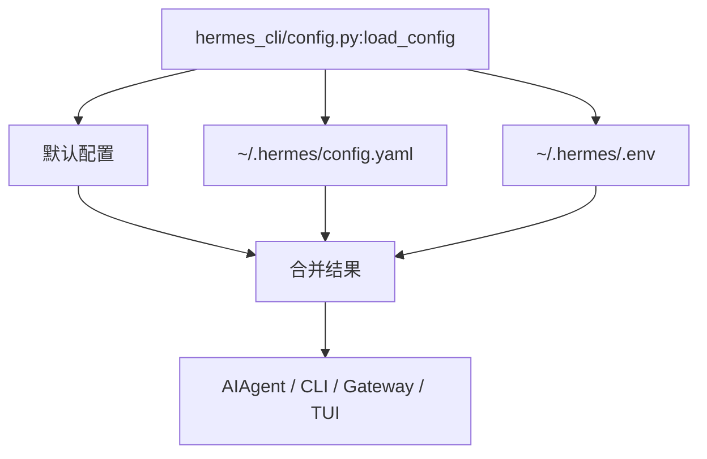

# 07 配置体系与环境变量

> 层：第四层（补齐源码逻辑与技术点）
> 状态：已复核（全部行号/符号与基准提交一致）
> 复核日期：2026-08-29
> 生成日期：2026-08-19
> 前置阅读：[04-核心模块与类型关系](./04-核心模块与类型关系.md)

## 一、本模块目标

补齐配置体系：

- 配置加载；
- 配置层级；
- `config.yaml` 与 `.env` 分工；
- profile 感知路径；
- 多实例支持；
- 环境变量边界。

## 二、配置架构

## 三、关键文件

| 文件 | 作用 |
|---|---|
| `hermes_cli/config.py` | 配置加载与合并 |
| `hermes_constants.py` | profile 感知 `HERMES_HOME` |
| `hermes_logging.py` | 日志路径与初始化 |
| `cli.py:load_cli_config()` | CLI 默认配置 + 用户配置合并 |

## 三点五、真实代码映射

| 主题 | 真实文件 | 真实符号/说明 |
|---|---|---|
| 配置加载 | `hermes_cli/config.py` | `load_config()` @3305 |
| CLI 配置合并 | `cli.py` | `load_cli_config()` @411 |
| profile 路径 | `hermes_constants.py` | `get_hermes_home()` @114 |
| 日志初始化 | `hermes_logging.py` | `setup_logging()` @259 |
| 用户配置 | `~/.hermes/config.yaml` | 行为配置 |
| 用户 secrets | `~/.hermes/.env` | API keys/tokens/passwords |
| 日志目录 | `~/.hermes/logs/` | `agent.log` / `errors.log` / `gateway.log` |
| 会话库 | `~/.hermes/state.db` | `SessionDB` 默认 SQLite 文件 |

## 四、配置层级

1. 硬编码默认值；
2. 用户 `config.yaml`；
3. 命令行参数；
4. 运行时覆盖。

## 五、`config.yaml` 与 `.env` 分工

- `config.yaml`：行为配置、超时、阈值、feature flag、显示偏好；
- `.env`：仅 secrets，如 API key、token、password；
- 不新增 `HERMES_*` 行为配置 env；
- 如果机制需要内部 env，用户文档仍指向 `config.yaml`。

## 六、profile 感知路径

真实符号：

- `hermes_constants.py:get_hermes_home()`，约在 `114` 行

作用：

- 根据 profile 返回不同 `HERMES_HOME`；
- 日志、配置、会话库、插件、技能均按 profile 隔离。

## 七、日志配置

真实符号：

- `hermes_logging.py:setup_logging()`，约在 `259` 行

日志文件：

- `~/.hermes/logs/agent.log`：INFO+；
- `~/.hermes/logs/errors.log`：WARNING+；
- `~/.hermes/logs/gateway.log`：gateway 运行时。

## 八、多实例支持

- profile 隔离；
- 工作区绑定；
- 会话库路径隔离；
- 日志路径隔离。

## 九、本模块结论

本模块补齐了配置加载、层级、路径和 env 边界。后续模块继续展开数据模型、技能/插件、调度、并发、错误、测试、部署和源码索引。
