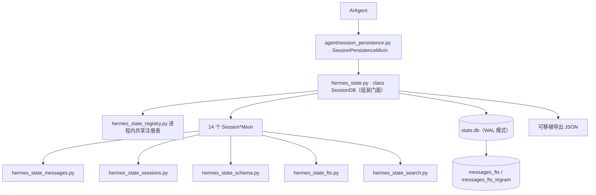
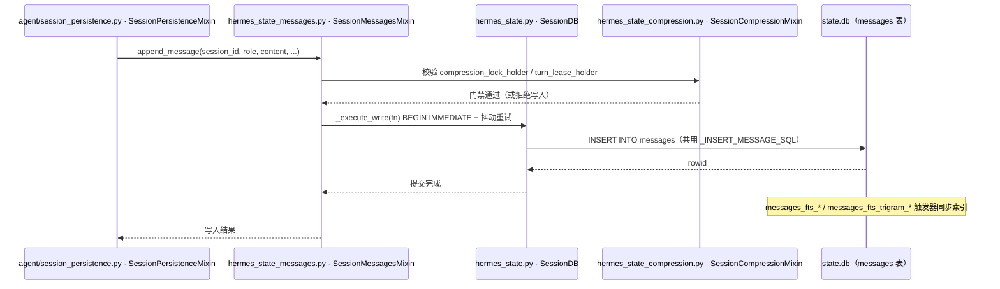

# 08 数据模型与会话存储

> 层：第四层（补齐源码逻辑与技术点）
> 状态：已按 cc0a679f14 复核
> 复核日期：2026-09-22
> 生成日期：2026-08-19
> 前置阅读：[04-核心模块与类型关系](./04-核心模块与类型关系.md)
> 后续阅读：[09-技能系统与插件架构](./09-技能系统与插件架构.md)

> **本版定位记法**：一律「`文件路径` · `符号名` `+N`」，`+0` = 符号定义行，`+N` = 符号体内第 N 行。
> 正文不出现绝对行号。本版基于提交 `cc0a679f14`（2026-09-21）静态分析；**未运行测试套件**，
> 不对"测试是否通过"作声明。表结构以 `hermes_state_common.py` · `Const:SCHEMA_SQL` 的实际 DDL 为准。

## 一、本模块目标

补齐会话存储：

- `SessionDB` 类及其组装方式；
- `hermes_state_*` 兄弟模块的分工；
- SQLite schema（真实 DDL）；
- 消息模型与消息读取；
- FTS5 搜索（含 CJK / trigram）；
- 软删除与 rewind；
- 压缩代际与 lineage；
- 可移植性导入导出与 schema 迁移。

## 二、存储架构



## 三、`SessionDB`

### 3.1 位置

- 文件：`hermes_state.py`（1697 行）
- 类：`hermes_state.py` · `class SessionDB` `+0`
- 异步门面：`hermes_state.py` · `class AsyncSessionDB` `+0`
  （每次调用经 `asyncio.to_thread`，避免阻塞事件循环）

### 3.2 继承关系

`SessionDB` **同样是 Mixin 组装类**（与 `AIAgent` 同一套路，但规模更小）：

```python
class SessionDB(
    SessionSessionsMixin, SessionFtsSetupMixin, SessionSearchMixin, SessionSchemaMixin,
    SessionPortabilityMixin, SessionTelegramTopicsMixin, SessionCompressionMixin,
    SessionGatewayMixin, SessionMaintenanceMixin, SessionUsageMixin, SessionTitlesMixin,
    SessionMessagesMixin, SessionRewindMixin, SessionProfileRepairMixin,
):
    """SQLite-backed session storage with FTS5 search; many reader threads, one writer (WAL)."""
```

共 **14 个 Mixin**。`SessionDB` 本体保留 51 个方法，全部是**基础设施**而非业务：

| 本体职责 | 代表符号 |
|---|---|
| 连接与连接池 | `SessionDB.__init__` `+0`、`_open_writer` `+0`、`_get_read_conn` `+0`、`_checkout_read_conn` `+0` |
| 读写原语（Mixin 全都建立在它们之上） | `_read_ctx` `+0`、`_execute_write` `+0`、`_read_all` `+0`、`_read_one` `+0`、`_write_sql` `+0` |
| 写重试与锁耐心 | `_sleep_before_write_retry` `+0`；类常量 `_WRITE_PATIENCE_S` / `_TRANSCRIPT_WRITE_PATIENCE_S` / `_ACTIVITY_WRITE_PATIENCE_S` |
| 文件代际与损坏守卫 | `_ensure_db_file_generation` `+0`、`_db_file_was_replaced` `+0`、`_halt_if_db_generation_changed` `+0`、`_raise_if_db_corrupt` `+0`、`_halt_db_corrupt` `+0` |
| WAL 维护 | `_try_wal_checkpoint` `+0`；类常量 `_CHECKPOINT_EVERY_N_WRITES` |
| 元数据与生命周期 | `get_meta` `+0`、`set_meta` `+0`、`list_meta_prefix` `+0`、`close` `+0`、`__enter__` `+0` / `__exit__` `+0` |

关键设计：**读路径与写路径分离**。`_read_ctx` 在 WAL 下产出无锁的池化只读连接；
只有非 WAL、打开失败或读连接达到上限时才退化到「写连接 + 锁」——注释里明说这是
"slower beats EMFILE"的刻意降级。`_execute_write` 用 `BEGIN IMMEDIATE` 提前拿写锁，
遇 locked/busy 时释放 Python 锁、抖动退避、**整个回调重试**（因此回调必须幂等）。

### 3.3 兄弟模块分工（28 个 `hermes_state_` 模块）

| 模块 | 定位 | 代表符号 |
|---|---|---|
| `hermes_state_common.py` | 共享常量与 SQL 片段（放在 `hermes_state` 外以避免循环 import） | `Const:SCHEMA_SQL`、`Const:SCHEMA_VERSION`、`Const:FTS_STORAGE_VERSION`、`Const:FTS_SQL`、`Const:FTS_TRIGRAM_SQL`、`Const:DEFERRED_INDEX_SQL`、`Const:_FTS_TRIGGERS`、`escape_like` `+0`、`is_automatic_end_reason` `+0`、`fts_trigram_session_sql` `+0`、`fts_rebuild_admission` `+0` |
| `hermes_state_sessions.py` | 会话生命周期：行 upsert/继承、生命周期标志（end/reopen/archive/pin/hide/read）、`model_config` 补丁、列表与计数、删除级联、自动归档扫描 | `SessionSessionsMixin` `+0`；`create_session` `+0`、`get_session` `+0`、`list_sessions_rich` `+0`、`session_lifecycle_statuses` `+0`、`get_session_delete_targets` `+0`、`delete_session` `+0`、`delete_sessions` `+0`、`archive_sessions` `+0`、`search_sessions` `+0` |
| `hermes_state_messages.py` | 转写持久化：消息追加/替换/rewind、reaction、resume 组装、重放用户消息去重 | `SessionMessagesMixin` `+0`；见第五节 |
| `hermes_state_schema.py` | schema 创建、列对齐（reconciliation）、FTS DDL 管理、延迟 FTS 恢复重试 | `SessionSchemaMixin` `+0`、`reconcile_state_schema` `+0`、`retry_deferred_fts_recovery` `+0`、`schema_read_probe_statements` `+0` |
| `hermes_state_fts.py` | FTS5 索引搭建：CJK-bigram（`cjk_unicode61`）DDL 与 tokenizer 装载、按表 ensure + 能力回退、FTS 域损坏识别、原子 fail-open 触发器摘除 | `SessionFtsSetupMixin` `+0`；`SessionFtsSetupMixin._ensure_fts_schema` `+0`、`SessionFtsSetupMixin._ensure_fts_cjk_schema` `+0`、`SessionFtsSetupMixin._enter_fts_fail_open` `+0`、`load_fts5_cjk_extension` `+0`、`fts5_cjk_so_path` `+0` |
| `hermes_state_search.py` | 全文 / trigram / CJK 消息检索与 FTS 维护 | `SessionSearchMixin` `+0`；`search_messages` `+0`、`search_sessions_by_id` `+0`、`get_anchored_view` `+0`、`list_recent_user_messages` `+0`、`fts_rebuild_status` `+0`、`fts_rebuild_step` `+0`、`fts_cjk_rebuild_step` `+0`、`rebuild_fts` `+0`、`optimize_fts` `+0`、`optimize_fts_storage` `+0` |
| `hermes_state_rewind.py` | 载体感知的用户轮 rewind（`/undo`、`/retry`），CLI / gateway / TUI 共用的唯一实现 | `SessionRewindMixin` `+0`、`rewind_user_turn` `+0`、`class RewindOutcome` `+0`、`class RewindTargetUnavailableError` `+0` |
| `hermes_state_compression.py` | 压缩 lineage、冷却/连败计数器、压缩锁与 turn lease | `SessionCompressionMixin` `+0`；`publish_compression_child` `+0`、`try_acquire_compression_lock` `+0`、`release_compression_lock` `+0`、`try_acquire_session_turn_lease` `+0`、`finalize_orphaned_compression_sessions` `+0`、`get_compression_chain` `+0`、`get_compression_lineage` `+0` |
| `hermes_state_portability.py` | 会话列表/富行、导出与导入 | `SessionPortabilityMixin` `+0`；`find_foreign_import` `+0`、`import_foreign_history` `+0`、`export_session` `+0`、`export_session_lineage` `+0`、`export_all` `+0`、`import_sessions` `+0` |
| `hermes_state_titles.py` | 会话标题：清洗、auto/user 来源排序、沿 lineage 查找 | `SessionTitlesMixin` `+0`；`set_session_title` `+0`、`get_session_title` `+0`、`resolve_session_by_title` `+0` |
| `hermes_state_timeline.py` | 只读 prompt 索引与有界转写跳转（不做全量 payload 水合） | `get_session_messages_around` `+0`、`get_session_timeline` `+0` |
| `hermes_state_usage.py` | token/用量记账：合并写入的后台 token writer、按模型用量行、计费路由列 | `SessionUsageMixin` `+0`；`update_session_billing_route` `+0`、`queue_token_counts` `+0`、`flush_token_counts` `+0`、`update_token_counts` `+0`、`record_auxiliary_usage` `+0`、`usage_totals` `+0` |
| `hermes_state_maintenance.py` | 保留期裁剪、陈旧会话归档、VACUUM 策略 | `SessionMaintenanceMixin` `+0`；`sweep_orphaned_sessions` `+0`、`archive_stale_sessions` `+0`、`prune_sessions` `+0`、`vacuum` `+0`、`maybe_auto_prune_and_vacuum` `+0` |
| `hermes_state_gateway.py` | 网关侧持久化：路由索引、peers、orphans、心跳、handoff | `SessionGatewayMixin` `+0` |
| `hermes_state_telegram.py` | Telegram DM topic 模式 | `SessionTelegramTopicsMixin` `+0` |
| `hermes_state_profile_repair.py` | 一个 `state.db` 内的跨 profile 脏数据查找与修复（`hermes sessions repair-profiles`） | `SessionProfileRepairMixin` `+0`、`session_key_profile` `+0` |
| `hermes_state_registry.py` | 进程内共享 `SessionDB` 注册表：每路径每进程一个实例、引用计数、文件被替换时的代际感知退休 | `acquire` `+0`、`close_all` `+0`、`get_shared_session_db` `+0`、`release_shared_session_db` `+0` |
| `hermes_state_holders.py` | state.db 结构性维护的「进程与 fd 权威」：证明没有外部进程仍持有当前/已 unlink 的 DB/WAL/SHM 代际 | `foreign_state_db_holders` `+0`、`live_writer_holds_db` `+0`、`read_only_db_uri` `+0` |
| `hermes_state_lockguard.py` | 把 WAL 模式的文件锁持在「游离 close() 取消不掉」的形态 | `supported` `+0`、`hold` `+0`、`release` `+0` |
| `hermes_state_lockowners.py` | 回答「此刻谁持有写锁」（Linux `/proc/locks`） | `parse_proc_locks` `+0`、`state_db_write_lock_holders` `+0`、`log_write_lock_holders` `+0` |
| `hermes_state_readpool.py` | 只读连接预算：按文件与进程的许可上限 + fd 余量闸门，避免 N 个句柄把进程拖进 EMFILE | `Const:_READ_POOL_MAX`、`Const:_READ_POOL_PROCESS_MAX`、`_read_budget_for` `+0`、`class _PathReadBudget` `+0` |
| `hermes_state_dbfile.py` | 文件级健康：头部探针（application_id / 全零检测）、已删 WAL sidecar 持有者扫描、全零库隔离、统计 | `is_zeroed_state_db` `+0`、`quarantine_invalid_state_db` `+0`、`collect_state_db_stats` `+0`、`has_invalid_sqlite_header_preopen` `+0`、`capture_retired_wal_generation` `+0`、`refuse_deleted_wal_generation` `+0` |
| `hermes_state_wal.py` | journal 模式与 PRAGMA 策略 | `resolve_journal_mode` `+0`、`apply_wal_with_fallback` `+0`、`apply_database_pragmas` `+0`、`sqlite_source_id` `+0` |
| `hermes_state_guard.py` | 活库测试隔离守卫 + 进程级「最后一次 init 错误」记录 | `get_last_init_error` `+0`、`_ensure_test_isolation`（在 `hermes_state.py` 内） |
| `hermes_state_repair.py` | 修复、备份与可写性预检 | `preflight_db_writability` `+0`、`repair_state_db_schema` `+0`、`state_db_has_structural_damage` `+0`、`apply_durability_barriers` `+0` |
| `hermes_state_errors.py` | 异常类型与错误分类谓词 | `classify_persistence_error` `+0`、`is_transient_sqlite_error` `+0`、`is_malformed_db_error` `+0`、`is_fts_scoped_corruption_error` `+0`；`class StateDbCorruptError` `+0`、`class StateDbReplacedError` `+0`、`class DeletedWalGenerationError` `+0`、`class SessionTurnLeaseLostError` `+0` |
| `hermes_state_ids.py` | 会话 ID 铸造的**唯一**位置（`YYYYMMDD_HHMMSS_<hex>`），刻意只用 stdlib | `Const:SESSION_ID_PATTERN`、`new_session_id` `+0` |
| `hermes_state_user_copy.py` | 「会话存储不可用 / 写不进去」的通俗文案，按错误桶喂给所有前端 | `describe_storage_failure` `+0`、`storage_failure_details` `+0`、`class StorageFailure` `+0` |

> 计数口径：顶层 `hermes_state_*.py` 兄弟模块共 **28 个**（本表逐行列出），加 `hermes_state.py`
> 本体共 29 个文件。任务简报里写的「36 个」与当前源码不符——以本表为准。

## 三点五、真实代码映射

| 主题 | 真实文件 | 真实符号/说明 |
|---|---|---|
| 会话库 | `hermes_state.py` | `SessionDB` `+0`（14 Mixin 组装门面） |
| 异步门面 | `hermes_state.py` | `AsyncSessionDB` `+0` |
| 创建会话 | `hermes_state_sessions.py` | `SessionSessionsMixin.create_session` `+0` |
| 读取会话 | `hermes_state_sessions.py` | `SessionSessionsMixin.get_session` `+0` |
| 追加消息 | `hermes_state_messages.py` | `SessionMessagesMixin.append_message` `+0` |
| 批量追加 | `hermes_state_messages.py` | `SessionMessagesMixin.append_messages_batch` `+0` |
| 读取消息 | `hermes_state_messages.py` | `SessionMessagesMixin.get_messages` `+0` |
| 上下文窗口读取 | `hermes_state_messages.py` | `SessionMessagesMixin.get_messages_around` `+0` |
| 转对话格式 | `hermes_state_messages.py` | `SessionMessagesMixin.get_messages_as_conversation` `+0` |
| 时间线（只读索引） | `hermes_state_timeline.py` | `get_session_timeline` `+0`、`get_session_messages_around` `+0` |
| 会话标题 | `hermes_state_titles.py` | `SessionTitlesMixin.get_session_title` `+0` |
| 删除目标 | `hermes_state_sessions.py` | `SessionSessionsMixin.get_session_delete_targets` `+0` |
| 全文检索 | `hermes_state_search.py` | `SessionSearchMixin.search_messages` `+0` |
| 软删除 rewind | `hermes_state_messages.py` | `SessionMessagesMixin.rewind_to_message` `+0` |
| 用户轮 rewind | `hermes_state_rewind.py` | `SessionRewindMixin.rewind_user_turn` `+0` |
| 导出/导入 | `hermes_state_portability.py` | `SessionPortabilityMixin.export_session` `+0` / `import_sessions` `+0` |
| schema 对齐 | `hermes_state_schema.py` | `reconcile_state_schema` `+0` |

## 四、关键表

`hermes_state_common.py` · `Const:SCHEMA_SQL` 是唯一的 fresh-install DDL 来源，
当前 `hermes_state_common.py` · `Const:SCHEMA_VERSION` = 30。
它建 13 张表：

| 表 | 用途 |
|---|---|
| `schema_version` | 主 schema 版本（单行 `version INTEGER NOT NULL`） |
| `system_prompts` | system prompt 去重存储（`hash TEXT PRIMARY KEY`, `prompt TEXT NOT NULL`）；`sessions.system_prompt_hash` 外键指向它 |
| `sessions` | 会话元数据 |
| `messages` | 消息行 |
| `session_model_usage` | 按（会话, 模型, 计费路由, 任务）聚合的用量与费用 |
| `state_meta` | 键值元数据（FTS 布局版本、重建高水位等） |
| `gateway_routing` | 网关路由索引（`PRIMARY KEY (scope, session_key)`） |
| `gateway_hygiene_state` | 每 session_key 的失败连击（`session_key`, `failure_streak`） |
| `gateway_heartbeats` | 后端心跳（`backend_id`, `pid`, `started_at`, `last_heartbeat`, `profile`, `host`） |
| `conversation_generations` | 每（source, session_key）的代际号，用于跨进程输入所有权 |
| `compression_locks` | 压缩互斥（`session_id`, `holder`, `acquired_at`, `expires_at`） |
| `session_turn_leases` | 跨进程会话轮次租约（`conversation_id`, `holder`, `acquired_at`, `expires_at`） |
| `async_delegations` | 异步委派的状态与投递记账（与 `tools/async_delegation.py` 的工具侧 DDL 保持同形） |

### 4.1 `sessions` 表（真实 DDL 摘要）

主键 `id TEXT`，其余列按用途分组：

- **身份与路由**：`source`（NOT NULL）、`user_id`、`session_key`、`chat_id`、`chat_type`、
  `thread_id`、`display_name`、`origin_json`、`expiry_finalized`；
- **模型与提示词**：`model`、`model_config`、`system_prompt`、`system_prompt_hash`；
- **血缘与生命周期**：`parent_session_id`（外键 → `sessions(id)`）、`started_at`（NOT NULL）、
  `ended_at`、`end_reason`、`archived`、`pinned`、`hidden`、`last_read_at`；
- **计数**：`message_count`、`tool_call_count`、`api_call_count`、`input_tokens`、`output_tokens`、
  `cache_read_tokens`、`cache_write_tokens`、`reasoning_tokens`；
- **工作区**：`cwd`、`git_branch`、`git_repo_root`、`git_metadata_generation`；
- **计费**：`billing_provider`、`billing_base_url`、`billing_mode`、`estimated_cost_usd`、
  `actual_cost_usd`、`cost_status`、`cost_source`、`pricing_version`；
- **标题与活动**：`title`、`title_source`、`last_activity_at`、`last_activity_description`、
  `last_activity_provenance`；
- **网关 handoff**：`handoff_state`、`handoff_platform`、`handoff_error`；
- **压缩状态**：`compression_failure_cooldown_until`、`compression_failure_error`、
  `compression_fallback_streak`、`compression_ineffective_count`、`compression_recovery_deadline`；
- **profile / rewind / 工具名**：`profile_name`、`transport_profile`、`rewind_count`、`tool_names`。

索引：`idx_sessions_source`、`idx_sessions_source_id`、`idx_sessions_parent`、`idx_sessions_started`。

### 4.2 `messages` 表（真实 DDL 摘要）

```sql
id INTEGER PRIMARY KEY AUTOINCREMENT,
session_id TEXT NOT NULL REFERENCES sessions(id),
role TEXT NOT NULL,
content TEXT,
tool_call_id TEXT, tool_calls TEXT, tool_name TEXT,
effect_disposition TEXT,
timestamp REAL NOT NULL,
token_count INTEGER, finish_reason TEXT,
reasoning TEXT, reasoning_content TEXT, reasoning_details TEXT,
codex_reasoning_items TEXT, codex_message_items TEXT,
platform_message_id TEXT, observed INTEGER DEFAULT 0,
_compressed_summary INTEGER NOT NULL DEFAULT 0,
active INTEGER NOT NULL DEFAULT 1,
compacted INTEGER NOT NULL DEFAULT 0,
api_content TEXT,
display_kind TEXT, display_metadata TEXT,
display_identity BLOB, display_order INTEGER
```

三个「状态位」是理解本表的关键：

- `active`：`1` = 活行；`0` = 被 rewind 软删除；
- `compacted`：`1` = 被压缩归档（**摘要掉了但仍可搜索**）；
- `_compressed_summary`：该行本身是压缩摘要行。

索引：`idx_messages_session`、`idx_messages_session_id`、`idx_messages_assistant_calls_by_session`，
以及 `hermes_state_common.py` · `Const:DEFERRED_INDEX_SQL` 里的延迟索引
（`idx_messages_session_active`、`idx_messages_display_page`、`idx_messages_display_backfill`、
`idx_messages_display_identity`）——延迟是因为它们只对已完成 display 回填的库有意义。

## 五、消息模型

### 5.1 `append_message` 的真实参数

`hermes_state_messages.py` · `SessionMessagesMixin.append_message` `+0`（23 个位置参数，
其中 22 个有默认值）：

`session_id`、`role`、`content`、`tool_name`、`tool_calls`、`tool_call_id`、`token_count`、
`finish_reason`、`reasoning`、`reasoning_content`、`reasoning_details`、
`codex_reasoning_items`、`codex_message_items`、`platform_message_id`、`observed`、
`effect_disposition`、`_compressed_summary`、`timestamp`、`api_content`、`display_kind`、
`display_metadata`、`compression_lock_holder`、`turn_lease_holder`、`turn_lease_ttl_seconds`。

> **重要澄清**：`compression_lock_holder` / `turn_lease_holder` / `turn_lease_ttl_seconds`
> **不是 `messages` 表的列**。它们是「这次写入必须持有哪个压缩锁 / 会话租约」的**门禁参数**，
> 校验对象分别是 `compression_locks` 与 `session_turn_leases` 两张表。
> 上一版文档把它们列为消息字段，是错的。

### 5.2 一次消息写入的时序



### 5.3 所有写入者共用一个 INSERT 形状

`hermes_state_messages.py` · `Const:_INSERT_MESSAGE_SQL` 是 append / batch / replace /
compact / import 共用的唯一 INSERT 语句；`Const:_MESSAGE_SCHEMA_KEYS` 由该 SQL 的列名集合
（再并入 `id`、`compacted`、`display_order`）派生，读侧据此决定哪些列需要走类型化解码。
`append_messages_batch` `+0` 额外接受 `chunk_rows` 与两个租约门禁参数。

## 六、消息读取

### 6.1 `get_messages` 的真实参数

`hermes_state_messages.py` · `SessionMessagesMixin.get_messages` `+0`：

`include_inactive`、`include_compacted`、`limit`、`offset`、`latest`、`after_id`。

语义（摘自其 docstring）：

- `include_inactive`：连 rewind 行一起读；
- `include_compacted`：读压缩归档的**展示**历史（**不含** rewind 行）；
- `latest`：从最新往回分页，但返回时仍是时间正序；
- `after_id`：keyset 分页。它与 `latest` / `offset` 互斥，也与 `include_compacted` 互斥
  （会直接 `raise ValueError`）——因为去重后的展示读只支持 offset 分页。

排序规则：**一律按 SQLite AUTOINCREMENT 的 `id` 升序**（`latest` 时内部 `DESC` 再 reverse），
**不用 timestamp 排序**——避免 WSL2 时钟回退问题。

### 6.2 三档可见性

`hermes_state_messages.py` · `SessionMessagesMixin._active_clause` `+0` 定义了唯一的三档口径：

| 档位 | 取哪些行 | 用途 |
|---|---|---|
| 审计 | 全部行 | 诊断 / 导出 |
| 展示 | `active = 1 OR compacted = 1`（**永不含 Undo/Rewind 行**） | UI 展示 |
| 默认 | 仅活行 | 模型上下文 |

### 6.3 展示层去重（`display_order` / `display_identity`）

`include_compacted` 的展示读走 CTE：先按 `display_order` 分组分页，再在每组内
`ORDER BY candidate.active DESC, candidate.id DESC LIMIT 1` 取代表行——即
「优先活行，其次最新代际」。相关符号：

- `_ensure_display_order` `+0`：对旧库一次性回填 `display_order`，**精确保持回填前的展示身份**；
- `_legacy_display_page` `+0`：只读旧库无法持久化 display identity，改为扫描时只保留定宽身份与
  代表 id，再按 id 取回被选中的 payload。

## 七、软删除与 rewind

- 默认只读 `active = 1`；`include_inactive=True` 读软删除行；
- `include_compacted=True` 读压缩保留行（不是 rewind 行）；
- rewind **用软删除，不物理删除**：`hermes_state_messages.py` ·
  `SessionMessagesMixin.rewind_to_message` `+0` 把 `id >= target_message_id` 的行全部置
  `active = 0`（含 target 本身，调用方会把它预填成下一个 prompt），返回
  `{"rewound_count", "target_message", "new_head_id"}`，带 `preserve_compaction_handoff`
  时额外返回 `replacement_message_id`（复合摘要载体要保留隐藏的交接脚手架作为新 head）。

上层封装是 `hermes_state_rewind.py` · `SessionRewindMixin.rewind_user_turn` `+0`：

- **按用户轮次**寻址（`user_ordinal`，`0` = 最旧；负数从最新往回数并夹到最旧，即 `/undo n`）；
- 支持 `warm_history`（CLI/TUI 的内存视图）：内存视图与持久转写必须有**相同数量的用户轮**且
  目标文本一致，否则 `RuntimeError` 且**什么都不改**；
- `require_retryable`：live payload 必须能无损重放为文本（重试要重发**存储的字节**，
  而不是 `"\n"` 拼接的展示文本）；
- `require_composite`：目标必须是压缩载体；
- 越界/形状不对抛 `RewindTargetUnavailableError`；
- `adopt_row_ids`（TUI）：把持久 `_row_id` 抄到装回的内存前缀上，让客户端能按行寻址后续消息。

## 八、压缩代际 dedupe

- 压缩**不是删旧行**，而是原地归档：`hermes_state_messages.py` ·
  `SessionMessagesMixin.archive_and_compact` `+0` 在一个 session id 下、一个事务里
  把活行置为 `active = 0, compacted = 1`（摘要掉了但仍可搜索），再把新的压缩消息作为
  全新活行插入，返回新的活行数（= `message_count`）；
- 因此**同一条逻辑消息可能对应多行**（被保护尾部会在新代际里复制）；
- 显示读取必须 dedupe：见 6.3，先 `display_order` 分组、再取代表行；
- 优先级：**先 live row（`active DESC`），再最新代际（`id DESC`）**；
- 跨会话的代际关系由 `hermes_state_compression.py` 维护：`publish_compression_child` `+0`
  登记子会话，`get_compression_chain` `+0` / `get_compression_lineage` `+0` 读回链条，
  `finalize_orphaned_compression_sessions` `+0` 收尾被遗弃的压缩子会话；
- 压缩互斥用 `compression_locks`（`try_acquire_compression_lock` `+0` /
  `release_compression_lock` `+0`），跨进程会话互斥用 `session_turn_leases`
  （`try_acquire_session_turn_lease` `+0`）。租约是**正确性边界**：非属主在被锁期间写入会被
  拒绝，而不是无限等待。

## 九、FTS5 搜索

### 9.1 两套索引

`hermes_state_common.py` · `Const:FTS_SQL` 与 `Const:FTS_TRIGRAM_SQL` 各定义一个
**视图 + 外部内容虚拟表**：

| 索引 | 源视图 | 内容 | 用途 |
|---|---|---|---|
| 基础词索引 | `messages_fts_src` | `id, content, tool_name, tool_calls` | 英文/中文分词检索 |
| trigram 索引 | `messages_fts_trigram_src` | `id, role, content, tool_name`，**排除 tool 行**，且只索引满足 `fts_trigram_session_sql` 的会话 | 子串 / 模糊匹配 |

要点：

- 基础索引对 tool 行的 content **只索引前 `FTS_TOOL_CONTENT_PREFIX_CHARS`（8192）字符**；
  工具行默认被搜索跳过，显式的「只搜工具」走全量 content 的 LIKE 回退，所以能力没有丢失；
- 源视图是**稳定投影**：只依赖被写入的那一行，不依赖可变的 `state_meta` 标记——这是
  external-content 的 integrity-check 与触发器的 delete/update 命令能永远与存储索引一致的原因
  （上一版反复出现的 fts5 "checksum mismatch" / 泄漏 token 就源于此）；
- 六个触发器由 `hermes_state_common.py` · `Const:_FTS_TRIGGERS` 列名：
  `messages_fts_{insert,delete,update}` 与 `messages_fts_trigram_{insert,delete,update}`；
- CJK 走单独的 bigram 索引：`hermes_state_fts.py` · `Const:FTS_CJK_TABLE_SQL` /
  `Const:FTS_CJK_TRIGGER_SQL`，tokenizer 扩展由 `load_fts5_cjk_extension` `+0` 装载，
  `.so` 路径由 `fts5_cjk_so_path` `+0` 解析，开关由 `_cjk_fts_config_enabled` `+0` 读取；
- 搭建入口是 `hermes_state_fts.py` · `SessionFtsSetupMixin` `+0`：
  `hermes_state_fts.py` · `SessionFtsSetupMixin._ensure_fts_schema` `+0` 按 tokenizer 能力回退，
  `hermes_state_fts.py` · `SessionFtsSetupMixin._ensure_fts_cjk_schema` `+0` 建 CJK 索引；
  无法建时只**软失败**并 warn（`hermes_state_fts.py` · `SessionFtsSetupMixin._warn_trigram_unavailable` `+0`、
  `hermes_state_fts.py` · `SessionFtsSetupMixin._warn_fts5_unavailable` `+0`）；
- 索引损坏时走**原子 fail-open**：`hermes_state_fts.py` · `SessionFtsSetupMixin._enter_fts_fail_open` `+0`
  摘掉触发器让写入继续，
  之后用 `hermes_state_search.py` · `rebuild_fts` `+0` 重建、`optimize_fts` `+0` 合并段。

### 9.2 检索 API

`hermes_state_search.py` · `SessionSearchMixin` `+0`：

- `search_messages` `+0`：消息检索（含慢查询日志与路由路径记录）；
- `search_sessions_by_id` `+0`：按会话 id 精确/前缀/子串检索，也会匹配 `_lineage_root_id`，
  使老会话的延续可被找到；
- `get_anchored_view` `+0`：锚定窗口（= `get_messages_around`）+ 会话首尾，一次调用同时拿到
  目标和结论；
- `list_recent_user_messages` `+0`：最近 N 个真实用户轮（80 字符预览）；
- 重建与优化：`fts_rebuild_status` `+0`、`fts_cjk_rebuild_status` `+0`、`fts_rebuild_step` `+0`、
  `fts_cjk_rebuild_step` `+0`、`fts_optimize_available` `+0`、`optimize_fts_storage` `+0`。

查询输入有上限：`hermes_state_common.py` · `Const:MAX_FTS5_QUERY_CHARS`（2048），
清洗后才进 FTS5。

### 9.3 FTS 布局版本独立于主 schema 版本

`hermes_state_common.py` · `Const:FTS_STORAGE_VERSION` = 3，记录在
`state_meta` 的 `fts_storage_version` 键下，**与 `SCHEMA_VERSION` 分开演进**：

- 主 schema 版本在打开库时自由前进（保证未来迁移总能落地）；
- FTS **布局**只有在新库、或用户显式执行 `hermes sessions optimize-storage` 时才升到当前版本；
- 老库停在布局 0（标记缺失）继续用内联索引，直到用户选择升级。

三个布局版本的含义（摘自常量注释）：1 = v23 external-content + 排除工具行的 trigram；
2 = trigram 再排除结构化 `tool_calls` JSON；3 = `messages_fts` 源对齐到稳定投影视图
`messages_fts_src`（工具行恒截断到前缀，无移动高水位）。

## 十、可移植性与迁移

### 10.1 导入导出

`hermes_state_portability.py` · `SessionPortabilityMixin` `+0`：

- 导出：`export_session` `+0`、`export_session_lineage` `+0`（沿 lineage 导出）、`export_all` `+0`；
- 导入：`import_sessions` `+0`，以及外部历史导入 `find_foreign_import` `+0` /
  `import_foreign_history` `+0`；
- 导入有硬上限（`SessionDB` 类常量）：`_IMPORT_MAX_SESSIONS` = 500、
  `_IMPORT_MAX_MESSAGES_PER_SESSION` = 10000、`_IMPORT_MAX_TOTAL_MESSAGES` = 50000、
  `_IMPORT_MAX_SESSION_BYTES` = 5 MiB、`_IMPORT_MAX_TOTAL_BYTES` = 25 MiB。
  **导入比导出上限低**，因为导入会持有一个 `BEGIN IMMEDIATE`。

### 10.2 schema 迁移

当前源码**没有** `hermes_state_migration` 这一模块（任务简报里提到的
`hermes_state_migration` / `_portability` 中，只有后者存在）。迁移实际由三处承担：

| 环节 | 位置 | 说明 |
|---|---|---|
| 列对齐 | `hermes_state_schema.py` · `SessionSchemaMixin` `+0` | 按 `SCHEMA_SQL` 与 `ALTER` 列表对齐既有库的列；`reconcile_state_schema` `+0` 是入口 |
| 结构修复 | `hermes_state_repair.py` · `preflight_db_writability` `+0` / `repair_state_db_schema` `+0` | 可写性预检与结构性损坏修复 |
| journal 模式 | `hermes_state_wal.py` · `resolve_journal_mode` `+0` / `apply_wal_with_fallback` `+0` | 决定并施加 WAL（或回退模式）与 PRAGMA |

版本推进的判定在 `hermes_state.py` · `SessionDB` 本体的 `_connect_and_init` /
`_connect_and_init_with_lock_patience`；FTS 布局的升级判定在
`hermes_state_fts.py` · `SessionFtsSetupMixin._db_needs_fts_storage_upgrade` `+0`。

### 10.3 可移植性之外的「换库」路径

文件被整体替换（快照恢复、恢复换盘）时，`SessionDB` 靠
`_ensure_db_file_generation` / `_db_file_was_replaced` / `_halt_if_db_generation_changed`
识别并停机，而不是继续往错误的文件写；配套的隔离与清理在
`hermes_state_dbfile.py` · `quarantine_invalid_state_db` `+0`、`is_zeroed_state_db` `+0`，
以及 `hermes_state_errors.py` · `class StateDbReplacedError` `+0` /
`class DeletedWalGenerationError` `+0`。

## 十一、本模块结论

本模块补齐了会话存储的数据模型和关键读写逻辑：

- `SessionDB` 是「门面 + 14 Mixin」，本体只剩连接管理、读写原语与损坏守卫；
- 业务职责分布在 **28 个** `hermes_state_*` 兄弟模块里，按「会话 / 消息 / schema / FTS / 检索 /
  rewind / 压缩 / 可移植 / 标题 / 时间线 / 用量 / 维护 / 网关 / 遥测 / 基础设施」分层；
- 表结构以 `hermes_state_common.py` · `Const:SCHEMA_SQL` 为准（13 张表，`SCHEMA_VERSION` = 30），
  FTS 布局版本独立演进（`FTS_STORAGE_VERSION` = 3）；
- 消息可见性由 `active` / `compacted` / `_compressed_summary` 三个状态位与 `display_order` /
  `display_identity` 两个展示列共同决定；
- rewind 是软删除，压缩是原地归档，两者都保留可搜索性。

后续模块继续展开技能/插件、调度、并发、错误、测试、部署和源码索引。

---

[上一篇：07-配置体系与环境变量](./07-配置体系与环境变量.md) · [总目录](./README.md) · [下一篇：09-技能系统与插件架构](./09-技能系统与插件架构.md)
