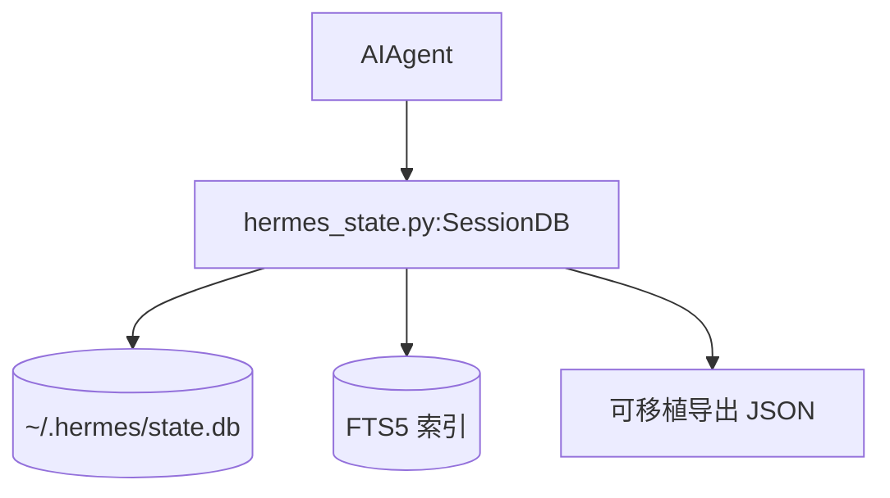

# 08 数据模型与会话存储

> 层：第四层（补齐源码逻辑与技术点）
> 状态：已复核（全部行号/符号与基准提交一致）
> 复核日期：2026-08-29
> 生成日期：2026-08-19
> 前置阅读：[04-核心模块与类型关系](./04-核心模块与类型关系.md)

## 一、本模块目标

补齐会话存储：

- `SessionDB` 类；
- SQLite schema；
- 消息模型；
- FTS5 搜索；
- 软删除与 rewind；
- 压缩代际；
- 可移植性导入导出。

## 二、存储架构



## 三、`SessionDB`

### 3.1 位置

- 文件：`hermes_state.py`
- 类：`SessionDB`，约在 `4385` 行

### 3.2 继承关系

```python
class SessionDB(SessionSearchMixin, SessionSchemaMixin, SessionPortabilityMixin):
    ...
```

- `SessionSearchMixin`：FTS5 搜索；
- `SessionSchemaMixin`：schema 与迁移；
- `SessionPortabilityMixin`：导入导出。

## 三点五、真实代码映射

| 主题 | 真实文件 | 真实符号/说明 |
|---|---|---|
| 会话库 | `hermes_state.py` | `SessionDB` @4385 |
| 创建会话 | `hermes_state.py` | `SessionDB.create_session()` @6110 |
| 读取会话 | `hermes_state.py` | `SessionDB.get_session()` @9509 |
| 追加消息 | `hermes_state.py` | `SessionDB.append_message()` @11059 |
| 批量追加 | `hermes_state.py` | `SessionDB.append_messages_batch()` @11205 |
| 读取消息 | `hermes_state.py` | `SessionDB.get_messages()` @11961 |
| 上下文窗口读取 | `hermes_state.py` | `SessionDB.get_messages_around()` @12135 |
| 转对话格式 | `hermes_state.py` | `SessionDB.get_messages_as_conversation()` @12309 |
| 会话活动 | `hermes_state.py` | `SessionDB.get_session_activity()` @8223 |
| 会话标题 | `hermes_state.py` | `SessionDB.get_session_title()` @9842 |
| 删除目标 | `hermes_state.py` | `SessionDB.get_session_delete_targets()` @13480 |

## 四、关键表

- `sessions`：会话元数据；
- `messages`：消息行；
- FTS5 表：全文搜索索引。

## 五、消息模型

`append_message()` 关键字段：

- `session_id`
- `role`
- `content`
- `tool_name`
- `tool_calls`
- `tool_call_id`
- `token_count`
- `finish_reason`
- `reasoning`
- `reasoning_content`
- `reasoning_details`
- `codex_reasoning_items`
- `codex_message_items`
- `platform_message_id`
- `observed`
- `effect_disposition`
- `timestamp`
- `api_content`
- `display_kind`
- `display_metadata`
- `compression_lock_holder`
- `turn_lease_holder`
- `turn_lease_ttl_seconds`

## 六、消息读取

`get_messages()` 关键参数：

- `include_inactive`
- `include_compacted`
- `limit`
- `offset`
- `latest`
- `after_id`

排序规则：

- 默认按 SQLite AUTOINCREMENT `id` 升序；
- 不用 timestamp 排序，避免 WSL2 时钟回退问题。

## 七、软删除与 rewind

- 默认只读 `active=1`；
- `include_inactive=True` 读取软删除行；
- `include_compacted=True` 读取压缩保留行；
- rewind 使用软删除，不物理删除。

## 八、压缩代际 dedupe

- 压缩会复制受保护尾部到新代际；
- 同一逻辑消息可能有多行；
- 显示读取需要 dedupe；
- 优先 live row，再选最新代际。

## 九、FTS5 搜索

- 会话搜索；
- 消息搜索；
- 中文/英文全文检索；
- 搜索结果与 session 元数据关联。

## 十、可移植性

- 导入外部会话；
- 导出会话；
- 消息 JSON 序列化；
- 平台消息 ID 保留。

## 十一、本模块结论

本模块补齐了会话存储的数据模型和关键读写逻辑。后续模块继续展开技能/插件、调度、并发、错误、测试、部署和源码索引。
