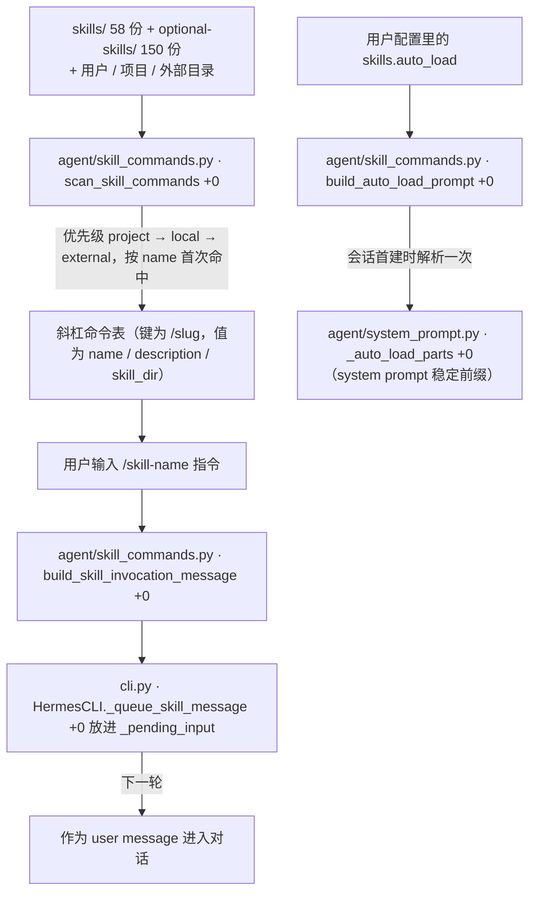
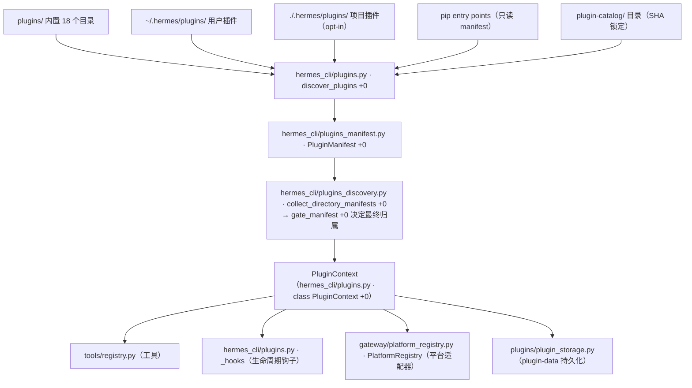
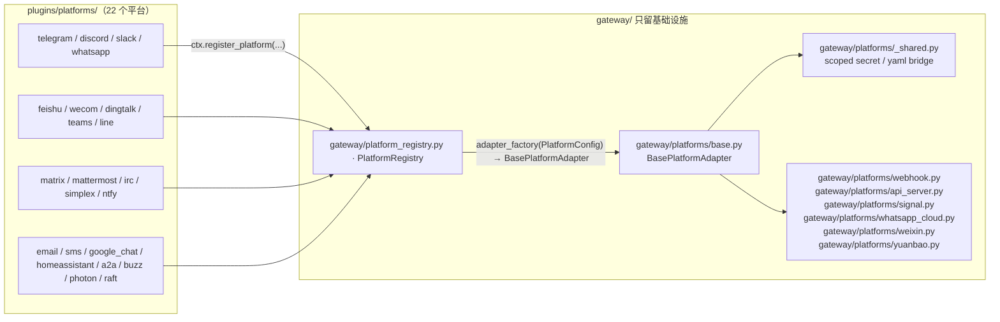

# 09 技能系统与插件架构

> 层：第四层（补齐源码逻辑与技术点）
> 状态：已按 cc0a679f14 复核
> 复核日期：2026-09-22
> 生成日期：2026-08-19
> 前置阅读：[04-核心模块与类型关系](./04-核心模块与类型关系.md)
> 后续阅读：[10-调度器与定时任务](./10-调度器与定时任务.md)

## 一、本模块目标

补齐技能与插件：

- 技能加载（扫描、优先级、斜杠命令表）；
- 技能注入方式（user message vs system prompt 稳定前缀）；
- 技能生命周期（Curator）；
- 插件系统：形态分类、基础设施、发现/加载/存储；
- **平台适配器的插件化落点**（本版最大的结构变化）；
- 插件与核心的边界约束。

## 二、技能系统

### 2.1 位置

| 位置 | 实测规模 | 说明 |
|---|---|---|
| `skills/` | 58 份技能定义文件 | 内置、默认可用，按类别分目录（`skills/apple/`、`skills/devops/` 等 13 个类别） |
| `optional-skills/` | 150 份技能定义文件 | 重型/小众技能，随仓库发布但**默认不启用**，需 `hermes skills install official/<category>/<skill>` 安装 |
| `~/.hermes/skills/` | 运行时 | 活动 profile 的技能目录（`tools/skills_tool.py` · `_skills_dir +0`，profile 感知，不能缓存） |
| 项目级技能目录 | 运行时 | `agent/skill_utils.py` · `get_project_skills_dirs +0`；扫描时**优先级最高** |
| 外部技能目录 | 运行时 | `agent/skill_utils.py` · `get_external_skills_dirs +0`（配置指向的额外目录） |
| 斜杠命令扫描 | 代码 | `agent/skill_commands.py` · `scan_skill_commands +0` |

`optional-skills/` 的实际类别（23 个）：`autonomous-ai-agents` `blockchain` `communication` `creative` `data-science` `devops` `dogfood` `email` `finance` `gaming` `health` `mcp` `migration` `mlops` `payments` `productivity` `research` `security` `smart-home` `social-media` `software-development` `web-development` `yuanbao`。

> `skills/AGENTS.md` 给出的类别清单（`autonomous-ai-agents, blockchain, communication, ...`）与实测目录**不完全一致**（少了 `data-science/dogfood/finance/gaming/payments/smart-home/social-media/yuanbao`，多了 `web-development` 之外的差异）。以实测目录为准。

### 2.2 设计初衷

技能是「给 Agent 的领域知识/操作手册」，一个技能 = 一个目录 + 一份技能定义文件（典型样例：`skills/apple/apple-reminders/SKILL.md`），frontmatter 写 `name`、`description`、`version`、`author`、`license`、`platforms`、`metadata.hermes.tags/category/config`。

**核心约束（本版核实仍成立）**：斜杠命令触发技能时，技能内容以 **user message** 注入，**不**写进 system prompt，以保护 per-conversation prompt caching。源码里的表述是硬证据——`agent/skill_commands.py` · `build_skill_invocation_message +0` 的 docstring 就写着 "Build the **user message** for a skill slash command"，返回值随后由 `cli.py` · `HermesCLI._queue_skill_message +0` 放进 `_pending_input` 队列，成为下一轮用户输入。

**但有一条例外路径需要分清**（上一版未区分）：

- `skills.auto_load`（`agent/skill_commands.py` · `build_auto_load_prompt +0`）与 `hermes -s <skill>` 预加载（`build_preloaded_skills_prompt +0`）是在**会话首次构建 system prompt 时**注入的；
- 它们被刻意做成「每个 agent 生命周期只解析一次」（`agent/system_prompt.py` · `_auto_load_parts +0`，结果缓存在 `agent._auto_load_skills_result`），从而保证 system prompt 在整个会话里**字节稳定**——换模型、压缩上下文、静态前缀恢复都不会让它变化；
- 也就是说：**会话中途的技能注入走 user message；会话起点的预置技能走 system prompt 的稳定前缀**。两条路都不破坏缓存。

### 2.3 加载流程

细节（全部可 grep 到）：

- 扫描顺序与优先级：`scan_skill_commands +0` 内部按 **project（经隔离检查点）> local（活动 profile 的技能目录）> external** 依次迭代，`seen_names` 保证同名首次命中胜出。
- 跳过目录：`Module:agent/skill_commands.py` · `Const:_SCAN_SKIP_PARTS` = `.git` `.github` `.hub` `.archive` `.locks`。
- 扫描结果**一次性发布**（map + 平台标签 + home + project 一起赋值），否则并发读者会拿新 map 配旧标签，泄漏另一个平台的「已禁用技能」视图。
- 技能内容预处理：`agent/skill_preprocessing.py` · `preprocess_skill_content +0` 做 `${HERMES_SKILL_DIR}` / `${HERMES_SESSION_ID}` 替换与 `!`+反引号 内联 shell 展开。
- 技能包（bundle）：`agent/skill_bundles.py` · `scan_bundles +0` / `build_bundle_invocation_message +0`，一个 `/bundle-slug` 一次加载多个技能；同名时 bundle 优先于 skill。
- 叠加调用：`/skill-a /skill-b 做 XYZ` 会连续吃掉最多 5 个（`Const:_MAX_STACKED_SKILLS`）前导技能，走 `build_stacked_skill_invocation_message +0`，复用 bundle 的脚手架标记，以便记忆提取器无需新增管线。
- 与核心命令撞名时给出提示：`skill_command_collision_note +0`。
- 每次加载会 bump Curator 用量：`agent/skill_commands.py` · `_render_skill_block +0` → `tools/skill_usage.py` · `bump_use +0`（非致命）。

### 2.4 斜杠命令与延迟失效（`--now`）

- 斜杠命令表由 `agent/skill_commands.py` · `get_skill_commands +0` 提供（首次为空才扫，`reload_skills +0` 可重扫并返回 `added/removed/unchanged/total` diff）。
- 用户输入的 `/command` 由 `resolve_skill_command_key +0` 归一化（`_` ≡ `-`）。
- 技能安装/卸载/重置的斜杠入口在 `hermes_cli/skills_hub.py` · `Module:hermes_cli/skills_hub.py` · `Var:_SLASH_ACTIONS`（`install` / `uninstall` / `reset` / `update` / `audit` / `publish` / `tap` …）。
- **`--now` 的语义已核实**：`hermes_cli/skills_hub.py` 的注释写得很直白——「`--now` 立即失效 prompt 缓存（更贵）；默认推迟到下一个会话」。实现上就是把 `invalidate_cache="--now" in args` 传给 `_finish_change +0`。
- 这条与根 `AGENTS.md` 的硬约束一致：**会改变 system-prompt 状态的斜杠命令（skills / tools / memory）必须缓存友好**，默认延迟失效 + 可选 `--now`，`/skills install --now` 是 canonical pattern。
- 在 prompt_toolkit 里运行斜杠命令时 `input()` 会挂起，所以 install/uninstall/reset **总是跳过二次确认**——敲下命令本身即视为同意。

### 2.5 Curator（技能生命周期）

`skills/AGENTS.md` 记录的技能生命周期维护，本版核实仍在：

- 核心：`agent/curator.py`（评审循环、自动状态迁移、LLM 评审提示词）+ `agent/curator_backup.py`（运行前 tar.gz 快照）；
- CLI：`hermes_cli/curator.py`；
- 用量遥测：`tools/skill_usage.py` 在活动 profile 的技能目录下维护一份隐藏的用量记录（`use_count` / `view_count` / `patch_count` / `last_activity_at` / `state` / `pinned`）；
- 不变量：只碰 `created_by: "agent"` 的技能；**从不删除**，归档是上限（归档进 `~/.hermes/skills/.archive/`，可恢复）；`pinned` 技能豁免一切自动迁移。

## 三、插件系统

### 3.1 位置与规模

| 位置 | 实测 | 说明 |
|---|---|---|
| `plugins/` | **245 个 py，18 个插件目录** | 仓库内置插件 |
| `~/.hermes/plugins/` | 运行时 | 用户安装插件（`plugins/plugin_loader.py` · `user_plugins_dir +0`） |
| `./.hermes/plugins/` | 运行时 | 项目插件，**需 opt-in**（`HERMES_ENABLE_PROJECT_PLUGINS`） |
| pip entry points | 运行时 | 通过包元数据发现，只读 manifest、按源码特征判 kind |
| `plugin-catalog/` | 目录 + `hermes_cli/plugin_catalog.py` | **树外插件的唯一发现系统**：一条 YAML 一个条目，强制 40 位 hex SHA 锁定，PR 人工合并 |

> 勘误：任务书说「19 个插件目录」，实测 `plugins/` 下的目录是 **18 个**（`browser` `context_engine` `cron_providers` `dashboard_auth` `disk-cleanup` `google_meet` `hermes-achievements` `image_gen` `kanban` `memory` `model-providers` `observability` `platforms` `security-guidance` `spotify` `teams_pipeline` `video_gen` `web`）。其余是文件：`plugins/__init__.py`、`plugins/AGENTS.md`、`plugins/plugin_loader.py`、`plugins/plugin_storage.py`、`plugins/plugin_utils.py`。

### 3.2 插件形态（按目录实测）

插件**不是一个统一抽象**，而是「一种 kind 一套发现系统 + 一套 ABC」。实测 105 份清单文件里 `kind:` 分布为：`model-provider` 38、`backend` 31、`platform` 22、`standalone` 2。

| 形态 | 落点 | 扩展点 |
|---|---|---|
| 平台适配器 | `plugins/platforms/`（22 个目录） | `ctx.register_platform(...)` → `gateway/platform_registry.py` |
| 模型提供方 | `plugins/model-providers/`（38 份清单） | 加载时调 `providers.register_provider(ProviderProfile(...))`，**后写胜出** |
| 记忆提供方 | `plugins/memory/`（8 个：honcho/mem0/supermemory/byterover/hindsight/holographic/openviking/retaindb） | `MemoryProvider` ABC（`agent/memory_provider.py` · `class MemoryProvider +0`）+ `agent/memory_manager.py` 编排。**该目录已冻结，不再接受新内置提供方** |
| 图像/视频/网页后端 | `plugins/image_gen/`（8）、`plugins/video_gen/`（4）、`plugins/web/`（11）、`plugins/browser/`（3） | 各自的 ABC + 编排器（`agent/image_gen_provider.py` · `class ImageGenProvider +0` 等）；`kind: backend` 主要落在这里 |
| 上下文引擎 | `plugins/context_engine/` | `agent/context_engine.py` · `class ContextEngine +0` |
| 定时任务提供方 | `plugins/cron_providers/chronos/` | cron 侧 provider |
| Dashboard 鉴权 | `plugins/dashboard_auth/`（4 个：`basic` `drain` `nous` + 共享模块） | `ctx.register_dashboard_auth_provider` |
| **Dashboard 插件（前端）** | `plugins/kanban/dashboard/`、`plugins/hermes-achievements/dashboard/` | 目录内放清单 `plugins/kanban/dashboard/manifest.json`、后端 `plugins/kanban/dashboard/plugin_api.py` 与 `dist/`；由 `hermes_cli/web_server_dashboard.py` · `_discover_dashboard_plugins +0` 发现，清单声明 `tab.path` / `entry` / `css` / `api` |
| 独立功能插件 | `plugins/spotify/`、`plugins/google_meet/`、`plugins/disk-cleanup/`、`plugins/security-guidance/`、`plugins/teams_pipeline/`、`plugins/observability/langfuse/` | 普通 `register(ctx)` |

### 3.3 插件基础设施

三个文件构成「目录型插件」的公共底座（模块 docstring 自述其职责）：

| 文件 | 关键符号 | 职责 |
|---|---|---|
| `plugins/plugin_loader.py` | `load_plugin_module +0` | 按路径把 `plugins/<kind>/<name>/` 的入口模块 import 进来：先注册父包（相对导入需要），再把同目录兄弟模块注册成 `<module>.<stem>`，最后 exec 本体，并把子模块挂回父模块——**复现正常 import 的形状**，monkeypatch 依赖这一点 |
| `plugins/plugin_loader.py` | `iter_plugin_dirs +0` | 列出有包初始化文件的子目录（跳过 `_`/`.` 开头）；单个目录不可读只 warning，不中断整体列举 |
| `plugins/plugin_loader.py` | `instance_from_module +0` | 先试 `register(ctx)`，再回退到「找 `base_cls` 的子类并实例化」 |
| `plugins/plugin_storage.py` | `plugin_data_dir +0` / `plugin_db +0` | 插件的持久化目录 `<hermes home>/plugin-data/<name>/` 与 SQLite 连接（WAL）。**插件不得把状态写进安装目录**（`remove` 会删、`update` 会 git pull）；凭据**不属于**这套约定，走 `agent.secret_scope` / `.env` |
| `plugins/plugin_utils.py` | `SingletonSlot +0` / `lazy_singleton +0` | 线程安全的懒加载单例槽（缓存首个成功构造的实例，失败的构造不缓存） |

清单文件（`plugins/platforms/telegram/plugin.yaml` 是典型样例）的作用：目录型插件的元数据来源——`name` / `label` / `kind` / `version` / `description` / `author` / `requires_env` / `optional_env`。`plugins/plugin_loader.py` · `read_plugin_description +0` 只读其中的 `description`；完整解析在 `hermes_cli/plugins_manifest.py` · `class PluginManifest +0`。

### 3.4 插件发现与注册

- 核心类：`hermes_cli/plugins.py` · `class PluginManager +0`（发现、加载、调用、卸载）。它是**facade**，兄弟模块按主题拆开：`hermes_cli/plugins_manifest.py`（清单解析与版本）、`hermes_cli/plugins_discovery.py`（目录/entry-point 发现与归属裁决）、`hermes_cli/plugins_loader.py`、`hermes_cli/plugins_state.py` · `class PluginState +0`、`hermes_cli/plugins_ledger.py`、`hermes_cli/plugin_catalog.py` · `load_catalog +0`、`hermes_cli/plugin_compat.py`、`hermes_cli/plugin_validate.py`、`hermes_cli/plugin_guard` 相关的 `tools/plugin_guard.py`。
- **发现时机陷阱**：`discover_plugins()` 只作为 import `model_tools.py` 的副作用运行。任何不先 import `model_tools.py` 就读取插件状态的代码必须显式调用它（幂等）。CLI 侧还有 `start_background_plugin_discovery +0` 把发现挪到守护线程，与启动的其余部分重叠。
- **生命周期钩子名**：`Module:hermes_cli/plugins.py` · `Var:VALID_HOOKS`（实测 30+ 项），涵盖 `pre_tool_call` / `post_tool_call` / `transform_tool_result` / `transform_llm_output` / `pre_llm_call` / `post_llm_call` / `on_stream_start|delta|end` / `pre_api_request` / `post_api_request` / `api_request_error` / `transform_api_error_classification` / `on_session_start` / `on_session_end` / `on_session_finalize` / `on_session_reset` / `on_skill_lifecycle` / `subagent_start` / `subagent_stop` / `pre_gateway_dispatch` / `agent_loop_stopped` / `pre_approval_request` / `post_approval_response` / `on_room_member_activity` 等。注册未知名字只 warning，仍会存储（`register_hook +0`）。
- **中间件**：`Module:hermes_cli/middleware.py` · `Var:VALID_MIDDLEWARE` = `tool_request` / `tool_execution` / `llm_request` / `llm_execution`。请求类改写 payload，执行类包裹回调。
- 宿主侧调用入口：`invoke_hook +0`、`has_hook +0`、`invoke_middleware +0`、`render_system_prompt_sections +0`、`_dispatch_pre_tool_call_hooks +0`。
- `PluginContext` 还提供（都经 `_track*` 记账，卸载时按逆序回滚）：`register_tool +0`、`register_cli_command +0`、`register_command +0`、`register_context_engine +0`、`register_memory_provider +0`、`register_dashboard_auth_provider +0`、`register_platform +0`、`register_platform_handler +0`、`register_auxiliary_task +0`、`register_redaction_patterns +0`、`register_system_prompt_section +0`、`register_skill +0`、`on_unload +0`；以及属性 `state`、`llm`、`platform_actions`、`subagent_lifecycle`、`profile_name`、`has_plugin`、`get_config` / `set_config`。

### 3.5 平台适配器的插件化（本版最重要的结构变化）

**上一版把「插件」描述成 memory / context_engine / model-providers / kanban / image_gen 等能力扩展；实测「插件系统」的实际承载面远大于此——整个消息平台层已经是插件。**

- 落点：`plugins/platforms/<平台>/`，共 **22 个目录**：`a2a` `buzz` `dingtalk` `discord` `email` `feishu` `google_chat` `homeassistant` `irc` `line` `matrix` `mattermost` `ntfy` `photon` `raft` `simplex` `slack` `sms` `teams` `telegram` `wecom` `whatsapp`。
- 每个平台目录的结构：包入口模块 + 同目录入口实现（如 `plugins/platforms/telegram/adapter.py`，其 `register +0` 里调 `ctx.register_platform(...)`）+ 清单 `plugins/platforms/telegram/plugin.yaml` + 若干平台专属兄弟模块（`plugins/platforms/telegram/telegram_ids.py`、`plugins/platforms/telegram/telegram_network.py` 等）。`plugins/platforms/telegram/__init__.py` 只做 `from .adapter import register`。
- 注册 API：`hermes_cli/plugins.py` · `PluginContext.register_platform +0`，签名 `(name, label, adapter_factory, check_fn, validate_config=None, required_env=None, install_hint="", **entry_kwargs)`。语义要点：
  - `check_fn` 是**被动**的「依赖是否可 import」探针，**绝不能**安装东西（状态展示会随意调用它）；
  - 主动安装器放 `ensure_deps_fn`，由 `create_adapter()` 在 `check_fn` 为假时调用；
  - 其余可转发到 `PlatformEntry` 的关键字：`setup_fn`、`emoji`、`allowed_users_env`、`platform_hint`；未知键抛 `TypeError`。
- 注册表：`gateway/platform_registry.py` · `class PlatformRegistry +0`（`register +0` / `get +0`），条目类型 `class PlatformEntry +0`（`source="plugin"`）。
- **`gateway/platforms/` 剩下的是基础设施**，不是平台适配器。按族分（下面除注明外都指该目录下的模块名，省略扩展名）：
  - 适配器基类与共享设施：`base`（`BasePlatformAdapter`）、`base_exec_approval`、`_shared`（scoped secret、YAML bridge、平台门控环境变量）、`access_policy_mixin`、`helpers`、`event`、`shared_ingress`、`media_cache`；
  - HTTP/回调基础设施：`webhook` 一族（3 个，含 coalesce、filters）、`api_server` 一族（7 个）、`msgraph_webhook`、`tcp_site`、`_http_client_limits`；
  - 未插件化的平台实现：`signal` 一族（3 个）、`whatsapp_cloud` + `whatsapp_common`、`weixin`、`yuanbao` 一族（4 个）、`bluebubbles`、`qqbot/`。
  - 本节只直接引用两个具体路径：基类 `gateway/platforms/base.py` 与共享设施 `gateway/platforms/_shared.py`；平台适配器文档 `gateway/platforms/ADDING_A_PLATFORM.md` 也在这一层。

  即：**同一份清单里既有留在核心的平台，也有已迁走的平台**——`whatsapp` 既在 `plugins/platforms/whatsapp/` 有适配器，又在核心留着 `gateway/platforms/` 的共享实现模块，二者不是重复实现。
- **`Platform` 枚举会动态吸收插件平台**：`gateway/config.py` · `Platform._scan_bundled_plugin_platforms +0` 扫 `plugins/platforms/` 下「有包初始化文件且带清单文件」的目录，目录名就是规范平台值；清单 `name:` 与目录名不同时（如目录 `a2a`、清单 `name: a2a-platform`）作为**别名**登记，目录名永远胜出。
- ⚠ **文档警示**：`gateway/platforms/ADDING_A_PLATFORM.md` 仍然存在，但内容已滞后——它还在描述核心目录下的 telegram/discord/whatsapp 模块，而这些适配器已经迁到 `plugins/platforms/`。读它时以源码为准。
- `plugins/AGENTS.md` 给出的平台适配器规范：token 锁与 scoped-secret 规则见 `gateway/AGENTS.md`，其中 `irc`、`feishu` 是 canonical 样例；平台插件**不得修改 `os.environ`**，YAML 配置经 `_shared.apply_yaml_bridge` 进 `PlatformConfig.extra`，门控走 `platform_gate_env`。

### 3.6 树外插件的发现与兼容契约

- **`plugin-catalog/` 是树外插件的唯一发现系统**：一条 YAML 一个条目、强制 40 位 hex SHA 锁定、PR 人工合并；`plugin-catalog/README.md` 是准入政策，配套的 CI 工作流会 clone 每个变更条目到它的 pin 并跑 `hermes plugins validate`。目录里的 kill list 清单（removed）列出已下架插件，所有安装路径（CLI、dashboard、TUI）都拒绝命中项，只有 CLI 有显式 `--allow-removed`。
- 代码侧：`hermes_cli/plugin_catalog.py` · `load_catalog +0`（loader，支持从文档站发布的目录 JSON 热刷新，树内为 fallback）、`hermes_cli/plugins_cmd_catalog.py`（解析、溯源 sidecar、search/info/validate、update 重 pin）。
- **兼容契约是行为契约**，不是一个 `PLUGIN_API_VERSION` 版本号：钩子 payload 只**新增关键字字段**（回调按签名自省，老窄签名只收到它声明的字段）、`PluginContext` 方法只增不删不改名、未知 manifest 字段忽略、provider 新方法给默认实现、弃用需「一次性进程内警告 + 文档化替代 + 至少 2 个后续 minor 版本」。
- 2026-09 拆分留下的兼容窗口：PR #102117 把内部实现挪进 `<stem>_<topic>` 兄弟模块，旧 import 路径通过 `PLUGIN-COMPAT` 的 `__getattr__` 块（登记在 `COMPAT_MANIFEST.md` / `compat_manifest.json`）继续可用，直到 `hermes_cli/plugin_compat.py` 的 `COMPAT_REMOVAL_DATE`。**树内代码与测试禁用这些路径**（CI 跑 `scripts/check_compat_pointers.py`）。
- 安装前安全扫描：`tools/plugin_guard.py` 对插件仓库做结构化检查与危险模式分级。

## 三点五、真实代码映射

| 主题 | 真实文件 | 真实符号/说明 |
|---|---|---|
| 技能斜杠命令扫描 | `agent/skill_commands.py` | `scan_skill_commands +0`、`get_skill_commands +0` |
| 技能调用消息构造 | `agent/skill_commands.py` | `build_skill_invocation_message +0`（**返回 user message**）、`build_stacked_skill_invocation_message +0` |
| 技能内容预处理 | `agent/skill_preprocessing.py` | `preprocess_skill_content +0`（变量替换 + 内联 shell 展开） |
| 技能元数据/目录解析 | `agent/skill_utils.py` | `parse_frontmatter +0`、`get_project_skills_dirs +0`、`get_disabled_skill_names +0` |
| 技能包 | `agent/skill_bundles.py` | `scan_bundles +0`、`build_bundle_invocation_message +0` |
| 技能工具 | `tools/skills_tool.py` | `skills_list +0`、`skill_view +0`；`skill_manage` 在 `tools/skill_manager_tool.py` 注册 |
| 技能用量/生命周期 | `tools/skill_usage.py`、`agent/curator.py` | `bump_use +0`；Curator 状态机 |
| 内置技能目录 | `skills/` | 58 份技能定义文件，13 个类别 |
| 可选技能目录 | `optional-skills/` | 150 份技能定义文件，23 个类别 |
| 可选技能安装源 | `tools/skills_hub_official.py` | `class OptionalSkillSource +0` |
| 技能斜杠命令实现 | `hermes_cli/skills_hub.py` | `Var:_SLASH_ACTIONS`、`_finish_change +0`（`--now` 语义） |
| 插件发现/加载 | `hermes_cli/plugins.py` | `discover_plugins +0`、`class PluginManager +0`、`class PluginContext +0`（facade，兄弟模块见 §3.4） |
| 插件清单 | `hermes_cli/plugins_manifest.py` | `class PluginManifest +0` |
| 插件目录发现 | `hermes_cli/plugins_discovery.py` | `collect_directory_manifests +0`、`gate_manifest +0` |
| 插件持久状态 | `hermes_cli/plugins_state.py` | `class PluginState +0` |
| 插件目录插件加载器 | `plugins/plugin_loader.py` | `load_plugin_module +0`、`iter_plugin_dirs +0` |
| 插件持久化存储 | `plugins/plugin_storage.py` | `plugin_data_dir +0`、`plugin_db +0` |
| 插件通用工具 | `plugins/plugin_utils.py` | `SingletonSlot +0`、`lazy_singleton +0` |
| 平台适配器注册表 | `gateway/platform_registry.py` | `class PlatformRegistry +0`、`class PlatformEntry +0` |
| 平台插件注册 API | `hermes_cli/plugins.py` | `PluginContext.register_platform +0` |
| 平台枚举动态扩展 | `gateway/config.py` | `Platform._scan_bundled_plugin_platforms +0` |
| Dashboard 插件发现 | `hermes_cli/web_server_dashboard.py` | `_discover_dashboard_plugins +0` |
| 插件 LLM 适配 | `agent/plugin_llm.py` | 插件侧 LLM facade |
| 插件流钩子 | `agent/plugin_stream_hooks.py` | 流式观察回调 |
| 插件覆盖内置工具 | `tools/registry.py` | `ToolRegistry.register +0`（`override=True` + `allow_tool_override` 门控） |
| 插件覆盖策略 | `tools/registry.py` | `ToolRegistry.register_plugin_override_policy +0` |
| 插件安装前扫描 | `tools/plugin_guard.py` | 结构化检查 + 危险模式分级 |

## 四、核心边界

以下约束**逐条来自权威文件**（`plugins/AGENTS.md` 与仓库根 `AGENTS.md`），不是推测：

- **插件永不触碰核心**（`plugins/AGENTS.md` §"Plugins never touch core"）：插件住在自己的目录里，在宿主提供的 ABC / hooks / `ctx` 接口内工作。**MUST NOT** 修改 `run_agent.py`、`cli.py`、`gateway/run.py`、`hermes_cli/main.py` 等核心文件。
- **缺能力就拓宽通用接口**：如果插件需要框架没有的能力，做法是**新增一个通用 hook 或 ctx 方法**，让插件去用它——**绝不**把插件专属逻辑硬编码进核心。反例被点名：PR #5295 删掉了 `hermes_cli/main.py` 里 95 行硬编码的 honcho argparse。
- **插件 setup 走统一入口**：`hermes memory setup` → `provider.post_setup(hermes_home, config)`，不新开并行顶层命令。
- **没有具体消费者的 hook 是投机基础设施，会被拒**（根 `AGENTS.md`）。
- **第三方产品插件不进 `plugins/`**（根 `AGENTS.md` §"What we don't want"）：可观测性后端、厂商 SaaS connector、分析看板等「别人家的产品」不落在仓库 `plugins/` 下——每一个都会变成我们对着一个快速演进的核心去维护、而我们并不拥有其后端的负担。它们以**独立插件仓库**发布（`~/.hermes/plugins/` 或 pip entry point），在社区推广。这是**耦合决策，不是质量门槛**。
- 同理 `plugins/memory/` 已关闭新内置 provider（2026-05），`plugins/observability/`、`plugins/kanban/`、`plugins/disk-cleanup/` 是**先例而非邀请**。
- 参考/文档配套插件（`example-dashboard`、`strike-freedom-cockpit`、`plugin-llm-example`、`plugin-llm-async-example`）住在独立仓库 `hermes-example-plugins`，不在本仓库。
- **生命周期钩子在「所属 profile 的作用域」下触发，由调用方绑定**：`on_session_start`/`on_session_end`/`sync_turn`/`shutdown` 既从 turn（已绑定）触发，也从淘汰、关闭、`tui_gateway` 拆卸与 cron 完成触发。一个进程服务多个 profile，所以 provider **不得**把 `initialize()` 拿到的 `hermes_home` 当成「那个 home」缓存；也不得用 `os.environ` 读凭据（要用 `agent.secret_scope.get_secret`，`check_fn` 同样）。后台工作必须用 `agent.memory_provider.spawn_context_thread` 起线程，裸 `threading.Thread` 会丢掉作用域并 fail-closed。
- 想加插件配置默认值时，要加一条以「已存在配置」信号为键的迁移守卫，让老用户保留旧默认。

## 五、Footprint Ladder 与技能/插件

根 `AGENTS.md` 的「Footprint Ladder」给出新增能力的优先顺序（**选择能正确解决问题的最高一级，即足迹最小的一级**）：

1. **扩展现有代码** — 已有东西的变体，零新表面积；
2. **CLI 命令 + 技能** — 配置/状态/基础设施能表达成 shell 命令时；由技能引导 agent 运行 `hermes <subcommand>`（订阅、定时任务、服务配置的默认落点）；
3. **`check_fn` 门控工具** — 需要结构化参数/返回，且**仅在前提条件已配置时出现**；它门控的是「可达性/是否 opt-in」，**进程级**；
4. **插件** — 第三方/小众/用户专属，住在 `~/.hermes/plugins/` 或 pip 包，运行时发现；
5. **MCP server（进目录）** — 确实是工具但不属于核心根本，零永久核心 schema 足迹，任何 MCP 宿主都能复用；
6. **新核心工具** — 只有根本性、几乎人人需要、且 terminal + file 或 MCP 达不到时才做（terminal、read_file、web_search、browser_navigate 是既有例子）。

**重要限定**：能力如果是**随会话而变**的（谁在看：桌面面板、内嵌浏览器、消息 reaction、Projects），它属于**命名 toolset 由 toolset 解析器折叠进来**，**不是** `check_fn`——`check_fn` 的粒度是进程级（并被 TTL 缓存），用它表达会话级能力会静默失效。

技能和插件是「边缘扩展」的两条主路，核心保持窄腰。

## 六、本模块结论

本模块补齐了技能加载/注入与插件架构，并把「插件」的边界从「若干能力扩展」重写为**覆盖消息平台层的通用扩展面**（22 个平台适配器插件）。同时补上了上一版缺失的三块：插件基础设施（loader / storage / utils）、树外插件的 `plugin-catalog/` 发现与行为兼容契约、以及技能侧的 `--now` 延迟失效与 Curator 生命周期。后续模块继续展开调度、并发、错误、测试、部署和源码索引。

---

上一篇：[08-数据模型与会话存储](./08-数据模型与会话存储.md) ｜ 总目录：[./README.md](./README.md) ｜ 下一篇：[10-调度器与定时任务](./10-调度器与定时任务.md)
