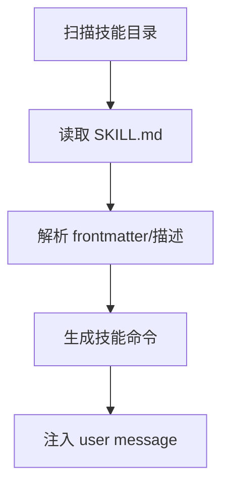
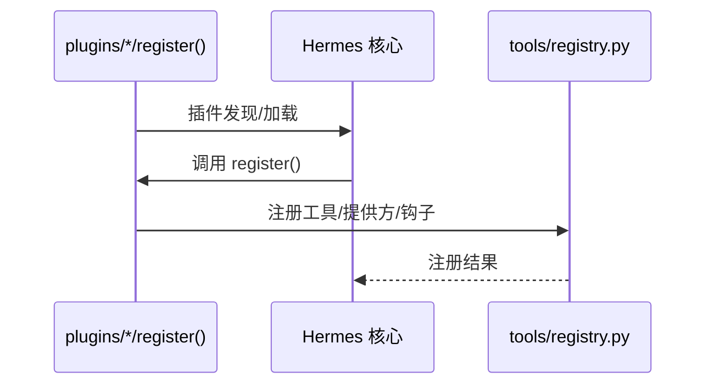

# 09 技能系统与插件架构

> 层：第四层（补齐源码逻辑与技术点）
> 状态：已复核（全部行号/符号与基准提交一致）
> 复核日期：2026-08-29
> 生成日期：2026-08-19
> 前置阅读：[04-核心模块与类型关系](./04-核心模块与类型关系.md)

## 一、本模块目标

补齐技能与插件：

- 技能加载；
- 技能执行；
- 技能生命周期；
- 插件系统；
- 插件注册；
- 插件与核心边界。

## 二、技能系统

### 2.1 位置

- 内置技能：`skills/`
- 可选技能：`optional-skills/`
- 用户技能：`~/.hermes/skills/`
- 斜杠命令扫描：`agent/skill_commands.py`

### 2.2 设计初衷

技能是“给 Agent 的领域知识/操作手册”，通过 `SKILL.md` 描述。技能以 **user message** 注入，而不是 system prompt，以保护 prompt caching。

### 2.3 加载流程

## 三、插件系统

### 3.1 位置

- 目录：`plugins/`
- 用户插件：`~/.hermes/plugins/`

### 3.2 插件类型

- memory providers；
- context engine；
- model providers；
- kanban；
- achievements；
- observability；
- image generation；
- platforms；
- 其他第三方/用户特定能力。

### 3.3 插件注册

## 三点五、真实代码映射

| 主题 | 真实文件 | 真实符号/说明 |
|---|---|---|
| 技能斜杠命令扫描 | `agent/skill_commands.py` | 扫描 `~/.hermes/skills/`，生成 skill 命令 |
| 技能预处理 | `agent/skill_preprocessing.py` | 技能内容预处理 |
| 技能工具 | `agent/skill_utils.py` | 技能相关工具/工具函数 |
| 技能包 | `agent/skill_bundles.py` | 技能包加载/管理 |
| 内置技能目录 | `skills/` | 仓库内置技能 |
| 可选技能目录 | `optional-skills/` | 较重/niche 技能，默认不启用 |
| 插件发现/加载 | `hermes_cli/agent_plugins.py` | CLI 侧插件加载 |
| 插件 LLM 适配 | `agent/plugin_llm.py` | 插件模型/LLM 能力 |
| 插件流钩子 | `agent/plugin_stream_hooks.py` | 插件流式回调 |
| 插件目录 | `plugins/` | memory、context_engine、model-providers、kanban、observability、image_gen、video_gen（新）、web（新）、cron_providers（新）、dashboard_auth（新）、security-guidance（新）、teams_pipeline（新）等 |
| 平台插件目录 | `plugins/platforms/` | 平台适配器插件化（本轮从 `gateway/platforms/` 迁入 22 个平台：telegram/discord/slack/whatsapp/homeassistant/matrix/mattermost/email/sms/dingtalk/wecom/feishu/teams/line/irc/google_chat/simplex/ntfy/a2a/buzz/photon/raft） |
| 插件存储 | `plugins/plugin_storage.py` | 插件持久化存储（本轮新增） |
| 插件工具 | `plugins/plugin_utils.py` | 插件通用工具（本轮新增） |
| 用户插件目录 | `~/.hermes/plugins/` | 用户安装插件 |
| 工具注册插件覆盖 | `tools/registry.py` | `register(..., override=True, scope=...)` |
| 插件覆盖策略 | `tools/registry.py` | `register_plugin_override_policy()` @598 |

## 四、核心边界

- 插件不能修改核心文件；
- 插件通过 ABC/hook 扩展；
- 如果插件需要更多能力，应扩大通用插件接口，而不是在核心中特判；
- 第三方产品插件不应进入仓库 `plugins/`，应发布为独立插件仓库。

## 五、Footprint Ladder 与技能/插件

新增能力优先顺序：

1. 扩展已有代码；
2. CLI 命令 + skill；
3. `check_fn` 门控工具；
4. 插件；
5. MCP server；
6. 新核心工具。

技能和插件是“边缘扩展”的主要方式，核心保持窄腰。

## 六、本模块结论

本模块补齐了技能加载/执行和插件架构。后续模块继续展开调度、并发、错误、测试、部署和源码索引。
