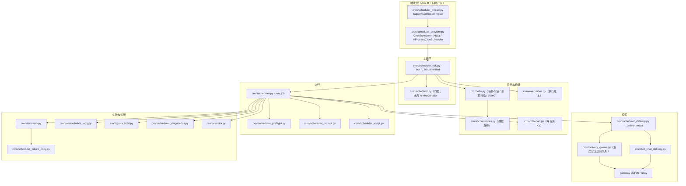
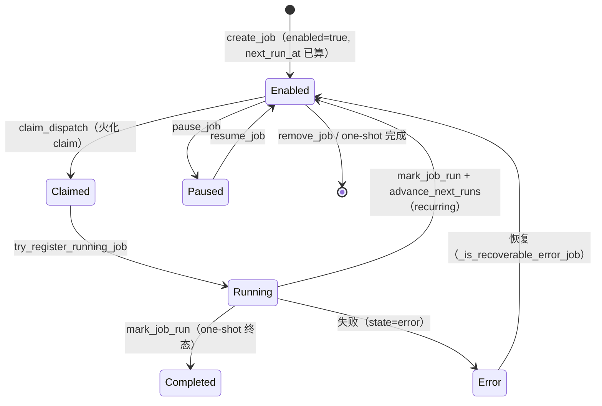
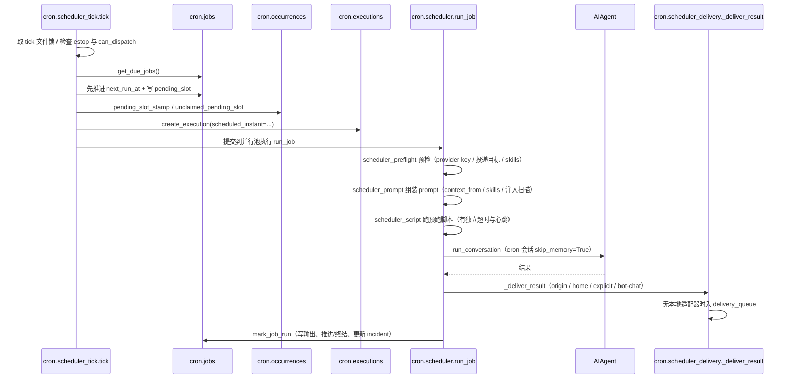

# 10 调度器与定时任务

> 层：第四层（补齐源码逻辑与技术点）
> 状态：已按 cc0a679f14 复核
> 复核日期：2026-09-22
> 生成日期：2026-08-19
> 前置阅读：[04-核心模块与类型关系](./04-核心模块与类型关系.md)
> 后续阅读：[11-并发模型与生命周期](./11-并发模型与生命周期.md)

> **本版定位记法**：一律「`文件路径` · `符号名` `+N`」，`+0` = 符号定义行，`+N` = 符号体内第 N 行。
> 正文不出现绝对行号。本版基于提交 `cc0a679f14`（2026-09-21）静态分析；**未运行测试套件**，不对"测试是否通过"作声明。

## 一、本模块目标

补齐调度器与定时任务：

- `cron/` 目录（**31 个 py 文件**，不再是两个文件）；
- 触发抽象与调度器主循环；
- 任务定义与任务存储；
- 执行记录（executions 账本 + occurrences 槽位）；
- 跨平台投递与投递队列；
- 失败、重试、事故与诊断。

> 本轮（自上一版基准 `aff5125f8` 起）最重要的变化：**`cron/scheduler.py` 已从「调度循环本体」
> 变成「门面 + `scheduler_*` 家族」**。`tick` 的实际实现已经搬到了 `cron/scheduler_tick.py`，
> `cron/scheduler.py` 只在文件末尾（`# ---- BEGIN PLUGIN-COMPAT ----` 区块之前）用
> `from cron.scheduler_tick import tick` 把它再导出。所以「读 `cron/scheduler.py` 找调度循环」这个
> 旧习惯会把你带到 4000 行之后的一个 import 语句。

## 二、调度架构

### 2.1 谁在跑 ticker

- **网关侧**：`gateway/run.py` · `_start_gateway_start_cron_and_housekeeping` `+0`
  → `cron/scheduler_provider.py` · `resolve_cron_scheduler` `+0` /
  `scheduler_for_profile_mode` `+0` → 用 `cron/scheduler_thread.py` ·
  `SupervisedTickerThread` `+0` 起一个受监督守护线程跑 `provider.start`。
- **网关内还有一条 misfire 兜底**：`gateway/run.py` · `_housekeeping_misfire_catch_up` `+0`
  每 5 个 housekeeping 周期调 `cron/scheduler_provider.py` · `fire_overdue_jobs` `+0`。
- **独立进程**：`python -m cron.scheduler`（`cron/scheduler.py` 文件末尾的
  `if __name__ == "__main__"` 分支；`--external-worker-file` 走重启安全外部 worker 协议）。
- **手动**：`hermes_cli/cron.py` · `cron_tick` `+0`。
- `gateway/run.py` · `_start_cron_ticker` `+0` **是 DEPRECATED shim**，只跑内置 in-process 循环，
  真实触发已由 `CronScheduler` provider 承担。

## 三、关键文件

`cron/` 顶层 29 个 py 文件 + `cron/scripts/` 下 2 个 = **31 个 py 文件**。

### 3.1 门面与主循环

| 文件 | 作用 |
|---|---|
| `cron/scheduler.py` | **门面**：`run_job`、tick 锁、in-flight 守卫、跨分相 re-export（文件末尾 `from cron.scheduler_tick import tick`） |
| `cron/scheduler_tick.py` | **主循环**：`tick` `+0`、`_tick_admitted` `+0`（扫描到期 → 推进 `next_run_at` → 派发） |
| `cron/scheduler_provider.py` | 触发抽象 `CronScheduler` `+0`（Axis B：只决定**何时**开火）、默认实现 `InProcessCronScheduler` `+0` |
| `cron/scheduler_thread.py` | `SupervisedTickerThread` `+0`：ticker 线程死掉后由 housekeeping 复活 |

### 3.2 任务定义与存储

| 文件 | 作用 |
|---|---|
| `cron/jobs.py` | 任务模型、JSON 存储原子读写、调度表达式解析、到期扫描、claim 与推进 |
| `cron/occurrences.py` | 精确的「槽位身份」（`scheduled_instant` / `pending_slot`），独立于可变的派发戳 |
| `cron/constants.py` | 火化 claim 的时间边界常量（`FIRE_CLAIM_TTL_SECONDS` 等，刻意不 import 任何东西） |
| `cron/env_settings.py` | profile 感知地读 `HERMES_*` 调优项（`cron_env_setting` `+0`） |
| `cron/notepad.py` | 每任务持久 KV 记事本（游标/水位），有明确的容量契约 |

### 3.3 执行

| 文件 | 作用 |
|---|---|
| `cron/scheduler_preflight.py` | 跑前预检：provider key / 投递目标 / skills、瞬时 provider 解析错误分类、`SharedRouteAdapters` |
| `cron/scheduler_prompt.py` | prompt 组装：`context_from` 注入、skill 加载、注入扫描、凭据外泄与配置封锁守卫 |
| `cron/scheduler_script.py` | 预跑脚本执行：超时、Windows venv、进程树终止、长脚本的 claim 心跳 |
| `cron/scheduler_detached_worker.py` | 活过 `run_job` 的 worker 的延迟 teardown（避免 SessionDB 句柄竞争） |
| `cron/scheduler_worker_env.py` | 外部 worker 的 import path 修复（`pin_hermes_tree_on_pythonpath` `+0`） |

### 3.4 投递

| 文件 | 作用 |
|---|---|
| `cron/scheduler_delivery.py` | 目标解析（origin/home/explicit/bot-chat）、transcript 镜像与会话播种、`_deliver_result` `+0` |
| `cron/delivery_queue.py` | **profile 本地的重启安全交接队列**：脱离网关 cgroup 的 worker 把最终发送排进队列，由网关至多认领一次 |
| `cron/bot_chat_delivery.py` | 尚未启动的输出在不支持的 Bot Chat owner 后面延迟（`drain` `+0` / `drain_in_background` `+0`） |

### 3.5 记录、失败与诊断

| 文件 | 作用 |
|---|---|
| `cron/executions.py` | **profile 本地的执行尝试账本**（不是重试队列），终态不可变 |
| `cron/incidents.py` | 失败事故：按 `(job_id, error signature)` 归并 + ack 去重 |
| `cron/scheduler_failure_copy.py` | 面向用户的一句话失败文案（分类后查表，含确切 CLI 命令与输出目录） |
| `cron/unreachable_retry.py` | 「根本没碰到模型」的定时开火的有界自动重跑 |
| `cron/quota_hold.py` | provider 用量窗口明确关闭时暂停该任务的开火 |
| `cron/scheduler_diagnostics.py` | 私有 run-document 诊断（与投递摘要分开） |
| `cron/monitor.py` | monitor 模式：`monitor_script` / `monitor_url` 的哈希抑制变更检测 |
| `cron/lifecycle_guard.py` | 禁止 cron 任务在网关内部重启/停掉网关（SIGTERM 重生循环） |
| `cron/blueprint_catalog.py` | Automation Blueprints：每个自动化一份 slot schema，各界面原生渲染 |
| `cron/suggestion_catalog.py` | 内置起步建议目录（`CatalogEntry` `+0`、`seed_catalog_suggestions` `+0`） |
| `cron/suggestions.py` | 建议的接受/忽略（`dedup_key` 闩锁） |
| `cron/scripts/` | cron 用到的独立脚本（`cron/scripts/classify_items.py`） |

### 3.6 用户与模型入口

| 入口 | 作用 |
|---|---|
| `hermes_cli/cron.py` | `hermes cron list\|add\|edit\|pause\|resume\|run\|remove` 与 `/cron` 的实现 |
| `tools/cronjob_tools.py` | 面向模型的单一压缩工具 `cronjob_manage`（toolset `cronjob`） |

## 三点五、真实代码映射

| 主题 | 真实文件 | 真实符号/说明 |
|---|---|---|
| 调度主循环 | `cron/scheduler_tick.py` | `tick` `+0`、`_tick_admitted` `+0` |
| 调度器门面 | `cron/scheduler.py` | `run_job` `+0`；tick 锁 `_acquire_tick_lock` `+0`；文件末尾再导出 `tick` |
| 触发抽象 | `cron/scheduler_provider.py` | `class CronScheduler` `+0`、`class InProcessCronScheduler` `+0`、`resolve_cron_scheduler` `+0` |
| ticker 监督 | `cron/scheduler_thread.py` | `class SupervisedTickerThread` `+0` |
| 任务定义 | `cron/jobs.py` | `parse_schedule` `+0`、`compute_next_run` `+0`、`create_job` `+0`、`update_job` `+0`、`pause_job` `+0`、`resume_job` `+0`、`trigger_job` `+0`、`remove_job` `+0` |
| 到期与派发 | `cron/jobs.py` | `get_due_jobs` `+0`、`claim_dispatch` `+0`、`advance_next_runs` `+0`、`mark_job_run` `+0`、`record_ticker_heartbeat` `+0` |
| 槽位身份 | `cron/occurrences.py` | `scheduled_instant` `+0`、`completed_occurrence` `+0`、`pending_slot_stamp` `+0`、`unclaimed_pending_slot` `+0` |
| 执行记录 | `cron/executions.py` | `create_execution` `+0`、`mark_execution_handoff_pending` `+0`、`adopt_claimed_execution` `+0`；终态 `("completed","failed","unknown")` |
| in-flight 守卫 | `cron/scheduler.py` | `get_running_job_ids` `+0`、`try_register_running_job` `+0`、`sweep_stale_inflight` `+0`、`mark_running_jobs_interrupted` `+0` |
| 空闲看门狗 | `cron/scheduler.py` | `_cron_inactivity_seconds` `+0`、`_inactivity_watchdog_loop` `+0` |
| 生命周期守卫 | `cron/lifecycle_guard.py` | `class GatewayLifecycleBlocked` `+0`、`contains_gateway_lifecycle_command` `+0` |
| 投递 | `cron/scheduler_delivery.py` | `_deliver_result` `+0`、`cron_delivery_targets`（分相 re-export） |
| 投递队列 | `cron/delivery_queue.py` | `enqueue` `+0`、`claim_next` `+0`、`drain` `+0`、`recover_abandoned` `+0`、`enqueue_and_wait` `+0` |
| Bot Chat 延迟投递 | `cron/bot_chat_delivery.py` | `drain` `+0`、`drain_in_background` `+0` |
| 事故记录 | `cron/incidents.py` | `upsert_incident` `+0`、`set_incident_state` `+0`、`ack_incident` `+0`、`close_incidents_for_recovered_job` `+0`；状态 `INCIDENT_STATES` |
| 失败文案 | `cron/scheduler_failure_copy.py` | `classify_cron_failure_reason` `+0`、`provider_failure_notice` `+0`、`generic_failure_notice` `+0` |
| 不可达重跑 | `cron/unreachable_retry.py` | `retry_enabled` `+0`、`is_model_unreachable_failure` `+0`、`plan_retry` `+0` |
| 配额窗口挂起 | `cron/quota_hold.py` | `hold_seconds_from_failure` `+0`、`plan_hold` `+0`、`hold_active` `+0` |
| 监控模式 | `cron/monitor.py` | `class MonitorOutcome` `+0`、`hash_monitor_output` `+0`、`check_monitor` `+0`、`job_has_monitor` `+0` |
| 诊断 | `cron/scheduler_diagnostics.py` | `format_run_error` `+0`、`external_worker_stderr_tail` `+0` |
| 记事本 | `cron/notepad.py` | `set_note` `+0`、`get_note` `+0`、`list_notes` `+0`、`render_notepad_section` `+0` |
| 建议目录 | `cron/suggestion_catalog.py` | `class CatalogEntry` `+0`、`seed_catalog_suggestions` `+0` |
| 蓝图目录 | `cron/blueprint_catalog.py` | `class AutomationBlueprint` `+0`、`fill_blueprint` `+0`、`blueprint_form_schema` `+0`、`blueprint_slash_command` `+0` |
| 建议逻辑 | `cron/suggestions.py` | `add_suggestion` `+0`、`accept_suggestion` `+0`、`dismiss_suggestion` `+0` |
| CLI 管理入口 | `hermes_cli/cron.py` | `cron_list` `+0`、`cron_tick` `+0` |
| 模型侧工具 | `tools/cronjob_tools.py` | `cronjob_manage`（toolset `cronjob`） |

## 四、任务生命周期

调度层与账本层有**两套**状态机，不要混为一谈。

### 4.1 调度层（`cron/jobs.py`）

关键不变量（`cron/AGENTS.md` 明确要求不得削弱）：

- **`tick()` 在派发之前**推进 `next_run_at`，并在同一次保存里写下 `pending_slot` —— 跨「跑一半崩掉」
  是 at-most-once；
- 扫描发现 `pending_slot` 但 owner 已死时，`cron/occurrences.py` 会**恰好一次**恢复该时刻；
  executions 账本的 `scheduled_instant` 阻止第二次开火；`cron.catch_up_missed: false` 会跳过
  超出 grace 的错过并记原因。**绝不静默丢槽位**；
- 补跑窗口 = 周期的一半，夹在 120s–2h；一次性任务给 120s grace；
- 每个 home 一个 tick 锁（`<HERMES_HOME>/cron/.tick.lock`），跨进程只允许一个 tick。

### 4.2 账本层（`cron/executions.py` + `cron/incidents.py`）

- executions：每次尝试一行，终态 `completed` / `failed` / `unknown` 且**不可变**；
  「unknown」只在 owner 进程被证明已死之后才写（启动时间读数与 claim 时的指纹不符**不算**死亡证明）。
- incidents：`INCIDENT_STATES = ("detected", "alerted", "resolved", "closed")`。
  只有 `closed`（操作者 ack）是终态；`resolved` 的错误再次出现会重新开成 `detected`；
  错误文本变化会铸出新的 incident id。两者共用同一个 `cron/executions.db`。

## 五、执行分发

### 5.1 一次开火的顺序

### 5.2 投递的三个车道

- **本地 live adapter**：网关进程内直接用适配器发送（E2EE / relay 需要，所以 loop 被传进 ticker）；
- **重启安全交接队列**（`cron/delivery_queue.py`）：脱离网关 cgroup 的 worker 无法持有
  relay/E2EE 适配器对象，于是把最终发送排进队列，由网关**至多认领一次**；
  认领后网关死掉则该行标为 unknown 且**永不重试**（丢一次比重复发一次更安全）；
- **进程外 standalone sender**：平台插件可在 `PlatformEntry.standalone_sender_fn` 里提供
  无共驻网关时的发送实现（配 `cron_deliver_env_var` 才能端到端可用）。

### 5.3 其它要点

- 定时任务触发的是**独立的 cron 会话**，`skip_memory=True`（记忆 provider 在 cron 中刻意不跑）；
- 可续投递可以把简报镜像/播种到面向回复的会话（origin、无 origin 的 home 兜底、
  用户手写的裸平台 home、显式 opt-in 目标）；`all` 展开不获得 home 镜像资格；
- `[SILENT]` 类响应会抑制投递（`cron/scheduler.py` · `_is_cron_silence_response` `+0`）；
- 会话内的空闲看门狗是**空闲时间**而非墙钟：卡住的会话会被硬中断，长而活跃的任务不会被砍；
  预跑脚本由独立的脚本超时约束。

## 六、失败与重试

- **失败记录**：executions 账本记每一次尝试；incidents 把同类失败归并成事故并做 ack 去重，
  避免同一任务同一错误每次开火都 ping 操作者；
- **重试策略**：
  - `cron/unreachable_retry.py` —— 「根本没到达模型」（如刚唤醒、VPN 未就绪）的有界自动重跑；
  - `cron/quota_hold.py` —— provider 明确给出 `retry after <N>s` 且整条 fallback 链都不可用时，
    按窗口挂起该任务的开火，而不是按节奏重复必然失败；
  - 一次性任务的 running claim 有 TTL（`HERMES_CRON_TIMEOUT`），owner 已死才可被回收；
- **超时控制**：`cron/scheduler.py` · `_cron_inactivity_seconds` `+0`（默认 600s 空闲，
  `HERMES_CRON_TIMEOUT` 覆盖，0 = 不限）约束 agent 会话；
  预跑脚本另受 `cron/scheduler.py` · `Const:_DEFAULT_SCRIPT_TIMEOUT`（3600s）约束，
  读取路径是 `cron/scheduler_script.py` · `_get_script_timeout` `+0`；
- **降级处理**：`cron/scheduler_failure_copy.py` 把分类后的失败翻成「发生了什么 + 该怎么办」的一句话
  通知，并给出确切的 `hermes cron` 命令与真实输出目录；
- **诊断**：`cron/scheduler_diagnostics.py` 生成私有 run-document 诊断（与投递摘要分离）；
  `cron/scheduler_thread.py` 的监督层负责「ticker 线程已经死了但没人发现」这类静默失效
  （`ticker_heartbeat` 冻结 → 复活）；
  `cron/scheduler.py` · `_maybe_reap_dead_owners` `+0` 按 300s 节流回收死 owner 的 claim。

## 七、本模块结论

本模块补齐了调度器与定时任务的主干逻辑。三个必须记住的结构性事实：

1. **`cron/scheduler.py` 是门面**：`tick` 在 `cron/scheduler_tick.py`，投递在
   `cron/scheduler_delivery.py`，预检在 `cron/scheduler_preflight.py`，prompt 在
   `cron/scheduler_prompt.py`，脚本在 `cron/scheduler_script.py`；
2. **「何时开火」被抽成 provider**（`cron/scheduler_provider.py` · `CronScheduler`），
   而「怎么执行 + 怎么投递」始终留在 `cron/scheduler.py` · `run_job` 与
   `cron/scheduler_delivery.py` · `_deliver_result`，provider 不得重实现它们；
3. **记录是三层**：任务存储（`cron/jobs.py`）、槽位身份（`cron/occurrences.py`）、
   执行账本（`cron/executions.py`）+ 事故（`cron/incidents.py`）。

后续模块继续展开并发、错误、测试、部署和源码索引。

---

[上一篇：09-技能系统与插件架构](./09-技能系统与插件架构.md) · [总目录](./README.md) · [下一篇：11-并发模型与生命周期](./11-并发模型与生命周期.md)
