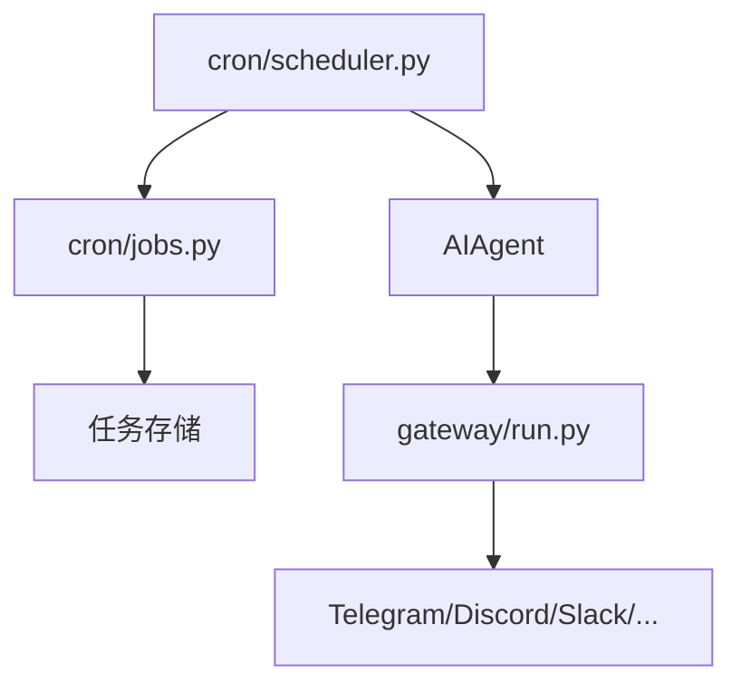
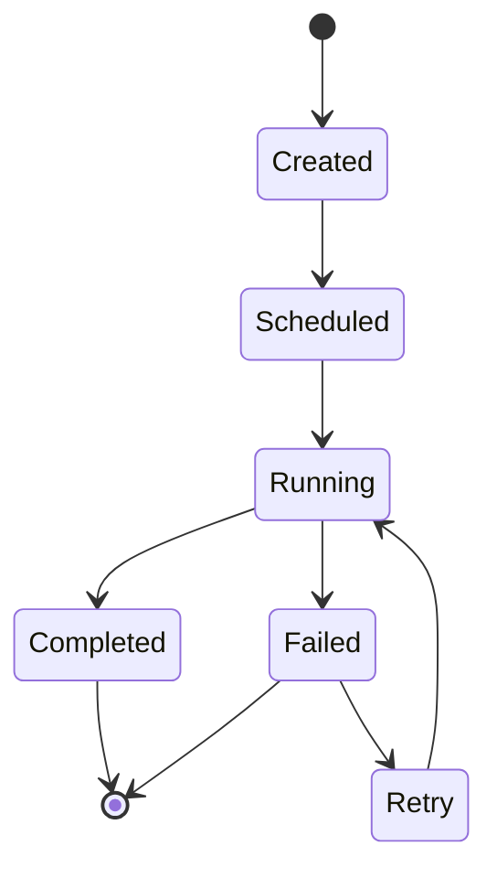

# 10 调度器与定时任务

> 层：第四层（补齐源码逻辑与技术点）
> 状态：已复核（全部行号/符号与基准提交一致）
> 复核日期：2026-08-29
> 生成日期：2026-08-19
> 前置阅读：[04-核心模块与类型关系](./04-核心模块与类型关系.md)

## 一、本模块目标

补齐调度器与定时任务：

- `cron/` 目录；
- 任务存储；
- 调度循环；
- 执行分发；
- 跨平台投递；
- 失败与重试。

## 二、调度架构

## 三、关键文件

| 文件 | 作用 |
|---|---|
| `cron/scheduler.py` | 调度循环 |
| `cron/jobs.py` | 任务定义与执行 |
| `hermes cron` CLI | 用户管理定时任务 |

## 三点五、真实代码映射

| 主题 | 真实文件 | 真实符号/说明 |
|---|---|---|
| 调度器 | `cron/scheduler.py` | 调度循环与执行入口 |
| 任务定义 | `cron/jobs.py` | 任务模型/执行逻辑 |
| 执行记录 | `cron/executions.py` | 任务执行历史 |
| 生命周期守卫 | `cron/lifecycle_guard.py` | 任务生命周期保护 |
| 调度 provider | `cron/scheduler_provider.py` | 调度器提供方抽象 |
| 监控 | `cron/monitor.py` | 定时任务监控 |
| 建议目录 | `cron/suggestion_catalog.py` | 建议/蓝图目录 |
| 事故记录 | `cron/incidents.py` | 定时任务事故/异常记录（本轮新增） |
| 建议逻辑 | `cron/suggestions.py` | 建议生成 |
| 蓝图目录 | `cron/blueprint_catalog.py` | 蓝图目录 |
| 记事本 | `cron/notepad.py` | 定时任务记事/状态 |
| CLI 管理入口 | `hermes cron` | 用户管理定时任务 |

## 四、任务生命周期

## 五、执行分发

- 定时任务触发 Agent turn；
- Agent 可调用工具；
- 结果通过 gateway 投递到平台；
- 支持跨平台通知。

## 六、失败与重试

- 任务失败记录；
- 重试策略；
- 超时控制；
- 降级处理。

## 七、本模块结论

本模块补齐了调度器与定时任务的主干逻辑。后续模块继续展开并发、错误、测试、部署和源码索引。
