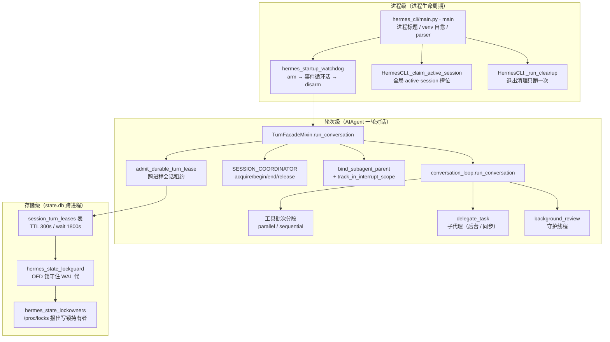
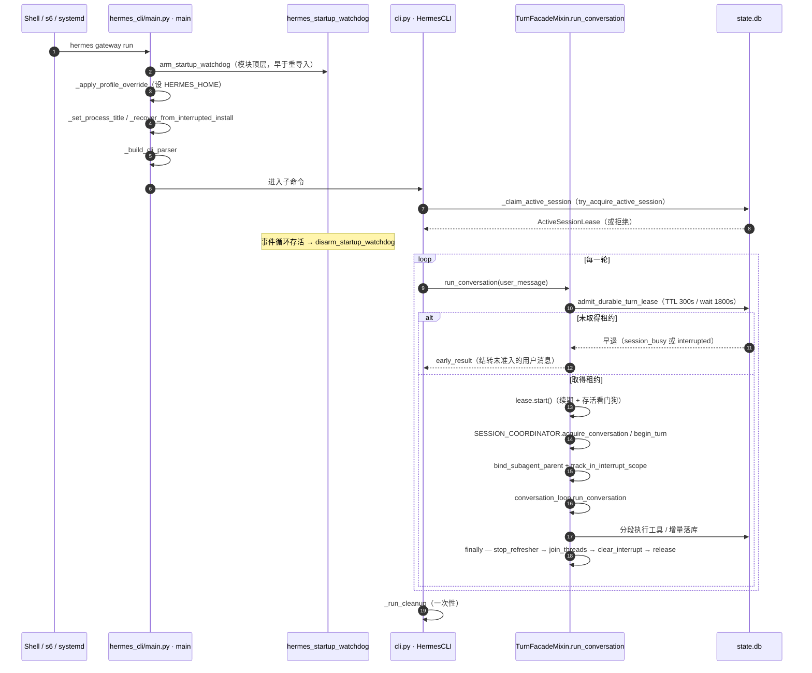

# 11 并发模型与生命周期

> 层：第四层（补齐源码逻辑与技术点）
> 状态：已按 cc0a679f14 复核
> 复核日期：2026-09-22
> 生成日期：2026-08-19
> 前置阅读：[04-核心模块与类型关系](./04-核心模块与类型关系.md)

## 一、本模块目标

补齐并发与生命周期：

- 进程启动序列与启动看门狗；
- 子代理委派与并发上限；
- 工具批次的并行/顺序分段；
- 跨进程会话串行化（durable turn lease）；
- relay 运行时的会话/轮次协调；
- 中断控制与中断作用域；
- 全局 active-session 槽位；
- 资源清理（轮次级与进程级）；
- 异常恢复。

## 二、并发模型总览



三类并发的边界很清楚：

| 层 | 串行化手段 | 关键文件 |
|---|---|---|
| 进程 | active-session 槽位（文件锁注册表） | `hermes_cli/active_sessions.py` |
| 轮次 | durable turn lease（SQLite 行租约） | `agent/turn_facade_lease.py`、`hermes_state_compression.py` |
| 会话内 | 工具分段计划 + 线程池 | `agent/tool_dispatch_helpers.py`、`agent/tool_executor.py` |

## 三点五、真实代码映射

| 主题 | 真实文件 · 符号（+偏移） | 说明 |
|---|---|---|
| 工具执行入口 | `run_agent.py` · `AIAgent._execute_tool_calls +0` | 单调用走顺序；多调用先规划分段 |
| 委派分发 | `run_agent.py` · `AIAgent._dispatch_delegate_task +0` | `delegate_task` 的唯一分发点 |
| 委派工具 | `tools/delegate_tool.py` · `delegate_task +0` | schema、批量、子代理构建 |
| 委派并发旋钮 | `tools/delegate_tool_config.py` · `_get_max_concurrent_children +0`、`_get_max_async_children +0`、`_get_oneshot_max_children +0`、`_get_max_spawn_depth +0` | 见第四节 |
| 子代理父绑定 | `agent/subagent_lifecycle.py` · `bind_subagent_parent +0` | 弱引用 ContextVar |
| 子代理公开服务 | `agent/subagent_lifecycle.py` · `class SubagentLifecycleService +0` | 插件面 `launch/status/wait/cancel/result` |
| 子代理线程池 | `agent/subagent_lifecycle.py` · `Const:_EXECUTOR` | `DaemonThreadPoolExecutor(max_workers=8)` |
| 工具批段规划 | `agent/tool_dispatch_helpers.py` · `_plan_tool_batch_segments +0` | 见第五节 |
| 分段执行 | `agent/tool_executor.py` · `execute_tool_calls_segmented +0` | 逐段跑，保序 |
| 工具并发上限 | `agent/tool_executor.py` · `Const:_MAX_TOOL_WORKERS` | 8 线程/批 |
| 并发批超时 | `agent/tool_executor.py` · `_resolve_concurrent_tool_timeout +0` | 配置键 `timeouts.tools.concurrent_batch` |
| 租约准入 | `agent/turn_facade_lease.py` · `admit_durable_turn_lease +0` | 见第七节 |
| 租约对象 | `agent/turn_facade_lease.py` · `class DurableTurnLease +0` | 续期 + 存活看门狗 + 中断 |
| 未准入消息结转 | `agent/turn_facade_lease.py` · `carry_unadmitted_user_message +0` | 等待被中断时不吞输入 |
| 租约行实现 | `hermes_state_compression.py` · `acquire_session_turn_lease +0` / `refresh_session_turn_lease +0` / `release_session_turn_lease +0` | 持有者限定 |
| relay 协调器 | `agent/relay_runtime.py` · `class RelaySessionCoordinator +0`、`Const:SESSION_COORDINATOR` | 见第八节 |
| 中断控制 | `agent/interrupt_control.py` · `class InterruptControlMixin +0` | `interrupt/hard_interrupt/clear_interrupt/steer/redirect` |
| 中断作用域 | `agent/interrupt_scope.py` · `track_in_interrupt_scope +0` | 宿主跨线程取消 |
| 轮次存活看门狗 | `agent/turn_liveness.py` · `class TurnLivenessWatchdog +0`、`resolve_turn_liveness_settings +0` | 由租约装配 |
| 定时器调度 | `agent/periodic_scheduler.py` · `schedule +0` | 共享调度器，不每轮起线程 |
| 后台审查 | `agent/background_review.py` · `cancel_background_review_for_live_turn +0` | 新轮开始前先收掉旧审查 |
| 批处理（离线） | `batch_runner.py` | 数据集评测，非运行时并发，见第六节 |
| 启动看门狗 | `hermes_startup_watchdog.py` · `arm_startup_watchdog +0` / `disarm_startup_watchdog +0` / `kick_startup_watchdog +0` / `report_startup_progress +0` | 见第十节 |
| 注册生命周期 | `registration_lifecycle.py` · `class ReplacementCoordinator +0` | 见第十节 |
| 全局槽位 | `hermes_cli/active_sessions.py` · `try_acquire_active_session +0` | 见第十一节 |
| 槽位申请 | `cli.py` · `HermesCLI._claim_active_session +0` / `_release_active_session +0` | 见第十一节 |
| 退出清理 | `cli.py` · `_run_cleanup +0`、`hermes_cli/cli_shutdown.py` · `Const:_CLEANUP_STEPS` | 见第十二节 |
| 持久化 | `agent/session_persistence.py` · `SessionPersistenceMixin._persist_session +0` | 每轮落库 |

## 四、子代理委派

### 4.1 分发路径

`run_agent.py` · `AIAgent._dispatch_delegate_task +0` 是 `delegate_task` 的**唯一**分发点（新增 schema 字段只加在这里）。它调用 `tools/delegate_tool.py` · `delegate_task +0`。

关键规则（`_dispatch_delegate_task +3~+5` 的注释与实参）：

- **顶层模型的委派默认后台执行**——`background=not (self._delegate_depth > 0)`；
- **orchestrator 子代理（depth > 0）保持同步**——它需要在本轮内拿到结果，且不拥有 gateway 会话；
- schema 层面的 `background` 参数被**有意忽略**；
- 每个子代理的结果作为新消息回到会话（后台委派经 `independent_completions` 控制是逐条回还是合并回）。

### 4.2 并发上限

| 旋钮 | 配置键 | 默认 | 语义 |
|---|---|---|---|
| 单次委派并发子数 | `delegation.max_concurrent_children` | 10 | 下限 1，**无上限**；> 10 时打一次「成本线性放大」告警 |
| 后台委派并发上限 | 同上（`_get_max_async_children +0`） | 10 | 达到上限时新异步分发**被拒绝而不是排队**，调用方改为同步执行 |
| 一次性会话总量 | `delegation.oneshot_max_children` | 2 | 有限一次性会话内累计子数；0 = 不限 |
| 派生深度 | `delegation.max_spawn_depth` | 1 | 下限 1，无上限；depth 0 是父 |

> **勘误**：`delegation.max_async_children` 已废弃——`_get_max_async_children +0` 里只发一次警告然后忽略，后台并发现在由 `max_concurrent_children` 统一封顶。
>
> 环境变量 `DELEGATION_MAX_CONCURRENT_CHILDREN` 仍是这个旋钮的次优先来源（配置 > env > 默认）。

### 4.3 父绑定与资源清理

`agent/subagent_lifecycle.py` · `bind_subagent_parent +0` 把宿主父 agent 绑进当前执行上下文。**存的是弱引用**（`+3~+7` docstring）：每一轮里被调度出去的 asyncio Handle/Future 会快照 Context，而这些快照活得比本轮长；存强引用会把已结束的子代理钉在父进程堆里直到后台循环结束。

`class SubagentLifecycleService +0`（插件面 `PluginContext.subagent_lifecycle`）：

- 子代理**只在进程内运行**（`+1~+3` docstring）；
- `launch +0` 在 `_REGISTRY.lock` 下先 `_cleanup_locked`，再按 `(parent_session_id, correlation_id)` 去重（`+9` 起）；
- 终态记录有**有界保留期**，绝不返回活跃记录（`_cleanup_locked +0`）；
- `cancel +0` 可取消；`reconnect +0` 对序列化后的 handle 会**报告无法重连**，而不是重新拉起工作。

`Const:_EXECUTOR` 是 `tools/daemon_pool.py` · `DaemonThreadPoolExecutor`（`max_workers=8`）。该池的文档明确：daemon worker 不会在 `shutdown(wait=False)` 后被 atexit 里的 `_threads_queues` 汇合卡住——**一个卡死的子代理不会阻止解释器退出**；代价是它也不保证退出前完成，持久化写入必须走前台线程。

## 五、工具并发执行

真实符号：

- `run_agent.py` · `AIAgent._execute_tool_calls +0`
- `agent/tool_dispatch_helpers.py` · `_plan_tool_batch_segments +0`
- `agent/tool_executor.py` · `execute_tool_calls_segmented +0`

规则（`_plan_tool_batch_segments +1~+10` docstring）：

- **单调用直接走顺序执行**（`_execute_tool_calls +10~+11`）；
- 多调用先规划成有序的 `("parallel" | "sequential", calls)` 段；**调用顺序严格保留**，后面的调用永不越过前面的屏障，因此结果顺序与副作用边界与纯顺序执行一致；
- **并行准入**：只读且无共享可变会话状态的工具（`Const:_PARALLEL_SAFE_TOOLS`，如 `read_file` / `search_files` / `session_search` / `ha_*` / `image_generate`）、以及路径作用域不冲突的工具；
- **路径冲突规则**：reader↔reader 重叠仍可并行；**任何涉及 writer 的重叠都会关闭当前 run**，让该调用落到冲突调用之后的新 run；
- **屏障**：`Const:_NEVER_PARALLEL_TOOLS`（当前是 `clarify`、`manage_connections`）、参数不可解析/非 dict、以及任何不满足并行安全的工具，一律成为顺序段；
- **不足两个调用的 run 降级为顺序**（顺序执行器拥有更丰富的内联分发逻辑）；相邻顺序段会合并。

线程与超时：

- 每个并行批最多 `Const:_MAX_TOOL_WORKERS`（8）个 worker 线程；
- `image_generate` 在场时，worker 数进一步被 `image_gen.max_parallel_requests`（默认 4）夹住（`_image_generate_parallel_limit +0`）；
- 并发批的截止时间由 `_resolve_concurrent_tool_timeout +0` 解析：**配置键 `timeouts.tools.concurrent_batch` 优先**，`HERMES_CONCURRENT_TOOL_TIMEOUT_S` 只是遗留桥，0/负数表示禁用；默认 420s。

中断与分段执行（`execute_tool_calls_segmented +1~+4`）：

- 段按序执行，段执行器在开头检查中断标志；中断后剩余段被「排空」，每个调用各得一条结果（保证 `tool_calls` 与 `tool` 结果一一对应）；
- 轮次收尾工作（预算结算 + `/steer`）只在这里跑一次（各段以 `finalize=False` 执行）；
- 任一段落发现 `_incremental_persistence_failed` 就**立即返回**，不再执行后续段。

## 六、批处理

真实符号：`batch_runner.py`（模块级 `main` 是 fire CLI）。

**勘误**：上一版把它写成 agent 运行时的「并行处理多个任务、隔离每个任务的 Agent 上下文」。实际职责是**离线数据集评测**：

- 输入是 JSONL 提示词数据集；
- 用 `multiprocessing.Pool` 按批并行，每批输出 `batch_N`.jsonl；
- 支持 `--resume` 的断点续跑；
- 轨迹输出为 from/value 格式，并聚合工具使用统计；
- 依赖 `toolset_distributions.py` 做工具集采样。

它**不参与**在线请求的并发控制，与 durable turn lease / active-session 槽位无关。运行时并发见第五、七、十一节。

## 七、跨进程会话串行化（durable turn lease）

### 7.1 为什么需要

`state.db` 被多个进程共享：Desktop、CLI（含 `--resume`）、gateway、后台投递。同一会话的 `[加载历史 → 跑 → 落库]` 这段必须一次只让一个进程走完，否则会出现 `user;user` 这类转写错位。

### 7.2 两个不同的「turn lease」

**勘误（上一版把两者混为一谈）**：

| | `gateway/turn_lease.py` | `agent/turn_facade_lease.py` |
|---|---|---|
| 范围 | **进程内**、单事件循环（asyncio） | **跨进程**（SQLite 行） |
| 键 | 路由键（routing key） | 解析后的 session_id |
| 实现 | `class SessionTurnLeaseRegistry +0`、`class TurnLeaseToken +0` | `class DurableTurnLease +0` |
| 超时语义 | `class TurnLeaseTimeoutError +0`，等待预算耗尽即 fail-closed | 等待 1800s 后返回 `session_busy` 早退结果 |
| 上限 | `Const:DEFAULT_MAX_LEASES` = 512（只淘汰空闲项） | 每会话一行 |

上一版写「跨进程租约 → `gateway/turn_lease.py`」是**错的**：`gateway/turn_lease.py` 的 docstring 自己说清了它只解决「同一个进程里两个路由键交错 flush 同一份转写」，并且**CLI 连续性进程在这个锁之外**。真正的跨进程串行化在 `agent/turn_facade_lease.py` + `hermes_state_compression.py`。

### 7.3 获取（准入）

`agent/turn_facade_lease.py` · `admit_durable_turn_lease +0`：

1. `+9`：取 `agent._session_db`；没有 db 或没有 session_id → 直接返回空准入（无租约，无需串行化）。
2. `+16~+21`：**新建会话、持久化被禁用、或 db 没有 `acquire_session_turn_lease` 能力**时跳过。注意这里调的是 `_durable_session_exists +0`——**探针失败按「存在」处理**（`+4~+9` 注释：locked / 非 WAL 读取不构成「行不存在」的证据；把探针失败当「新会话」会在竞争点上 fail-open）。所以探针失败时选择**获取租约**，即 fail-closed。
3. `+24~+26`：持有者字符串 = `pid=<pid>:turn=<relay_turn_id>:platform=<platform>`。
4. `+39~+42`：`db.acquire_session_turn_lease(session_id, holder, ttl_seconds=LEASE_TTL_SECONDS, wait_seconds=LEASE_WAIT_SECONDS, on_wait=..., should_abort=...)`。等待期间通过 `on_wait` 发状态提示；`should_abort` 读 `agent._interrupt_requested`，所以 `/stop` 能立刻中止等待。
5. 获取失败 → `_lease_not_acquired_result +0` 构造早退结果，调用方原样返回。
6. `+48~+50`：**准入成功后才**建 `DurableTurnLease` 并把 holder/TTL 写回 agent（这样 `finally` 不会去释放一个从未拥有的 holder）。
7. `+56~+72`：**只有等待过**才重载转写（`resolve_resume_session_id` + `get_messages_as_conversation`）——立即拿到租约时跳过，避免无谓的 prompt cache 失配。重载会把「被本进程打断的那次等待里未落库的用户输入」补回来（依赖 `_PERSIST_AFTER_ADMISSION_INTERRUPT` 标记，见 7.6）。

常量（`agent/turn_facade_lease.py` 模块级）：`LEASE_TTL_SECONDS = 300.0`、`LEASE_WAIT_SECONDS = 1800.0`。

### 7.4 续期与释放

| 动作 | 符号 | 语义 |
|---|---|---|
| 启动 | `DurableTurnLease.start +0` | 置 `turn_active=True`，先 `_touch_activity`（否则看门狗会从**上一轮**的空闲起算而误杀新轮），再经共享调度器注册续期与看门狗两个定时器 |
| 续期 | `refresh_tick +0` | 每 `refresh_interval`（默认 60s，取 `agent._session_turn_lease_refresh_interval`）跑一次 `refresh_session_turn_lease(..., ttl_seconds=LEASE_TTL_SECONDS)`；**返回 False 或抛异常都会中断本轮** |
| 停止续期 | `stop_refresher +0` | 置 `turn_active=False` 并 set `stop`；同时是看门狗的 deactivate 回调——无法展开的卡死不能永远持有租约，让 TTL 到期后由陈旧清理回收 |
| 收线程 | `join_threads +0` | `handle.cancel(wait=1.0)`，镜像旧的 `thread.join(timeout)`，保证在 `clear_interrupt` 之前让在飞的 tick 结束 |
| 清中断 | `clear_interrupt +0` | 只清**本租约**引起的那条中断（比对 `_interrupt_message` 一致才清） |
| 释放 | `release +0` | `db.release_session_turn_lease(session_id, holder)`；只有 agent 上的 holder 属性仍指向本租约时才清空；释放失败只记 error，不抛 |

**持有者限定（holder fencing）**：`hermes_state_compression.py` · `refresh_session_turn_lease +0` 的 UPDATE 带 `AND holder = ?`，`release_session_turn_lease +0` 的 DELETE 同理。因此一个迟到的旧续期不会续到继任者的租约上。

### 7.5 租约丢失与 fail-closed

- **续期失败**：`refresh_tick +0` 打 error 后调 `_interrupt_turn +0`，消息是「Session turn lease lost; stopping to protect the transcript.」，工具归因 `tool_reason="session turn lease lost"`（`Const:_REASON_LEASE_LOST`）。
- **租约丢失的中断是无条件的**（`_interrupt_turn +1~+2` 注释）：租约丢了就意味着本进程不再拥有该会话，不做 generation 校验。
- **等待超时是 fail-closed 的**：`_lease_not_acquired_result +0` 返回带 `failed=True`、`error="session_turn_lease_timeout:<id>"`、`failure_reason="session_busy"`、`failure_retryable=True` 的结果，并给出「另一进程占用太久，请稍后重发」的文案——而不是裸的 `TimeoutError`。
- **被中断的等待不吞输入**：`carry_unadmitted_user_message +0` 把这次已接收但未落库的用户消息以 `_PERSIST_AFTER_ADMISSION_INTERRUPT` 标记追加进早退结果的 history，让后续轮次既能看到它、也会持久化它。硬停（`/stop`）则取消输入而不是结转。

### 7.6 存活看门狗

`DurableTurnLease.build_threads +0` 只在配置给出存活超时时才建 `agent/turn_liveness.py` · `class TurnLivenessWatchdog +0`。设计要点（`+1~+2` docstring）：**续期成功不等于有进展**——静默卡死的轮次会一直续期下去，所以必须有独立的「活动时钟」看门狗。

`commit_liveness_abort +0` 是看门狗观测的**提交点**：

1. 在 `_touch_activity` 用的**同一把锁**下重新校验观测到的 `(generation, timestamp)`，轮次若已恢复则放弃；
2. 再在租约锁下确认 `stop` 未置位且轮次仍活跃；
3. `agent.interrupt(..., hard_cancel=True, require_generation=current_generation)`——generation 声明与首次可见发布在**同一个临界区**内完成；
4. `interrupt` 抛异常 → `published` 保持 False → **拒绝本次中止（fail-closed）**；声明过期同样返回 False。

### 7.7 轮次内的清理顺序

`agent/turn_facade.py` · `TurnFacadeMixin.run_conversation +0` 的 `finally` 是**嵌套**的，顺序是硬性的（`+155~+168`）：

```
end_turn(relay_turn)                     # +158
  → release_conversation(relay_lease)    # +162
    → lease.stop_refresher()             # +164~+165
    → lease.join_threads()               # +166
    → lease.clear_interrupt()            # +167  ← 必须在 join 之后
    → lease.release()                    # +168
```

`+124~+128` 另有一处更早的 `lease.stop_refresher()`（内层 `finally`）：循环结束后的 relay/任务收尾不能再被迟到的续期中断打断。

## 八、relay 运行时

真实符号：`agent/relay_runtime.py` · `class RelaySessionCoordinator +0`，模块级单例 `Const:SESSION_COORDINATOR`（`+246`）。

`TurnFacadeMixin.run_conversation` 里的调用序列：

| 阶段 | 符号（+偏移） | 作用 |
|---|---|---|
| 建/复用会话作用域 | `acquire_conversation +24` | 入参 `profile_key` / `session_id` / `platform` / `parent_session_id` / `model`；返回 `ConversationLease` |
| 开轮次 | `begin_turn +49` | 返回 `RelayTurnContext`；`relay_enabled=False` 时跳过 relay 侧的 task 上报 |
| 收逻辑调用 | `finish_logical_calls +191` | 在 `run_conversation` 返回后调用，`outcome ∈ {success, cancelled, failed}` |
| 收轮次 | `end_turn +102` | 最外层 `finally` 第一件事 |
| 释放会话作用域 | `release_conversation +236` | 静态方法；`end_turn` 之后 |

主链路上的偏移：`+75`（`acquire_conversation`）、`+87`（`begin_turn`）、`+135`（`finish_logical_calls`）。

relay 的可用性是**逐 profile** 的：`get_runtime +0` 返回当前 profile 的 Relay 宿主，`current_profile_key +0` 给出隔离键；没有 Relay wheel 时落到 `class NoopRelayRuntime +0`（显式降级宿主）。异常路径上 `relay_outcome` 按异常类型映射：`KeyboardInterrupt`/`InterruptedError`/`CancelledError` → `cancelled`，`TimeoutError` → `timed_out`，其余 → `failed`。

## 九、中断控制与中断作用域

### 9.1 `InterruptControlMixin`

`agent/interrupt_control.py` · `class InterruptControlMixin +0`：

| 方法 | 偏移 | 说明 |
|---|---|---|
| `interrupt` | `+3` | 请求中断当前工具循环；`hard_cancel` 表示显式停止（压缩在普通中断被屏蔽时也认它）；`tool_reason` 是可信的固定归因；`require_generation` 是活动代际声明 |
| `hard_interrupt` | `+103` | 保留 `interrupt()` ABI 的显式停止入口（前端据此做特性探测） |
| `clear_interrupt` | `+109` | 清中断请求与按线程的工具信号；`preserve_redirect` 控制是否保留待应用的重定向 |
| `steer` | `+138` | 把用户文本排到当前工具批之后，作为独立的 user 行投递 |
| `redirect` | `+149` | 在**不新建任务**的前提下改向当前轮 |

`interrupt` 的锁纪律（`+42~+46` 注释）：硬停与重定向共用 `_pending_redirect_lock`，避免 `/stop` 与已接受纠偏相互竞态、把停止意外变成重试；阻塞式的「等在飞提交」在原子声明边界**之前**跑，破坏性的「取消待定提交」在声明存活**之后**跑。

`require_generation` 路径（`+14~+18`、`+55~+63`）分三步：在活动锁下**预留**声明 → 在最终变更边界**消费**声明并首次发布（同一临界区）→ 若期间有真实进展则 `return False`。

### 9.2 `InterruptScope`

`agent/interrupt_scope.py` 解决的是**宿主跨线程取消**：宿主在 worker 线程上跑阻塞命令（Hermes Console），看不到命令内部 fork 出来的 `AIAgent`，因此没法调 `interrupt()`。

- `class InterruptScope +0`：`cancel +7` 闩存原因并硬中断作用域内**每一个** agent；`track +19` 注册 agent，**在 cancel 之后才注册的 agent 会被立即中断**（所以取消不会输给还没开始的轮次）。
- `bind_interrupt_scope +33`：把某个 scope 绑定为当前上下文中所有轮次的所有者。
- `track_in_interrupt_scope +0`：把 agent 注册进已绑定的 scope；**没有 scope 时是 no-op**（返回 `nullcontext()`）。

`TurnFacadeMixin.run_conversation +111` 一次性把三个上下文管理器套在真正的循环外面：

```python
with bind_subagent_parent(self), scoped_runtime_main({}), track_in_interrupt_scope(self):
```

`+114` 才 `lease.start()`——即**先完成作用域绑定，再启动租约计时**。

## 十、启动生命周期全貌

### 10.1 入口序列

`hermes_cli/main.py` · `main +0`：

| 偏移 | 动作 |
|---|---|
| `+2` | `_set_process_title +0`——纯装饰，让 `ps/top` 显示 `hermes` 而不是 `python3.xx` |
| `+3` | `_warn_if_unsupervised_pid1 +0`——PID 1 且无上级回收者时告警 |
| `+4` | `_advertise_agent_env +0` |
| `+34` | `_recover_from_interrupted_install +0`（`hermes_cli/main_install_repair.py`）——**venv 自愈**：修一个被中断的 `hermes update` 留下的半成品 venv，并提示（**不重启**）那次更新没重启的 fleet。含 `update` 子命令时整体跳过 |
| `+44~+51` | Termux / serve / chat 的快速启动快路径 |
| `+53` | `_build_cli_parser +0` |
| `+58` | 容器模式：`get_container_exec_info +0` 命中则 `execvp` 进托管容器（在 `parse_args` **之前**，否则 `--help` 和未知 flag 会被宿主 argparse 截走） |

**更早**：模块顶层（`+0` 之前）在 `_argv_is_gateway_run +0` 命中「相邻的 `gateway run`」时先 `arm_startup_watchdog()`；再往后是模块级的 `_apply_profile_override()` 调用。

`_apply_profile_override +0` 的解析顺序：

- `+10~+17`：`HERMES_HOME` 已设且其父目录名是 `profiles` → 直接信任；`HERMES_UPDATE_POST_SWAP=1` 的更新后子进程也直接返回（否则会在**别的 profile** 里完成更新收尾）。
- `+19~+29`：没给 `-p` 且不在 gateway supervisor / Desktop SSH 后端下 → 读 `<root>/active_profile`，非 `default` 就采用（**粘性 profile**）。
- `+34`：`hermes_cli/profiles.py` · `resolve_profile_env +0` 解析成路径。
- `+49`：写 `os.environ["HERMES_HOME"]`；`+51`：把 flag 从 `argv` 剥掉。
- 任何 `hermes_cli/profiles.py` 的 bug 都**不得**阻止启动：捕获后打 warning 并回退默认 profile。

### 10.2 启动看门狗（`hermes_startup_watchdog.py`）

解决的问题（模块 docstring）：**进程在事件循环起来之前就卡死**——此时循环存活看门狗、关停看门狗、心跳文件全都假设「启动已成功」，一个都不会响（OOF-298：约 30 小时，所有线程停在 `futex_wait_queue`，零日志，s6 看到 PID 还活着）。

- `arm_startup_watchdog +0`：起一个守护线程，超时未 disarm 就 `faulthandler` dump 全线程栈、往生命周期账本记一笔（NS-608），然后 `os._exit` 用**服务重启码**退出，交给 s6/systemd 拉起。
- `disarm_startup_watchdog +0`：事件循环确认存活后收手。**幂等**，从不抛。
- `kick_startup_watchdog +0`：把截止时间推到 `now + timeout + extra_s`。用于**设计上就该空闲的等待**——当前唯一的非测试调用点是 respawn 风暴退避（`hermes_cli/gateway.py`，`extra_s` 取退避值；模块 docstring 记该退避上限为 300s）。MCP 发现的 120s 等待**落在**默认 300s 之内，因此不需要 kick。
- `report_startup_progress +0`：声明一个**阶段持有的进展租约**，这是最高权威的证据——它证明「启动路径本身还活着」，且对 I/O 密集阶段（schema 迁移、`SessionDB.__init__` 里的损坏修复）在几乎零 CPU 时也成立。

权威顺序（模块 docstring 的「Order of authority」段）：阶段租约 > 进程级 CPU 进展（CPU 证据被 `Const:_MAX_CPU_EXTENSIONS` = 3 封顶，因为无关线程烧 CPU 不该永远掩盖被 park 的启动线程）。

**慢但活着**的启动不会被杀。已知局限：**自旋型**死锁会先耗掉那 3 次有上限的延长才触发。

配置是**纯环境变量**的：`HERMES_STARTUP_WATCHDOG=0` 关闭，`HERMES_STARTUP_WATCHDOG_TIMEOUT_S` 改超时（默认 300s，下限 30s）。理由写在 docstring 里：**用户配置 YAML 的解析本身就在被观测范围内**。因此该模块**只有标准库、导入极轻**——arm 必须发生在导入 `gateway`（数百个模块）之前，而触发时卡死的主线程可能还持有 import 锁，所以 fire 路径**不做任何 import**。

`class StartupWatchdogHandle +0` 的状态机：`armed → disarmed` 或 `armed → firing`，由句柄自己的状态锁保证两者不会同时「赢」（#89750）。`+87` 的 `_fire` 还有一条 `_exit_escort` 护卫线程（`Const:_FIRE_EXIT_BOUND_S` = 10s）：取证路径自己卡住（主线程持着 logging handler 锁、磁盘满）时也硬退出。

**arm 站点**：`hermes_cli/main.py`（`gateway run`）、`cli.py`（`--gateway`）、`hermes_cli/gateway.py`、`gateway/run.py`、`scripts/hermes-gateway`。**disarm 站点**：`gateway/run_startup.py`、`hermes_cli/gateway.py`。**阶段租约站点**：`hermes_state_schema.py`、`hermes_state_repair.py`、`hermes_state_maintenance.py`、`hermes_state_sessions.py`、`gateway/lifecycle_ledger.py`。

### 10.3 注册生命周期（`registration_lifecycle.py`）

`class ReplacementCoordinator +0` 管的是**可替换运行时注册的归属代际**——不只是值身份：同一个 provider 单例可能在旧归属代际被卸载后**再次注册**。

- `class ReplacementLease +0`：一个注册槽位里的一代归属，带 `previous` / `predecessor` / `restore` / `finalize` / `active`。
- `transaction +8`：把「快照 / 写入 / 获取」与「租约释放」串行化。
- `acquire +13`：给新的一代挂到**匹配的活跃前任**上（用 `same_registration +0` 做身份比较，元组逐元素比）。
- `dispose +23`：移除租约并把**最近一个仍活着的前任**恢复回去。规则是「只有最新的活跃代际才能改槽位」——旧代际可能与新代际共享同一对象身份，注册表级的 CAS 分辨不出来（`+11~+12` 注释）。执行顺序固定为 `restore → finalize → 槽位裁剪`，且**前一步抛异常也照样跑后续步骤**（`finally` 套 `finally`）。

模块级单例：`Const:replacement_coordinator`。

> **它在启动/关闭序列里的位置**：这是**被启动流程使用**的基础设施，不是启动流程本身的阶段。本版复核时在 `hermes_cli/main.py` / `gateway/run.py` 的启动路径上**没有**找到对 `replacement_coordinator` 的调用点；它的消费者是需要「可替换注册」能力的子系统（provider/插件注册）。**当前源码无法确定**它在完整启动序列里的确切插入点——需要另做一次调用点追踪。

### 10.4 启动时序图



## 十一、全局 active-session 槽位

`cli.py` · `HermesCLI._claim_active_session +0`：

- `+2~+3`：已经有租约就返回 True（幂等）。
- `+7~+14`：`hermes_cli/active_sessions.py` · `try_acquire_active_session +0`，带 `metadata={"live_session_id": ...}` 作为**写者身份**（本进程重复申请会替换自己的条目，见 #94595）。
- `+21~+23`：拿到租约后登记 `atexit` → `_release_active_session +0`（`+26`）释放。
- **异常路径 fail-open**：`try_acquire_active_session` 抛异常时打 warning 并返回 True（容量上限属于资源策略，不该阻止使用）。

`try_acquire_active_session +0` 的语义（`+6~+8` docstring）：

- **每会话独占是正确性**，无条件强制——一份存储会话最多一个活着的所有者；
- **`max_concurrent_sessions` 是资源策略**，只在配置了才生效（顶层键优先，回退 `gateway.max_concurrent_sessions`；`null`/`0`/省略 = 不限）；
- **归属不确定时 fail-closed**：读不到注册表就返回 `ActiveSessionRefusal(SESSION_COORDINATION_UNAVAILABLE)`——「无法证明没有别的所有者」绝不能变成「没有所有者」；
- `registry_home` 让按 profile 作用域运行的后端共享**所属 profile** 的注册表；
- 死进程的陈旧条目会被 prune（`_prune_dead +0`）。

## 十二、资源清理

### 12.1 轮次级

`TurnFacadeMixin.run_conversation +0` 的 `finally` 按 7.7 的固定顺序清理：relay 轮次 → relay 会话作用域 → 租约（停续期 → 收线程 → 清中断 → 释放）。同一段还负责：清活动标签（`_reset_activity_labels_after_turn`）、清 `_relay_pending_turn_id`、复位三个上下文 token（accounting / conversation / affinity）、以及 `_review_queue.note_turn_finished()` 平衡 `note_turn_started()`（否则 idle 队列的活跃轮次计数会泄漏）。

轮次**开始前**先收旧审查：`agent/background_review.py` · `cancel_background_review_for_live_turn +0`（在 `run_conversation` 的第一句调用，`+17`）。后台审查是守护线程，超时 `Const:_BACKGROUND_REVIEW_CANCEL_TIMEOUT_SECONDS` = 2s。

### 12.2 进程级

`cli.py` · `_run_cleanup +0`——**只跑一次**（`+3~+6` 的 `_cleanup_done` 守卫）：

1. `+9`：先武装退出看门狗（`_arm_exit_watchdog`），给整个清理加时限；
2. `+13`：**最先**复位终端输入模式（清焦点上报与鼠标追踪），因为后面的拆除可能要几秒、且某一步抛异常不能跳过它；
3. `+15~+17`：按 `hermes_cli/cli_shutdown.py` · `Const:_CLEANUP_STEPS` 顺序执行，每步各自声明要吞的异常类：

   | 步骤 | 吞 |
   |---|---|
   | `_stop_cli_wake_word` | `Exception` |
   | `_cleanup_all_terminals` | `Exception` |
   | `_interrupt_async_delegations` | `Exception` |
   | `_cleanup_all_browsers` | `Exception` |
   | `_shutdown_mcp_servers` | **`BaseException`**（MCP 拆除可能抛 `BaseException` 派生错误） |
   | `_shutdown_cached_aux_clients` | `Exception` |

4. `+18~+21`：`_notify_session_finalize`（经 `hermes_cli/lifecycle.py` · `finalize_session +0`）。**已交接给 gateway 的会话绝不在这里 finalize**（`_should_emit_cleanup_session_finalize +0`）——否则会给 gateway 正在写的行盖上 `end_reason`，让交接段从历史里消失（#88234）；
5. 最后 `_shutdown_agent_memory_provider`，失败只 warning。

`_run_cleanup` 由 `atexit` 注册，也在正常退出 / EOF / 中断路径上调用。`kill -9` 不可捕获，kanban worker 的 `os._exit(0)` 绕过 `atexit`——但两者都是非 TTY 场景，没有终端模式要复位。

## 十三、异常恢复

- **每次 API 调用尝试各自的重试/恢复守卫**：`agent/turn_retry_state.py` · `class TurnRetryState +0`——一次性恢复守卫与重启信号按「单次 API 调用尝试」为粒度，不跨轮累加。
- **最终响应不会被持久化失败吞掉**：`agent/turn_finalizer.py` · `_recover_final_from_stream +0`（`+1~+5` docstring）在**可能失败**的尾部整形/落库步骤**之前**先把流式已交付的文本绑定为 `final_response`；`_guarded_cleanup +0` 则保证每个收尾步骤都被守卫。
- **但增量持久化失败会中止工具执行**（**勘误**：上一版把它笼统写成「持久化失败不阻断已生成响应」）。两处实现：
  - `agent/turn_tool_round.py`：工具执行**前**的 canonical append 失败 → 记 `_last_persistence_error_cause`，**绝不**用仅存在于进程内的状态去投影行或跑工具，直接 `break`；
  - `agent/tool_executor.py` · `_flush_session_db_after_tool_progress +0`：失败置 `agent._incremental_persistence_failed = True`，`execute_tool_calls_segmented` 每段开头检查该标志并提前返回。
- **后台任务失败隔离**：后台委派上限满时**拒绝而非排队**；后台审查失败只影响审查本身；`DaemonThreadPoolExecutor` 保证卡死的子任务不阻塞退出。
- **子代理失败回传**：`SubagentLifecycleService` 的终态快照有界保留，`result +0` / `status +0` 可取；`reconnect +0` 明确报告无法重连。

## 十四、易错点与边界条件

1. **`gateway/turn_lease.py` 与 `agent/turn_facade_lease.py` 是两回事**，不要互相替代（见 7.2）。
2. **租约探针失败必须 fail-closed**：`_durable_session_exists +0` 把「读不到」当「存在」，从而选择获取租约。反过来的写法（当新会话）会在竞争点上 fail-open。
3. **只有「等待过」才重载转写**；立即拿到租约时重载会造成无谓的 prompt cache 失配。
4. **`clear_interrupt` 必须在 `join_threads` 之后**：先清会让在飞的 tick 又发一次中断。
5. **`turn_active` 与 `stop` 都只在租约锁下读写**，这样迟到的续期失误永远不会硬中断**下一轮**。
6. **续期成功 ≠ 有进展**：必须靠独立的活动时钟看门狗，否则静默卡死会一直续期。
7. **存活中止的 generation 声明必须在同一个临界区内消费并首次发布**；`interrupt` 抛异常时中止要**拒绝**（fail-closed）。
8. **`_EXECUTOR` / 工具线程池都是 daemon**：不阻塞退出，但也**不保证**完成——持久化写入不能放在上面。
9. **分段执行必须保序**：并行段之间是屏障；任何 writer 路径重叠都会关闭当前 run。结果顺序与纯顺序执行一致，这是硬约束而非优化。
10. **`_NEVER_PARALLEL_TOOLS` 目前只有 `clarify` 与 `manage_connections`**；新增交互式工具必须加进去，否则会与 UI 抢输入。
11. **并发批超时的真源是配置键 `timeouts.tools.concurrent_batch`**，`HERMES_CONCURRENT_TOOL_TIMEOUT_S` 只是遗留桥（`_resolve_concurrent_tool_timeout +1~+2`）。
12. **active-session 的容量上限 fail-open，独占性 fail-closed**：读不到注册表时拒绝会话，而不是放行。
13. **启动看门狗只能用环境变量配置**（`HERMES_STARTUP_WATCHDOG*`），因为它观测的正是配置解析本身；且它必须保持「只有标准库」。
14. **慢启动不会被杀**，但自旋型死锁会先耗掉 3 次有上限的 CPU 延长（`_MAX_CPU_EXTENSIONS`）才触发。
15. **已交接给 gateway 的会话不能在 CLI 侧 finalize**。
16. **`_run_cleanup` 只能跑一次**；重复调用直接返回。

## 十五、本模块结论

本模块补齐了进程级（启动序列、启动看门狗、注册代际、active-session 槽位、一次性退出清理）、轮次级（durable turn lease、relay 协调、中断控制与作用域、租约清理顺序）与会话内（工具分段并发、子代理并发上限与清理）三层并发模型，并给出了持久化失败的两种不同处理方式。后续模块继续展开错误处理、测试、部署和源码索引。

---

上一篇：[10-调度器与定时任务](./10-调度器与定时任务.md) ｜ 总目录：[./README.md](./README.md) ｜ 下一篇：[12-错误处理与重试机制](./12-错误处理与重试机制.md)
