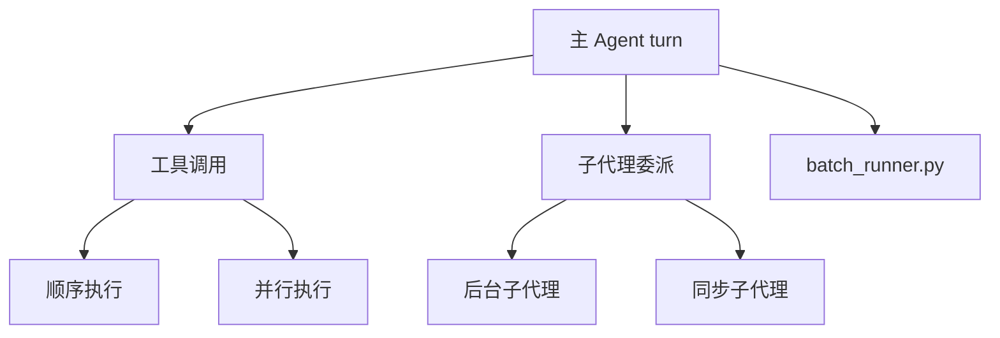

# 11 并发模型与生命周期

> 层：第四层（补齐源码逻辑与技术点）
> 状态：已复核（全部行号/符号与基准提交一致）
> 复核日期：2026-08-29
> 生成日期：2026-08-19
> 前置阅读：[04-核心模块与类型关系](./04-核心模块与类型关系.md)

## 一、本模块目标

补齐并发与生命周期：

- 子代理委派；
- 并行批处理；
- 工具并发执行；
- 资源清理；
- 异常恢复；
- 跨进程会话串行化。

## 二、并发模型总览

## 二点五、真实代码映射

| 主题 | 真实文件 | 真实符号/说明 |
|---|---|---|
| 工具执行入口 | `run_agent.py` | `AIAgent._execute_tool_calls()` @8164 |
| 委派分发 | `run_agent.py` | `AIAgent._dispatch_delegate_task()` @8208 |
| 委派工具 | `tools/delegate_tool.py` | `delegate_task` |
| 子代理生命周期 | `agent/subagent_lifecycle.py` | 子代理绑定/生命周期 |
| 工具批段规划 | `agent/tool_dispatch_helpers.py` | `_plan_tool_batch_segments()` |
| 分段执行 | `agent/tool_executor.py` | `execute_tool_calls_segmented()` |
| 批处理 | `batch_runner.py` | 并行批处理 |
| 会话持久化锁 | `run_agent.py` | `AIAgent._persist_session()` @1924 |
| 跨进程租约 | `gateway/turn_lease.py` | durable turn lease |
| 后台审查 | `agent/background_review.py` | 后台记忆/技能审查 |

## 三、子代理委派

真实符号：

- `run_agent.py:AIAgent._dispatch_delegate_task()`，约在 `8208` 行
- `tools/delegate_tool.py`

关键规则：

- 顶层模型委派默认后台执行；
- orchestrator subagent 委派保持同步；
- 每个子代理结果作为新消息回到会话。

## 四、工具并发执行

真实符号：

- `run_agent.py:AIAgent._execute_tool_calls()`，约在 `8164` 行
- `agent/tool_dispatch_helpers.py:_plan_tool_batch_segments()`
- `agent/tool_executor.py:execute_tool_calls_segmented()`

规则：

- 单个 tool call 顺序执行；
- 多个 tool call 按并行安全段拆分；
- 只读工具、非重叠文件目标、opt-in MCP 工具可并行；
- 交互式、不安全、未识别工具作为顺序屏障。

## 五、批处理

真实符号：

- 文件：`batch_runner.py`

作用：

- 并行处理多个任务；
- 隔离每个任务的 Agent 上下文；
- 收集结果。

## 六、跨进程会话串行化

- 多进程共享 `state.db`；
- Desktop、CLI、gateway 可能并发；
- durable turn lease 串行化 load → run → flush；
- 探针失败 fail-closed。

## 七、资源清理

- 中断处理；
- 后台 review 取消；
- 工具环境清理；
- 数据库连接关闭；
- 临时文件清理。

## 八、异常恢复

- 每轮重试计数器重置；
- 持久化失败不阻断已生成响应；
- 后台任务失败隔离；
- 子代理失败回传。

## 九、本模块结论

本模块补齐了并发模型与生命周期。后续模块继续展开错误处理、测试、部署和源码索引。
