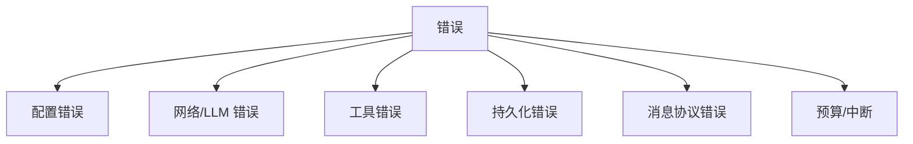

# 12 错误处理与重试机制

> 层：第四层（补齐源码逻辑与技术点）
> 状态：已复核（全部行号/符号与基准提交一致）
> 复核日期：2026-08-29
> 生成日期：2026-08-19
> 前置阅读：[03-详细逐步说明-主链路拆解](./03-详细逐步说明-主链路拆解.md)

## 一、本模块目标

补齐错误处理与重试：

- 错误传播；
- 重试策略；
- 超时控制；
- 降级处理；
- 工具错误截断；
- 持久化失败处理。

## 二、错误分类

## 二点五、真实代码映射

| 主题 | 真实文件 | 真实符号/说明 |
|---|---|---|
| 错误分类 | `agent/error_classifier.py` | 错误分类 |
| 错误类型 | `agent/errors.py` | 自定义错误 |
| 重试工具 | `agent/retry_utils.py` | 重试策略 |
| 空响应守卫 | `agent/empty_response_guard.py` | 空响应恢复 |
| 消息修复 | `agent/agent_runtime_helpers.py` | `repair_message_sequence_with_cursor()` |
| 尾部脚手架清理 | `run_agent.py` | `AIAgent._drop_trailing_empty_response_scaffolding()` @1964 |
| 工具错误截断 | `tools/registry.py` | `_MAX_TOOL_ERROR_CHARS` @33 |
| 持久化 | `run_agent.py` | `AIAgent._persist_session()` @1924 |
| 迭代预算 | `agent/iteration_budget.py` | `IterationBudget` |
| 中断兼容 | `agent/interrupt_compat.py` | 中断兼容 |
| 限流跟踪 | `agent/rate_limit_tracker.py` | 限流跟踪 |
| 重复守卫 | `agent/repetition_guard.py` | 重复输出守卫 |

## 三、配置错误

- 缺少 provider/API key；
- 模型解析失败；
- 目录不存在；
- 配置 schema 错误。

处理：

- CLI 启动前检查；
- 打印用户可读提示；
- 必要时 `sys.exit(1)`。

## 四、网络/LLM 错误

- 限流；
- 超时；
- 连接错误；
- 空响应；
- 截断响应；
- 无效 JSON；
- 无效 tool call。

处理：

- 重试计数器；
- fallback provider；
- 空响应恢复；
- 截断续写；
- 无效 tool call 修复/终止。

## 五、工具错误

真实符号：

- `tools/registry.py:_MAX_TOOL_ERROR_CHARS = 2048`

处理：

- 工具错误返回模型前截断到 2048 字符；
- 日志保留更长错误；
- guardrails 可阻止危险工具；
- 工具失败作为 `tool` 消息回传模型。

## 六、持久化错误

真实符号：

- `run_agent.py:AIAgent._persist_session()`，约在 `1924` 行
- `hermes_state.py:SessionDB`

处理：

- 持久化失败尽量不阻断已生成响应；
- 记录 `_incremental_persistence_failed`；
- 下一轮可恢复；
- 锁竞争、磁盘错误分类。

## 七、消息协议错误

- 角色交替错误；
- 孤立 tool 消息；
- 空 assistant 消息；
- 隐藏脚手架残留。

处理：

- `repair_message_sequence_with_cursor()`；
- `_drop_trailing_empty_response_scaffolding()`；
- 发送前 sanitize。

## 八、预算与中断

- `IterationBudget`；
- `_interrupt_requested`；
- grace call；
- 中断文本；
- 持久化中断状态。

## 九、本模块结论

本模块补齐了错误处理与重试机制。后续模块继续展开测试、部署和源码索引。
