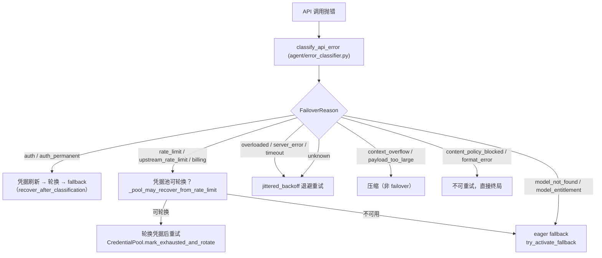
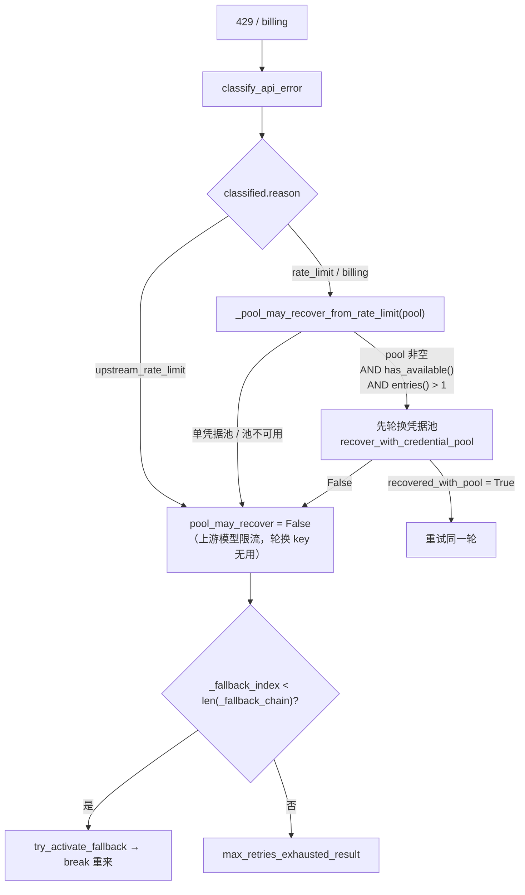

# 12 错误处理与重试机制

> 层：第四层（补齐源码逻辑与技术点）
> 状态：已按 cc0a679f14 复核
> 复核日期：2026-09-22
> 生成日期：2026-08-19
> 前置阅读：[03-详细逐步说明-主链路拆解](./03-详细逐步说明-主链路拆解.md)
> 后续阅读：[13-测试体系与质量保障](./13-测试体系与质量保障.md)

## 一、本模块目标

补齐错误处理与重试：

- 错误传播；
- 错误分类；
- 重试策略与退避；
- 超时控制；
- 降级处理（凭据轮换 → fallback 链）；
- 工具错误截断；
- 压缩失败与预检超时；
- 持久化失败处理；
- 中断与取消。

本模块只讲「一次 API 调用失败之后发生什么」。调用成功路径见
[03-详细逐步说明-主链路拆解](./03-详细逐步说明-主链路拆解.md)。

## 二、错误分类

`agent/error_classifier.py` · `class FailoverReason +0` 是分类的**唯一枚举**：每个值都直接对应一种恢复策略
（枚举值自身带注释说明策略）。分类结果装进 `agent/error_classifier.py` · `class ClassifiedError +0`
（字段含 `reason` / `status_code` / `retryable` / `is_auth` / `billing_unverified` 等），
由 `agent/error_classifier.py` · `classify_api_error +0` 产出。

`FailoverReason` 的关键取值与语义（`agent/error_classifier.py` · `class FailoverReason +0` 起的枚举体）：

| 取值 | 触发面 | 策略 |
|---|---|---|
| `auth` / `auth_permanent` | 401/403；刷新后仍失败 | 前者刷新/轮换，后者 abort |
| `billing` | 402 / 确认欠费 | 立即轮换 |
| `rate_limit` | 429 / 配额节流 | 退避 + 轮换 |
| `upstream_rate_limit` | 聚合商的**上游模型** 429（key 本身健康） | 直接 fallback，不轮换 |
| `upstream_blocked` | 供应商前面的 WAF/CDN 403 | 直接 fallback |
| `overloaded` / `server_error` / `timeout` | 503/529、500/502、连接超时 | 退避重试 |
| `context_overflow` / `payload_too_large` | 上下文超窗、413 | **压缩**，不是 failover |
| `image_too_large` / `image_corrupt` | 图片超限 / 无法解码 | 缩图 / 剥离后重试一次 |
| `model_not_found` / `model_entitlement` | 404 / 账号无该模型权限 | 换模型或轮换凭据 |
| `content_policy_blocked` | 供应商安全过滤 | 同一请求确定性失败，**不改写不重试** |
| `role_alternation` | 严格 chat template 拒绝相邻同角色 | 合并同角色消息后重试 |
| `unknown` | 无法分类 | 带退避重试 |

## 二点五、真实代码映射

| 主题 | 真实文件 | 真实符号 |
|---|---|---|
| 错误分类枚举 | `agent/error_classifier.py` | `class FailoverReason +0`、`class ClassifiedError +0`、`classify_api_error +0` |
| 错误摘要（provider → 人话） | `agent/api_error_summary.py` | `class ApiErrorSummaryMixin +0`、`ApiErrorSummaryMixin._summarize_api_error +0` |
| 权益/订阅失败识别 | `agent/api_error_summary.py` | `ApiErrorSummaryMixin._is_entitlement_failure +0`、`ApiErrorSummaryMixin._decorate_xai_entitlement_error +0` |
| 错误体脱敏与截断 | `agent/api_error_summary.py` | `ApiErrorSummaryMixin._clean_error_message +0`、`ApiErrorSummaryMixin._coerce_api_error_detail +0` |
| hook 载荷脱敏 | `agent/api_request_hooks.py` | `class ApiRequestHooksMixin +0`、`ApiRequestHooksMixin._sanitize_hook_payload +0` |
| 错误 → 前端结构体 | `agent/error_surface.py` | `build_error_surface_from_result +0`、`build_error_surface_from_exception +0` |
| 重试退避 | `agent/retry_utils.py` | `jittered_backoff +0`、`adaptive_rate_limit_backoff +0`、`parse_retry_after_seconds +0` |
| 单次尝试的恢复记账 | `agent/turn_retry_state.py` | `class TurnRetryState +0` |
| 失败后的恢复阶梯 | `agent/turn_recovery.py` | `recover_after_classification +0`、`route_classified_error +0`、`compute_error_backoff +0` |
| 凭据池轮换 | `agent/credential_pool.py` | `class CredentialPool +0`、`CredentialPool.mark_exhausted_and_rotate +0`、`CredentialPool.has_available +0` |
| 池恢复判定 | `run_agent.py` | `_pool_may_recover_from_rate_limit +0` |
| 池轮换入口 | `agent/agent_runtime_helpers.py` | `recover_with_credential_pool +0` |
| fallback 链构建 | `agent/agent_init.py` | `_fallback_entries +0`、`_init_fallback_chain +0` |
| fallback 激活 | `agent/chat_completion_helpers.py` | `try_activate_fallback +0` |
| 主运行时恢复 | `agent/agent_runtime_helpers.py` | `restore_primary_runtime +0` |
| 限流冷却与推迟切换 | `agent/fallback_cooldown.py` | `Const:_RATE_LIMIT_FAILOVER_REASONS`、`switch_deferred_by_reset +0`、`_arm_rate_limit_cooldown +0` |
| 限流/额度头解析 | `agent/rate_limit_credits.py` | `class RateLimitCreditsMixin +0`、`RateLimitCreditsMixin._capture_rate_limits +0` |
| 限流状态格式化 | `agent/rate_limit_tracker.py` | `parse_rate_limit_headers +0`、`format_rate_limit_display +0` |
| Nous 跨会话 429 熔断 | `agent/nous_rate_guard.py` | `record_nous_rate_limit +0`、`is_genuine_nous_rate_limit +0` |
| 辅助模型参数梯级重试 | `agent/auxiliary_fallback_recovery.py` | `send_with_parameter_rungs +0` |
| 工具错误截断 | `tools/registry.py` | `Const:_MAX_TOOL_ERROR_CHARS`、`_bound_error_text +0`、`_bound_json_error_result +0` |
| 压缩预检超时 | `agent/turn_context.py` | `class PreflightCompressionTimedOut +0`、`_fail_closed_after_preflight_timeout +0`、`_fail_closed_on_insufficient_progress +0` |
| 空响应守卫 | `agent/empty_response_guard.py` | `record_empty_attempt +0`、`empty_retry_budget +0`、`resolve_guard_settings +0` |
| 重复输出守卫 | `agent/repetition_guard.py` | `is_runaway_repetition +0` |
| 迭代预算 | `agent/iteration_budget.py` | `class IterationBudget +0`、`IterationBudget.consume +0`、`IterationBudget.refund +0` |
| 中断控制 | `agent/interrupt_control.py` | `class InterruptControlMixin +0`、`InterruptControlMixin.interrupt +0`、`InterruptControlMixin.hard_interrupt +0`、`InterruptControlMixin.steer +0`、`InterruptControlMixin.redirect +0` |
| 消息序列修复 | `agent/agent_runtime_helpers.py` | `repair_message_sequence_with_cursor +0` |
| 尾部脚手架清理 | `agent/session_persistence.py` | `SessionPersistenceMixin._drop_trailing_empty_response_scaffolding +0` |
| 持久化 | `agent/session_persistence.py` | `SessionPersistenceMixin._persist_session +0` |
| 增量持久化失败标志 | `agent/tool_executor.py` | `_flush_session_db_after_tool_progress +0`（置位）、`execute_tool_calls_segmented` 读位 |
| 单次 API 调用的重试循环 | `agent/conversation_loop.py` | `_run_api_retry_loop +0`、`run_conversation +0` |
| 轮次门面 | `agent/turn_facade.py` | `TurnFacadeMixin.run_conversation +0` |

## 三、配置错误

- 缺少 provider/API key；
- 模型解析失败；
- 目录不存在；
- 配置 schema 错误。

处理：

- CLI 启动前检查；
- 打印用户可读提示；
- 必要时 `sys.exit(1)`。

配置错误的判定不在本模块：`hermes_cli/main.py` · `_first_run_setup_guard +0` 负责「一个 provider 都没配」
的首次引导，`_has_any_provider_configured +0` 负责「至少一个可用」。这些是**启动期**检查，与运行时 API 错误
走不同的代码路径。

## 四、网络/LLM 错误

- 限流；
- 超时；
- 连接错误；
- 空响应；
- 截断响应；
- 无效 JSON；
- 无效 tool call。

处理：

- 重试计数器；
- fallback provider；
- 空响应恢复；
- 截断续写；
- 无效 tool call 修复/终止。

### 4.1 重试计数与上限（已核实的真实常量）

- 上限：`agent/agent_init.py` · `init_agent +0` 内 `_api_retries = max(int(_agent_section.get("api_max_retries", 3)), 1)`
  → 存进 `agent._api_max_retries`。**默认 3，最小 1**（配置键 `agent.api_max_retries`）。
- 读取点：`agent/conversation_loop.py` · `run_conversation +0` 内
  `s.retry_count, s.max_retries = 0, agent._api_max_retries`。
- 循环条件：`agent/conversation_loop.py` · `_run_api_retry_loop +0` 的 `while s.retry_count < s.max_retries`。
- 自动恢复轮数：`agent._auto_recovery_cycles`（配置键 `agent.auto_recovery_cycles`，**默认 5，0 关闭**），
  实现落在 `agent/turn_recovery_autorecover.py`，由 `agent/turn_retry_state.py` · `class TurnRetryState +0` 的
  `auto_recovery_cycles_used` 字段记账。
- 压缩尝试上限：`agent/conversation_loop.py` · `run_conversation +0` 内
  `max_compression_attempts=getattr(agent, "max_compression_attempts", 3)`。

> 勘误：上一版文档没有给出任何重试次数常量。当前源码的权威值是 **`api_max_retries` 默认 3**。

### 4.2 退避算法（`agent/retry_utils.py`）

- `jittered_backoff +0`：`min(base * 2^(attempt-1), max_delay) + uniform(0, jitter_ratio * delay)`，
  默认 `base_delay=5.0` / `max_delay=120.0` / `jitter_ratio=0.5`；`attempt` 为 1-based。
  seed 由 `time_ns ^ (counter * 0x9E3779B9)` 混合，保证多会话并发时不出现惊群。
- 调用方实际传入 `base_delay=2.0, max_delay=60.0`（`agent/turn_recovery.py` · `compute_error_backoff +0` 内）。
- `parse_retry_after_seconds +0`：解析 `Retry-After`（数值或 HTTP-date），**clamp 到 0.0**。
- `reset_delay_from_message +0`：从 provider 自由文本里抓重置窗口，正则表 `RETRY_DELAY_PATTERNS` 按序尝试
  （`quotaResetDelay` ms/s → `retry after N s` → `resets_in_seconds` 字段 → `resets in 4hr 5min`）。
- `adaptive_rate_limit_backoff +0`：对 Z.AI Coding Plan 的 GLM-5.2 过载 429（`is_zai_coding_overload_error +0`）
  前 3 次走普通退避，之后按 `_ZAI_CODING_OVERLOAD_LONG_BACKOFF = (30.0, 60.0, 90.0, 120.0)` 逐步加宽；
  `zai_coding_overload_retry_ceiling +0` 把重试上限抬到 `short_attempts + 4 + 1` 才够跑完这条阶梯。

### 4.3 一次退避的决策顺序（`compute_error_backoff +0`）

1. `Retry-After` 优先（**对任何可重试错误生效，不只 429**），上限 **600s**——注释记录了原因：
   Anthropic Tier 1 的输入 token 桶约 171s 重置，早先 120s 上限会导致提前重试并再次触发限流。
2. `Retry-After <= 0`（值为 0 或已过期的 HTTP-date）视为**缺失**，避免热循环。
3. 否则用 `jittered_backoff(retry_count, base_delay=2.0, max_delay=60.0)`。
4. 若 `is_rate_limited or is_zai_coding_overload` 且无 `Retry-After`，改用 `adaptive_rate_limit_backoff`。
5. 状态行：普通重试**缓冲**（`_buffer_diagnostic_status`），只有长等待（Z.AI long 或 `Retry-After > 60`）
   才立即 `_emit_diagnostic_status`，避免用户对着无信息 spinner 干等。

### 4.4 空响应与重复输出

- `agent/empty_response_guard.py` · `resolve_guard_settings +0` 把 `agent.empty_response_guard` 解析成
  `(enabled, threshold)`；`record_empty_attempt +0` 记录一次空完成，`empty_retry_budget +0` 给出该
  streak 的预算（**3，若单次尝试即确定性则 1**）；`deterministic_empty +0` 判断是否确定性空。
- `agent/repetition_guard.py` · `is_repetition_dominated +0` / `is_runaway_repetition +0`：
  单个 60+ 字符子串重复覆盖到一定比例即判定为失控重复。

## 五、工具错误

真实符号（**常量仍在，且比上一版描述更细**）：

- `tools/registry.py` · `Const:_MAX_TOOL_ERROR_CHARS` = **2048**；
- `tools/registry.py` · `Const:_MAX_LOGGED_ERROR_CHARS` = **8192**；
- 截断标记：`tools/registry.py` · `Const:_TOOL_ERROR_TRUNCATION_MARKER` = `"… [truncated]"`。

处理：

- `tools/registry.py` · `_bound_error_text +0`：超过 2048 才截断，截断时按 8192 写一条 DEBUG 日志
  （日志比模型看到的多）。
- `tools/registry.py` · `_bound_json_error_result +0`：**在分发边界**再兜一次——handler 直接
  `json.dumps({"error": str(exc)})` 会绕过 `tool_error` 的上限，若不拦，超大错误体会在多次重试间累积。
  它只改 JSON 的 `error` 字段，其余键原样保留。
- 工具失败作为 `tool` 消息回传模型；
- guardrails 可阻止危险工具（`agent/tool_guardrails.py`）。

> 定位更正：`_MAX_TOOL_ERROR_CHARS` 仍在 `tools/registry.py`（**未**迁出），但上一版把「截断到 2048」写成
> 唯一机制；实际是**双入口 + 双上限**（模型 2048 / 日志 8192），且新增了 JSON 兜底函数。

## 六、持久化错误

真实符号：

- `agent/session_persistence.py` · `SessionPersistenceMixin._persist_session +0`；
- `agent/tool_executor.py` · `_flush_session_db_after_tool_progress +0`：写库失败置
  `agent._incremental_persistence_failed = True`；
- 消费点：`agent/tool_executor.py` 的 `execute_tool_calls_segmented` 每段开头检查该标志并提前返回；
  `agent/turn_tool_round.py`、`agent/terminal_approval_batch.py` 同样检查；- 重置点：`agent/conversation_loop.py` · `run_conversation +0` 内 `agent._incremental_persistence_failed = False`。

处理：

- 持久化失败尽量不阻断已生成响应；
- 一轮内后续段落**快速失败**（不再逐段重试写库）；
- 下一轮重置后可恢复；
- 锁竞争、磁盘错误分类由 `hermes_state` 一族承担（见 [08-数据模型与会话存储](./08-数据模型与会话存储.md)）。

> 定位更正：上一版写 `run_agent.py:AIAgent._persist_session()`「约在 2020 行」——该符号已迁至
> `agent/session_persistence.py`；`_drop_trailing_empty_response_scaffolding` 也已迁到同一文件。

## 七、消息协议错误

- 角色交替错误；
- 孤立 tool 消息；
- 空 assistant 消息；
- 隐藏脚手架残留。

处理：

- `agent/agent_runtime_helpers.py` · `repair_message_sequence_with_cursor +0`；
- `agent/session_persistence.py` · `SessionPersistenceMixin._drop_trailing_empty_response_scaffolding +0`；
- 发送前 sanitize；
- 分类侧对应 `FailoverReason.role_alternation`（严格 chat template 拒绝相邻同角色 → 合并后重试）。

## 八、预算与中断

- `agent/iteration_budget.py` · `class IterationBudget +0`：线程安全计数，`IterationBudget.consume +0` /
  `IterationBudget.refund +0` / `used` / `remaining`。父 agent 上限是 `max_iterations`（`run_agent.py` · `AIAgent.__init__` 默认
  `sys.maxsize`），子代理是 `delegation.max_iterations`（默认 50）；`execute_code` 这类程序化工具调用
  的迭代通过 `IterationBudget.refund +0` 归还，不吃预算。
- 警告比例：`normalize_budget_warning_ratio +0`（必须是 0 与 1 之间的有限值，否则视为关闭）。
- 中断：`agent/interrupt_control.py` · `class InterruptControlMixin +0`
  - `InterruptControlMixin.interrupt +0`：请求停止，但保留 `interrupt()` ABI；
  - `InterruptControlMixin.hard_interrupt +0`：显式停止，前端可特性探测；
  - `InterruptControlMixin.clear_interrupt +0`：清中断请求与 per-thread 工具信号（`preserve_redirect` 可保留改道）；
  - `InterruptControlMixin.steer +0`：把用户文本排成独立 user 行，在当前工具批次之后投递；
  - `InterruptControlMixin.redirect +0`：在**不把当前轮变成新任务**的前提下改道当前轮。
- 中断期间的在途请求：`_ic_abort_active_request +0` 关掉已注册在途请求的 socket（cron 轮会注册）；
  `_ic_signal_tool_workers +0` 把中断位扇出到并发工具 worker 的 tid。
- 中断不改变错误语义：`agent/turn_recovery.py` · `abort_turn_on_interrupt +0` 与
  `interruptible_backoff_sleep +0`（退避等待可被中断打断，不干等到天亮）。

## 九、限流与凭据轮换（429 时的真实决策）

这是本模块最容易写错的一段。真实判定是**两级**：

判定函数（全文很短，值得背下来）：

- `run_agent.py` · `_pool_may_recover_from_rate_limit +0`：
  `return pool is not None and pool.has_available() and len(pool.entries()) > 1`。
  注释点明理由——**单凭据池只会重试同一份配额**，轮换没有意义。
- 调用点：`agent/turn_recovery.py` · `route_classified_error +0` 内（`_should_fallback` 分支）。
  其中 `_is_upstream = classified.reason == FailoverReason.upstream_rate_limit` 时**强制** `pool_may_recover = False`，
  即聚合商上游 429 一律走 fallback（注释：key 是健康的，池帮不上）。
- 轮换实现：`agent/credential_pool.py` · `CredentialPool.mark_exhausted_and_rotate +0`
  - 先 `_identify_failed_entry`；识别不到但调用方给了身份线索 → `_rotate_unmatched`；
  - **模型级失败**（`_is_model_scoped_failure`）只 bench 该模型，凭据对其他模型仍可用；
  - 否则 `_mark_exhausted`，并**把共享同一 runtime key 的所有兄弟 entry 一起标记**——否则
    `_select_unlocked()` 会继续发回那把耗尽的 key，轮换永不收敛（注释记录了约 2.5 分钟挂起）；
  - 状态为 `STATUS_DEAD` 时 WARNING，否则 INFO。
- 恢复后的回退：`agent/agent_runtime_helpers.py` · `restore_primary_runtime +0` 调用
  `_revert_credential_rotation +0`，配额 bench 解除后把长活会话挪回原凭据（否则 gateway 会话整生命周期
  都在给 fallback 付费）。

辅助机制：

- 429 只重试一次的守卫：`agent/turn_retry_state.py` · `class TurnRetryState +0` 的 `has_retried_429`；
- Nous 真账号级 429：`agent/nous_rate_guard.py` · `record_nous_rate_limit +0` 写**跨会话**状态文件，
  让所有会话一起退避；`is_genuine_nous_rate_limit +0` 排除上游 429；判定为真时
  `agent/turn_recovery.py` 会把 `retry_count` 重置为 `max(0, max_retries - 1)` 并 `continue`，
  强制让循环顶部的 Nous 守卫跑一次。
- 限流状态捕获（**只读不写**）：`agent/rate_limit_credits.py` · `RateLimitCreditsMixin._capture_rate_limits +0` 解析
  `x-ratelimit-*` 头并缓存，`RateLimitCreditsMixin._capture_credits +0` 解析 `x-nous-credits-*` 并触发阈值通知。
  这些方法从不抛异常，也不参与重试决策。

## 十、fallback 链

- 构建：`agent/agent_init.py` · `_fallback_entries +0` 把「旧式单 dict `fallback_model`」与
  「新式 list `fallback_providers`」归一化成 entry 列表（只保留同时有 `provider` 与 `model` 的 dict）。
- 装配：`agent/agent_init.py` · `_init_fallback_chain +0` 设置 `agent._fallback_chain` /
  `agent._fallback_index = 0` / `agent._fallback_activated`，并保留 `agent._fallback_model`（兼容旧调用方）。
  它**先**调用 `sync_credential_pool_entry_id(agent)`——OAuth 刷新会在失败请求被恢复前换掉 token，
  只用 key 值无法归属失败。
- 激活：`agent/chat_completion_helpers.py` · `try_activate_fallback +0`：`_fallback_index >= len(_fallback_chain)`
  即返回 False；否则取 `_fallback_chain[_fallback_index]`、`_fallback_index += 1`、置
  `_fallback_activated = True`，并做模型/客户端/压缩器/推理参数的成套切换。
- 轮级作用域：`agent/agent_runtime_helpers.py` · `restore_primary_runtime +0` 在每个**新轮开始**恢复主运行时，
  使 fallback 只作用于本轮（长活 CLI 与 gateway 的缓存 agent 都依赖这点）。它同时重置
  `_fallback_index = 0`，修掉「`try_activate_fallback()` 返回 False 却把 index 顶到链尾，导致本会话之后
  再也 fallback 不了」的问题。
- 冷却：`agent/fallback_cooldown.py` · `_arm_rate_limit_cooldown +0` 把主 provider 的冷却设到
  provider 声明的 `reset_at`；缺失/非法/过期时退回 60s → 2m → … → 4h 的指数序列。
  `switch_deferred_by_reset +0` 是可选优化（`fallback.min_switch_reset_seconds`，默认 0 = 关闭）：
  若主 provider 的限流很快就解除，切模型比等待更贵，就干脆不切。
- 辅助模型的参数梯级：`agent/auxiliary_fallback_recovery.py` · `send_with_parameter_rungs +0`。
  主辅助请求走完整恢复阶梯，而 fallback 候选**过去只给一发**，导致「fallback 模型拒绝 `temperature`
  或 `max_tokens`」就整个任务失败。该函数只在候选请求周围跑参数梯级，其他错误（auth/payment/connection）
  原样抛出给调用方。
- 无 fallback 链可用时：`agent/turn_recovery.py` · `max_retries_exhausted_result +0` 收尾。

## 十一、压缩失败与预检超时

- `agent/turn_context.py` · `class PreflightCompressionTimedOut +0`：超大轮无法安全完成预检时抛出。
- `agent/turn_context.py` · `_fail_closed_after_preflight_timeout +0`：**只在确实压不动时才停轮**。
  判定顺序：
  1. `context_compression_timed_out(agent)` 为假 → 直接返回（没超时就不管）；
  2. `request_exceeds_model_window(agent, request_tokens) is False` → 记一条 WARNING 并**照原样发送**
     （只是高于压缩阈值、但仍装得下窗口的请求不该被卡死）；
  3. 否则抛 `PreflightCompressionTimedOut`，文案指引用户跑 `/compress`。
- `agent/turn_context.py` · `_fail_closed_on_insufficient_progress +0`：补另一个洞——压缩跑完了但几乎没回收
  （或 <5%）而请求仍超窗时，旧行为是继续发、被 provider 拒、再压、UI 反复卡住。现在只要
  `request_exceeds_model_window(...) is True` 就 fail closed。
- 「有进展」的判据：`agent/turn_context.py` · `compression_made_progress +0` = `new_len < orig_len or (orig_tokens > 0 and new_tokens < orig_tokens * 0.95)`，
  即**行数变少，或 token 实质下降 >5%**（只降 5% 以内不算，否则多轮压缩会空转）。
- 压缩失败后的请求重建：`agent/conversation_loop.py` · `run_conversation +0` 内
  `max_compression_attempts` 触顶后记 `failure_reason="context_overflow", failure_retryable=False`。

## 十二、易错点与边界条件

1. **429 不是「先退避再 fallback」**。顺序是「凭据池可轮换 → 轮换重试；池不可用 → 立即 fallback」。
   单凭据池会**跳过**轮换直接 fallback（`_pool_may_recover_from_rate_limit +0` 的第三个条件
   `len(pool.entries()) > 1` 是关键）。
2. **`upstream_rate_limit` 不查池**。聚合商上游 429 一律直接 fallback，因为换 key 无用。
3. **`Retry-After` 对 5xx 也生效**，不只是 429。忽略它会把「源站故障」变成重试风暴。
4. **`Retry-After` 上限是 600s**，不是 120s（120s 会在 Anthropic Tier 1 的 171s 桶前提前重试）。
5. **`Retry-After: 0` 与已过期的 HTTP-date 都按「无此头」处理**，否则会热循环 provider。
6. **工具错误有两道闸**：`_bound_error_text +0`（模型侧 2048）与 `_bound_json_error_result +0`
   （分发边界的 JSON `error` 字段兜底）。只做前者挡不住直接 `json.dumps` 的 handler。
7. **`_incremental_persistence_failed` 是「本轮后续段落快速失败」而不是「整轮失败」**；下一轮会重置。
8. **`_fallback_index` 即使未激活也要重置**，否则一次失败的 fallback 尝试会永久封死本会话的 fallback。
9. **`restore_primary_runtime +0` 会检查主 provider 的限流冷却**（`_rate_limited_until`）与
   **权益拒绝标记**（`_is_entitlement_rejected`）：主模型被账号级拒绝时，恢复主运行时只会每轮重演失败。
10. **`compute_error_backoff +0` 的 import 是懒加载**，这样测试里 patch
    `agent.retry_utils.jittered_backoff` 才能拦到（`tests/agent` 的 conftest 有把退避归零的 fixture）。
11. **`IterationBudget.refund +0` 让 `used` 可能不单调**，任何「用 used 判断是否超预算」的外部代码
    都该用 `IterationBudget.consume +0` 的返回值，不要自己比较。
12. **中断与错误是两条正交路径**：中断不产生 `FailoverReason`，走 `abort_turn_on_interrupt +0`；
    但 `interruptible_backoff_sleep +0` 让退避等待可被中断。

## 十三、本模块结论

本模块补齐了错误分类（`FailoverReason` 全枚举）、重试计数与退避（`api_max_retries` 默认 3、
`jittered_backoff` / `adaptive_rate_limit_backoff` / 600s `Retry-After` 上限）、限流与凭据轮换的两级决策
（`_pool_may_recover_from_rate_limit` → `mark_exhausted_and_rotate` → `try_activate_fallback`）、
fallback 链的构建/激活/轮级恢复、工具错误的双上限截断、压缩预检的两种 fail-closed、持久化失败的
段落级快速失败，以及中断控制的五种操作。后续模块继续展开测试、部署和源码索引。

---

上一篇：[11-并发模型与生命周期](./11-并发模型与生命周期.md) ｜ 总目录：[./README.md](./README.md) ｜ 下一篇：[13-测试体系与质量保障](./13-测试体系与质量保障.md)
