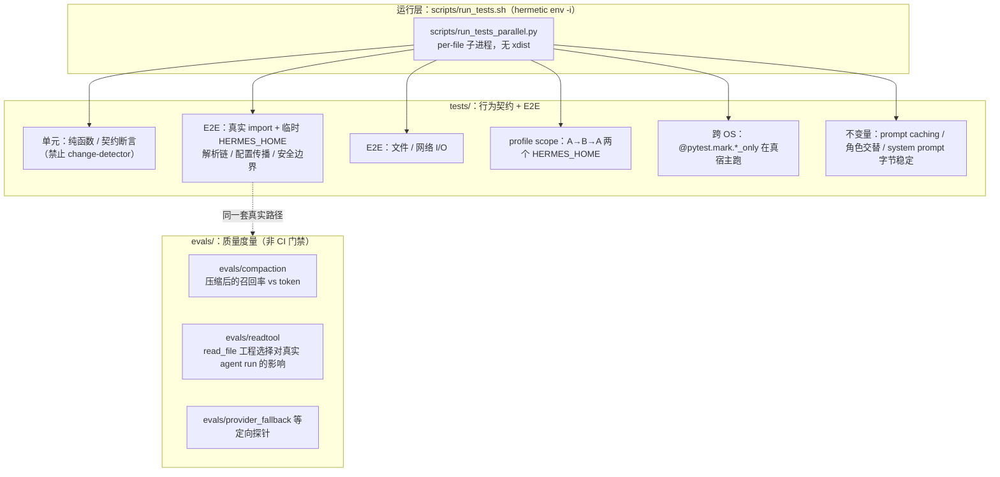

# 13 测试体系与质量保障

> 层：第四层（补齐源码逻辑与技术点）
> 状态：已按 cc0a679f14 复核
> 复核日期：2026-09-22
> 生成日期：2026-08-19
> 前置阅读：[04-核心模块与类型关系](./04-核心模块与类型关系.md)
> 后续阅读：[14-构建部署与运维](./14-构建部署与运维.md)

## 一、本模块目标

补齐测试与质量保障：

- 测试目录结构与规模；
- 测试运行方式（含 hermetic 环境与 per-file 隔离）；
- 测试设计原则（**权威来源：仓库根 `AGENTS.md`**）；
- `evals/` 评测套件与 `tests/` 的分工；
- 质量门禁（CI / lint / 类型检查 / 跨 OS 车道）。

> 本模块只做静态分析，**未运行测试套件**，因此不对「测试是否通过」作任何声明。

## 二、测试目录

`tests/` 的布局原则（`AGENTS.md` § Testing）：**目录镜像源码树**。某个模块的测试放在
`tests/<顶层源码目录>/`；只有根级模块（`batch_runner`、`utils`、`hermes_constants`、打包相关）
的测试直接放在 `tests/` 下。

实测（2026-09-22，HEAD `cc0a679f14`）：

- `tests/` 下 **33 个子目录**，根级另有 **53 个 `.py`**；
- 匹配 `test_*.py` 的文件共 **4789 个**，`tests/` 下全部 `.py` 共 **4862 个**。

按 `test_*.py` 数量排序的主要分组：

| 目录 | test_*.py | 对应源码 |
|---|---|---|
| `tests/hermes_cli/` | 1248 | `hermes_cli/`、`cli.py` |
| `tests/gateway/` | 980 | `gateway/` |
| `tests/agent/` | 913 | `agent/`、`run_agent.py` |
| `tests/tools/` | 698 | `tools/`、`model_tools.py` |
| `tests/tui_gateway/` | 204 | `tui_gateway/`、`ui-tui/` |
| `tests/plugins/` | 150 | `plugins/` |
| `tests/cron/` | 137 | `cron/` |
| `tests/hermes_state/` | 130 | `hermes_state.py` + `hermes_state_*.py` |
| `tests/scripts/` | 73 | `scripts/`（含 `tests/scripts/install/`、`tests/scripts/desktop_update/`） |
| `tests/skills/` | 54 | `skills/`、`optional-skills/` |
| `tests/acp_adapter/` | 26 | `acp_adapter/` |
| `tests/docker/` | 25 | `docker/`、`Dockerfile` |
| `tests/honcho_plugin/` | 21 | Honcho 插件 |
| `tests/providers/` | 14 | `providers/` |
| `tests/computer_use/` | 10 | `tools/computer_use/` |
| `tests/ci/` | 10 | `scripts/ci/` 自身（如 `tests/ci/test_classify_changes.py`） |
| `tests/website/` | 8 | 站点生成 |
| `tests/integration/` | 8 | 需外部服务的集成测试（默认 `-m 'not integration'` 排除） |
| `tests/conformance/` | 6 | 一致性向量 |
| `tests/monitoring/` | 5 | 监控 |
| `tests/e2e/` | 5 | 真实适配器端到端 |
| `tests/verify/` | 4 | `hermes verify` |
| `tests/secret_sources/` | 3 | `agent/secret_sources/` |
| `tests/evals/` | 2 | 评测框架自身的冒烟 |
| `tests/desktop/` | 2 | Desktop |
| `tests/security/`、`tests/perf_guards/`、`tests/openviking_plugin/`、`tests/dashboard/` | 各 1 | 安全 / 性能守卫 / 插件 / dashboard |
| `tests/manual/`、`tests/install/`、`tests/fixtures/`、`tests/fakes/` | 0 | 手工脚本、安装测试资产、fixture 与假件（**非** pytest 收集目标） |

> 勘误：上一版文档写「约 3414 个测试文件」。当前实测是 **4789 个 `test_*.py`**，且该数字随仓库变化。

## 三、运行方式

```bash
source .venv/bin/activate   # 或 source venv/bin/activate
scripts/run_tests.sh
```

`AGENTS.md` § Testing 的第一条是硬规则：**永远用 `scripts/run_tests.sh`，不要裸跑 `pytest`**。
理由写在脚本与文档里：裸 `pytest` 在设了 API key 的大机器上会导致反复的「本地过、CI 挂」事故。

### 3.1 `scripts/run_tests.sh` 实际做了什么（已逐行核对）

1. **venv 探测**：依次试 `$REPO_ROOT/.venv` → `$REPO_ROOT/venv` → `$HOME/.hermes/hermes-agent/venv`，
   并且**要求候选 venv 能 `import pytest`**，只有 `bin/activate` 而没 pytest 会被跳过并打印
   `▶ skipping venv without pytest: ...`。原因写在注释里：release venv 有 `bin/activate` 但没 pytest，
   早先「只判存在」的探测会选中它，于是每个文件都死在 `No module named pytest`，而运行器
   报「0 tests passed」，一眼看去像绿的（退出码其实是 1）。
2. **Windows venv 布局**：额外识别 `<candidate>/Scripts/activate` + `Scripts/python.exe`。
3. **Nix devShell 兜底**：没有本地 venv 时用 `HERMES_PYTHON`（同样要求能 import pytest）。
4. **hermetic 环境**：用 `env -i` 起一个空环境，只显式放行：
   - `PATH` / `HOME`；
   - Windows 定位变量 `USERPROFILE HOMEDRIVE HOMEPATH LOCALAPPDATA APPDATA SYSTEMROOT TEMP TMP`（仅在已设置时）；
   - 测试基础设施开关 `HERMES_TEST_IMAGE HERMES_TEST_WORKERS HERMES_TEST_PATHS
     HERMES_TEST_FILE_TIMEOUT HERMES_TEST_FILE_RETRIES HERMES_TEST_SLICE`；
   - `TZ=UTC LANG=C.UTF-8 LC_ALL=C.UTF-8 PYTHONHASHSEED=0 PYTHONUTF8=1`；
   - opt-in：`HERMES_RUN_SLOW_PET_TESTS`、`HERMES_E2E_BROWSER`。
   注释明确说这是**显式白名单**（不用 `HERMES_TEST_*` glob），以便「没有凭据能泄漏」这个性质一眼可审计。
5. **预编译字节码**：`compileall -q -j 0 -- $(git ls-files '*.py')`，避免约 2000 个子进程各自首次编译。
6. **入口**：`exec ... "$PYTHON" scripts/run_tests_parallel.py "$@"`。

### 3.2 `scripts/run_tests_parallel.py` 的模型

- **per-file 隔离**：每个测试文件起一个全新的 `python -m pytest <file>` 子进程，并行度默认
  `os.cpu_count()`（`-j/--jobs` 可限）。
- **不用 xdist**：xdist 的常驻 worker 会跨文件累积状态，正是要消灭的泄漏源。文档给出的量化理由：
  per-test 派生约 250ms × 17k 测试 ≈ 70 分钟纯 CPU，而 per-file 约 250ms × ~850 文件 ≈ 3.5 分钟。
- 默认不收集 `integration` / `e2e`，除非显式指定。
- **flaky 策略**（`AGENTS.md` § Testing）：失败的**文件**会在全新子进程里重试一次
  （`--file-retries`；`HERMES_TEST_FILE_RETRIES=0` 关闭）；被信号或文件超时杀掉的 worker
  **永不重试**（重启一个失控进程只会把损害翻倍）。重试通过算绿，但会以 `⚠ FLAKY` 打印两份输出——
  文档明说这是要修的 bug，不是噪音。
- 超时缩放：`scripts/run_tests_parallel.py` 的 `_effective_file_timeout` 会把文件超时放宽到其最近一次
  健康耗时的 **3 倍**（读上次运行留下的逐文件耗时表），避免被负载拉长的已知慢文件被 SIGKILL 后
  被当成 FLAKY 洗掉。
- 时间类测试约束：墙钟界限 ≥ 2s、事件驱动同步、禁止 `assert not _wait_until(...)` 这类竞态写法。

### 3.3 hermetic 与隔离 fixture（`tests/conftest.py`）

- `tests/conftest.py` · `_hermetic_environment +0`（autouse）：把 `HOME` / `HERMES_HOME` 重定向到
  per-test 临时目录，并设 `HERMES_DISABLE_LAZY_INSTALLS=1`（**禁止运行中途 pip 安装**，所以 CI 必须
  预先 `uv sync` 好所有可选 SDK）。
- `tests/conftest.py` · `_isolate_hermes_home +0`（autouse）：进一步隔离 `HERMES_HOME`。
- `AGENTS.md` 明令：**测试不得写 `~/.hermes/`**，profile 测试还要 mock `Path.home()`；
  凡 `patch.object(Path, "home", ...)` 的测试**必须同时设 `HERMES_HOME`**——代码读的是环境变量，
  不是 `Path.home()/.hermes`。
- 跨 OS 标记的唯一真源：`tests/conftest.py` · `Const:_OS_MARKS`。

### 3.4 标记与 addopts（`pyproject.toml`）

`pyproject.toml` 的 pytest 段（`[tool]` 下的 `ini_options` 表）：`testpaths = ["tests"]`，
`addopts = "-m 'not integration'"`。
已声明标记：`integration`、`real_concurrent_gate`、`real_post_swap_handoff`、`real_agent_prewarm`、
`real_retry_backoff`、`requires_wal`、`no_isolate`、`ssh`、`linux_only`、`macos_only`、`windows_only`。

后四个「opt-out」标记（`real_*` / `no_isolate`）的含义是**退出某个 autouse stub**：例如
`tests/agent` 有一条 autouse fixture 把 `jittered_backoff` 归零，需要测真实退避的用例必须标
`real_retry_backoff` 才能拿到真值。

## 三点五、真实代码映射

| 主题 | 真实文件/目录 | 真实符号/说明 |
|---|---|---|
| 测试目录 | `tests/` | 33 子目录、4789 个 `test_*.py`（实测） |
| 规范测试运行器 | `scripts/run_tests.sh` | venv 探测（要求能 import pytest）→ `env -i` hermetic → `scripts/run_tests_parallel.py` |
| 并行执行器 | `scripts/run_tests_parallel.py` | per-file 子进程，无 xdist；`_effective_file_timeout +0` |
| 全局 fixture | `tests/conftest.py` | `_hermetic_environment +0`、`_isolate_hermes_home +0` |
| 跨 OS 标记真源 | `tests/conftest.py` | `Const:_OS_MARKS` |
| pytest 配置 | `pyproject.toml` | pytest 段（`[tool]` 下的 `ini_options`）：`testpaths`、`addopts`、`markers` |
| 测试设计规范 | `AGENTS.md` | § Testing（含「Don't fake the host OS」「Don't write change-detector tests」「Never read source code in tests」） |
| 各模块测试子规范 | `agent/AGENTS.md`、`hermes_cli/AGENTS.md`、`gateway/AGENTS.md`、`tools/AGENTS.md`、`cron/AGENTS.md` 等 | `AGENTS.md` § Routing Table 列出路由 |
| 评测套件 | `evals/` | 34 子目录、214 个文件（146 `.py` / 26 `.md` / 12 `.json` / 8 `.mjs` / 3 `.ts` / 3 `.tsx` …） |
| CI 编排 | `.github/workflows/` 的 `ci` | `detect` → 条件调用子 workflow → `all-checks-pass` |
| 变更分类器 | `scripts/ci/classify_changes.py` | 把改动文件映射成 lane 布尔量 |
| Python 车道 | `.github/workflows/` 的 `tests` | 单个 96 核 runner，不切片，timeout 30min |
| 跨 OS 车道 | `.github/workflows/` 的 `tests-os` | `macos_only` → macos-latest；`windows_only` → windows-latest；**选中 0 个测试即失败** |
| lint 车道 | `.github/workflows/` 的 `lint` | ruff + ty 的 diff（advisory）+ 阻塞式 `ruff check .` |
| JS/TS 车道 | `.github/workflows/` 的 `js-tests` | vitest + tsc + eslint，Node 26，单个 32 核 runner |
| Nix 车道 | `.github/workflows/` 的 `nix` | `nix flake check`（package、devShell、`nix/checks.nix` 下 21 个 check） |
| Desktop E2E | `.github/workflows/` 的 `e2e-desktop` | Playwright（Linux），产出截图/视觉 diff 状态 |
| Windows 进程拓扑 E2E | `.github/workflows/` 的 `windows-venv-e2e` | `wine2e/**` 分支推送时跑真实进程 |
| 共享 ESLint 配置 | 仓库根 `eslint.config` 的 `.shared.mjs` 变体 | 所有 TS workspace 的 flat config 基座 |

## 四、测试设计原则

本节内容**全部来自仓库根 `AGENTS.md`**（447 行），是该仓库唯一权威的测试哲学表述。

### 4.1 行为契约优于快照（`AGENTS.md` § What we want）

> **Behavior contracts over snapshots.** Tests assert how two pieces of data relate, never
> freeze a current value (see Testing).

### 4.2 E2E 验证，而不是「绿的 unit mock」（`AGENTS.md` § What we want）

> **E2E validation, not just green unit mocks.** Anything touching resolution chains, config
> propagation, security boundaries, remote backends, or file/network I/O must exercise the
> real path with real imports against a temp `HERMES_HOME` — two of them (A→B→A) when the
> change touches profile scope. Mocks hide integration bugs.

要点：

- 触及**解析链、配置传播、安全边界、远程后端、文件/网络 I/O** 的改动，必须用**真实 import**
  在临时 `HERMES_HOME` 上跑真实路径；
- 涉及 **profile scope** 的改动要两个临时 `HERMES_HOME`（A→B→A），证明跨 profile 不串；
  `AGENTS.md` § Code Shape Rules 进一步要求「用两个 home 在 multiplex 下实测，而不是一个临时
  `HERMES_HOME`」，并给出咨询式 lint：`scripts/check_profile_scope_patterns.py`；
- 「不要在没有 E2E 验证的情况下接上死代码」——未发布代码之所以是死的通常有原因，接之前先在
  临时 `HERMES_HOME` 上用真实 import 跑通真实解析链。

### 4.3 禁止 change-detector 测试（`AGENTS.md` § Don't write change-detector tests）

> A change-detector fails whenever data *expected to change* is updated — model catalogs,
> `_config_version`, enumeration counts, hardcoded model lists.

明确**禁止**的写法（原文例子）：断言某个具体模型名存在于某 provider 的模型表、断言
`DEFAULT_CONFIG["_config_version"] == 21`、断言 `len(models) == 8`。

**应该**写的（把「快照」换成「两块数据之间的契约」）：

- 断言 provider 键存在且其模型列表**非空**（管线通）；
- 断言落盘配置的 `_config_version` **等于** `DEFAULT_CONFIG["_config_version"]`（迁移到达最新）；
- 断言两个集合**不相交**（如 moonshot 全量模型与 coding-plan-only 模型无泄漏）；
- 断言每个目录模型都有 context-length 条目（**关系**断言）。

原文的判据：**「读起来像快照就删掉；读起来像两块数据之间的契约就留下。」** 审查者会拒绝新提交的
change-detector，作者应在复审前自行改写。

### 4.4 测试里不得读源码（`AGENTS.md` § Never read source code in tests）

读 `.py`/`.ts`/`.tsx` 文件文本的测试测的是**源码形状**而非行为，被**明文禁止**：

- 实现悄悄坏掉时它照样过（正则匹配到了一个接错的调用点）；
- 正确的重构会让它挂；
- 它跑不了打包/压缩产物；
- 它阻碍结构化清理；
- 它给假信心。

正确做法是把逻辑抽成纯函数 / 可依赖注入的函数再调用（原文示例：把「隐藏 Windows 子进程窗口」的
判断抽成 `hiddenWindowsChildOptions(options, isWindows)` 纯函数后直接调用）。

原文补一句：**「如果逻辑内联在某个 god-file 里而抽取很别扭，那正是该抽取的信号，不是该用正则绕过去的信号。」**

### 4.5 不要伪造宿主 OS（`AGENTS.md` § Don't fake the host OS）

- 真正按宿主差异的行为必须在**那台宿主上**测，用 `@pytest.mark.linux_only` / `macos_only` /
  `windows_only`，**绝不 patch `sys.platform`**。
- 与宿主无关的东西不标记：把平台当**数据**传入的纯函数（如
  `hidden_windows_child_options(opts, is_windows=True)`）、声明/打包不变量（如「pyproject 用
  `sys_platform == 'win32'` 标记声明 `tzdata`」）。
- 判据：**「如果测试需要解释器相信自己在另一个 OS 上才能过，那它就该在那个 OS 上跑。」**
- **必须用标记，不能用裸 `skipif`**：`scripts/ci/list_os_marked_tests.py` 是按**标记名**grep 出文件、
  再用 `-m <marker>` 过滤的。一个 `skipif(sys.platform != "win32")` 在 Linux 上跳过、在 Windows 上
  又永不被 import——**哪里都不跑，且静默**。文件级别名（把标记赋给一个模块级变量）虽会被列出但
  `-m windows_only` 会全部 deselect，得到「零覆盖的绿」。也不要在平台 `@parametrize` 里对非宿主行
  调 `pytest.skip()`，应拆成每个 OS 一个带标记的测试。
- 一个跨多平台顺序走的测试要拆开：宿主原生那一臂留在 Linux，其余各臂做成各自带标记的测试。

### 4.6 CI lane 与测试放置的耦合（`AGENTS.md` § Testing）

- 测试放置镜像源码树；安装器/更新器脚本测试放 `tests/scripts/install/` 与
  `tests/scripts/desktop_update/`。
- 文件名里**不要**放 issue 号：把「issue 号 + 描述」式文件名改成纯描述式文件名，在模块 docstring 里
  写「Regression for #<issue>」。
- **CI lane 陷阱**：`scripts/ci/classify_changes.py` 按改动文件选 job。一个断言前端依赖清单
  （`package.json`、`package-lock.json`）、TypeScript 配置或 TypeScript / JavaScript 源文件的
  **Python** 测试**不会在纯 JS 的 PR 上跑**（PR 绿，`main` 上红——因为 push 时分类器 fail open）。
  这类测试属于 vitest 套件，不属于 `tests/*.py`。

## 五、关键测试面



## 六、`evals/` 评测套件

`evals/` 与 `tests/` 是**两种不同的东西**，容易混淆：

| | `tests/` | `evals/` |
|---|---|---|
| 目的 | 断言行为契约（对/错） | **度量质量**（更好/更差、差多少） |
| 判定 | pass / fail | 分数、token、耗时、召回率 |
| 是否 CI 门禁 | 是（`.github/workflows/` 的 `tests` 等） | **否**（需要真实 provider、花真钱） |
| 依赖 | hermetic（禁中途安装、无凭据） | 需要已配置 provider / API key |
| 输出 | pytest 结果 | `results/<label>/` 下的 JSON + `evals/compaction/report.py` 一类报告器 |

实测（2026-09-22）：`evals/` 下 **34 个子目录**、**214 个文件**
（146 `.py` / 26 `.md` / 12 `.json` / 8 `.mjs` / 3 `.ts` / 3 `.tsx` / 3 `.jsonl` / 3 `.html` / 2 `.sh` …）。
`evals/` **没有顶层 README**；每个子套件自带 README（实测 17 个目录有）。

两个有完整方法论的套件：

**`evals/compaction/`** — 度量上下文压缩在**召回率**上的代价，而不只是省了多少 token。
流程（`evals/compaction/README.md`）：

1. 读一份真实长转录（JSON `{"messages": [...]}`）；
2. 在「会被压缩掉的中段」生成一批事实性召回问题（按转录缓存，保证可复现）；
3. 用矩阵里的每个 policy 跑 `ContextCompressor.compress()`；
4. 每个 policy 只带**压缩后**上下文去回答那些问题，并与 gold 对比判分；
5. 产出 scorecard：召回准确率 vs 保留 token。

关键设计点：默认臂是 **`current+recovery`（生产路径）**——Hermes 的压缩是「摘要 + 它携带的
session_search 指针」，回答者会拿到一次对归档区的检索往返（与生产同一个 FTS5+BM25 引擎）。
裸 policy 名（`current`）是闭卷，在 needle 问题上**低 30 分以上**，只在特意要那个下限时才用。
`evals/compaction/policies.py` 里的 `"engine": "jev"` 臂绕过 `ContextCompressor` 走
`evals/compaction/jev_arm.py`。转录**不入库**（含真实会话数据），要用
`evals/compaction/scripts/reconstruct_lineage.py` 从 `state.db` 的**副本**重建；
`evals/compaction/test_region_scoping.py` 是区域划界绊线，断言 summarizer 的输入只带中段。

**`evals/readtool/`** — A/B 度量 `read_file` 的工程选择对**真实 agent run** 的影响
（`evals/readtool/README.md`）。每个任务都跑**完整 Hermes agent**（file + terminal + search toolsets）
打一个确定性的「敌对工作区」：80K 行 lockfile、单行 600KB 的 minified JS、150K 行日志里藏一个 ERROR、
空配置文件、NFD + U+202F 的 Unicode 文件名、近似文件名（`AGENTS.md` 与只差一个字母 S 的变体）、
FIFO（会阻塞朴素读）、扩展名撒谎（文本名里装 PNG 字节）等。指标：accuracy、api_turns、tool_calls、
read_file_calls、total_tokens、wall_s。交战规则：**最少 3 次重复**（单次 ±3% 内是噪音）、
跑飞时不要改 `tools/`（runner import 的是活树）、刻意用两个模型（一个前沿模型 + 一个强开源模型）。

## 七、质量门禁

**存在 CI**（实测 `.github/workflows/` 下 35 个 workflow 文件 = 34 个 `.yml` + 1 个 `.yaml`）。

### 7.1 编排（`.github/workflows/` 的 `ci`）

- 触发：`pull_request` 与 `push` 到 `main`；
- `detect` job 跑一次分类器，产出 lane 布尔量（`python` / `python_prod` / `frontend` / `site` /
  `scan` / `deps` / `uv_lock` / `npm_lock` / `installer` / `desktop_updater` / `rust` /
  `docker_meta` / `mcp_catalog` / `ci_review` …）；
- 子 workflow 通过 `workflow_call` 被条件调用，**自身不再带 `push`/`pull_request` 触发**；
- 末尾 `all-checks-pass` 聚合，使分支保护只需要求一个 check；
- 分类器在 `push`/`dispatch` 时**fail open**（所有 lane 为真），保证合并后验证不被削弱。
- 该文件顶部有安全注释：这个 workflow 会跑 PR 控制的 action/workflow/代码，**不得**在此加
  `secrets: inherit` 或 GitHub App 凭据。

### 7.2 Python 测试（`.github/workflows/` 的 `tests`）

- 单个 `ubuntu-latest-96-core` runner，**不做切片**（注释解释：切片是为 4 核 runner 存在的，
  96 核已越过「最慢单文件约 82s」的地板，再切只会多一次 setup）；
- `uv sync --locked --python 3.11 --extra all --extra dev --extra anthropic --extra mistral
  --extra fal --extra modal --extra daytona --extra hindsight --extra parallel-web`——
  因为 hermetic 环境禁中途 pip 安装，所有可选 SDK 必须预先就位；
- 恢复逐文件耗时缓存以启用超时缩放；
- 用 `scripts/run_tests.sh` 跑（per-file 隔离）。

### 7.3 跨 OS 车道（`.github/workflows/` 的 `tests-os`）

- `macos_only` → `macos-latest`；`windows_only` → `windows-latest`；
- **不切片**（被标记的集合只有数十个测试）；
- **每车道选中 0 个测试即失败**（pytest 退出码 5）——否则改个标记名或选择器写坏会报绿而实际零覆盖，
  正是该 workflow 要防的静默覆盖丢失。

### 7.4 lint 与类型检查（`.github/workflows/` 的 `lint`）

- 两个 job：`lint-diff`（ruff + ty 相对目标分支的 **diff**，advisory，永远 exit 0，把 Markdown 摘要
  写到 run 页面）与**阻塞式** `ruff check .`；
- 阻塞规则来自 `pyproject.toml` 的 `[tool.ruff.lint].select`，实测值为
  `["PLW1514", "ASYNC210", "ASYNC220", "ASYNC221", "ASYNC251"]`：
  - `PLW1514`（未指定 encoding）——Windows 上裸 `open()` 默认 cp1252 会静默损坏非 ASCII 内容；
  - `ASYNC210/220/221/251`——`async def` 里的阻塞调用会冻住整个 gateway/uvicorn 事件循环，
    注释里点了两个真实事故（17 分钟 getaddrinfo 挂起拖垮后端、`time.sleep` 冻结重启 10s）；
  - `per-file-ignores` 对 `tests/**` 全放开，对 `skills/**` / `optional-skills/**` / `plugins/**`
    只放开 `PLW1514`；
  - 其余规则**有意关闭**，注释说明是「在梳理类型检查期间」，文件里另有一段 ASYNC ratchet baseline
    （已存在的历史违规，逐个 PR 修，**禁止**往列表里加新文件）。
- 类型检查用 **ty**（`[tool.ty.environment].python-version = "3.13"`，规则 `unknown-argument = "warn"`、
  `redundant-cast = "ignore"`）。注意 CI 的测试 job 跑 **Python 3.11**，而 ty 环境声明 3.13——两者
  刻意不同，别据此推断运行时版本。

### 7.5 JS/TS（`.github/workflows/` 的 `js-tests`）

单个 `ubuntu-latest-32-core` job（替换了原先 14 腿矩阵）跑 vitest + tsc + eslint，Node 26，
用仓库根 `eslint.config` 的 `.shared.mjs` 变体作为所有 TS workspace 的 flat config 基座。

### 7.6 Nix（`.github/workflows/` 的 `nix`）

`nix flake check` 构建 flake 的每个输出：package、devShell，以及 `nix/checks.nix` 下 **21 个 check**
（模块求值、option 对齐、`.env` 组装、service argv 等）。该 workflow **自带触发**、不被编排文件调用，
原因写在文件注释里：reusable workflow 调用会让调用方 run 全程 in-progress，而 GitHub 拒绝
`gh run rerun` 一个仍在进行的 run——一个慢 advisory job 会挡住旁边所有快速必需 job 的重跑。

### 7.7 其他车道

`.github/workflows/` 下还有：`docker` 与 `docker-lint`（Docker 只在 push-to-main 与 release 构建，
**不按 PR 构建**）、`e2e-desktop`（Playwright，产出截图/视觉 diff 状态）、`windows-venv-e2e`
（`wine2e/**` 分支推送时在真实 `windows-latest` 上跑
`tests/hermes_cli/test_venv_holder_windows_live.py`，真进程、不 mock psutil）、`osv-scanner`、
`supply-chain-audit`、`install-e2e` / `install-e2e-macos-run` / `install-e2e-windows-run`、
`installer-tests`、`rust-tests`、`skills-index` / `skills-index-freshness`、`docs-site-checks`、
`js-autofix`、`case-collision-check`、`history-check`、`lockfile-diff`、`uv-lockfile-check`、
`contributor-check`、`profile-artifact-check`、`plugin-catalog-ci`、`review-labels`、
`label-rerun`、`publish-e2e-evidence`、`infographic-check`、`deploy-site`、`ci-review-comment`。

### 7.8 咨询式 lint 脚本（不进阻塞门禁，但被 `AGENTS.md` 点名）

`scripts/check_profile_scope_patterns.py`、`scripts/check_compat_pointers.py`、
`scripts/check-windows-footguns.py`、`scripts/check_subprocess_stdin.py`、
`scripts/check_no_tmp_literals.py`、`scripts/check-case-collisions.py`、`scripts/lint_diff.py`。
其中 `scripts/check_compat_pointers.py` 在 CI 里是**会失败的**（见
[14-构建部署与运维](./14-构建部署与运维.md) 的兼容清单一节）。

## 八、易错点与边界条件

1. **不要裸跑 `pytest`**。`scripts/run_tests.sh` 的 hermetic 环境与 per-file 隔离是 CI 平价的前提；
   裸跑会因为凭据/`TZ`/模块级状态泄漏产生「本地过、CI 挂」（或反过来）。
2. **venv 探测要求能 `import pytest`**，不是只看 `bin/activate`。release venv 会被跳过并打印提示。
3. **CI 的 Python 版本（3.11）与 ty 的 `python-version`（3.13）不同**，别把后者当运行时版本。
4. **`integration` 默认被排除**（`addopts = "-m 'not integration'"`）；要跑必须显式覆盖。
5. **`real_*` 标记是「退出 autouse stub」**，不是「更慢的测试」。不标就拿到被归零/被 stub 的假值。
6. **`skipif(sys.platform != ...)` 是静默零覆盖**。必须用 `tests/conftest.py` · `Const:_OS_MARKS` 里登记的
   标记名，否则 `scripts/ci/list_os_marked_tests.py` 找不到它，OS 车道也跑不到。
7. **断言前端依赖清单 / TypeScript 配置 / TS·JS 源文件的 Python 测试不会在纯 JS 的 PR 上跑**
   （分类器 lane 决定），PR 绿而 `main` 红。这类断言属于 vitest。
8. **change-detector 的判据是「读起来像不像快照」**，不是「有没有被冻结的字面量」。
   「断言模型列表长度等于 8」与「断言落盘 `_config_version` 等于默认值」的区别就是快照 vs 契约。
9. **`evals/` 不是测试**：它花钱、要 provider、不进 CI 门禁；把评测结论当回归断言用会既慢又不稳。
10. **`evals/compaction` 的转录不入库**，且必须从 `state.db` 的**副本**重建（`cp` 之后再指过去），
    不要指向活的 `state.db`。
11. **`tests/manual/` / `tests/install/` / `tests/fixtures/` / `tests/fakes/` 里没有 `test_*.py`**，
    它们不是 pytest 收集目标，统计「测试文件数」时不应把它们算进去。
12. **`tests/ci/` 是测试 CI 工具自身的**（如 `tests/ci/test_classify_changes.py`），
    与 `tests/scripts/` 分工不同：前者测 `scripts/ci/`，后者测 `scripts/`。

## 九、本模块结论

本模块补齐了测试目录结构与实测规模（33 子目录、4789 个 `test_*.py`）、规范运行器
`scripts/run_tests.sh` 的真实行为（venv 探测要求能 import pytest、`env -i` hermetic 白名单、
per-file 子进程隔离、flaky 重试策略、超时缩放）、测试设计原则（来自 `AGENTS.md` 的
「行为契约优于快照」「E2E 验证而非绿 unit mock（profile 改动用 A→B→A 两个临时 `HERMES_HOME`）」
「禁止 change-detector」「测试里不得读源码」「不得伪造宿主 OS」）、`evals/` 与 `tests/` 的分工
（含 `evals/compaction` 的召回率方法论与 `evals/readtool` 的 A/B 纪律），以及实测存在的 CI 门禁
（35 个 workflow、`ci` 编排 + lane 分类器、ruff/ty、vitest/tsc/eslint、`nix flake check`、
跨 OS 车道零选择即失败）。后续模块继续展开构建部署和源码索引。

---

上一篇：[12-错误处理与重试机制](./12-错误处理与重试机制.md) ｜ 总目录：[./README.md](./README.md) ｜ 下一篇：[14-构建部署与运维](./14-构建部署与运维.md)
