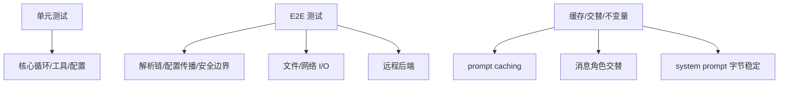

# 13 测试体系与质量保障

> 层：第四层（补齐源码逻辑与技术点）
> 状态：已复核（全部行号/符号与基准提交一致）
> 复核日期：2026-08-29
> 生成日期：2026-08-19
> 前置阅读：[04-核心模块与类型关系](./04-核心模块与类型关系.md)

## 一、本模块目标

补齐测试与质量保障：

- 测试目录结构；
- 测试运行方式；
- 测试设计原则；
- E2E 验证；
- 质量门禁。

## 二、测试目录

- 目录：`tests/`
- 规模：约 3054 个测试文件（静态统计，随仓库变化）

## 三、运行方式

```bash
source .venv/bin/activate   # 或 source venv/bin/activate
scripts/run_tests.sh
```

`scripts/run_tests.sh` 探测顺序：

1. `.venv`
2. `venv`
3. `$HOME/.hermes/hermes-agent/venv`

## 三点五、真实代码映射

| 主题 | 真实文件/目录 | 真实符号/说明 |
|---|---|---|
| 测试目录 | `tests/` | 约 3054 个测试文件（静态统计） |
| 测试运行脚本 | `scripts/run_tests.sh` | 探测 `.venv` → `venv` → `$HOME/.hermes/hermes-agent/venv` |
| 核心循环测试 | `tests/` 下 conversation/agent 相关测试 | 覆盖 `agent/conversation_loop.py` |
| 工具注册测试 | `tests/` 下 tools/registry 相关测试 | 覆盖 `tools/registry.py` |
| 会话存储测试 | `tests/` 下 hermes_state 相关测试 | 覆盖 `hermes_state.py:SessionDB` |
| 配置测试 | `tests/` 下 config 相关测试 | 覆盖 `hermes_cli/config.py` |
| 网关测试 | `tests/` 下 gateway 相关测试 | 覆盖 `gateway/run.py`、`gateway/platforms/` |
| E2E 临时环境 | 测试内使用临时 `HERMES_HOME` | 验证真实 imports 和文件/网络 I/O |

## 四、测试设计原则

- 行为契约优于快照；
- 不写 change-detector 测试；
- 对 resolution chain、config propagation、security boundary、remote backend、file/network I/O 做 E2E；
- 用真实 imports 和临时 `HERMES_HOME`；
- 不只用 green unit mocks。

## 五、关键测试面



## 六、质量门禁

- 类型检查；
- lint；
- 单元测试；
- E2E 测试；
- 行为契约断言；
- 不破坏 prompt caching；
- 不破坏消息角色交替。

## 七、本模块结论

本模块补齐了测试体系与质量保障。后续模块继续展开构建部署和源码索引。
