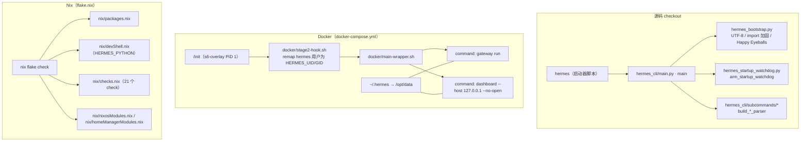

# 14 构建部署与运维

> 层：第四层（补齐源码逻辑与技术点）
> 状态：已按 cc0a679f14 复核
> 复核日期：2026-09-22
> 生成日期：2026-08-19
> 前置阅读：[04-核心模块与类型关系](./04-核心模块与类型关系.md)
> 后续阅读：[15-源码索引与覆盖矩阵](./15-源码索引与覆盖矩阵.md)

## 一、本模块目标

补齐构建部署与运维：

- 安装流程与依赖管理；
- 打包与部署形态（Docker / Nix / 源码 checkout + 启动器）；
- 启动链路与引导（`hermes` 启动器、`hermes_bootstrap.py`、启动看门狗）；
- 日志体系与自检（`hermes logs`、`hermes doctor`）；
- 更新与自愈；
- 插件兼容清单（`compat_manifest.json` / `COMPAT_MANIFEST.md`）；
- Termux / 移动端分支。

## 二、开发环境

```bash
source .venv/bin/activate   # 或 source venv/bin/activate
```

规范做法是 editable 安装（`setup.py` 的模块 docstring 明确要求）：

```bash
uv sync          # 或: uv pip install -e .
```

**不要**尝试构建 wheel/sdist：`setup.py` 把 `bdist_wheel` 与 `sdist` 两个 setuptools 命令都替换成
带守卫的子类，只要环境变量 `HERMES_NIX_BUILD != "1"` 就抛 `RuntimeError`，并打印：

> Building wheels or sdists for hermes-agent is not supported.
> Hermes is distributed via the shell installer, Docker image, or Nix.

原因写在文件里：pip/PyPI 与 Homebrew **不再是受支持的发行方式**，而 wheel 会缺少运行时才解析的
打包资产（locales、skills、optional-mcps、web_dist、tui_dist、plugin manifests）。唯一合法的
`build_wheel` 消费者是 uv2nix（它在 Nix 构建沙箱里调用 `setuptools.build_meta.build_wheel`），
由 `nix/python.nix` 给 Hermes 派生设置 `HERMES_NIX_BUILD=1`。editable 安装走 `build_editable`，
不经过 `bdist_wheel`，所以守卫不影响开发。

`setup.py` 还负责一件事：从源码树**推导** `py_modules`（列出根目录所有 `.py`，排除自身）。
注释说明原因是 `packages.find` 只看带 `__init__` 的目录，看不见 `run_agent`、`hermes_state`、
`toolsets` 这类根级单文件模块；静态清单曾经每轮目录调整就漂移，导致装出来的 wheel
`ModuleNotFoundError`。

## 二点五、真实代码映射

| 主题 | 真实文件/目录 | 真实符号/说明 |
|---|---|---|
| 启动器脚本 | `hermes` | 仅 `from hermes_cli.main import main` + `main()` |
| CLI 入口 | `hermes_cli/main.py` | `main +0`（文件 3637 行） |
| 子命令注册 | `hermes_cli/subcommands/` | 64 个 `.py`；每组建 `build_<group>_parser(subparsers, ...)` |
| 子命令实现 | `hermes_cli/main.py` | `cmd_chat +0`、`cmd_gateway +0`、`cmd_dashboard +0`、`cmd_logs +0`、`cmd_update +0`、`cmd_uninstall +0`、`cmd_model +0`、`cmd_proxy +0`、`cmd_backup +0`、`cmd_console +0`、`cmd_verify +0`、`cmd_config +0`、`cmd_completion +0` |
| 日志初始化 | `hermes_logging.py` | `setup_logging +0` |
| 日志组件前缀表 | `hermes_logging.py` | `Const:COMPONENT_PREFIXES` |
| 日志查看 | `hermes_cli/logs.py` | `Const:LOG_FILES`、`tail_log`、`list_logs` |
| 日志子命令解析 | `hermes_cli/subcommands/logs.py` | `build_logs_parser +0` |
| 自检 | `hermes_cli/doctor.py` | `run_doctor +0`（另有 `doctor_config` / `doctor_live` / `doctor_platform` / `doctor_report` / `doctor_state` / `doctor_tools` / `doctor_connectivity` 7 个兄弟模块） |
| 自检子命令 | `hermes_cli/subcommands/doctor.py` | 注册 `doctor`（help: Check configuration and dependencies） |
| 启动看门狗 | `hermes_startup_watchdog.py` | `arm_startup_watchdog +0`、`disarm_startup_watchdog +0`、`kick_startup_watchdog +0`、`report_startup_progress +0`、`get_startup_watchdog_dump_path +0`、`resolve_startup_watchdog_timeout +0`、`startup_watchdog_disabled +0` |
| 进程引导 | `hermes_bootstrap.py` | `apply_windows_utf8_bootstrap +0`、`harden_import_path +0`、`install_happy_eyeballs_socket_connect +0`、`export_scratch_tmp_env +0`、`suppress_platform_ver_console +0`、`activate_durable_lazy_target +0` |
| 打包守卫 | `setup.py` | `_GuardedBdistWheel` / `_GuardedSdist`、`_root_py_modules` |
| 依赖声明 | `pyproject.toml` | `[project]` / extras（`all`、`dev`、`termux`、`termux-all` …） |
| Termux 约束 | `constraints-termux.txt` | pip 约束文件（`-c`） |
| Docker 镜像 | `Dockerfile` | 多阶段：`sqlite_build` → `uv_source` → `node_source` → `debian:13.4` 运行时 |
| Docker 编排 | `docker-compose.yml` / `docker-compose.windows.yml` | `gateway` 与 `dashboard` 两个 service |
| 容器内脚本 | `docker/` | 6 个 `.sh`（`docker/entrypoint.sh`、`docker/entrypoint-dispatch.sh`、`docker/main-wrapper.sh`、`docker/stage2-hook.sh`、`docker/hermes-exec-shim.sh`、`docker/tini-shim.sh`）+ `docker/SOUL.md` |
| Nix | `flake.nix` / `flake.lock` / `nix/` | flake-parts；导入 `nix/packages.nix`、`overlays.nix`、`nixosModules.nix`、`homeManagerModules.nix`、`checks.nix`、`devShell.nix` |
| 发布脚本 | `scripts/release.py` | 发布流程 |
| 安装脚本 | `scripts/install.sh` / `scripts/install.ps1` / `scripts/install.cmd` | 跨平台安装器 |
| 更新实现 | `hermes_cli/update_cmd*.py` | `update_cmd` 及 9 个兄弟模块（deps / git / config / maint / stash / windows / zip / fleet / drain_report） |
| 更新契约与回执 | `hermes_cli/update_contract.py`、`hermes_cli/update_inventory.py`、`hermes_cli/update_receipt.py`、`hermes_cli/update_restart_recovery.py`、`hermes_cli/update_lock.py`、`hermes_cli/update_handoff.py`、`hermes_cli/update_abort_recovery.py`、`hermes_cli/update_serve_obligations.py` | 更新协议、资产清点、回执、重启恢复、锁、交接 |
| 启动自愈 | `hermes_cli/_early_recovery.py`、`hermes_cli/_install_repair.py`、`hermes_cli/_scan_venv_blockers.py`、`hermes_cli/_startup_fast.py`、`hermes_cli/_subprocess_compat.py` | 早期恢复、半成品安装修复、venv 阻塞扫描、fast launch、子进程兼容 |
| 进程身份 | `hermes_cli/process_identity.py` | 进程身份识别 |
| Worktree | `hermes_cli/worktree_cmd.py`、`hermes_cli/worktree_gc.py` | worktree 子命令与回收 |
| 插件兼容清单 | `compat_manifest.json`、`COMPAT_MANIFEST.md` | 见第八节 |
| 兼容清单执行 | `hermes_cli/plugin_compat.py` | `load_manifest +0`、`removal_in_effect +0`、`Const:COMPAT_REMOVAL_DATE` |
| 清单 in-tree 守卫 | `scripts/check_compat_pointers.py` | CI 中失败即违规 |
| Termux 判定 | `hermes_cli/main.py` | `_is_termux_startup_environment +0`、`_sync_bundled_skills_for_startup +0` |

## 三、安装流程

- 使用 `hermes setup` 配置 provider/API key —— `hermes_cli/subcommands/setup.py` 注册
  `setup`，可选 section：`model|tts|terminal|gateway|tools|telemetry|agent`；
- 使用 `hermes tools` 管理工具（`hermes_cli/subcommands/tools.py`，无子命令时进交互式 UI）；
- 使用 `hermes update` 更新（`hermes_cli/main.py` · `cmd_update +0`）；
- 使用 `hermes doctor` 诊断（`hermes_cli/doctor.py` · `run_doctor +0`）。

**分发渠道（按 `setup.py` 的声明）**：shell 安装器（`scripts/install.sh` / `install.ps1` /
`install.cmd`）、Docker 镜像、Nix。**不含** PyPI 与 Homebrew。

## 四、依赖管理

- Python 依赖：`pyproject.toml` + `uv.lock`（CI 用 `uv sync --locked`，锁文件与 pyproject 不一致即失败）；
- Node/TypeScript 依赖：TUI、Desktop、Web、站点各自 workspace，Node 固定 26；
- 插件依赖与技能依赖：`plugins/`、`skills/`、`optional-skills/` 各自声明；
- Termux/Android：`constraints-termux.txt` 用 `-c` 施加 pip 约束，实测内容为
  `ipython<10`、`jedi>=0.18.1,<0.20`、`parso>=0.8.4,<0.9`、`stack-data>=0.6,<0.7`、
  `pexpect>4.3,<5`、`matplotlib-inline>=0.1.7,<0.2`、`asttokens>=2.1,<3`。
  文件注释说明：**uvloop 被排除在 Termux 安装路径之外**，因为 libuv 的 `./configure` 在 Android
  上跑不起来（非 FHS 布局 + bionic libc）；uvicorn 在缺 uvloop 时自动回退 stdlib asyncio 事件循环。
  `[uvloop]` extra 被包含在 `[all]` 里，但**有意**从 `[termux]` 与 `[termux-all]` 中省略。

## 五、打包部署

### 5.1 部署形态总览



### 5.2 Docker（`Dockerfile` + `docker/` + `docker-compose.yml`）

`Dockerfile` 是多阶段构建，实测阶段名与要点：

| 阶段 | 基础镜像 | 作用 |
|---|---|---|
| `sqlite_build` | `debian:13.4` | 自己编译 SQLite 共享库 |
| `uv_source` | `ghcr.io/astral-sh/uv:0.11.6-python3.13-trixie` | 提供 `uv` |
| `node_source` | `node:26-bookworm-slim` | 提供 Node 26（Debian trixie 自带的是 20.x，2026-04 已 EOL） |
| 运行时 | `debian:13.4` | 最终镜像 |

为什么自编 SQLite：文件头注释写明 Debian 13 仍带 SQLite 3.46.1，含上游 **WAL-reset 损坏 bug**，
而 trixie 没有 backport，所以构建阶段拉 `SQLITE_AUTOCONF_VERSION=3530400`（带 SHA256 校验）自己编译，
并显式打开 FTS3/FTS4/FTS5、RTREE、GEOPOLY、COLUMN_METADATA、UNLOCK_NOTIFY、DBSTAT/DBPAGE、
MATH_FUNCTIONS、PREUPDATE_HOOK、SESSION、SECURE_DELETE、`SQLITE_THREADSAFE=1`、
`SQLITE_MAX_VARIABLE_NUMBER=250000`。

运行时环境变量：`PYTHONUNBUFFERED=1`、`PYTHONDONTWRITEBYTECODE=1`（注释：`/opt/hermes` 在已发布容器里
不可变，可写状态属于 `/opt/data`）。

`docker/` 共 **6 个 `.sh` + 1 个 `SOUL.md`**：`docker/entrypoint.sh`、`docker/entrypoint-dispatch.sh`、
`docker/main-wrapper.sh`、`docker/stage2-hook.sh`、`docker/hermes-exec-shim.sh`、`docker/tini-shim.sh`，另有
`docker/cont-init.d/` 与 `docker/s6-rc.d/` 两个子目录。镜像用 **s6-overlay** 做 PID 1 与进程监督。

`docker-compose.yml` 提供两个 service（实测）：

- `gateway`：`build: .`，`network_mode: host`，卷 `~/.hermes:/opt/data`，
  环境 `HERMES_UID` / `HERMES_GID`（默认 10000），`command: ["gateway", "run"]`；
- `dashboard`：`depends_on: gateway`，同卷，`command: ["dashboard", "--host", "127.0.0.1", "--no-open"]`。

文件顶部注释给出了三条硬约束，值得照抄：

1. 设 `HERMES_UID` / `HERMES_GID` 为宿主上拥有 `~/.hermes` 的用户，`docker/stage2-hook.sh` 用
   `usermod` / `groupmod` 重映射内部 `hermes` 用户，各受监督服务再经 `s6-setuidgid` 降权；
2. **dashboard 默认只绑 `127.0.0.1`**。它存 API key，无认证暴露到 LAN 不安全；远程访问请用 SSH 隧道
   或加认证的反向代理，**不要**传 `--insecure --host 0.0.0.0`；
3. 若覆盖 entrypoint，**必须保留 `/init` 作为链中第一个命令**（镜像默认 ENTRYPOINT 是 `/init`
   加上容器内 `/opt/hermes/docker/` 下的 `main-wrapper` 脚本，仓库内对应 `docker/main-wrapper.sh`）。
   `/init` 是 s6-overlay 的 PID 1，负责跑
   `docker/cont-init.d/` 脚本（chown、profile 对账、dashboard 开关）并搭监督树；绕过它会跳过全部初始化，
   gateway 无法正常工作。

另有 `docker-compose.windows.yml`（Windows 变体）。

### 5.3 Nix（`flake.nix`）

`flake.nix` 用 **flake-parts**，`systems = ["x86_64-linux", "aarch64-linux", "aarch64-darwin"]`，
输入含 `nixpkgs`、`flake-parts`、`pyproject-nix`、`uv2nix`、`pyproject-build-systems`、
`npm-lockfile-fix`、`home-manager`，输出由 6 个模块组成：`nix/packages.nix`、`nix/overlays.nix`、
`nix/nixosModules.nix`、`nix/homeManagerModules.nix`、`nix/checks.nix`、`nix/devShell.nix`。

`flake.nix` 的注释说明 `home-manager` 输入**只**被 `nix/checks.nix` 用来对真实的 Home Manager
模块系统求值 `homeManagerModules.default`（而不是对着 stub 求值）；消费该模块**不需要**这个输入。

CI 侧由 `.github/workflows/` 的 `nix` 车道跑 `nix flake check`（见
[13-测试体系与质量保障](./13-测试体系与质量保障.md) § 7.6）。

### 5.4 源码 checkout 的启动链路

`hermes`（仓库根的启动器脚本）全文只有 12 行：`if __name__ == "__main__": from hermes_cli.main import main; main()`。
它的 docstring 说明该包装器**应当表现得像已安装的 `hermes` 命令**，包括 `gateway`、`cron`、`doctor`
等子命令。

`hermes_cli/main.py` · `main +0` 是真正的入口（文件 3637 行）。它在 argparse 之前就做了一批
冷启动敏感的事（按文件内定义顺序）：

- `_apply_profile_override +0`：预解析 `--profile` / `-p`，**在 import 之前**设好 `HERMES_HOME`；
- `_wants_tui_early +0` / `_config_default_interface_early +0`：用最小解析决定是否走 TUI；
- `_set_process_title +0`：把 `ps` 里的 `python3.xx` 显示成 `hermes`；
- `_warn_if_unsupervised_pid1 +0`：进程是 PID 1 且上面没有回收者时告警；
- `_require_tty +0`：stdin 非终端时 exit 1（否则 curses/`input()` 提示会 100% CPU 空转）。

子命令的注册方式是**分散的**：`hermes_cli/subcommands/__init__.py` 的 docstring 说明
「每组在自己的模块里提供 `build_<group>_parser(subparsers, ...)`，由 `main()` 调用；
`cmd_*` handler 用依赖注入传入，避免任何模块 import `main`（防环）」。实测 `hermes_cli/subcommands/`
下 **64 个 `.py`**。

`hermes_bootstrap.py` 提供**进程级**引导修补，都是「在 import 潮之前装上」的类型：

- `install_happy_eyeballs_socket_connect +0`：给进程内每个同步 TCP 连接做 IPv6/IPv4 竞速（RFC 8305）；
  它还带一个 `_Urllib3ConnectionPatcher` **import hook**，因为 urllib3 有自己的串行地址遍历器；
- `apply_windows_utf8_bootstrap +0`：Windows 上的一次性 UTF-8 引导；
- `suppress_platform_ver_console +0`：在 Windows 上 stub 掉 `platform._syscmd_ver`，规避解码崩溃与控制台闪窗；
- `harden_import_path +0`：阻止当前目录里的同名包遮蔽 Hermes 模块；
- `activate_durable_lazy_target +0`：把 `HERMES_LAZY_INSTALL_TARGET` 的持久化 lazy-install 目录放进 `sys.path`；
- `export_scratch_tmp_env +0`：除非已设置，否则把 `TMPDIR`/`TMP`/`TEMP` 指向 `HERMES_HOME/cache/scratch`。

## 六、运维监控

### 6.1 日志体系（`hermes_logging.py`）

`hermes_logging.py` · `setup_logging +0` 是唯一入口，返回 `logs/` 目录路径。签名：

```python
setup_logging(*, hermes_home=None, log_level=None, max_size_mb=None,
              backup_count=None, mode=None, force=False) -> Path
```

docstring 明确：可安全多次调用，第二次除非 `force=True` 否则是 no-op；级别与轮转默认值来自
`HERMES_HOME` 下 YAML 配置的 `logging` 段；`mode="gateway"` 额外加 `gateway.log`，
`mode="gui"` 额外加 `gui.log`。

实际写盘的 4 个文件（`setup_logging +0` 内的 `handler_specs`，顺序即代码顺序）：

| 文件 | 级别 | 轮转 | mode 门控 | 组件过滤 |
|---|---|---|---|---|
| `agent.log` | `logging.INFO`（或配置/入参覆盖） | 默认 5MB × 3 | 无 | 无 |
| `errors.log` | `logging.WARNING` | 2MB × 2 | 无 | 无 |
| `gateway.log` | `logging.INFO` | 5MB × 3 | **`mode == "gateway"`** | `COMPONENT_PREFIXES["gateway"]` |
| `gui.log` | `logging.INFO` | 10MB × 5 | **`mode == "gui"`** | `COMPONENT_PREFIXES["gui"]` |

日志目录是 `HERMES_HOME/logs/`（`mkdir_under_hermes_home(home / "logs")`）。
所有 handler 用 `agent.redact.RedactingFormatter`（脱敏格式化器）。

组件 → logger 名前缀映射由 `hermes_logging.py` · `Const:COMPONENT_PREFIXES` 定义（实测）：

- `gateway` → `("gateway", "hermes_plugins", "plugins.platforms")`——注释点明
  「从 `gateway/platforms/` 迁到 bundled 插件的消息适配器仍是 gateway 组件，归 `gateway.log`」；
- `agent` → `("agent", "run_agent", "model_tools", "batch_runner")`；
- `tools` → `("tools",)`；`cli` → `("hermes_cli", "cli")`；`cron` → `("cron",)`；
- `gui` → `("hermes_cli.web_server", "hermes_cli.pty_bridge", "hermes_cli.desktop", "tui_gateway", "uvicorn")`。

多 home 路由：一个进程里出现第二个 Hermes home（dashboard / `hermes serve` 为多 profile 建 agent、
multiplex gateway）时，`_adopt_secondary_home +0` 会改成**按记录所属 home 路由**，
而不是再叠一个文件 handler——注释解释了叠 handler 会让每个 profile 的日志串到一起。

### 6.2 日志查看（`hermes logs`）

`hermes_cli/main.py` · `cmd_logs +0` → `hermes_cli/logs.py` · `tail_log` / `list_logs`。
可识别的日志名由 `hermes_cli/logs.py` · `Const:LOG_FILES` 定义（实测 6 项）：

`agent` → `agent.log`、`errors` → `errors.log`、`gateway` → `gateway.log`、`gui` → `gui.log`、
`desktop` → `desktop.log`、`mcp` → `mcp-stderr.log`。

> 注意**写入方与查看方不是同一张表**：`setup_logging +0` 只创建 `agent.log` / `errors.log` /
> `gateway.log` / `gui.log`；`desktop.log` 由 Desktop 应用侧写，`mcp-stderr.log` 是
> `tools/mcp_tool.py` 把每个 stdio MCP 子进程的 stderr 重定向过来的（注释称其为「MCP 输出通道」）。
> 查看器认得它们，`setup_logging` 不创建它们。

参数（`hermes_cli/subcommands/logs.py` · `build_logs_parser +0`）：位置参数 `log_name`
（默认 `agent`，或 `list`）、`-n/--lines`（默认 50）、`-f/--follow`、`--level`、`--session`、
`--since`（如 `1h`/`30m`/`2d`）、`--component`（`gateway`/`agent`/`tools`/`cli`/`cron`/`gui`）。

### 6.3 自检（`hermes doctor`）

存在。`hermes_cli/subcommands/doctor.py` 注册子命令 `doctor`（help: Check configuration and
dependencies），实现在 `hermes_cli/doctor.py` · `run_doctor +0`。同一族还有 7 个模块：
`doctor_config`、`doctor_connectivity`、`doctor_live`、`doctor_platform`、`doctor_report`、
`doctor_state`、`doctor_tools`。

`run_doctor +0` 内可确认的行为：

- `_check_auth_providers +0`：**刷新无关**的 OAuth 状态快照——注释明确 doctor **绝不**触发 token 刷新；
- `_check_api_connectivity +0`：对每个已配置 provider 做并行 HTTP/SDK 探测；
- `_ack_advisory +0`：`hermes doctor --ack <id>` 持久化 ack 后直接返回，不跑诊断；
- 输出行有 `check_ok` / `check_warn` / `check_fail` 三档。

另有 `hermes debug`（`hermes_cli/debug.py`）会打包 `agent.log`、`gateway.log`、`gui.log`、
`desktop.log` 各最多 512KB 用于分享。

### 6.4 启动看门狗（`hermes_startup_watchdog.py`）

模块 docstring 交代了它存在的理由：其它所有存活性兜底（loop-liveness watchdog、shutdown watchdog、
heartbeat 文件）都**假设启动已经成功**；进程若在事件循环活起来之前死锁，它们一个都触发不了
（OOF-298：约 30 小时，所有线程卡在 `futex_wait_queue`，零日志，s6 看到 PID 还活着）。

机制（实测）：

- **在进程入口 arm，在确认循环存活后 disarm**；armed 期间超时则 dump 全线程栈（`faulthandler`）、
  把退出记进生命周期账本，并 `os._exit` 一个「服务重启」退出码，让 s6/systemd 重新拉起。
- **慢但活着**的启动**不会**被杀。权威顺序：(1) 阶段自有进度租约
  （`report_startup_progress +0`）——它证明**启动路径本身**活着，对 I/O 密集阶段（schema 迁移、
  `SessionDB.__init__` 里的损坏修复）几乎零 CPU 也有效；(2) 进程级 CPU 进度，但有
  `_MAX_CPU_EXTENSIONS` 上限，避免无关线程烧 CPU 永久掩盖被挂住的启动线程。
- 已知局限：**自旋型**启动死锁会先赚满那几次受限延期才触发；实际观察到的一类是停驻线程死锁。
- 天然空闲的等待应调 `kick_startup_watchdog +0`（带重启风暴退避，上限 300s）；
  MCP 发现的 120s 等待落在 300s 默认值之内。
- 常量：`DEFAULT_STARTUP_WATCHDOG_TIMEOUT_S = 300.0`、`_MIN_TIMEOUT_S = 30.0`、
  `SERVICE_RESTART_EXIT_CODE = 75`（与 `gateway.restart` 的退出码有平价测试）。
- **配置只走环境变量**（`HERMES_STARTUP_WATCHDOG`、`HERMES_STARTUP_WATCHDOG_TIMEOUT_S`），
  因为解析 `HERMES_HOME` 下的 YAML 配置本身就在观测范围内；`startup_watchdog_disabled +0` 只认
  `0/false/no/off`（`_FALSEY`）。
- dump 路径：`get_startup_watchdog_dump_path +0` → `<HERMES_HOME>/logs/gateway-startup-watchdog.log`，
  由 `_write_dump_record +0` 追加一行 JSON 元数据记录。
- **import 轻量是正确性属性**：顶层模块、只用 stdlib；arming 必须早于 import `gateway`
  （数百个模块，import 期死锁在观测范围内），且触发时被挂住的主线程可能持有 import 锁，
  所以触发路径自己不做 import，账本写入跑在一个带超时 join 的辅助线程上。
- 实测 arm 点：`cli.py`（`from hermes_startup_watchdog import arm_startup_watchdog` 后立即调用）与
  `gateway/run.py`；`gateway/run_startup.py` 里调用 `disarm_startup_watchdog +0`。

## 七、更新与自愈

- `hermes update`（`hermes_cli/main.py` · `cmd_update +0`）：模块 docstring 说明它做了
  「hangup 保护 + update 锁」包住真正的实现（`hermes_cli/update_cmd.py` 一族）。
- 更新契约与回执：`hermes_cli/update_contract.py`、`hermes_cli/update_inventory.py`、
  `hermes_cli/update_receipt.py`；
  更新后重启恢复：`hermes_cli/update_restart_recovery.py`；中止恢复：`hermes_cli/update_abort_recovery.py`；
  串行化：`hermes_cli/update_lock.py`；交接：`hermes_cli/update_handoff.py`。
- 半成品 venv 自愈：`hermes_cli/_install_repair.py`；venv 阻塞扫描：
  `hermes_cli/_scan_venv_blockers.py`；早期恢复：`hermes_cli/_early_recovery.py`；
  启动快速路径：`hermes_cli/_startup_fast.py`。
- 过期 bytecode 清理与 Windows 旧 exe 隔离清理：属 `_early_recovery` / `update_cmd_windows`
  覆盖的范围（本模块未逐行核实其具体清理策略，**当前源码无法在本篇给出确切清理清单**）。

## 八、插件兼容清单：`compat_manifest.json` / `COMPAT_MANIFEST.md`

这是上一版文档完全没提的机制，也是本篇的**主要归属地**。配置侧的唯一切入点
（`plugins.allow_deprecated_imports`）已登记在
[07-配置体系与环境变量](./07-配置体系与环境变量.md) § 十一；插件加载语义归
[09-技能系统与插件架构](./09-技能系统与插件架构.md)。本节讲它**作为发布/兼容资产**的一面。

### 8.1 它是什么

`COMPAT_MANIFEST.md` 的第一句就是定位：

> The September 2026 decomposition (PR #102117) split the large modules of Hermes Agent into focused
> files. **Internal import paths are not a stable API**, and after that PR the names below are no
> longer defined where they used to be.

为给外部插件作者留出迁移时间，**每个名字仍可从它的旧模块 import**——实现方式是在旧模块尾部追加一段
`PLUGIN-COMPAT` 块（实测 `PLUGIN-COMPAT` 出现在 `run_agent.py`、`cli.py`、`cron/jobs.py`、
`cron/scheduler.py`、`gateway/status.py`、`agent/relay_runtime.py` 等大量模块里）。

`compat_manifest.json` 的顶层结构（实测）：`{"schema": 1, "note": "...", "entries": [...]}`，
共 **2087 条** entry，覆盖 **335 个 facade 模块** 与 **341 个 target**。每条 entry 的字段是
`facade` / `name` / `kind` / `target`。

> **勘误**：`COMPAT_MANIFEST.md` 顶部那张统计表与 `compat_manifest.json` 的**实际条目数不一致**。
> MD 表列的是 `moved 0` / `moved-lazy 1148` / `import 592` / `restored-def 290` /
> `restored-helper 41` / `restored-import 17` / `module-stub 3` / `unrestorable 34`（合计 2125，
> 且含 JSON 里并不存在的 `unrestorable` 类）；JSON 实测计数是 `moved-lazy 1146` /
> `import 592` / `restored-def 289` / `restored-helper 40` / `restored-import 17` /
> `module-stub 3`（合计 2087）。**以 JSON 为准**——它是运行时真正加载的那份。

### 8.2 三种 kind 的语义

| kind | 含义 |
|---|---|
| `moved-lazy` | 名字现在定义在新位置，从旧模块经 `__getattr__` **惰性**再导出（避免 import 环） |
| `import` | 旧模块曾经暴露的第三方/stdlib 名字，恢复其原始 import |
| `restored-def` | 因未使用而被删除的 public 名字，逐字恢复分解前的定义 |
| `restored-helper` / `restored-import` | 仅为支撑上面某个 `restored-def` 而恢复的私有 helper / import |
| `module-stub` | 整个模块被删除，留一个 stub 从替代者再导出 |

**范围**（MD 明确）：只覆盖分解前在模块顶层定义或 import 过的 **public** 名字（无前导下划线）。
私有名字（`_foo`、`_TG_NAME_LIMIT`、`_clamp_telegram_names` …）**不恢复**；测试用的 monkeypatch
接缝同样不保留。

### 8.3 时间表与运行时行为

`hermes_cli/plugin_compat.py` · `Const:COMPAT_REMOVAL_DATE` = **2026-09-14**。

| 时间 | CLI banner / `hermes doctor` / `hermes update` | Desktop | 插件 |
|---|---|---|---|
| 2026-09-14 之前 | 黄色提示，点名插件、日期与 `hermes plugins compat` | 一次性弹窗 | 能加载；每次经旧路径解析发一次 `HermesPluginCompatWarning` |
| **2026-09-14 起** | 红色提示：插件 **DISABLED** | 一次性弹窗 | **不加载**；`hermes plugins list` 显示原因 |
| revert 落地后 | 同上 | 同上 | 不加载（旧路径已不存在） |

- 判定函数：`hermes_cli/plugin_compat.py` · `removal_in_effect +0`
  = `not manifest_path().exists() or today >= COMPAT_REMOVAL_DATE`。
- **本版基准提交 `cc0a679f14`（2026-09-21）晚于该日期**，所以 `removal_in_effect +0` 现在返回真：
  命中旧路径的插件**默认被禁用**。用户侧逃生阀是 `HERMES_HOME` 下 YAML 配置里的
  `plugins.allow_deprecated_imports: true`（`hermes_cli/plugin_compat.py` ·
  `allow_deprecated_imports +0`）——代码只认字面布尔 `true`。
- 但**清单文件与 `PLUGIN-COMPAT` 块在 HEAD 里仍然存在**：该层是「按计划 revert 那个 commit」来移除的，
  而在 `cc0a679f14` 上这个 revert 还没落地。也就是说，**日期已过、路径还在、插件已被禁用**——
  三者同时成立是当前的真实状态，不要只凭日期推断文件已消失。

### 8.4 作者侧工具与 CI 守卫

- `hermes plugins compat <你的插件路径>`：打印每一处 `file:line` 与「旧路径 → 新路径」，
  只要还有残留就 **exit 1**。
- 迁移期告警可静音：`python -W ignore::hermes_cli.plugin_compat.HermesPluginCompatWarning`。
- **仓库内禁止使用这些指针**：`scripts/check_compat_pointers.py` 遍历每个第一方 Python 文件
  （源码**与**测试），命中 `from <facade> import <compat_name>`、`import <facade>` 后
  `<facade>.<compat_name>`、或 `patch("<facade>.<compat_name>")` / `monkeypatch.setattr(...)`
  就 exit 1 并列出 `file:line`。理由写在 docstring 里：这些块靠 revert 移除，若树内依赖它们，
  revert 会直接弄坏主干。

## 九、Termux / 移动端

`hermes_cli/main.py` 有专门的 Termux 分支（都在冷启动敏感路径上）：

- `_is_termux_startup_environment +0`：import-safe 的判定——`TERMUX_VERSION` 已设，
  或 `PREFIX` 含 `com.termux/files/usr`，或 `PREFIX` 以 `/data/data/com.termux/` 开头。
- `_sync_bundled_skills_for_startup +0`：同步内置技能，但在 Termux 上会**先看指纹**——
  老 Android 存储上把每个内置技能都哈希一遍安全但昂贵。指纹用
  `_termux_bundled_skills_fingerprint +0`（优先 git revision 指纹
  `_read_git_revision_fingerprint +0`，它不 spawn git，直接读 `.git/HEAD`、`.git/packed-refs`
  并处理 worktree 的 `commondir`；拿不到 git 就退回 `skills/` 目录的 mtime/size），
  戳文件是 `_termux_bundled_skills_stamp_path +0` → `<HERMES_HOME>/skills/.termux_bundled_sync_stamp`。
  这样「更新后 checkout revision 变了 → 强制一次真同步 → 之后启动跳过」。
- 逃生阀：`HERMES_TERMUX_FORCE_SKILLS_SYNC=1` 强制同步；`_termux_should_prefetch_update_check +0`
  在 Termux 上**默认不做**更新检查预取，除非 `HERMES_TERMUX_PREFETCH_UPDATES=1`。
- 依赖侧见第四节 `constraints-termux.txt`（uvloop 在 Android 上不可用）。

## 十、易错点与边界条件

1. **不要构建 wheel/sdist**。`setup.py` 会抛 `RuntimeError`，除非在 Nix 构建里且 `HERMES_NIX_BUILD=1`。
   开发用 editable（`uv sync` / `uv pip install -e .`）。
2. **`gateway.log` 与 `gui.log` 是 mode-gated**。不传 `mode="gateway"` / `mode="gui"` 时
   `setup_logging +0` **不会**创建这两个文件；`mode` 不是日志级别。
3. **`errors.log` 的级别是 `WARNING` 且轮转参数与其它文件不同**（2MB × 2），
   不要假设四个文件共用同一套轮转配置。
4. **`hermes logs` 认得的文件多于 `setup_logging` 创建的文件**（多出 `desktop.log` 与
   `mcp-stderr.log`）。找不到文件不是 bug。
5. **看门狗只走环境变量配置**（`HERMES_STARTUP_WATCHDOG` / `..._TIMEOUT_S`），
   因为读 `HERMES_HOME` 下的 YAML 配置本身在观测范围内；把这两个键写进 YAML 是无效的。
6. **看门狗不会杀「慢但活着」的启动**，但**自旋型**死锁会先耗尽受限的 CPU 延期才触发
   （模块 docstring 自陈的已知局限）。
7. **Docker 里不要绕过 `/init`**。覆盖 entrypoint 时必须保留它作为链中第一项，否则
   `cont-init.d`（chown、profile 对账、dashboard 开关）全被跳过，gateway 不能正常工作。
8. **dashboard 不要绑 `0.0.0.0`**。它存 API key，默认 `127.0.0.1`；远程请走 SSH 隧道或带认证的反代。
9. **`compat_manifest.json` 与 `COMPAT_MANIFEST.md` 的统计表不一致**，以 JSON 为准。
10. **`COMPAT_REMOVAL_DATE`（2026-09-14）已过 ≠ 兼容层已删除**。日期控制的是
    「命中旧路径的插件是否被禁用」；文件的实际移除靠 revert，本基准提交上尚未落地。
11. **裸名路径引用要补全**。实测 `cron/` 下**没有** `base` 与 `helpers` 两个模块
    （只有 `cron/scheduler.py`、`cron/jobs.py`、`cron/scheduler_provider.py` 等）；
    `gateway/platforms/base.py` 与 `gateway/platforms/helpers.py` 才是真实存在的同名模块。
    在文档里裸写不带目录的 `base` · `helpers` 会变成失效引用。
12. **`setup.py` 的 `py_modules` 是运行时从源码树推导的**，不要在 `pyproject.toml` 里另加静态
    根模块清单——注释明确说静态清单会随目录调整漂移，导致装出来的 wheel `ModuleNotFoundError`。

## 十一、本模块结论

本模块补齐了构建部署与运维：分发渠道（shell 安装器 / Docker / Nix，**不含** PyPI 与 Homebrew）与
`setup.py` 的 wheel/sdist 守卫、依赖管理（`uv.lock` 锁定 + `constraints-termux.txt` 且 uvloop 在
Android 被排除）、Docker 多阶段构建（自编修过 WAL-reset bug 的 SQLite 3530400、Node 26、s6-overlay
与 `/init` 约束）、Nix flake（flake-parts + 6 个模块 + 21 个 check）、源码 checkout 的启动链路
（`hermes` 启动器 → `hermes_cli/main.py` · `main` → `hermes_bootstrap.py` → `hermes_startup_watchdog.py`）、
日志体系（`setup_logging +0` 的 4 个写盘文件与 mode 门控、`COMPONENT_PREFIXES` 组件映射、
`hermes logs` 的 6 个可查文件）、自检（`hermes doctor` / `run_doctor +0`）、
更新与自愈模块群，以及首次系统整理的插件兼容清单机制
（`compat_manifest.json` 2087 条 / 335 facade，`COMPAT_REMOVAL_DATE` 已过但文件仍在，
`scripts/check_compat_pointers.py` 禁止树内使用）。下一篇是源码索引与覆盖矩阵。

---

上一篇：[13-测试体系与质量保障](./13-测试体系与质量保障.md) ｜ 总目录：[./README.md](./README.md) ｜ 下一篇：[15-源码索引与覆盖矩阵](./15-源码索引与覆盖矩阵.md)
