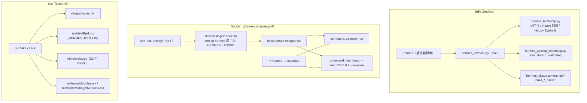
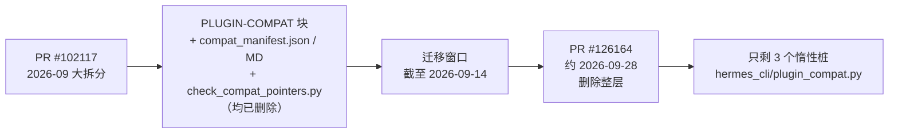

# 14 构建部署与运维

> 层：第四层（补齐源码逻辑与技术点）
> 状态：已按 e1fdf003a6 复核
> 复核日期：2026-10-05
> 生成日期：2026-08-19
> 前置阅读：[04-核心模块与类型关系](./04-核心模块与类型关系.md)
> 后续阅读：[15-源码索引与覆盖矩阵](./15-源码索引与覆盖矩阵.md)

## 一、本模块目标

补齐构建部署与运维：

- 安装流程与依赖管理；
- 打包与部署形态（Docker / Nix / 源码 checkout + 启动器）；
- 启动链路与引导（`hermes` 启动器、`hermes_bootstrap.py`、启动看门狗）；
- 日志体系与自检（`hermes logs`、`hermes doctor`）；
- 更新与自愈；
- 插件兼容层（2026-09 引入、2026-10 已按计划移除，见第八节）；
- 依赖与环境管理器 `pm/`（2026-10 新增，见第二、四节）；
- Termux / 移动端分支。

## 二、开发环境

2026-10 起，开发环境入口改为仓库根目录的 **venv 风格激活脚本**（`activate` / `activate.fish` /
`activate.ps1`），它把 `pm/` 组合出的环境（PATH + 工具变量）应用到**当前 shell**，并带保存/还原：

```bash
source ./activate          # bash / zsh（仓库根目录）
source ./activate.fish     # fish
.\activate.ps1             # PowerShell
```

- `activate` 头部注释：`deactivate` 精确撤销激活所改动的部分；`hermes` 在本 checkout 内变成一个
  shell 函数，**只在 shell 位于该 worktree 内时可用**，离开即拒绝；提示符加 worktree 名前缀。
- **脚本与其它进程不 source 它**，改走 `scripts/run-in-hermes-env`；两者共用 `scripts/_activation.sh`
  （`activate.fish` 只负责应用其输出）。
- Windows 从零克隆的入口是 `setup-hermes.ps1`：按 `pm/lock.json` 中 sha256 校验过的 uv 引导，
  再交给 `python -m pm.cli install`（PM 接管最终解释器、工具库与依赖生成），最后指向 `.\activate.ps1`。
- **依赖/环境变更归 `pm/`（Package Manager）**：`pm/AGENTS.md` 明令
  「Do not mutate Hermes environments with raw pip or uv」——用 `hermes pm lock` /
  `hermes pm install` / `hermes pm repair`（见第四节）。根 `AGENTS.md` 的 Development Environment
  段落同样只给 `source ./activate`。
- 依赖/环境管理器的架构细节由专题 `18-依赖管理与部署平台探测` 承接；本节只写操作视角。

`setup.py` 的模块 docstring 仍把 editable 安装（`build_editable`）列为开发路径，但它的 block message
现在直接指向 `source ./activate`。**不要**尝试构建 wheel/sdist：`setup.py` 把 `bdist_wheel` 与 `sdist`
两个 setuptools 命令都替换成带守卫的子类（`_GuardedBdistWheel` / `_GuardedSdist`），只要环境变量
`HERMES_NIX_BUILD != "1"` 就抛 `RuntimeError`，并打印：

> Building wheels or sdists for hermes-agent is not supported.
> Hermes is distributed via the shell installer, Docker image, or Nix.

原因写在文件里：pip/PyPI 与 Homebrew **不再是受支持的发行方式**，而 wheel 会缺少运行时才解析的
打包资产（locales、skills、optional-mcps、web_dist、tui_dist、plugin manifests）。唯一合法的
`build_wheel` 消费者是 uv2nix（它在 Nix 构建沙箱里调用 `setuptools.build_meta.build_wheel`），
由 `nix/python.nix` 给 Hermes 派生设置 `HERMES_NIX_BUILD=1`。editable 安装走 `build_editable`，
不经过 `bdist_wheel`，所以守卫不影响开发。

`setup.py` 还负责一件事：`setup.py` · `_root_py_modules +0` 从源码树**推导** `py_modules`
（列出根目录所有 `.py`，排除自身）。注释说明原因是 `packages.find` 只看带 `__init__` 的目录，
看不见 `run_agent`、`hermes_state`、`toolsets` 这类根级单文件模块；静态清单曾经每轮目录调整就漂移，
导致装出来的 wheel `ModuleNotFoundError`。

## 二点五、真实代码映射

| 主题 | 真实文件/目录 | 真实符号/说明 |
|---|---|---|
| 启动器脚本 | `hermes` | 仅 `from hermes_cli.main import main` + `main()` |
| CLI 入口 | `hermes_cli/main.py` | `main +0`（文件 3729 行；`pm` 子命令在模块导入期就转发到 `pm.cli.main`） |
| 子命令注册 | `hermes_cli/subcommands/` | 64 个 `.py`；每组建 `build_<group>_parser(subparsers, ...)` |
| 子命令实现 | `hermes_cli/main.py` | `cmd_chat +0`、`cmd_gateway +0`、`cmd_dashboard +0`、`cmd_logs +0`、`cmd_update +0`、`cmd_uninstall +0`、`cmd_model +0`、`cmd_proxy +0`、`cmd_backup +0`、`cmd_console +0`、`cmd_verify +0`、`cmd_config +0`、`cmd_completion +0` |
| 日志初始化 | `hermes_logging.py` | `setup_logging +0` |
| 日志组件前缀表 | `hermes_logging.py` | `Const:COMPONENT_PREFIXES` |
| 日志查看 | `hermes_cli/logs.py` | `Const:LOG_FILES`、`tail_log`、`list_logs` |
| 日志子命令解析 | `hermes_cli/subcommands/logs.py` | `build_logs_parser +0` |
| 自检 | `hermes_cli/doctor.py` | `run_doctor +0`（另有 `doctor_config` / `doctor_live` / `doctor_platform` / `doctor_report` / `doctor_state` / `doctor_tools` / `doctor_connectivity` 7 个兄弟模块） |
| 自检子命令 | `hermes_cli/subcommands/doctor.py` | 注册 `doctor`（help: Check configuration and dependencies） |
| 启动看门狗 | `hermes_startup_watchdog.py` | `arm_startup_watchdog +0`、`disarm_startup_watchdog +0`、`kick_startup_watchdog +0`、`report_startup_progress +0`、`get_startup_watchdog_dump_path +0`、`resolve_startup_watchdog_timeout +0`、`startup_watchdog_disabled +0` |
| 进程引导 | `hermes_bootstrap.py` | `apply_windows_utf8_bootstrap +0`、`enable_windows_vt +0`、`harden_import_path +0`、`install_happy_eyeballs_socket_connect +0`、`install_never_free_environ +0`、`export_scratch_tmp_env +0`、`suppress_platform_ver_console +0`、`class RelaunchExit +0` |
| 依赖/环境管理器 | `pm/`（55 个文件，自带 `AGENTS.md`） | `pm/cli.py` · `cmd_lock +0` / `cmd_install +0` / `cmd_repair +0`（`hermes pm`） |
| 开发环境激活 | `activate` / `activate.fish` / `activate.ps1` | venv 风格 shell 激活脚本；共用 `scripts/_activation.sh` |
| Windows 安装脚本 | `setup-hermes.ps1` | 从零克隆引导 pm 环境 |
| 机器事实与可执行查找 | `hermes_platform/`（`declaration.py` + `host/` + `resolver/`，自带 `AGENTS.md`） | 机器事实声明 + 可执行文件解析 |
| 打包守卫 | `setup.py` | `_GuardedBdistWheel` / `_GuardedSdist`、`_root_py_modules` |
| 依赖声明 | `pyproject.toml` | `[project]` / extras（`all`、`dev`、`termux`、`termux-all` …） |
| Termux 运行时库 | `pm/termux_libs.py`、`pm/termux_runtime_libs.json` | Termux 运行时库 pin 表（原 `constraints-termux.txt` 已删除，见第四节） |
| Docker 镜像 | `Dockerfile` | 多阶段：`sqlite_build` / `runtime_base` / `python_deps` / `icons` / `frontend_build` / `runtime`（uv/node 由 `pm/lock.json` 落地，**无**独立 uv/node 阶段） |
| Docker 编排 | `docker-compose.yml` / `docker-compose.windows.yml` | `gateway` 与 `dashboard` 两个 service |
| 容器内脚本 | `docker/` | 7 个 `.sh`（`docker/entrypoint.sh`、`docker/entrypoint-dispatch.sh`、`docker/main-wrapper.sh`、`docker/stage2-hook.sh`、`docker/hermes-exec-shim.sh`、`docker/tini-shim.sh`、`docker/sandbox-desktop-smoke.sh`）+ `docker/SOUL.md`，另有 `docker/build_agent.py` 与 `docker/sandbox-desktop.Dockerfile` |
| Nix | `flake.nix` / `flake.lock` / `nix/` | flake-parts；导入 `nix/packages.nix`、`overlays.nix`、`nixosModules.nix`、`homeManagerModules.nix`、`checks.nix`、`devShell.nix` |
| 发布脚本 | `scripts/release.py` | 发布流程 |
| 安装脚本 | `scripts/install.sh` / `scripts/install.ps1` / `scripts/install.cmd` | 跨平台安装器 |
| 更新实现 | `hermes_cli/update_cmd*.py` | `update_cmd` 及 14 个兄弟模块（check / common / config / drain_report / fleet / fleet_checkout / fleet_gatewayless / git / maint / stale_survivors / stash / validation / windows / zip） |
| 更新契约与回执 | `hermes_cli/update_contract.py`、`hermes_cli/update_inventory.py`、`hermes_cli/update_receipt.py`、`hermes_cli/update_restart_recovery.py`、`hermes_cli/update_lock.py`、`hermes_cli/update_handoff.py`、`hermes_cli/update_abort_recovery.py`、`hermes_cli/update_serve_obligations.py` | 更新协议、资产清点、回执、重启恢复、锁、交接 |
| 启动自愈 | `hermes_cli/_early_recovery.py`、`hermes_cli/_install_repair.py`、`hermes_cli/_scan_venv_blockers.py`、`hermes_cli/_startup_fast.py`、`hermes_cli/_subprocess_compat.py` | 早期恢复、半成品安装修复、venv 阻塞扫描、fast launch、子进程兼容 |
| 进程身份 | `hermes_cli/process_identity.py` | 进程身份识别 |
| Worktree | `hermes_cli/worktree_cmd.py`、`hermes_cli/worktree_gc.py` | worktree 子命令与回收 |
| 插件兼容层（已移除） | `hermes_cli/plugin_compat.py` | 仅剩 3 个惰性桩 `compat_report +0` / `removal_in_effect +0` / `summary_lines +0`；清单文件、守卫脚本与 CLI 子命令均已删除（见第八节） |
| Termux 判定 | `hermes_cli/main.py` | `_is_termux_startup_environment +0`、`_sync_bundled_skills_for_startup +0` |

## 三、安装流程

- 使用 `hermes setup` 配置 provider/API key —— `hermes_cli/subcommands/setup.py` 注册
  `setup`，可选 section：`model|tts|terminal|gateway|tools|telemetry|agent`；
- 使用 `hermes tools` 管理工具（`hermes_cli/subcommands/tools.py`，无子命令时进交互式 UI）；
- 使用 `hermes update` 更新（`hermes_cli/main.py` · `cmd_update +0`）；
- 使用 `hermes doctor` 诊断（`hermes_cli/doctor.py` · `run_doctor +0`）。

**分发渠道（按 `setup.py` 的声明）**：shell 安装器（`scripts/install.sh` / `install.ps1` /
`install.cmd`）、Docker 镜像、Nix。**不含** PyPI 与 Homebrew。

## 四、依赖管理

- Python 依赖：`pyproject.toml` + `uv.lock`（CI 用 `uv sync --locked`，锁文件与 pyproject 不一致即失败）；
- **Hermes 环境由 `pm/` 独占**（`pm/AGENTS.md` 的硬规则）：
  - `hermes pm lock`：无参时按 `pyproject.toml` 重锁 `uv.lock`；`--bump` 时钉一个工具到 `pm/lock.json`
    （`pm/cli.py` · `cmd_lock +0`）。改完 `pyproject.toml` 后的标准动作是
    「`hermes pm lock` → 重新 `source ./activate` → 提交 `pyproject.toml` 与 `uv.lock`」。
  - `hermes pm install`：setup/sync 声明式运行时 extras（`pm/cli.py` · `cmd_install +0`）。
  - `hermes pm repair`：修复受损依赖（`pm/cli.py` · `cmd_repair +0`）。
  - 另有 `env` / `doctor` / `gc` / `bundle` 子命令（见 `pm/cli.py` 模块 docstring）。
  - **禁止用裸 pip/uv 改 Hermes 环境**；PM 对外只交出解释器或工具路径，从不交出 uv。
- 钉版策略（`pm/AGENTS.md`）：所有依赖带上界（PyPI `>=floor,<next_major`；pre-1.0 用
  `<0.(minor+2)`）；Git URL 用 40 位 commit SHA；CI 专用 Python 需求用 `==exact`；裸 `>=X.Y.Z` 被
  CI 拒绝。
- Node/TypeScript 依赖：TUI、Desktop、Web、站点各自 workspace；Node 由 `pm/lock.json` 钉在 26
  （实测 `v26.7.0`）。
- 插件依赖与技能依赖：`plugins/`、`skills/`、`optional-skills/` 各自声明。
- Termux/Android：`constraints-termux.txt` **已删除**。**uvloop 仍被排除在 Termux 安装路径之外**，
  因为 libuv 的 `./configure` 在 Android 上跑不起来（非 FHS 布局 + bionic libc）；uvicorn 在缺 uvloop
  时自动回退 stdlib asyncio 事件循环。该策略现在写在 `pyproject.toml`：`uvloop` 用环境标记
  `sys_platform != 'android'` 门控，`[uvloop]` extra 被包含在 `[all]` 里，但**有意**从 `[termux]` 与
  `[termux-all]` 中省略。Termux 运行时库 pin 表在 `pm/termux_libs.py` / `pm/termux_runtime_libs.json`
  （用 `hermes pm update --termux [--check]` 维护）。

## 五、打包部署

### 5.1 部署形态总览


```mermaid
flowchart TD
    subgraph SRC["源码 checkout"]
        H["hermes（启动器脚本）"] --> M["hermes_cli/main.py · main"]
        M --> B["hermes_bootstrap.py<br/>UTF-8 / import 加固 / Happy Eyeballs"]
        M --> SW["hermes_startup_watchdog.py<br/>arm_startup_watchdog"]
        M --> SUB["hermes_cli/subcommands/*<br/>build_*_parser"]
    end

    subgraph DOCKER["Docker（docker-compose.yml）"]
        INIT["/init（s6-overlay PID 1）"] --> S2["docker/stage2-hook.sh<br/>remap hermes 用户为 HERMES_UID/GID"]
        S2 --> MW["docker/main-wrapper.sh"]
        MW --> GW["command: gateway run"]
        MW --> DB["command: dashboard --host 127.0.0.1 --no-open"]
        VOL["~/.hermes → /opt/data"] --- GW
        VOL --- DB
    end

    subgraph NIX["Nix（flake.nix）"]
        F["nix flake check"] --> PKG["nix/packages.nix"]
        F --> DS["nix/devShell.nix（HERMES_PYTHON）"]
        F --> CHK["nix/checks.nix（21 个 check）"]
        F --> MOD["nix/nixosModules.nix / nix/homeManagerModules.nix"]
    end
```

### 5.2 Docker（`Dockerfile` + `docker/` + `docker-compose.yml`）

`Dockerfile` 是多阶段构建，实测阶段名与要点：

| 阶段 | 基础镜像 | 作用 |
|---|---|---|
| `sqlite_build` | `debian:13.4`（多架构 digest 固定） | 自己编译 SQLite 共享库 |
| `runtime_base` | `debian:13.4`（同一 digest） | 系统包 + 用 `pm.ensure` 从 `pm/lock.json` 落地 pinned uv / node / npm / ffmpeg / ripgrep / chromium |
| `python_deps` | `runtime_base` | Python 依赖层（只复制 `pyproject.toml` + `uv.lock` 以命中缓存） |
| `icons` | `python_deps` | 图标 |
| `frontend_build` | `runtime_base` | 构建 TUI / Web 前端产物 |
| `runtime` | `python_deps` | 最终镜像（拷入 `icons` 与 `frontend_build` 的产物） |

> **已变化**：旧版文档写的独立 `uv_source`（`ghcr.io/astral-sh/uv:...`）与 `node_source`
> （`node:26-bookworm-slim`）两个阶段**已不存在**。Dockerfile 头部注释说明原因：uv 与 node 现在
> 都来自 `pm/lock.json` 的 sha 校验锁，单独的镜像 tag 会让底座在它们下面漂移（正是 pm 设计要终结的
> 「双权威」问题）。`runtime_base` 阶段用 stdlib-only 的 pm provisioner 读 `pm/lock.json`，把 pinned
> uv + 完整 Chromium 落地到 `/opt/hermes` 下的自包含 store（在 `/opt/data` 卷之外，能扛 overlay）；
> node 仍是 26（锁里实测 `v26.7.0`）。

为什么自编 SQLite：文件头注释写明 Debian 13 仍带 SQLite 3.46.1，含上游 **WAL-reset 损坏 bug**，
而 trixie 没有 backport，所以构建阶段拉 `SQLITE_AUTOCONF_VERSION=3530400`（带 SHA256 校验）自己编译，
并显式打开 FTS3/FTS4/FTS5、RTREE、GEOPOLY、COLUMN_METADATA、UNLOCK_NOTIFY、DBSTAT/DBPAGE、
MATH_FUNCTIONS、PREUPDATE_HOOK、SESSION、SECURE_DELETE、`SQLITE_THREADSAFE=1`、
`SQLITE_MAX_VARIABLE_NUMBER=250000`。

运行时环境变量：`PYTHONUNBUFFERED=1`、`PYTHONDONTWRITEBYTECODE=1`（注释：`/opt/hermes` 在已发布容器里
不可变，可写状态属于 `/opt/data`）。

`docker/` 共 **7 个 `.sh` + 1 个 `SOUL.md`**：`docker/entrypoint.sh`、`docker/entrypoint-dispatch.sh`、
`docker/main-wrapper.sh`、`docker/stage2-hook.sh`、`docker/hermes-exec-shim.sh`、`docker/tini-shim.sh`、
`docker/sandbox-desktop-smoke.sh`，另有 `docker/cont-init.d/` 与 `docker/s6-rc.d/` 两个子目录，
以及 `docker/build_agent.py`、`docker/sandbox-desktop.Dockerfile`。镜像用 **s6-overlay** 做 PID 1 与进程监督。

`docker-compose.yml` 提供两个 service（实测）：

- `gateway`：`build: .`，`network_mode: host`，卷 `~/.hermes:/opt/data`，
  环境 `HERMES_UID` / `HERMES_GID`（默认 10000），`command: ["gateway", "run"]`；
- `dashboard`：`depends_on: gateway`，同卷，`command: ["dashboard", "--host", "127.0.0.1", "--no-open"]`。

文件顶部注释给出了三条硬约束，值得照抄：

1. 设 `HERMES_UID` / `HERMES_GID` 为宿主上拥有 `~/.hermes` 的用户，`docker/stage2-hook.sh` 用
   `usermod` / `groupmod` 重映射内部 `hermes` 用户，各受监督服务再经 `s6-setuidgid` 降权；
2. **dashboard 默认只绑 `127.0.0.1`**。它存 API key，无认证暴露到 LAN 不安全；远程访问请用 SSH 隧道
   或加认证的反向代理，**不要**传 `--insecure --host 0.0.0.0`；
3. 若覆盖 entrypoint，**必须保留 `/init` 作为链中第一个命令**（镜像默认 ENTRYPOINT 是 `/init`
   加上容器内 `/opt/hermes/docker/` 下的 `main-wrapper` 脚本，仓库内对应 `docker/main-wrapper.sh`）。
   `/init` 是 s6-overlay 的 PID 1，负责跑
   `docker/cont-init.d/` 脚本（chown、profile 对账、dashboard 开关）并搭监督树；绕过它会跳过全部初始化，
   gateway 无法正常工作。

另有 `docker-compose.windows.yml`（Windows 变体）。

### 5.3 Nix（`flake.nix`）

`flake.nix` 用 **flake-parts**，`systems = ["x86_64-linux", "aarch64-linux", "aarch64-darwin"]`，
输入含 `nixpkgs`、`flake-parts`、`pyproject-nix`、`uv2nix`、`pyproject-build-systems`、
`npm-lockfile-fix`、`home-manager`，输出由 6 个模块组成：`nix/packages.nix`、`nix/overlays.nix`、
`nix/nixosModules.nix`、`nix/homeManagerModules.nix`、`nix/checks.nix`、`nix/devShell.nix`。

`flake.nix` 的注释说明 `home-manager` 输入**只**被 `nix/checks.nix` 用来对真实的 Home Manager
模块系统求值 `homeManagerModules.default`（而不是对着 stub 求值）；消费该模块**不需要**这个输入。

CI 侧由 `.github/workflows/` 的 `nix` 车道跑 `nix flake check`（见
[13-测试体系与质量保障](./13-测试体系与质量保障.md) § 7.6）。

### 5.4 源码 checkout 的启动链路

`hermes`（仓库根的启动器脚本）全文只有 12 行：`if __name__ == "__main__": from hermes_cli.main import main; main()`。
它的 docstring 说明该包装器**应当表现得像已安装的 `hermes` 命令**，包括 `gateway`、`cron`、`doctor`
等子命令。

`hermes_cli/main.py` · `main +0` 是真正的入口（文件 3729 行）。它在 argparse 之前就做了一批
冷启动敏感的事（按文件内定义顺序）：

- `_apply_profile_override +0`：预解析 `--profile` / `-p`，**在 import 之前**设好 `HERMES_HOME`；
- `_wants_tui_early +0` / `_config_default_interface_early +0`：用最小解析决定是否走 TUI；
- `_set_process_title +0`：把 `ps` 里的 `python3.xx` 显示成 `hermes`；
- `_warn_if_unsupervised_pid1 +0`：进程是 PID 1 且上面没有回收者时告警；
- `_require_tty +0`：stdin 非终端时 exit 1（否则 curses/`input()` 提示会 100% CPU 空转）。

模块导入期还有一条早退分支：`if sys.argv[1:2] == ["pm"]: from pm.cli import main as _pm_main;
raise SystemExit(_pm_main(sys.argv[2:]))`——`hermes pm ...` 在 profile 解析之后、**应用依赖 import 之前**
就被转发给 PM（源码注释：PM runs after profile resolution but before application dependency imports）。

子命令的注册方式是**分散的**：`hermes_cli/subcommands/__init__.py` 的 docstring 说明
「每组在自己的模块里提供 `build_<group>_parser(subparsers, ...)`，由 `main()` 调用；
`cmd_*` handler 用依赖注入传入，避免任何模块 import `main`（防环）」。实测 `hermes_cli/subcommands/`
下 **64 个 `.py`**。

`hermes_bootstrap.py` 提供**进程级**引导修补，都是「在 import 潮之前装上」的类型：

- `install_happy_eyeballs_socket_connect +0`：给进程内每个同步 TCP 连接做 IPv6/IPv4 竞速（RFC 8305）；
  它还带一个 `_Urllib3ConnectionPatcher` **import hook**，因为 urllib3 有自己的串行地址遍历器；
- `apply_windows_utf8_bootstrap +0`：Windows 上的一次性 UTF-8 引导；
- `enable_windows_vt +0`：让 stdout/stderr 背后的控制台开启 ANSI 转义处理；
- `suppress_platform_ver_console +0`：在 Windows 上 stub 掉 `platform._syscmd_ver`，规避解码崩溃与控制台闪窗；
- `install_never_free_environ +0`：让 `os.environ` 的写入对其它线程里的原生 `getenv` 安全
  （glibc < 2.41 的 `setenv` 对新名字会 realloc `environ`）；
- `harden_import_path +0`：阻止当前目录里的同名包遮蔽 Hermes 模块；
- `export_scratch_tmp_env +0`：除非已设置，否则把 `TMPDIR`/`TMP`/`TEMP` 指向 `HERMES_HOME/cache/scratch`；
- `class RelaunchExit +0`：携带被重启子进程退出码的异常类型。

> **已变化**：旧版列出的 `activate_durable_lazy_target +0`（把 `HERMES_LAZY_INSTALL_TARGET` 的
> 持久化 lazy-install 目录放进 `sys.path`）在当前源码中**已不存在**——`hermes_bootstrap.py` 与全仓
> 都搜不到该符号与 `HERMES_LAZY_INSTALL_TARGET` 环境变量。

### 5.5 2026-10 新增的构建/部署入口与规模快照

本轮（`cc0a679f14` → `e1fdf003a6`）新增、且与构建/部署直接相关的入口（只列操作视角）：

| 新增 | 内容 | 说明 |
|---|---|---|
| `pm/` | 依赖/环境管理器（55 个文件，自带 `AGENTS.md`） | `hermes pm lock` / `install` / `repair`（`pm/cli.py` · `cmd_lock +0` / `cmd_install +0` / `cmd_repair +0`）；**禁止用裸 pip/uv 改 Hermes 环境** |
| `hermes_platform/` | `declaration.py` + `host/` + `resolver/`，自带 `AGENTS.md` | 机器事实声明 + 可执行文件查找 |
| `activate` / `activate.fish` / `activate.ps1` | venv 风格 shell 激活脚本 | 开发环境入口，见第二节；共用 `scripts/_activation.sh` |
| `setup-hermes.ps1` | Windows 安装脚本 | 从零克隆引导 pm 环境，见第二节 |
| `hermes_yaml.py`、`hermes_constants_scratch.py` | 新的根级模块 | 本模块未逐行核实其职责，**当前源码无法在本篇给出确切说明** |
| `registration_lifecycle.py`、`toolset_distributions.py`、`trajectory_compressor.py`、`mini_swe_runner.py` | 根级模块 | 不属于本篇范围；此处仅登记其存在 |

根级 `hermes_state_*.py` 兄弟模块由 **28 → 32**：新增 `hermes_state_coverage.py`、
`hermes_state_health.py`、`hermes_state_identity.py`、`hermes_state_pidns.py`（两次基准间只增不减）。

**规模快照**（`cc0a679f14` 2026-09-21 → `e1fdf003a6` 2026-10-05，供其它篇目替换旧数字）：

| 模块 | 2026-09-21 | 2026-10-05 |
|---|---|---|
| 根级 `*.py` | 46 | **52** |
| `hermes_state_*.py` | 28 | **32** |
| `agent/` | 301 | **317** |
| `hermes_cli/` | 536 | **644** |
| `gateway/` | 169 | **177** |
| `tools/` | 316 | **339** |
| `cron/` | 31 | **36** |
| `tui_gateway/` | 91 | **101** |
| `acp_adapter/` | 14 | **14** |
| `plugins/` | 245 | **225**（唯一收缩） |
| `apps/`（ts/tsx） | 2789 | **3453** |
| `ui-tui/`（ts/tsx） | 484 | **522** |
| `web/`（ts/tsx） | 186 | **195** |

> 依赖/环境管理器的架构细节由专题 `18-依赖管理与部署平台探测` 承接；本节只给操作视角与规模事实。

## 六、运维监控

### 6.1 日志体系（`hermes_logging.py`）

`hermes_logging.py` · `setup_logging +0` 是唯一入口，返回 `logs/` 目录路径。签名：

```python
setup_logging(*, hermes_home=None, log_level=None, max_size_mb=None,
              backup_count=None, mode=None, force=False) -> Path
```

docstring 明确：可安全多次调用，第二次除非 `force=True` 否则是 no-op；级别与轮转默认值来自
`HERMES_HOME` 下 YAML 配置的 `logging` 段；`mode="gateway"` 额外加 `gateway.log`，
`mode="gui"` 额外加 `gui.log`。

实际写盘的 4 个文件（`setup_logging +0` 内的 `handler_specs`，顺序即代码顺序）：

| 文件 | 级别 | 轮转 | mode 门控 | 组件过滤 |
|---|---|---|---|---|
| `agent.log` | `logging.INFO`（或配置/入参覆盖） | 默认 5MB × 3 | 无 | 无 |
| `errors.log` | `logging.WARNING` | 2MB × 2 | 无 | 无 |
| `gateway.log` | `logging.INFO` | 5MB × 3 | **`mode == "gateway"`** | `COMPONENT_PREFIXES["gateway"]` |
| `gui.log` | `logging.INFO` | 10MB × 5 | **`mode == "gui"`** | `COMPONENT_PREFIXES["gui"]` |

日志目录是 `HERMES_HOME/logs/`（`mkdir_under_hermes_home(home / "logs")`）。
所有 handler 用 `agent.redact.RedactingFormatter`（脱敏格式化器）。

组件 → logger 名前缀映射由 `hermes_logging.py` · `Const:COMPONENT_PREFIXES` 定义（实测）：

- `gateway` → `("gateway", "hermes_plugins", "plugins.platforms")`——注释点明
  「从 `gateway/platforms/` 迁到 bundled 插件的消息适配器仍是 gateway 组件，归 `gateway.log`」；
- `agent` → `("agent", "run_agent", "model_tools", "batch_runner")`；
- `tools` → `("tools",)`；`cli` → `("hermes_cli", "cli")`；`cron` → `("cron",)`；
- `gui` → `("hermes_cli.web_server", "hermes_cli.pty_bridge", "hermes_cli.desktop", "tui_gateway", "uvicorn")`。

多 home 路由：一个进程里出现第二个 Hermes home（dashboard / `hermes serve` 为多 profile 建 agent、
multiplex gateway）时，`_adopt_secondary_home +0` 会改成**按记录所属 home 路由**，
而不是再叠一个文件 handler——注释解释了叠 handler 会让每个 profile 的日志串到一起。

### 6.2 日志查看（`hermes logs`）

`hermes_cli/main.py` · `cmd_logs +0` → `hermes_cli/logs.py` · `tail_log` / `list_logs`。
可识别的日志名由 `hermes_cli/logs.py` · `Const:LOG_FILES` 定义（实测 8 项）：

`agent` → `agent.log`、`errors` → `errors.log`、`gateway` → `gateway.log`、`gui` → `gui.log`、
`desktop` → `desktop.log`、`update` → `update.log`、`handoff` → `desktop-update-handoff.log`、
`mcp` → `mcp-stderr.log`。

> 注意**写入方与查看方不是同一张表**：`setup_logging +0` 只创建 `agent.log` / `errors.log` /
> `gateway.log` / `gui.log`；`desktop.log` 由 Desktop 应用侧写；`update.log` 是
> `hermes_cli/main_dashboard.py` · `_UpdateOutputStream` 写出的 `hermes update` 全程 stdout/stderr
> 镜像（跨运行 append）；`desktop-update-handoff.log` 是 Desktop 驱动更新的交接日志
> （`scripts/desktop-update/windows.ps1` / `scripts/desktop-update/posix.sh`）；`mcp-stderr.log` 是
> `tools/mcp_tool.py` 把每个 stdio MCP 子进程的 stderr 重定向过来的（注释称其为「MCP 输出通道」）。
> 查看器认得它们，`setup_logging` 不创建它们。

参数（`hermes_cli/subcommands/logs.py` · `build_logs_parser +0`）：位置参数 `log_name`
（默认 `agent`，或 `list`）、`-n/--lines`（默认 50）、`-f/--follow`、`--level`、`--session`、
`--since`（如 `1h`/`30m`/`2d`）、`--component`（`gateway`/`agent`/`tools`/`cli`/`cron`/`gui`）。

### 6.3 自检（`hermes doctor`）

存在。`hermes_cli/subcommands/doctor.py` 注册子命令 `doctor`（help: Check configuration and
dependencies），实现在 `hermes_cli/doctor.py` · `run_doctor +0`。同一族还有 7 个模块：
`doctor_config`、`doctor_connectivity`、`doctor_live`、`doctor_platform`、`doctor_report`、
`doctor_state`、`doctor_tools`。

`run_doctor +0` 内可确认的行为：

- `_check_auth_providers +0`：**刷新无关**的 OAuth 状态快照——注释明确 doctor **绝不**触发 token 刷新；
- `_check_api_connectivity +0`：对每个已配置 provider 做并行 HTTP/SDK 探测；
- `_ack_advisory +0`：`hermes doctor --ack <id>` 持久化 ack 后直接返回，不跑诊断；
- 输出行有 `check_ok` / `check_warn` / `check_fail` 三档。

另有 `hermes debug`（`hermes_cli/debug.py`）会打包 `agent.log`、`gateway.log`、`gui.log`、
`desktop.log` 各最多 512KB 用于分享。

### 6.4 启动看门狗（`hermes_startup_watchdog.py`）

模块 docstring 交代了它存在的理由：其它所有存活性兜底（loop-liveness watchdog、shutdown watchdog、
heartbeat 文件）都**假设启动已经成功**；进程若在事件循环活起来之前死锁，它们一个都触发不了
（OOF-298：约 30 小时，所有线程卡在 `futex_wait_queue`，零日志，s6 看到 PID 还活着）。

机制（实测）：

- **在进程入口 arm，在确认循环存活后 disarm**；armed 期间超时则 dump 全线程栈（`faulthandler`）、
  把退出记进生命周期账本，并 `os._exit` 一个「服务重启」退出码，让 s6/systemd 重新拉起。
- **慢但活着**的启动**不会**被杀。权威顺序：(1) 阶段自有进度租约
  （`report_startup_progress +0`）——它证明**启动路径本身**活着，对 I/O 密集阶段（schema 迁移、
  `SessionDB.__init__` 里的损坏修复）几乎零 CPU 也有效；(2) 进程级 CPU 进度，但有
  `_MAX_CPU_EXTENSIONS` 上限，避免无关线程烧 CPU 永久掩盖被挂住的启动线程。
- 已知局限：**自旋型**启动死锁会先赚满那几次受限延期才触发；实际观察到的一类是停驻线程死锁。
- 天然空闲的等待应调 `kick_startup_watchdog +0`（带重启风暴退避，上限 300s）；
  MCP 发现的 120s 等待落在 300s 默认值之内。
- 常量：`DEFAULT_STARTUP_WATCHDOG_TIMEOUT_S = 300.0`、`_MIN_TIMEOUT_S = 30.0`、
  `SERVICE_RESTART_EXIT_CODE = 75`（与 `gateway.restart` 的退出码有平价测试）。
- **配置只走环境变量**（`HERMES_STARTUP_WATCHDOG`、`HERMES_STARTUP_WATCHDOG_TIMEOUT_S`），
  因为解析 `HERMES_HOME` 下的 YAML 配置本身就在观测范围内；`startup_watchdog_disabled +0` 只认
  `0/false/no/off`（`_FALSEY`）。
- dump 路径：`get_startup_watchdog_dump_path +0` → `<HERMES_HOME>/logs/gateway-startup-watchdog.log`，
  由 `_write_dump_record +0` 追加一行 JSON 元数据记录。
- **import 轻量是正确性属性**：顶层模块、只用 stdlib；arming 必须早于 import `gateway`
  （数百个模块，import 期死锁在观测范围内），且触发时被挂住的主线程可能持有 import 锁，
  所以触发路径自己不做 import，账本写入跑在一个带超时 join 的辅助线程上。
- 实测 arm 点：`cli.py`（`from hermes_startup_watchdog import arm_startup_watchdog` 后立即调用）与
  `gateway/run.py`；`gateway/run_startup.py` 里调用 `disarm_startup_watchdog +0`。

## 七、更新与自愈

- `hermes update`（`hermes_cli/main.py` · `cmd_update +0`）：模块 docstring 说明它做了
  「hangup 保护 + update 锁」包住真正的实现（`hermes_cli/update_cmd.py` 一族）。
- 更新契约与回执：`hermes_cli/update_contract.py`、`hermes_cli/update_inventory.py`、
  `hermes_cli/update_receipt.py`；
  更新后重启恢复：`hermes_cli/update_restart_recovery.py`；中止恢复：`hermes_cli/update_abort_recovery.py`；
  串行化：`hermes_cli/update_lock.py`；交接：`hermes_cli/update_handoff.py`。
- 半成品 venv 自愈：`hermes_cli/_install_repair.py`；venv 阻塞扫描：
  `hermes_cli/_scan_venv_blockers.py`；早期恢复：`hermes_cli/_early_recovery.py`；
  启动快速路径：`hermes_cli/_startup_fast.py`。
- 过期 bytecode 清理与 Windows 旧 exe 隔离清理：属 `_early_recovery` / `update_cmd_windows`
  覆盖的范围（本模块未逐行核实其具体清理策略，**当前源码无法在本篇给出确切清理清单**）。

## 八、插件兼容层：已按计划移除

本节讲 Hermes 的**插件兼容层**（2026-09 随 PR #102117 大拆分引入，2026-10 随 PR #126164 移除）
**作为发布/兼容资产**的一面。插件加载语义归
[09-技能系统与插件架构](./09-技能系统与插件架构.md)；配置侧的 `plugins.allow_deprecated_imports`
逃生口**已随本层一起删除**，见 [07-配置体系与环境变量](./07-配置体系与环境变量.md) § 十一。

### 8.1 它曾经是什么

2026-09 的分解（PR #102117）把 Hermes Agent 的大模块拆成专注的小文件。**内部 import 路径不是稳定
API**：拆分后，原先在旧模块顶层定义的名字不再在那里。为给外部插件作者留迁移时间，仓库曾为**每个
public 名字**在旧模块尾部追加一段 `PLUGIN-COMPAT` 块（懒 `__getattr__` 指针表 / 第三方名再导出 /
逐字恢复的死定义），使旧路径仍可 `import`。配套资产包括：

- `compat_manifest.json`：机器可读清单（旧文档实测 2087 条 entry / 335 个 facade / 341 个 target）；
- `COMPAT_MANIFEST.md`（**已删除**）：人读文档（旧文档指出其顶部统计表与 JSON 实测计数**不一致**）；
- `scripts/check_compat_pointers.py`：in-tree 守卫（**已删除**），曾禁止第一方代码依赖这些指针。

**这三个文件在 HEAD 中全部不存在**，本节描述的是它们**曾经**的形态。

### 8.2 为什么移除、什么时候

兼容层本意是让 pre-#102117 的旧 import 路径活到 **2026-09-14**。窗口关闭约两周后（约 2026-09-28），
PR #126164（commit `a5bd246865`）**把层本身删掉**：360 个文件、约 **−27,749 行**。


```mermaid
flowchart LR
    A["PR #102117<br/>2026-09 大拆分"] --> B["PLUGIN-COMPAT 块<br/>+ compat_manifest.json / MD<br/>+ check_compat_pointers.py（均已删除）"]
    B --> C["迁移窗口<br/>截至 2026-09-14"]
    C --> D["PR #126164<br/>约 2026-09-28<br/>删除整层"]
    D --> E["只剩 3 个惰性桩<br/>hermes_cli/plugin_compat.py"]
```

### 8.3 被删除的东西（HEAD 实测）

| 类别 | 内容 | 现状 |
|---|---|---|
| 指针块 | 328 个追加的 `PLUGIN-COMPAT` 块（懒 `__getattr__` 指针表、第三方名再导出、恢复的死定义） | 全仓 Python 源码命中 **0**（唯一残留是 `evals/codebase_navigability/bench.py` 的 docstring，那是 AST 走查器的说明文字） |
| 清单与守卫 | `compat_manifest.json`、`COMPAT_MANIFEST.md`、`scripts/check_compat_pointers.py` | 均已删除 |
| 再导出桩模块 | `gateway/startup_watchdog.py`、`hermes_cli/observability/relay_runtime.py`、`tools/environments/modal_utils.py` | 均已删除 |
| 上报面 | CLI banner 提示、`hermes plugins compat` 子命令、`hermes doctor` 兼容性段落、更新后提示、Desktop 一次性弹窗、loader 的预导入跳过 | 全部移除 |
| 逃生口 | `DEFAULT_CONFIG.plugins.allow_deprecated_imports` | 已从 `hermes_cli/config_defaults.py` 消失；源码命中 0 |
| 死代码 | `hermes_cli/setup.py::_check_espeak_ng`、`gateway/config.py::SessionResetPolicy`、`cron/scheduler.py` 末尾的 `# ---- BEGIN PLUGIN-COMPAT ----` 区块 | 均已消失 |
| 前端 | `apps/desktop/electron/plugin-compat-notice.ts` 及其测试 | 已删除 |

符号级核查（全仓 Python 源码命中数）：`COMPAT_REMOVAL_DATE`、`allow_deprecated_imports`、
`HermesPluginCompatWarning`、`_PLUGIN_COMPAT_LAZY` **全部为 0**。

### 8.4 唯一保留物：3 个惰性桩

`hermes_cli/plugin_compat.py` **保留**，22 行 / 831 字节，只剩 3 个惰性桩：

```python
def compat_report(manifests=None, *, force=False) -> Dict[str, List[Any]]: return {}
def removal_in_effect(today=None) -> bool: return True
def summary_lines(report, *, today=None) -> List[str]: return []
```

（记法：`hermes_cli/plugin_compat.py` · `compat_report +0` / `removal_in_effect +0` /
`summary_lines +0`。）

保留原因写在该文件 docstring 里：**删除前就已经在运行的** `hermes update` 进程，会在 checkout 被换掉
之后仍然懒导入这 3 个名字来做「更新后提示」（回归基线 `tests/compat/old_updater_surface.json`），
所以留成惰性桩——`nothing left to report`。

> **纠正旧结论**：旧文档写 `removal_in_effect +0` =
> `not manifest_path().exists() or today >= COMPAT_REMOVAL_DATE`。**现在这是错的**——它**硬编码
> `return True`**，不再做任何日期比较；`COMPAT_REMOVAL_DATE` 常量已不存在。

唯一还引用 `plugin_compat` 的地方是两个测试（属正常）：
`tests/hermes_cli/test_plugin_api_compat.py`、`tests/e2e/core/upgrade/test_fresh_process_entrypoints.py`。

### 8.5 移除后的用户可见行为

外部插件若仍 import 旧路径，**直接在 `hermes plugins list` 里以 ImportError 报加载失败**，
和任何坏插件走同一条路径——**不再有任何兼容提示、不再有迁移指引、不再有静默期、不再有逃生口**。
加载器在 `hermes_cli/plugins_loader.py` · `_load_error_text +0` 里把异常文本写进 `loaded.error`，
并记一条 `Failed to load plugin '...'` 警告。

### 8.6 顺带修掉的一个假 seam（值得保留的实例）

两个 `test_run_agent` 的 patch 原先打 `run_agent.handle_function_call` 指针（兼容层提供的再导出
seam），现在改打 `model_tools.handle_function_call`——**即生产代码真正读取的那个 seam**。这正是根
`AGENTS.md` 的「patch where production reads」原则的活例：这次移除顺带把测试里的假 seam 修掉了。

## 九、Termux / 移动端

`hermes_cli/main.py` 有专门的 Termux 分支（都在冷启动敏感路径上）：

- `_is_termux_startup_environment +0`：import-safe 的判定——`TERMUX_VERSION` 已设，
  或 `PREFIX` 含 `com.termux/files/usr`，或 `PREFIX` 以 `/data/data/com.termux/` 开头。
- `_sync_bundled_skills_for_startup +0`：同步内置技能，但在 Termux 上会**先看指纹**——
  老 Android 存储上把每个内置技能都哈希一遍安全但昂贵。指纹用
  `_termux_bundled_skills_fingerprint +0`（优先 git revision 指纹
  `_read_git_revision_fingerprint +0`，它不 spawn git，直接读 `.git/HEAD`、`.git/packed-refs`
  并处理 worktree 的 `commondir`；拿不到 git 就退回 `skills/` 目录的 mtime/size），
  戳文件是 `_termux_bundled_skills_stamp_path +0` → `<HERMES_HOME>/skills/.termux_bundled_sync_stamp`。
  这样「更新后 checkout revision 变了 → 强制一次真同步 → 之后启动跳过」。
- 逃生阀：`HERMES_TERMUX_FORCE_SKILLS_SYNC=1` 强制同步；`_termux_should_prefetch_update_check +0`
  在 Termux 上**默认不做**更新检查预取，除非 `HERMES_TERMUX_PREFETCH_UPDATES=1`。
- 依赖侧见第四节：`constraints-termux.txt` **已删除**，uvloop 策略改由 `pyproject.toml` 的
  `sys_platform != 'android'` 标记门控（uvloop 在 Android 上不可用），Termux 运行时库 pin 表在
  `pm/termux_libs.py`。

## 十、易错点与边界条件

1. **不要构建 wheel/sdist**。`setup.py` 会抛 `RuntimeError`，除非在 Nix 构建里且 `HERMES_NIX_BUILD=1`。
   开发用 `source ./activate`（editable 安装由 PM 负责，**不要**用裸 uv/pip 改环境）。
2. **`gateway.log` 与 `gui.log` 是 mode-gated**。不传 `mode="gateway"` / `mode="gui"` 时
   `setup_logging +0` **不会**创建这两个文件；`mode` 不是日志级别。
3. **`errors.log` 的级别是 `WARNING` 且轮转参数与其它文件不同**（2MB × 2），
   不要假设四个文件共用同一套轮转配置。
4. **`hermes logs` 认得的文件多于 `setup_logging` 创建的文件**（多出 `desktop.log`、`update.log`、
   `desktop-update-handoff.log` 与 `mcp-stderr.log`）。找不到文件不是 bug。
5. **看门狗只走环境变量配置**（`HERMES_STARTUP_WATCHDOG` / `..._TIMEOUT_S`），
   因为读 `HERMES_HOME` 下的 YAML 配置本身在观测范围内；把这两个键写进 YAML 是无效的。
6. **看门狗不会杀「慢但活着」的启动**，但**自旋型**死锁会先耗尽受限的 CPU 延期才触发
   （模块 docstring 自陈的已知局限）。
7. **Docker 里不要绕过 `/init`**。覆盖 entrypoint 时必须保留它作为链中第一项，否则
   `cont-init.d`（chown、profile 对账、dashboard 开关）全被跳过，gateway 不能正常工作。
8. **dashboard 不要绑 `0.0.0.0`**。它存 API key，默认 `127.0.0.1`；远程请走 SSH 隧道或带认证的反代。
9. **插件兼容层已移除，旧 import 路径直接 `ImportError`**。清单文件（`compat_manifest.json`、
   `COMPAT_MANIFEST.md` 均已删除）、守卫脚本、`hermes plugins compat` 子命令、
   `plugins.allow_deprecated_imports` 逃生口**都已删除**；外部插件仍 import 旧路径会在
   `hermes plugins list` 里报加载失败，与任何坏插件走同一条路径。
10. **`removal_in_effect +0` 现在硬编码 `return True`**（旧文档写的
    `not manifest_path().exists() or today >= COMPAT_REMOVAL_DATE` 已作废，`COMPAT_REMOVAL_DATE`
    常量不复存在）。`hermes_cli/plugin_compat.py` 只剩 3 个惰性桩，只为「删除前已在跑的
    `hermes update`」保留，不代表兼容层还在。
11. **裸名路径引用要补全**。实测 `cron/` 下**没有** `base` 与 `helpers` 两个模块
    （只有 `cron/scheduler.py`、`cron/jobs.py`、`cron/scheduler_provider.py` 等）；
    `gateway/platforms/base.py` 与 `gateway/platforms/helpers.py` 才是真实存在的同名模块。
    在文档里裸写不带目录的 `base` · `helpers` 会变成失效引用。
12. **`setup.py` 的 `py_modules` 是运行时从源码树推导的**，不要在 `pyproject.toml` 里另加静态
    根模块清单——注释明确说静态清单会随目录调整漂移，导致装出来的 wheel `ModuleNotFoundError`。

## 十一、本模块结论

本模块补齐了构建部署与运维：分发渠道（shell 安装器 / Docker / Nix，**不含** PyPI 与 Homebrew）与
`setup.py` 的 wheel/sdist 守卫、依赖管理（`uv.lock` 锁定；Hermes 环境由 `pm/` 独占，
`hermes pm lock` / `install` / `repair`；uvloop 用 `sys_platform != 'android'` 标记在 Termux 被排除）、
Docker 多阶段构建（自编修过 WAL-reset bug 的 SQLite 3530400；uv/node 改由 `pm/lock.json` 落地，
不再有独立的 `uv_source` / `node_source` 阶段；Node 26、s6-overlay 与 `/init` 约束）、
Nix flake（flake-parts + 6 个模块 + 21 个 check）、源码 checkout 的启动链路
（`hermes` 启动器 → `hermes_cli/main.py` · `main` → `hermes_bootstrap.py` → `hermes_startup_watchdog.py`，
`hermes pm ...` 在 import 期就转发给 `pm.cli.main`）、开发环境入口（`source ./activate` 一族 +
`setup-hermes.ps1`）、日志体系（`setup_logging +0` 的 4 个写盘文件与 mode 门控、
`COMPONENT_PREFIXES` 组件映射、`hermes logs` 的 8 个可查文件）、自检（`hermes doctor` / `run_doctor +0`）、
更新与自愈模块群，以及**插件兼容层从引入到按计划移除**的完整经过
（清单文件与守卫脚本已删除；`hermes_cli/plugin_compat.py` 只剩 3 个惰性桩；旧 import 路径现在直接
`ImportError`）。下一篇是源码索引与覆盖矩阵。

---

上一篇：[13-测试体系与质量保障](./13-测试体系与质量保障.md) ｜ 总目录：[./README.md](./README.md) ｜ 下一篇：[15-源码索引与覆盖矩阵](./15-源码索引与覆盖矩阵.md)
