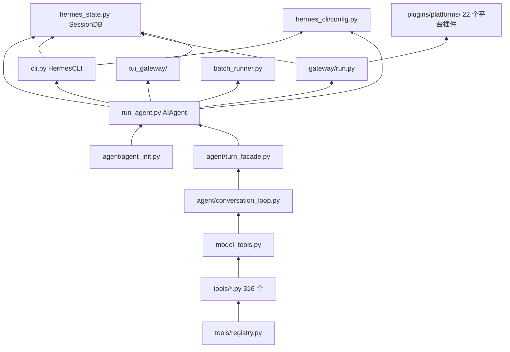

# 15 源码索引与覆盖矩阵

> 层：第四层（补齐源码逻辑与技术点）
> 状态：已按 `cc0a679f14` 复核
> 复核日期：2026-09-22
> 生成日期：2026-08-19
> 前置阅读：全部前序文档
> 后续阅读：[16-前端形态与宿主协议](./16-前端形态与宿主协议.md)

> **本篇的设计原则**：索引表**只给「符号 → 文件」映射，不给行号**。
> 上一版索引表写了绝对行号，在一次上游合并后全部失效；而符号名与文件归属在重构中稳定得多。
> 需要精确到行时，用第六节的自取命令实时获取。

## 一、本模块目标

提供源码索引和覆盖矩阵，帮助读者：

- 快速定位关键符号**在哪个文件**；
- 检查文档覆盖度；
- 按模块继续深入源码；
- **自己获取实时行号**，而不是依赖文档里可能过期的数字。

## 二、关键符号索引（符号 → 文件）

### 2.1 核心类（注意：四大核心类均为 Mixin 组装）

| 符号 | 文件 | 说明 |
|---|---|---|
| `class AIAgent` | `run_agent.py` | 14 个 Mixin 组装；`__init__` 是转发器 |
| `class HermesCLI` | `cli.py` | 17 个 Mixin 组装 |
| `class SessionDB` | `hermes_state.py` | 14 个 Mixin 组装 |
| `class GatewayRunner` | `gateway/run.py` | 17 个 Mixin 组装 |
| `class TurnContext` | `agent/turn_context.py` | 每轮循环的输入上下文 |
| `class _ChatTurn` | `cli.py` | 单轮 chat 的 per-turn 状态载体 |
| `class TurnFacadeMixin` | `agent/turn_facade.py` | turn 准入门面 |
| `class SessionPersistenceMixin` | `agent/session_persistence.py` | 会话持久化 |
| `class CompressionFacadeMixin` | `agent/compression_facade.py` | 压缩门面 |
| `class StreamDeliveryMixin` | `agent/stream_delivery.py` | 流式投递 |
| `class InterruptControlMixin` | `agent/interrupt_control.py` | 中断控制 |
| `class ActivityTrackingMixin` | `agent/activity_tracking.py` | 活动状态 |
| `class RateLimitCreditsMixin` | `agent/rate_limit_credits.py` | 限流额度 |
| `class ClientLifecycleMixin` | `agent/client_lifecycle.py` | client 生命周期 |
| `class ToolRegistry` | `tools/registry.py` | 工具注册表 |

> `AIAgent` 的 14 个 Mixin 完整映射见 [04-核心模块与类型关系](./04-核心模块与类型关系.md)；
> `HermesCLI` 的 17 个见 [02-简单例子-全路径走读](./02-简单例子-全路径走读.md) 5.4 节。

### 2.2 主链路函数

| 符号 | 文件 |
|---|---|
| `main` | `hermes_cli/main.py` |
| `build_top_level_parser` | `hermes_cli/_parser.py` |
| `cmd_chat` | `hermes_cli/main.py` |
| `_apply_profile_override` | `hermes_cli/main.py` |
| `_set_process_title` | `hermes_cli/main.py` |
| `_resolve_use_tui` | `hermes_cli/main_tui_launch.py` |
| `CLIAgentSetupMixin._init_agent` | `hermes_cli/cli_agent_setup_mixin.py` |
| `CLIChatTurnMixin.chat` | `hermes_cli/cli_chat_turn_mixin.py` |
| `HermesCLI.process_command` | `cli.py` |
| `load_cli_config` | `hermes_cli/cli_config_load.py` |
| `init_agent` | `agent/agent_init.py` |
| `TurnFacadeMixin.run_conversation` | `agent/turn_facade.py` |
| `TurnFacadeMixin.chat` | `agent/turn_facade.py` |
| `admit_durable_turn_lease` | `agent/turn_facade_lease.py` |
| `run_conversation`（薄壳） | `agent/conversation_loop.py` |
| `_run_conversation_turn`（实现） | `agent/conversation_loop.py` |
| `_restore_or_build_system_prompt` | `agent/conversation_loop.py` |
| `build_system_prompt` | `agent/system_prompt.py` |
| `build_turn_context` | `agent/turn_context.py` |
| `build_api_messages` | `agent/turn_context.py` |
| `export_current_turn_boundary` | `agent/turn_context.py` |
| `_persist_session` | `agent/session_persistence.py` |
| `AIAgent._execute_tool_calls` | `run_agent.py` |
| `AIAgent._dispatch_delegate_task` | `run_agent.py` |

### 2.3 工具系统

| 符号 | 文件 |
|---|---|
| `handle_function_call` | `model_tools.py` |
| `get_tool_definitions` | `model_tools.py` |
| `coerce_tool_args` | `tools/arg_coercion.py` |
| `discover_builtin_tools` | `tools/registry.py` |
| `ToolRegistry.register` | `tools/registry.py` |
| `Const:_MAX_TOOL_ERROR_CHARS` | `tools/registry.py`（值 2048） |

### 2.4 状态存储

| 符号 | 文件 |
|---|---|
| `SessionDB.append_message` | `hermes_state_messages.py` |
| `SessionDB.get_messages` | `hermes_state_messages.py` |
| 会话行读写 | `hermes_state_sessions.py` |
| schema DDL / `SCHEMA_VERSION` | `hermes_state_schema.py` |
| FTS5 搜索 | `hermes_state_fts.py` / `hermes_state_search.py` |
| 跨进程锁与持有者 | `hermes_state_lockguard.py` / `hermes_state_lockowners.py` / `hermes_state_holders.py` |
| 压缩记录 | `hermes_state_compression.py` |
| 迁移与可移植性 | `hermes_state_portability.py` / `hermes_state_repair.py` |
| profile 修复 | `hermes_state_profile_repair.py` |

> 28 个兄弟模块的完整分工表见 [08-数据模型与会话存储](./08-数据模型与会话存储.md)。

### 2.5 网关与平台

| 符号 | 文件 |
|---|---|
| `GatewayRunner` | `gateway/run.py` |
| `main`（网关进程入口） | `gateway/run.py` |
| `start_gateway`（async） | `gateway/run.py` |
| `TurnRunner.run_sync` | `gateway/run_turn_runner.py` |
| 平台适配器（22 个插件） | `plugins/platforms/<平台>/` |
| 网关侧内置适配器与基础设施 | `gateway/platforms/` |
| 新增平台指南（**内容已滞后**） | `gateway/platforms/ADDING_A_PLATFORM.md` |

### 2.6 配置与底座

| 符号 | 文件 |
|---|---|
| `load_config` | `hermes_cli/config.py` |
| `DEFAULT_CONFIG` | `hermes_cli/config_defaults.py` |
| `get_hermes_home` | `hermes_constants.py` |
| `setup_logging` | `hermes_logging.py` |
| 兼容性清单 | `compat_manifest.json` / `COMPAT_MANIFEST.md` |
| 启动看门狗 | `hermes_startup_watchdog.py` |

## 三、模块依赖图



## 四、文档覆盖矩阵

| 文档 | 层 | 覆盖内容 | 本版状态 |
|---|---|---|---|
| [00](./00-阅读指南与文档地图.md) | 0 | 阅读指南、术语、入口索引 | 已更新 |
| [01](./01-简单框架-系统骨架.md) | 1 | 系统骨架、模块边界、数据流 | 已重写 |
| [02](./02-简单例子-全路径走读.md) | 2 | 最小例子全路径 | 已重写 |
| [03](./03-详细逐步说明-主链路拆解.md) | 3 | 主链路逐跳拆解 | 已重写 |
| [04](./04-核心模块与类型关系.md) | 4 | 核心模块与类型关系（含 14 Mixin） | 已更新 |
| [05](./05-消息网关与平台适配.md) | 4 | 消息网关与平台适配（含插件化） | 已更新 |
| [06](./06-工具系统与工具集.md) | 4 | 工具系统与工具集 | 已更新 |
| [07](./07-配置体系与环境变量.md) | 4 | 配置体系与环境变量 | 已更新 |
| [08](./08-数据模型与会话存储.md) | 4 | 数据模型与会话存储（28 兄弟模块） | 已更新 |
| [09](./09-技能系统与插件架构.md) | 4 | 技能系统与插件架构 | 已更新 |
| [10](./10-调度器与定时任务.md) | 4 | 调度器与定时任务 | 已更新 |
| [11](./11-并发模型与生命周期.md) | 4 | 并发模型与生命周期 | 已更新 |
| [12](./12-错误处理与重试机制.md) | 4 | 错误处理与重试机制 | 已更新 |
| [13](./13-测试体系与质量保障.md) | 4 | 测试体系与质量保障 | 已更新 |
| [14](./14-构建部署与运维.md) | 4 | 构建部署与运维 | 已更新 |
| [15](./15-源码索引与覆盖矩阵.md) | 4 | 源码索引与覆盖矩阵 | 已更新（本篇） |
| [16](./16-前端形态与宿主协议.md) | 4 | **前端形态与宿主协议（新增）** | 本版新增 |
| [17](./17-上下文压缩与缓存保护.md) | 4 | **上下文压缩与缓存保护（新增）** | 本版新增 |

### 覆盖缺口（诚实标注）

以下主题本库**未**设专篇，只在相关篇目内被部分提及：

- **LLM provider 适配细节**（`agent/*_adapter.py` 各家的请求/响应差异）——散见 04 / 12；
- **凭据池与计费的完整数据模型**（`agent/credential_pool.py`、`agent/billing_*.py`）——散见 12；
- **`acp_adapter/`（ACP 协议适配）**——未被任何篇目覆盖；
- **`evals/` 评测套件的设计细节**——13 篇只讲了它与 `tests/` 的分工；
- **`contributors/` 与社区流程**——不属源码文档范围。

## 五、本库的可信度约定

- 全部结论基于**源码静态分析**，**未运行测试套件**，因此不对"测试是否通过"作任何声明；
- 基准提交 `cc0a679f14`（2026-09-21）。若你检出的提交不同，**符号名与文件归属通常仍成立，行号一定漂移**；
- 标注「当前源码无法确定」的结论是刻意保留的空白，不是遗漏；
- 上游 `docs/` 目录下的 18 个文件在本版基准中已不存在，本库不再引用它们。

## 六、如何自取实时位置（推荐工作流）

本库自带的定位工具（在仓库根目录执行）：

```bash
# 定位符号定义在哪个文件、哪一行（排除 tests/evals/node_modules）
python3 docs/sourceReader/.progress/sr_tools.py locate AIAgent TurnFacadeMixin SessionDB

# 输出某个文件的符号骨架（--top 只看顶层定义）
python3 docs/sourceReader/.progress/sr_tools.py outline agent/conversation_loop.py --top

# 拿符号定义行，用于计算函数内偏移（+0 = 定义行）
python3 docs/sourceReader/.progress/sr_tools.py offset agent/turn_facade.py run_conversation

# 校验某篇文档的所有路径引用与行号引用
python3 docs/sourceReader/.progress/sr_tools.py verify docs/sourceReader/03-详细逐步说明-主链路拆解.md
```

**维护本库前请先读** `docs/sourceReader/.progress/UPDATE-SPEC.md`（记法规范、格式要求、已知架构变化与勘误）。

## 七、继续深入建议

- 想理解**主链路**：读 [02](./02-简单例子-全路径走读.md) → [03](./03-详细逐步说明-主链路拆解.md)；
- 想改**核心类**：先读 [04](./04-核心模块与类型关系.md) 的 Mixin 映射，再去对应 `*Mixin` 文件；
- 想改**状态层**：读 [08](./08-数据模型与会话存储.md) 的 28 模块分工表；
- 想接**新平台**：读 [05](./05-消息网关与平台适配.md) 与 [09](./09-技能系统与插件架构.md)；
- 想改**上下文/压缩**：读 [17](./17-上下文压缩与缓存保护.md)（注意 prompt 缓存不变量）；
- 想改**前端**：读 [16](./16-前端形态与宿主协议.md)（注意契约单源在 Python 侧，改契约要重新生成 TS）；
- 想跑**测试**：读 [13](./13-测试体系与质量保障.md)（注意"行为契约优于快照"与 E2E 要求）。

## 八、本模块结论

本模块完成源码索引与覆盖矩阵，作为整套文档库的收尾。索引以**符号 → 文件**为主，配合第六节的实时定位命令，
使本库在下次上游合并后仍可低成本维护。

---

**导航**：[上一篇 · 14-构建部署与运维](./14-构建部署与运维.md) ｜ [总目录](./README.md) ｜ [下一篇 · 16-前端形态与宿主协议](./16-前端形态与宿主协议.md)
