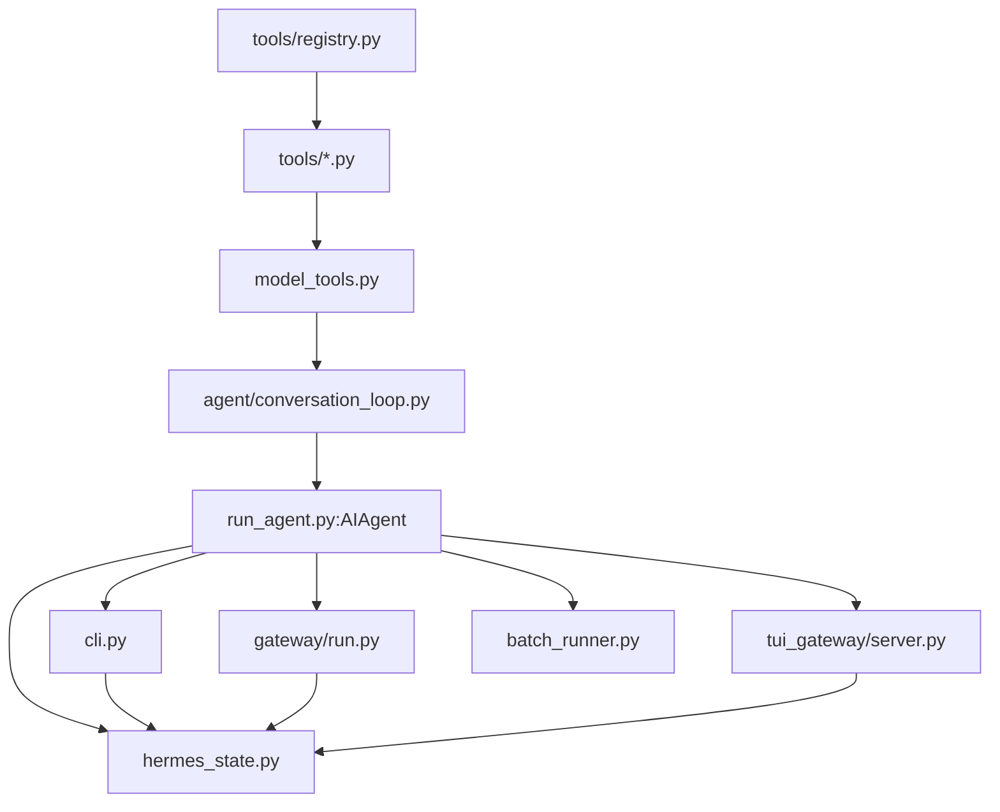

# 15 源码索引与覆盖矩阵

> 层：第四层（补齐源码逻辑与技术点）
> 状态：已复核（全部行号/符号与基准提交一致）
> 复核日期：2026-08-29
> 生成日期：2026-08-19
> 前置阅读：全部前序文档

## 一、本模块目标

提供源码索引和覆盖矩阵，帮助读者：

- 快速定位关键符号；
- 检查文档覆盖度；
- 按模块继续深入源码。

## 二、关键符号索引

| 符号 | 文件 | 行号（近似） |
|---|---|---|
| `AIAgent` | `run_agent.py` | 422 |
| `AIAgent.run_conversation()` | `run_agent.py` | 8597 |
| `AIAgent.chat()` | `run_agent.py` | 9077 |
| `AIAgent._persist_session()` | `run_agent.py` | 2020 |
| `AIAgent._execute_tool_calls()` | `run_agent.py` | 8428 |
| `AIAgent._dispatch_delegate_task()` | `run_agent.py` | 8472 |
| `run_conversation()` | `agent/conversation_loop.py` | 1834 |
| `_restore_or_build_system_prompt()` | `agent/conversation_loop.py` | 870 |
| `build_turn_context()` | `agent/turn_context.py` | 508 |
| `handle_function_call()` | `model_tools.py` | 1240 |
| `get_tool_definitions()` | `model_tools.py` | 323 |
| `discover_builtin_tools()` | `tools/registry.py` | 111 |
| `register()` | `tools/registry.py` | 763 |
| `_MAX_TOOL_ERROR_CHARS` | `tools/registry.py` | 33 |
| `SessionDB` | `hermes_state.py` | 4385 |
| `SessionDB.create_session()` | `hermes_state.py` | 6110 |
| `SessionDB.get_session()` | `hermes_state.py` | 9509 |
| `SessionDB.append_message()` | `hermes_state.py` | 11059 |
| `SessionDB.get_messages()` | `hermes_state.py` | 11961 |
| `HermesCLI` | `cli.py` | 5049 |
| `HermesCLI.process_command()` | `cli.py` | 12118 |
| `HermesCLI.chat()` | `cli.py` | 16421 |
| `load_cli_config()` | `cli.py` | 412 |
| `_init_agent()` | `hermes_cli/cli_agent_setup_mixin.py` | 339 |
| `cmd_chat()` | `hermes_cli/main.py` | 3125 |
| `main()` | `hermes_cli/main.py` | 13103 |
| `build_top_level_parser()` | `hermes_cli/_parser.py` | 136 |
| `GatewayRunner` | `gateway/run.py` | 6950 |
| `run_sync()` | `gateway/run.py` | 5455 |
| `get_hermes_home()` | `hermes_constants.py` | 114 |
| `setup_logging()` | `hermes_logging.py` | 259 |

## 二点五、真实代码映射补充

本文件本身就是源码索引，但为了满足“真实代码映射”硬性要求，这里再补一组按模块聚合的入口符号：

| 模块 | 真实入口文件 | 关键符号 |
|---|---|---|
| Agent 核心 | `run_agent.py` | `AIAgent` @422 |
| 对话循环 | `agent/conversation_loop.py` | `run_conversation()` @1834 |
| 每轮上下文 | `agent/turn_context.py` | `build_turn_context()` @508 |
| 工具分发 | `model_tools.py` | `handle_function_call()` @1240 |
| 工具注册 | `tools/registry.py` | `register()` @763 |
| 会话存储 | `hermes_state.py` | `SessionDB` @4385 |
| CLI | `cli.py` | `HermesCLI` @5049 |
| CLI 入口 | `hermes_cli/main.py` | `main()` @13103 |
| 网关 | `gateway/run.py` | `GatewayRunner` @6950 |
| 配置 | `hermes_cli/config.py` | `load_config()` @3570 |
| 日志 | `hermes_logging.py` | `setup_logging()` @259 |
| 路径 | `hermes_constants.py` | `get_hermes_home()` @114 |

## 三、模块依赖图

## 四、文档覆盖矩阵

| 文档 | 层 | 覆盖内容 |
|---|---|---|
| 00 | 0 | 阅读指南、术语、入口索引 |
| 01 | 1 | 系统骨架、模块边界、数据流 |
| 02 | 2 | 最小例子全路径 |
| 03 | 3 | 主链路逐跳拆解 |
| 04 | 4 | 核心模块与类型关系 |
| 05 | 4 | 消息网关与平台适配 |
| 06 | 4 | 工具系统与工具集 |
| 07 | 4 | 配置体系与环境变量 |
| 08 | 4 | 数据模型与会话存储 |
| 09 | 4 | 技能系统与插件架构 |
| 10 | 4 | 调度器与定时任务 |
| 11 | 4 | 并发模型与生命周期 |
| 12 | 4 | 错误处理与重试机制 |
| 13 | 4 | 测试体系与质量保障 |
| 14 | 4 | 构建部署与运维 |
| 15 | 4 | 源码索引与覆盖矩阵 |

## 五、继续深入建议

- 从 `run_agent.py` 开始读核心门面；
- 从 `agent/conversation_loop.py` 读真实循环；
- 从 `tools/registry.py` 读工具注册；
- 从 `hermes_state.py` 读会话存储；
- 从 `gateway/run.py` 读消息网关；
- 从 `tests/` 读行为契约和 E2E 场景。

## 六、本模块结论

本模块完成源码索引与覆盖矩阵，作为整套文档库的收尾。
