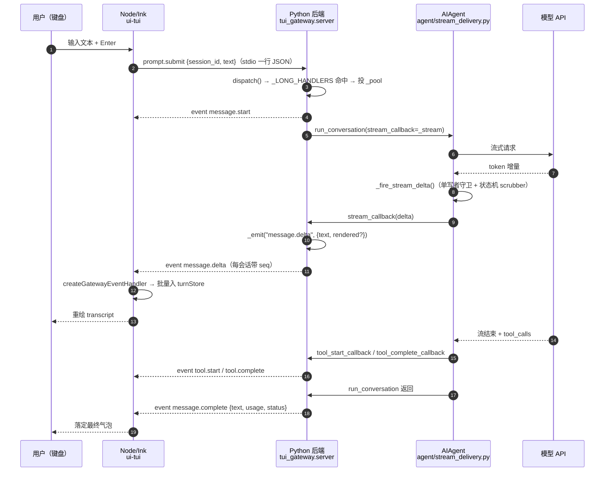

# 16 前端形态与宿主协议

> 层：第四层（补齐源码逻辑与技术点）
> 状态：新增（基准 cc0a679f14）
> 编写日期：2026-09-22
> 前置阅读：[15-源码索引与覆盖矩阵](./15-源码索引与覆盖矩阵.md)
> 后续阅读：[17-上下文压缩与缓存保护](./17-上下文压缩与缓存保护.md)

## 一、本模块目标

本库前 15 篇覆盖了 CLI、消息网关、工具系统、技能与插件、状态存储、配置、调度、并发、错误处理、测试、部署。
**前端形态（TUI / 桌面端 / Web Dashboard）此前只有骨架层的拓扑图，没有专篇**——本篇补上这个缺口。

本篇要讲清六件事：

1. **进程与部署形态**：每种前端由哪些进程组成，谁拉起谁，怎么退出；
2. **通信协议**：stdio 与 WebSocket 两条线上的 JSON-RPC 实现、方法目录、事件目录；
3. **流式与增量渲染**：模型 token 从 `AIAgent` 流到屏幕的完整链路；
4. **工具集差异**：桌面端/TUI 与 CLI 看到的工具集为什么不同，门控落在哪；
5. **前端构建**：TS/React 侧的构建配置，以及构建产物如何被 Python 侧引用；
6. **Web Dashboard 的特殊性**：它内嵌的是真 TUI 的 PTY，不是第二套渲染。

### 1.1 实测规模

| 目录 | 形态 | 实测文件数 | 技术栈 |
|---|---|---|---|
| `ui-tui/` | TUI 渲染层 | 499 | TypeScript + Ink（React for CLI）+ 自研 `packages/hermes-ink` |
| `tui_gateway/` | TUI / 桌面端 / Dashboard 共用的 Python 后端 | 91 个 `.py` | Python + Pydantic 契约 |
| `apps/desktop/` | 桌面端 | 2894 | Electron 40 + React 19 + nanostores + Tailwind |
| `apps/shared/` | 桌面端与 Web 共用的客户端 | 43 | TypeScript（源码直引，无构建产物） |
| `web/` | Web Dashboard SPA | 206 | Vite + React 19 + xterm.js |
| `apps/bootstrap-installer/` | 引导安装器 | 44 | **Tauri 2（Rust）** + React |

> 统计口径：`find <dir> -type f`，排除 `node_modules/`、`dist/`、`target/`、`.git/`。

> **注意**：`apps/bootstrap-installer/` 是**新目录**，任务描述里说「也请一并核实」。核实结论见 §2.4——它是一个 Tauri 壳，**不是**聊天前端，与上面四种形态不是同类。

## 二、进程与部署形态

### 2.0 四种形态总览

```mermaid
flowchart TB
    subgraph A["形态 A · TUI（hermes --tui）"]
        A1["Node 进程<br/>ui-tui（Ink/React 渲染 + 输入）"]
        A2["Python 进程<br/>python -m tui_gateway.entry<br/>AIAgent + 工具 + 会话"]
        A3["Python 子进程<br/>tui_gateway.slash_worker"]
        A1 -->|"stdio：新行分隔 JSON-RPC"| A2
        A2 -.->|"按需拉起（斜杠命令）"| A3
    end

    subgraph B["形态 B · 桌面端（Electron）"]
        B1["Electron main 进程<br/>apps/desktop/electron/main.ts"]
        B2["Python 进程<br/>hermes serve --port 0（headless）"]
        B3["Electron renderer<br/>React + nanostores"]
        B1 -->|"spawn：serveBackendArgs()"| B2
        B3 -->|"WebSocket /api/ws"| B2
    end

    subgraph C["形态 C · Web Dashboard"]
        C1["浏览器 SPA<br/>web（xterm.js）"]
        C2["dashboard 进程<br/>hermes dashboard（FastAPI）"]
        C3["Node 进程<br/>真 TUI（ui-tui entry.js）"]
        C4["Python 进程<br/>tui_gateway.entry"]
        C1 -->|"WebSocket /api/pty：原始 PTY 字节"| C2
        C2 -->|"ptyprocess.spawn"| C3
        C3 -->|"stdio JSON-RPC"| C4
        C4 -->|"回连 WebSocket /api/pub"| C2
        C1 -->|"WebSocket /api/events"| C2
    end

    subgraph D["形态 D · 引导安装器"]
        D1["Tauri 壳（Rust）<br/>Hermes-Setup"]
        D2["scripts/install.sh<br/>scripts/install.ps1"]
        D1 -->|"子进程"| D2
    end
```



四种形态共用**同一个** `tui_gateway` 后端与同一套 JSON-RPC 协议（形态 D 例外，它不跑 Agent）。

### 2.1 形态 A：TUI = Node 渲染进程 + Python 后端进程

**进程边界**：Node 是**父进程**，Python 是**子进程**。TypeScript 拥有屏幕，Python 拥有会话、工具、模型调用与斜杠命令逻辑（`tui_gateway/AGENTS.md` 的原文约束：「Never move agent behaviour into the renderer」）。

**Node 侧入口**：`ui-tui/src/entry`（`.tsx`）。它在模块顶层用 `await` 做四件事：重置终端模式、`new GatewayClient()` 并 `gw.start()`、装优雅退出处理、`ink.render(<App gw={gw} />)`。

**谁拉起谁**：`ui-tui/src/gatewayClient.ts` · `class GatewayClient` `+0` 的 `startSpawnedGateway` `+0` 是唯一 spawn 点：

- `resolvePython +0` 按 `HERMES_PYTHON` → `PYTHON` → `$VIRTUAL_ENV` → `<root>/.venv` → `<root>/venv` 的顺序找一个 Python，找不到就退回 `python`/`python3`；
- `spawn(python, ['-m', 'tui_gateway.entry'], { cwd, env, stdio: ['pipe', 'pipe', 'pipe'] })`，并把 `PYTHONPATH` 与 `HERMES_PYTHON_SRC_ROOT` 设成仓库根（防止启动目录里同名包遮蔽 Hermes 自己的顶层模块）；
- `this.channel.attach({ send: text => void stdin.write(text + '\n') })`——RPC 请求写在子进程 stdin，响应/事件从 stdout 按行读（`createInterface`），stderr 只当日志。

**另一种启动方式（attach 模式）**：若环境里有 `HERMES_TUI_GATEWAY_URL`，`start +0` 走 `startAttachedGateway +0`，**不 spawn Python**，而是把同一条协议改到 WebSocket 上。Dashboard 的 `/api/pty` 正是用这个变量把自己的 in-memory gateway 交给 PTY 子进程（见 §7）。

**握手与超时**：Python 侧 `tui_gateway/entry.py` · `main +0` 一启动就先写一条 `event` 帧 `gateway.ready`（携带 skin、`change_events: true`、`replay_epoch`）。Node 侧 `startReadyTimer +0` 在 `HERMES_TUI_STARTUP_TIMEOUT_MS`（默认 15000，下限 5000）内没等到 `gateway.ready`，就发 `gateway.start_timeout` 事件并把 cwd/python/stderr 尾巴一起报给 UI——这是「装错 Python」「缺依赖」与「启动挂住」三类问题的分诊点。

**生命周期与退出**：

| 触发 | 谁 | 行为 |
|---|---|---|
| 用户 `/quit`、Ctrl+C、SIGTERM | Node 父进程 | `setupGracefulExit` 的 cleanups 调 `gw.kill(reason)`；`kill +0` 先置 `disposed` 再 `proc.kill()` |
| 输出流 EIO/EPIPE 连续 5 次 | Node 父进程 | `recordParentLifecycle` 后 `gw.kill('dead-output-stream')` + `process.exit(1)`（防止「终端已死但父进程变僵尸、每秒抛一次」） |
| 内存达到 critical | Node 父进程 | `process.exit(137)`（关闭子进程 stdin → 子进程走「干净 EOF」而不是 SIGTERM，因此必须靠父进程的 breadcrumb 才能归因） |
| Python 侧 stdin EOF | Python 子进程 | `tui_gateway/entry.py` · `main +0` 的读循环 `break` → 正常退出；`_stdin_recovery.handle_spurious_eof` 负责区分「子进程把共享 fd 翻成 O_NONBLOCK 造成的假 EOF」与真 EOF |
| SIGTERM / SIGHUP | Python 子进程 | `tui_gateway/entry.py` · `_log_signal +0`：把**所有线程**的栈写进 crash log → `print("[gateway-signal] …")` 到 stderr → 起一个 `_shutdown_grace_seconds()`（默认 1.0s，`HERMES_TUI_GATEWAY_SHUTDOWN_GRACE_S` 可覆写）的 daemon timer 兜底 `os._exit(0)` → 显式跑一次 `_shutdown_sessions()` → `sys.exit(0)`。SIGPIPE 被显式设为 `SIG_IGN`（默认行为会在后台线程写已静默的管道时静默杀进程） |
| stdout 写失败（管道断了） | Python 子进程 | `tui_gateway/entry.py` · `_write_or_exit +0` 记一条 `gateway exit` 到 crash log 后 `sys.exit(0)` |

**两个必须知道的进程级副作用**：

1. `tui_gateway/server.py` 在 import 期做 `_real_stdout = sys.stdout; sys.stdout = sys.stderr`——**stdout 被独占给 JSON-RPC**，任何库的 `print()` 都会变成 stderr 上的 `gateway.stderr`，而不是污染协议。
2. `tui_gateway/entry.py` · `_close_rpc_stdin_on_exec +0` 把 stdin 标成 close-on-exec：TUI 的 stdin 就是 Node↔Python 的 JSON-RPC socketpair，若某个依赖启动子进程时没显式给 `stdin=`，标准描述符会继承下去，子进程可能**抢读掉一条 RPC 请求**。

**第三个进程**：`tui_gateway/server.py` · `_SlashWorker +0` 是一个**常驻的 HermesCLI 子进程**（`python -m tui_gateway.slash_worker --session-key …`），用于在**不打断当前 Agent 会话**的前提下跑斜杠命令（`slash.exec`）。它有自己的 stdin/stdout 行协议（`{"id","command"}` → `{"id","ok","output"}`），并且按 session 的 profile home 构造环境（`served_profile_child_env`）。

### 2.2 形态 B：桌面端 = Electron 渲染进程 + `hermes serve` 后端进程

桌面端**不嵌入 TUI**（`apps/desktop/AGENTS.md` 第 14 行：「It is not the browser dashboard and it does not embed the TUI」）。它有自己的 composer、transcript 与 slash 管线。

**后端 argv 的唯一构造点**：`apps/desktop/electron/backend-command.ts` · `serveBackendArgs +0` 返回

```
['serve', '--host', '127.0.0.1', '--port', '0']
```

带 profile 时前面插 `['--profile', <name>]`。`--port 0` 表示让内核分配临时端口。

**向后兼容的窄降级**（同文件）：`serve` 是较新的子命令，老运行时只认 `dashboard --no-open`。`sourceDeclaresServe +0` 用正则 `/add_parser\(\s*["']serve["']/` 探测运行时源码里是否注册了 `serve`（刻意不用 `"server" in src` 这种子串判断，避免 `start_server` 假阳性）；只有探测为假时 `dashboardFallbackArgs +0` 才把 argv 改写成 `dashboard --no-open`。上游实现是 `apps/desktop/electron/backend-serve-support.ts` · `createBackendServeSupportResolver +0`。

**spawn 点与注入的环境**：`apps/desktop/electron/main.ts` 里 `spawnOwnedBackend +0` 是唯一 spawn 包装；后端 argv 由 `getBackendArgsForRuntime +0` 给出。注入的关键环境变量（两处调用点，主后端与池化后端各一处）：

| 变量 | 作用 |
|---|---|
| `HERMES_HOME` | 显式钉住子进程的 profile home（Windows 上 Desktop 默认 `%LOCALAPPDATA%\hermes` 与 Python 默认 `~/.hermes` 不同，不钉会分裂成两套 config/session/.env/log） |
| `HERMES_DASHBOARD_SESSION_TOKEN` | REST 与 WS 升级共用的会话令牌 |
| `HERMES_DESKTOP=1` | 「这个后端由 app 拉起」——用于跑 cron ticker 与 web-dist 处理 |
| `TERMINAL_CWD` | 把工具/终端 cwd 钉到与子进程 spawn cwd 一致 |
| `HERMES_WEB_DIST` | Electron 打包的 web 产物目录 |
| `HERMES_DESKTOP_READY_FILE` | 端口通告文件（见下） |
| `HERMES_PARENT_PID` + 父进程 start marker | 让后端能在 Desktop 非正常死亡后**自退**，且不被 PID 复用骗过 |

（`desktopBackendSpawnEnv +0` 在 `apps/desktop/electron/guest-onboarding.ts`，负责把 guest onboarding 的启动决策**最后**盖章，防止继承来的旧值泄漏。）

**端口发现**：`serve --port 0` 的端口由 Python 侧通告。`hermes_cli/web_server.py` 在 bind 之后写一行哨兵：

```
ready_token = "HERMES_BACKEND_READY" if headless else "HERMES_DASHBOARD_READY"
_write_machine_sentinel_line(f"{ready_token} port={actual_port}")
```

Electron 侧 `apps/desktop/electron/backend-ready.ts` · `waitForDashboardPortAnnouncement +0` 等待它；Windows 上 Desktop 用 `pythonw.exe` 启动（无控制台、拿不到 stdout），所以改等 `HERMES_DESKTOP_READY_FILE` 指向的原子 JSON 文件（`hermes_cli/web_server_lifecycle.py` · `_write_dashboard_ready_file +0`）。

**`serve` 到底做了什么**：`hermes_cli/subcommands/dashboard.py` 的 `_configure_serve_parser +0` 把 `func=cmd_dashboard`、`headless_backend=True`、`no_open=True`、`command="serve"` 一起设进 defaults。`cmd_dashboard`（`hermes_cli/main.py` · `cmd_dashboard +0`）在 `headless_backend=True` 时：

- 跳过 `_build_web_ui`（不建前端）；
- 导出 `HERMES_SERVE_HEADLESS=1`；
- `mount_spa +0`（`hermes_cli/web_server_dashboard.py`）看到这个变量后**不挂 SPA**，只留 JSON-RPC/WS/API 可达（即便磁盘上残留一个 `web_dist/` 也不会误挂）。

**池化后端**：桌面端为每个 `(connection, profile)` 组合池化一个 `hermes serve --port 0`；启动 home 就是该 profile，`HERMES_DESKTOP=1` 已设。同一个进程仍可托管多个 home 的会话——第一个非 launch home 会触发 `tui_gateway/launch_profile_policy.py` 的 multiplex 激活（详见 `tui_gateway/AGENTS.md` § Profile scope）。

**退出与回收**：`apps/desktop/electron/local-backend-lifecycle.ts` · `createLocalBackendLifecycle +0` 用一个 `AbortController` + `starts`/`children`/`stops` 三张表实现「物理所有权比路由条目活得久」：shutdown 时先 abort、再 `waitForTeardown`（默认 7s 上界）等待所有 start/stop。单进程的杀法在 `apps/desktop/electron/backend-child.ts`：`stopBackendChild +0` 在 Windows 走 `taskkill /T /F` 整树，在 POSIX 走 `process.kill(-pid, 'SIGTERM')`——因为后端是用 `start_new_session=True` 起的，**进程组 id == pid**，只杀直接子进程会留下 MCP 孙进程。`waitForBackendExit +0` 是「优雅退出 → SIGKILL 升级 → 有界等待」的三段式。

> 与网关的关系：`serve` 随 app 退出；消息网关**不随 app 退出**（它由 `/api/gateway/*` detached 拉起）。源码注释明确写着「Never re-parent the gateway under the backend」。

### 2.3 形态 C：Web Dashboard = FastAPI 进程 + PTY 里的真 TUI

这是**四层进程**：

```
浏览器（xterm.js）
  └─ WebSocket /api/pty ── FastAPI（hermes dashboard）
       └─ ptyprocess.spawn ── Node（真 TUI：ui-tui entry.js）
            └─ stdio JSON-RPC ── Python（tui_gateway.entry）
```

`hermes_cli/web_routers/chat_ws.py` · `pty_ws +0` 是 `/api/pty` 的处理器：过完 WS 鉴权门（`_ws_gate`）后，用 `_resolve_chat_argv_async` 拿到 `argv/cwd/env`，再用 `PtyBridge.spawn` 起 PTY。`_resolve_chat_argv`（`hermes_cli/web_server_chat.py`）里的第一句就是 `_make_tui_argv(PROJECT_ROOT / "ui-tui", tui_dev=False)`——**Dashboard 起的和 `hermes --tui` 起的是同一份 argv**。

三条与 PTY 相关的通道（都在同一个 router 文件里）：

| 端点 | 处理器 | 方向 | 用途 |
|---|---|---|---|
| `/api/pty` | `pty_ws +0` | 浏览器 ↔ PTY 原始字节 | 终端画面与键盘输入 |
| `/api/ws` | `gateway_ws +0` | 浏览器 ↔ `tui_gateway.dispatch` | 结构化元数据（侧栏用）；直接 `await handle_ws(ws, …)` |
| `/api/pub` | `pub_ws +0` | PTY 子进程 → 服务端 | 子进程把每条 emit 镜像回来 |
| `/api/events` | `events_ws +0` | 服务端 → 浏览器订阅者 | 把 `/api/pub` 收到的帧按 channel 扇出 |

**回连镜像（sidecar）**：Dashboard 起的 TUI 是**第三个**进程里的 gateway，它的 emit 走的是自己的 stdout（给 Ink）。为了同时喂 React 侧栏，`/api/pty` 在 env 里塞 `HERMES_TUI_SIDECAR_URL`（`_build_sidecar_url +0` → `ws://…/api/pub?channel=…`）；Python 侧 `tui_gateway/entry.py` · `_install_sidecar_publisher +0` 看到这个变量就把 `server._stdio_transport` 包成 `TeeTransport(stdio, WsPublisherTransport(url))`——**primary 是 stdio，sidecar 是 best-effort 二级**，`WsPublisherTransport` 的 `write` 只入队就返回（队列满则丢弃，死连接后短路），绝不阻塞 agent 循环。

**PTY 保活**：`PTY_REGISTRY`（`Module:hermes_cli/web_server_chat.py` · `Const:PTY_REGISTRY`）是一个 `PtySessionRegistry(ttl=30*60, max_sessions=16, buffer_cap=1MiB)`。不带 `?attach=` 时走 `_legacy_pump +0`（1:1 socket↔PTY，断开即杀）；带 token 时 PTY **比 socket 活得久**，重连按 token 复用，重放后强制一次全屏重绘（新 xterm 无法从任意差分尾巴重建画面）。

**resize 协议**：不是标准 JSON 控制帧，而是把 `\x1b[RESIZE:<cols>;<rows>]` 当作**原始字节**发进同一个 WS；服务端用 `_RESIZE_RE`（`Module:hermes_cli/web_server_chat.py` · `Const:_RESIZE_RE`）匹配到整帧就是 resize 就本地消费（`bridge.resize` → `TIOCSWINSZ`），**不写进 PTY**。

**PTY 实现有两个**：`hermes_cli/pty_bridge.py` · `class PtyBridge` `+0`（POSIX，`fcntl`/`termios`/`ptyprocess`）与 `hermes_cli/win_pty_bridge.py` · `class WinPtyBridge`（Windows，pywinpty/ConPTY）。选择在 `hermes_cli/web_server_chat.py` 模块顶部按 `sys.platform.startswith("win")` 完成；两者都导入失败时 `_PTY_BRIDGE_AVAILABLE = False`，`pty_ws +0` 会发一条红字提示后以 1011 关闭——**这就是 `web/AGENTS.md` 里「native Windows does not（work）」的实际落点：不是平台不支持，而是缺 pywinpty 时降级**。

### 2.4 形态 D：引导安装器 = Tauri 壳 + install 脚本

`apps/bootstrap-installer/` 核实结论：

- 它是 **Tauri 2** 应用（`apps/bootstrap-installer/src-tauri/Cargo.toml` + `apps/bootstrap-installer/src-tauri/tauri.conf.json`），前端是 React（入口 `apps/bootstrap-installer/src/main`（`.tsx`）与 `apps/bootstrap-installer/src/routes/` 下的 welcome/progress/success/failure 四个页面组件），**不是 Electron**；
- 它**不运行 Agent**，不连 `tui_gateway`。`src-tauri/src/lib.rs` 的 `AppMode` 只有两个取值：`Install`（裸启动，首次安装）与 `Update`（`Hermes-Setup.exe --update`，由桌面端的 Update 按钮 handoff 过来）；
- 真正的安装逻辑在 `apps/bootstrap-installer/src-tauri/src/` 下的 `bootstrap` / `install_script` / `powershell` / `paths` / `update` 五个 Rust 模块，按 `apps/bootstrap-installer/src-tauri/tauri.conf.json` 的 `bundle.longDescription` 描述，驱动 `scripts/install.ps1`（Windows）与 `scripts/install.sh`（macOS/Linux）；
- 打包目标 `app`/`dmg`/`appimage`，identifier `com.nousresearch.hermes.setup`，与桌面端的 `com.nousresearch.hermes` 是**两个独立应用**。

因此本篇把它列为「宿主协议」的外围形态，不展开其安装流程（属第 14 篇构建部署范围）。

## 三、通信协议

### 3.1 线协议与传输抽象

线协议是**新行分隔的 JSON-RPC 2.0**：一个 JSON 对象一行，`\n` 分隔。同一份 `dispatch` 同时跑在两条传输上，抽象在 `tui_gateway/transport.py`：

| 类型 | 位置 | 说明 |
|---|---|---|
| `Transport`（Protocol） | `tui_gateway/transport.py` · `class Transport` `+0` | 只有 `write(obj) -> bool` 与 `close()`；`False` 表示对端已消失 |
| `StdioTransport` | `tui_gateway/transport.py` · `StdioTransport +0` | 写 `sys.stdout`；序列化在锁外做，避免大 payload 阻塞别的线程 |
| `WSTransport` | `tui_gateway/ws.py` · `WSTransport +0` | 每连接一个；`write` 可从任意线程调（worker 线程 marshal 到 loop 并等 future），在 loop 线程上调用则 fire-and-forget |
| `FanoutTransport` | `tui_gateway/transport.py` · `FanoutTransport +0` | 有序、有界的会话事件邮箱；每 peer 一个 daemon writer + 上限（256 帧 / 4 MiB），溢出时**丢订阅而不是拖垮 emitting turn** |
| `TeeTransport` | `tui_gateway/transport.py` · `TeeTransport +0` | primary + N 个 best-effort secondary；Dashboard 的 stdio+sidecar 双写 |
| 当前 transport | `tui_gateway/transport.py` · `bind_transport +0` / `current_transport +0` | 存在 `ContextVar` 里，让 pool 派发的 handler 能写回正确 peer |

**`_PEER_GONE_ERRNOS`**（`Module:tui_gateway/transport.py` · `Const:_PEER_GONE_ERRNOS`）把 `EPIPE`/`ECONNRESET`/`EBADF`/`ESHUTDOWN` 及两个 Windows 对应码定义为「对端已消失」；**其他 OSError 一律重抛**，否则 `UnicodeEncodeError`、`ENOSPC`、`EACCES` 会伪装成「干净断开」，crash log 里什么都留不下。

### 3.2 方法目录（client→server）

**唯一注册缝**：`tui_gateway/server.py` · `register_method +0`（`_methods[name] = fn`），装饰器是 `method +0`。拆到 `methods_*.py` 的模块用 `tui_gateway/method_ctx.py` · `class HandlerRegistry +0` 延迟注册，`install +0` 时把函数用 `types.FunctionType` **重新绑定到 server 的 globals**（`rebind +0`）再注册——这样拆出去的函数体字节不变，`global X` 仍改 server 的模块状态。

**实测 113 个 `@method`**。它们拆在 `tui_gateway/` 下的 23 个 `methods_*.py` 兄弟模块里（`methods_session`、`methods_prompt`、`methods_config`、`methods_complete`、`methods_browser`、`methods_connectors`、`methods_profiles`、`methods_tools`、`methods_voice`、`methods_vault`、`methods_projects`、`methods_groups`、`methods_images`、`methods_slash`、`methods_free_tier`、`methods_subagents`、`methods_bot_relay`、`methods_session_control`、`methods_session_foreign`、`methods_session_model_guard`、`methods_browser_control`、`methods_complete_helpers`、`methods_config_set`；以上名字均须补 `.py` 后缀）。部分名字：

| 类别 | 方法名（节选） |
|---|---|
| 会话 | `session.create` `session.list` `session.resume` `session.close` `session.delete` `session.title` `session.compress` `session.events.since` `session.events.stats` `session.workspace.move` `session.control` `session.set_hidden` `session.most_recent` `session.active_list` |
| 对话 | `prompt.submit` `prompt.background` `prompt.btw` `request.answer` `approval.pending` `approval.respond` `clarify.lock` |
| 补全/命令 | `complete.slash` `complete.path` `commands.catalog` `slash.exec` `command.dispatch` `cli.exec` `shell.exec` |
| 配置/模型 | `config.get` `config.set` `model.options` `model.save_key` `model.disconnect` `setup.status` `setup.runtime_check` |
| GUI 专属 | `connection.respond` `connectors.*` `browser.manage` `image.*` `pet.*` `voice.*` `wake.*` `preview.restart` `spawn_tree.*` `subagent.*` |
| 协议自省 | `ping` `client.capabilities` `gateway.capabilities` `profiles.create` `diagnostics`（`.share_nous`）`verification.status` |

**分发路径**：`tui_gateway/rpc_dispatch.py` · `dispatch +0`：

1. `bind_transport(t)` 把本请求的写目标钉住；
2. 若这一帧是**对「我们发出去的 server→client 请求」的应答**（`server_requests.is_response_frame`），解析后直接返回 `None`（不再回帧）；
3. 方法名在 `Module:tui_gateway/server.py` · `Const:_LONG_HANDLERS` 里 → 投到 `_pool`（`ThreadPoolExecutor`，worker 数 `HERMES_TUI_RPC_POOL_WORKERS` 默认 8）**并返回 `None`**，由 worker 自己写响应；否则走 `handle_request +0` 内联执行并返回响应 dict。
   - 这个划分是**为了不让慢 handler 卡住 WS 读循环**。`_LONG_HANDLERS` 的注释逐条列了原因：`pet.generate` 是多次图像模型往返、`reload.mcp` 是冷 npx + 30s OAuth 等待、`bot_relay.*` 是**完整的一轮 agent 对话（600s）**、`voice.*`/`wake.*` 是同步装 faster-whisper（300s）……
4. `handle_request +0` 先过 `hermes_cli.backend_retirement.retirement.work()` 的准入（后端退休中返回 `5035`），再 `_normalize_request +0`，然后查表；查不到返回 `-32601`，报文里带「客户端与后端版本不同步，请 `hermes update`」的提示。

**错误码**（源码里实际出现的）：

| 码 | 含义 |
|---|---|
| `-32700` | 解析错误（非法 JSON 行） |
| `-32600` | 非法请求（不是对象 / `method` 非非空字符串） |
| `-32602` | `params` 不是对象 |
| `-32601` | 未知方法 |
| `-32603` | 内部错误 / 序列化失败 / handler 崩溃 |
| `-32000` | handler 抛异常（inline 路径） |
| `4000` | **未知参数键**（客户端 bug，带键路径） |
| `4001` | 非法/缺失 session 或 transport 授权 |
| `4064` | `ProfileUnavailableError`：显式 `profile` 参数在本机没有活的 profile |
| `5035` | 后端正在退休，请重连 |

### 3.3 server→client 请求（后端问渲染端）

JSON-RPC 是**对等**的：不只是客户端调方法，后端也会**主动发请求**并等待应答。实现在 `tui_gateway/server_requests.py`。

- `class ServerRequest +0`：`id` 形如 **`srq-<12 位 hex>`**——字符串 id 永不与客户端自增的整数 id 冲突，随机部分还能区分 compute-host 子进程与父进程同时打到一个 socket 上的请求；
- `send +0`（阻塞，等 `Event`）与 `send_async +0`（队列式，approval 用）两个入口；
- 超时/取消（中断、会话关闭、进程退出）发**一条** `request.cancel {id, method, reason}`，让所有渲染端用同一种方式拆卡片；
- 断线重连时未应答的请求由 `session.resume` / `session.activate` / `session.events.since` 以 `open_requests` 字段返回（`open_requests +0`），客户端把「还挂着的提问」当新到的请求重新投递——所以**重放环不需要携带「等答案的问题」**。

**契约里的 12 个 server→client 请求**（`tui_gateway/contracts/server_requests.py`）：
`clarify` `approval` `sudo` `secret` `vault.unlock_prompt` `vault.save_login` `vault.code` `terminal.read` `preview.read` `window.read` `preview.act` `tour`。

**能力协商**：客户端每连接声明一次自己会答这类请求——`client.capabilities {server_requests: true}` → `advertise +0`。没声明的 WebSocket 客户端是「比 server→client 请求更老的构建」，`send`/`send_async` **快速失败**（返回和错误响应一样的 `None`，且不写帧），而不是让 agent 干等满 clarify 的 300s 超时。这条守卫的触发条件由 `tui_gateway/server.py` 的 `_session_client_answers_requests` 供给（经 `bind_sinks` 注入）。

**approval 的落地链路**（`tui_gateway/server.py` · `_emit_approval_request +0`）：构造 client-safe payload（`_approval_request_payload +0`：补 `choices`，并用 `gateway.run._redact_approval_command` 脱敏命令行）→ `server_requests.send_async("approval", …)` → 回调里调 `tools.approval.resolve_gateway_approval`。若结果是 `None`（没有任何客户端能答），走 `withdraw_gateway_approval` **撤回而不是拒绝**——「没人拒绝这条命令」。

**通用一问一答**：`tui_gateway/server.py` · `_ask +0` 是「答案在 `value` 里的单字符串请求」（sudo、secret、vault、terminal.read 等）的统一封装。

### 3.4 事件通知（server→client）

事件是 `method: "event"` 的通知帧，`params = {type, session_id, payload?}`。构造与发送：

- `tui_gateway/server.py` · `_event_frame +0`：先 `_contracts.check_payload(event, payload)`，再拼帧；
- `tui_gateway/server.py` · `_emit +0`：先过 `agent.notification_presentation.event_presentation_muted(event, sid)`（会话级静音），再 `write_json`；
- `tui_gateway/server.py` · `write_json +0`：**三阶梯路由**——① 带 `session_id` 的事件帧/server 请求 → 该会话记录的 `transport`（异步事件即使来自没有 ContextVar 绑定的线程也能到对的窗口）；② 当前 ContextVar 绑定的 transport；③ 模块级 `_stdio_transport`（测试 monkey-patch `_real_stdout` 时靠它）。
- 会话无关的全局事件（如 `skin.changed`）用 `_broadcast_global_event +0` 扇给 `register_live_transport +0` 登记过的所有 WS peer；一个 peer 写失败只 debug 一条日志，不影响其余。

**实测 60 个事件**（`tui_gateway/contracts/events.py`）。分组：

| 组 | 事件名 |
|---|---|
| 生命周期/连接 | `gateway.ready` `error` `notice` `notification`（`.show`）`notification.clear` `request.cancel` `setup.ready` `tip`（`.show`）`status.update` |
| 流式 | `message.start` `message.delta` `message.interim` `message.complete` `thinking.delta` `reasoning.delta` `reasoning.available` |
| 工具 | `tool.start` `tool.generating` `tool.complete` `tool.output_risk` `agent.terminal.output` `terminal.close` |
| 会话 | `session.info` `session.title` `session.usage` `session.reclaimed` `session.resume_progress` `session.control.update` `sessions.changed` `todo.updated` `background.complete` |
| 皮肤/布局 | `skin.changed` `layout.apply` `pane.reveal` `preview.open` `preview.close` `preview.restart.*` |
| GUI 专属 | `connection.request` `connection.update` `browser.controller.command` `browser.controller.cancel` `browser.progress` `voice.*` `wake.detected` `pet.*` `moa.*` `btw.complete` `reaction` `message.reaction` |
| 其它 | `pairing.changed` `platforms.changed` `cron.changed` `billing.step_up.verification` `review.summary` `bot_relay.outbox.pending` `subagent`（经 `subagent.*` 方法而非事件暴露） |

**每个事件帧都带 `seq`**：`tui_gateway/event_replay.py` · `_stamp_event +0` 给带 `session_id` 的事件盖**每会话单调 seq** 并存进一个小环。边界：

- `_REPLAY_BUFFER_MAX = 512` 帧 / `_REPLAY_BUFFER_BYTES_MAX = 4 MiB`（每会话）；
- `_REPLAY_PROCESS_BYTES_MAX = 64 MiB`（跨最多 `_REPLAY_SESSIONS_MAX = 64` 个会话），超了按 FIFO 逐出；
- 被逐出或从未保留（单帧超预算）的帧留下 `_replay_evicted_through` 水位，`is_truncated +0` 据此告诉客户端「别信重放，去重新拉历史」。

**进程 epoch**：`replay_epoch +0` 返回进程启动时生成的随机 hex。seq 计数器是**进程内**的，后端重启会从 1 重新开始，而客户端手上还攥着旧水位——没有 epoch 检查，`events_since(sid, 97)` 会永远返回 `[]` 且 `truncated=false`，客户端会**静默地以为什么都没漏**。客户端在 `gateway.ready` / `session.events.since` 上看到 epoch 变化就清空水位。

### 3.5 客户端侧：`JsonRpcGatewayClient` 与它的三个消费者

`apps/shared/src/json-rpc-gateway.ts` · `class JsonRpcGatewayClient +0` 是**桌面端与 Web 共用**的 WebSocket 客户端（`apps/shared` 包名 `@hermes/shared`，通过 `file:` 依赖被三处引用，无构建产物，源码直引）。它的关键能力：

| 成员 | 位置 | 作用 |
|---|---|---|
| `connect(wsUrl)` | `+0` | 只接受 `ws://`/`wss://`（`isGatewayWebSocketUrl +0` 先挡，避免 `ws://<origin>/[object Object]` 这类僵尸 boot 循环）；15s 连接超时；失败按类分消息（拒绝 token / TLS-DNS / 无应答 各自一句） |
| `request<T>(method, params, timeout, signal)` | `+0` | 请求超时默认 120s；未连接立即 reject |
| `onRequest(handler)` | `+0` | server→client 请求入口；重连后重投的带 `replayed: true` |
| `on/onAny` | 经 `GatewayEventHub +0` | 按类型 + `*` 通配的事件分发 |
| `handleEvent +0` | | 收到 `gateway.ready` 时按 `heartbeat` 启心跳、按 `replay_epoch` 处理重启；`replayHold` 期间把该会话的实时帧**暂存**，避免与重放响应重复或抢跑 |
| `fetchReplay +0` | | 重连后按每会话水位逐会话调 `session.events.since`；`replayGeneration` 令牌保证「被打断的重放」不会占用替换上来的新 socket |
| 状态机 | `ConnectionState = 'idle'\|'connecting'\|'open'\|'closed'\|'error'` | 供 UI 渲染连接态 |

**三个消费者**（都用继承，不重写协议）：

1. `apps/desktop/src/api/client.ts` · `class HermesGateway +0`（`extends JsonRpcGatewayClient`）——桌面端。`STARTUP_REQUEST_TIMEOUT_MS +0 = 60_000`（启动期读接口给宽限，因为 `/api/profiles` 要对每个 profile 走一遍技能树）、`PROMPT_SUBMIT_REQUEST_TIMEOUT_MS +0 = 1_800_000`（`prompt.submit` 实质是 fire-and-forget，回合完成靠事件而非 RPC 返回，所以 ack 超时要对齐后端 `agent.gateway_timeout`）。
2. `web/src/lib/gatewayClient.ts` · `class GatewayClient +0`——Dashboard 连 `/api/ws`，`requestIdPrefix: "w"`。
3. `web/src/lib/eventsFeedClient.ts` · `class EventsFeedClient +0`——Dashboard 侧栏连 `/api/events`，`replay: false`、心跳关掉，因为**订阅者不说话**（服务端 `receive_text()` 只用来等断开）。

**Ink TUI 不用这个类**：`ui-tui/src/gatewayClient.ts` 用的是更底层的 `JsonRpcRequestChannel`（同样来自 `@hermes/shared`）——因为 `JsonRpcGatewayClient.connect()` 只接受 WebSocket，而 TUI 主路径是 stdio。两者共用**同一个 channel 实现与同一套事件分发语义**，但传输壳不同。

**客户端本地合成事件**（`apps/shared/src/gateway-events.ts` · `ClientLocalGatewayEventMap +0`）：`dashboard.new_session_requested` `gateway.protocol_error` `gateway.reconnecting` `gateway.start_timeout` `gateway.stderr`——**从不来自后端**，由 TUI 的 `gatewayClient` 推进同一条 handler 流，用来报传输态。`GatewayEventMap +0` 把后端事件表与这张表合并，所以 UI 代码只需要一个联合类型。

### 3.6 契约层：Python 是唯一真源，TS 是生成的

这是本模块最值得记的设计：**线协议在 Python 里声明，为 TypeScript 生成**。

- `tui_gateway/contracts/` 是 14 个主题模块（`sessions` `prompt_voice` `config_free_tier_control` `tools_commands` `tools_mcp_plugins` `profiles_vault_complete_foreign_subagents` `projects_pets` `billing_delegation_pets` `connectors_operation` `groups_bot_relay` `liveness` `common` `events` `server_requests`），每个在 import 时往注册表填条目；
- `tui_gateway/contracts/registry.py` 提供三个声明函数：`method +0`（Params + Result）、`server_request +0`（Params + Result）、`event +0`（Payload，可为 `None`）；
- 基类在 `tui_gateway/contracts/base.py`：`class Params +0` 默认 `extra="forbid"`（未知键 = 客户端 bug，回 `4000` 带键路径），`Result` 同；`Payload` 是通知载荷；`WireEnum` 渲染成 TS 字面量联合；
- **`register_method` 拒绝未声明的名字**：给一个没有契约的名字注册 `@method` 会在 import 期报错。`assert_complete +0` 还会双向查——「有 handler 无契约」和「有契约无 handler/无 emit」都算不完整。

**生成与校验闭环**：

```
tui_gateway/contracts/*.py
   └─ scripts/gen_gateway_contracts.py
        ├─ apps/shared/src/gateway-contract.generated.ts   （5133 行；RpcMethods / ServerRequestMap / GatewayEventMap + 全部值形状）
        └─ apps/shared/src/gateway-contract.openrpc.json
```

`tests/tui_gateway/contracts/test_generated.py` 会在内存里重新生成并与提交的产物 diff，**过期即 CI 红**。于是改契约的流程是：改模型 → 重新生成 → `tsc` 会把每个消费该字段的地方指出来。`apps/shared/src/gateway-events.ts` 只在其上加「客户端本地合成事件」与 `GatewayEvent` 信封。

**运行时校验的严格度**：`tui_gateway/contracts/registry.py` 的 `STRICT` 取 `HERMES_TEST_ISOLATION`。测试隔离下，handler 的结果或 emit 的 payload 与模型不符会抛 `ContractViolation`；生产只按名字打一次 warning（**结果/payload 是我们自己的 bug，绝不该破坏用户的一轮对话**）。而 `params` 的未知键在生产也回 `4000`（那是客户端 bug）。

## 四、流式与增量渲染

### 4.1 一次 TUI 对话的完整时序



### 4.2 Python 侧的 delta 产生与守卫

`agent/stream_delivery.py` · `class StreamDeliveryMixin +0` 是 `AIAgent` 14 个 Mixin 之一（见 UPDATE-SPEC §5.1），负责**流的单一写者**与回调扇出：

- `_fire_stream_delta +0` 是每个文本增量的入口。它依次做：**单写者检查**（`_stream_writer_superseded +0`，被更新的重试取代的旧流必须丢弃，否则新旧 token 会交错）→ 工具迭代后的段前空行（`_stream_needs_break`，不叠加多个空行）→ **有状态 scrubber**（`_stream_think_scrubber` 去思考块、`_stream_context_scrubber` 去记忆上下文；**逐 delta 跑正则会把跨 delta 拆开的标签毁掉**，所以必须是有状态机）→ `_deliver_to_stream_callbacks +0`；
- `_deliver_to_stream_callbacks +0` 把文本投给 `stream_delta_callback` 与 `_stream_callback` 两个回调（任一接受即算送达），用 `_call_quietly +0` 吞掉回调异常——**显示层出错不能中断 agent 回合**；
- `_claim_stream_writer +0` / `_stream_writer_is_current +0`：每次 provider 路径/每次重试在消费前 claim 一次，claim 会 bump 共享 token，于是另一个线程上还活着的旧 attempt 被「隔离」（fenced out）。token 存在线程本地，没 claim 过的线程永远不会被隔离。

### 4.3 回调怎么变成事件

`tui_gateway/prompt_turn.py` · `_invoke_agent +0` 是接线点。它在函数内定义闭包 `_stream(delta)`，然后：

```python
st.run_kwargs = run_kwargs = {
    "conversation_history": list(st.history),
    "stream_callback": _stream,
    ...
}
```

`_stream` 做四件事：Bot Mode 的**静默标记 hold**（把 `"NO"→"NO_REPLY"` 这类可能最终解析为静默标记的缓冲扣住，避免先显示再撤回）→ 追加到会话 inflight 缓冲 → 若 `streamer` 可用则 `streamer.feed(delta)` 产出 `payload["rendered"]` → `_emit("message.delta", sid, payload)`。

- `payload["rendered"]` 来自 `tui_gateway/render.py` · `make_stream_renderer +0`——**服务端**的增量 markdown 渲染，让渲染能力弱的前端也能拿到已排版的片段；客户端可以只用 `text`（`StreamDeltaPayload` 两者都有）。
- 若会话开了 TTS，同一个 delta 还会进 `st.tts_queue`。

**其余回调到事件的映射**在 `tui_gateway/agent_callbacks.py` · `_agent_cbs +0` 里一次列全（`_wire_callbacks +0` 装的是需要「反向提问」的那几个）：

| AIAgent 回调 | 事件 |
|---|---|
| `stream_callback` | `message.delta`（由 `prompt_turn` 的闭包发，不在这里） |
| `thinking_callback` | `thinking.delta` |
| `reasoning_callback` | `reasoning.delta`（verbose 时附 `verbose: true`） |
| `tool_start_callback` / `tool_complete_callback` / `tool_progress_callback` / `tool_gen_callback` | `tool.start` / `tool.complete` / `tool.*` / `tool.generating` |
| `status_callback` | `status.update`（`lifecycle` 且文本是压缩进度时重打为 `compacting`，否则空闲压缩看起来像挂住的回合） |
| `notice_callback` / `notice_clear_callback` | `notification`（`.show`）/ `notification.clear` |
| `reaction_callback` | `reaction` |
| `interim_assistant_callback` | `message.interim`（受 `display.interim_assistant_messages` 门控） |
| `clarify_callback` | server→client 请求 `clarify`（不是事件） |
| `read_terminal_callback` / `read_preview_callback` / `drive_preview_callback` / `read_window_below_callback` | server→client 请求 `terminal.read` / `preview.read` / `preview.act` / `window.read` |
| `connection_callback` | `connection.request`（fire-and-forget；卡片通过 `connection.respond` 驱动 op） |
| `tour_callback` | server→client 请求 `tour` |

**子代理镜像**：委派的子会话活动只会以 `subagent.*` 事件到达**父** sid。`tui_gateway/agent_callbacks.py` · `_mirror_subagent_to_child +0` 把它翻译成**子** sid 上的原生流事件（`_CHILD_DELTA_EVENTS`：`subagent.thinking`→`reasoning.delta`、`subagent.text`/`subagent.start`→`message.delta`），这样子代理自己的窗口不会一片空白。仅镜像给「开了 watch 但还没升级成完整 agent」的会话。

### 4.4 高频帧的合流（两条独立机制）

token 级帧是高频的，两条链路各有各的合并：

1. **Python 侧（WS）**：`tui_gateway/ws.py` · `WSTransport +0` 对 `_STREAMING_EVENT_TYPES = {message.delta, reasoning.delta, thinking.delta}` 做**缓冲 + 定时冲刷**（`_TOKEN_COALESCE_S = 0.033`，约 30fps，人眼不可辨）。关键顺序规则：**非流式帧到达时会先把缓冲区整批刷出去再排自己**，所以 tool/approval/status/completion 永远不会被 token 超过。原因很实在——每次 wakeup 都要和 agent 回合抢 GIL。
2. **Node 侧（TUI）**：`ui-tui/src/gatewayClient.ts` · `drain +0` 用 `queueMicrotask` 把「订阅前已到达的事件」按时间序一次性重放，并**在 flush 之前保持 `subscribed = false`**，让这个窗口里到达的实时事件继续缓冲——否则重放事件会插到更晚的实时事件后面。这个设计是为了绕开一个真实崩溃：attach 模式下 `gateway.ready` 在 React 首次 commit 期间同步 emit，触发 "Too many re-renders"（Minified React error #301）。

**渲染侧的批量**：TUI 的 `ui-tui/src/app/createGatewayEventHandler.ts` 用 `Module:ui-tui/src/config/timing.ts` · `Const:STREAM_BATCH_MS`（=16）做帧内批量，避免每个 token 一次 React 渲染；桌面端对应实现在 `apps/desktop/src/app/session/hooks/use-message-stream/gateway-event/message-stream.ts`。

## 五、工具集差异：为什么桌面端看到的工具和 CLI 不同

### 5.1 门控的唯一落点

`tui_gateway/server.py` · `_gui_surface_toolsets +0`：

```python
return {"project", "desktop_ui"} if platform == "desktop" else {"project"}
```

它的 docstring 是这条设计的判据原文：「`platform` is the SESSION's source, never a process env var: the desktop may drive a URL/cloud backend where `HERMES_DESKTOP` is unset」。

调用点是 `_load_enabled_toolsets +0`：显式 `HERMES_TUI_TOOLSETS` 钉住优先；否则 coding posture（`agent/coding_context.py` · `coding_selection +0`）；否则配置里的 CLI toolset 集合（`hermes_cli/tools_config.py` · `_get_platform_tools +0`）。**三条路径最后都并上 `_gui_surface_toolsets(session_platform)`**。

### 5.2 这两个 toolset 里有什么

`Module:toolsets.py` · `Const:TOOLSETS`（其中 `"project"` 与 `"desktop_ui"` 两项）：

| toolset | 工具 | 说明 |
|---|---|---|
| `project` | `desktop_project` | Desktop Projects——创建/切换命名工作区（GUI 会话专属） |
| `desktop_ui` | `read_terminal` `close_terminal` `desktop_preview` `drive_preview` `annotate_preview` `read_window_below` `focus_pane` `react_to_message` `gui_tour` `show_tip` | 应用内终端/浏览器面板、面板聚焦、消息反应、引导 tour |

**两者都不在 `Module:toolsets.py` · `Const:_HERMES_CORE_TOOLS` 里**——这正是根 `AGENTS.md` 的「narrow waist」在起作用：每个模型工具都会在**每次** API 调用里发送，所以 GUI 专属能力绝不能进核心工具表。

### 5.3 「desktop」到底指什么：`HERMES_DESKTOP_TERMINAL` 的分叉

`tui_gateway/server.py` · `_resolve_session_platform +0`：

```python
desktop = is_truthy_value(os.environ.get("HERMES_DESKTOP"))
return "desktop" if desktop and not is_truthy_value(os.environ.get("HERMES_DESKTOP_TERMINAL")) else "tui"
```

也就是说：**同一个由桌面端拉起的后端，聊天面板拿到 `platform="desktop"`（有 `desktop_ui`），而内嵌终端面板拿到 `platform="tui"`（没有 `desktop_ui`）**。这是不看源码想不到的一处细分——`desktop_ui` 里的 `read_terminal` / `focus_pane` 之类工具，对一个「本来就是终端」的会话是自指的、没有意义的。

`_resolve_session_source +0` 还规定：会话 DB 的 `source` 若由调用方显式给出（例如插件把会话标成 `"telegram"`），**永不改写**；只有空值才回落到 env 解析出的 platform。`_resolve_agent_platform +0` 是它的别名。

### 5.4 另外两处「工具集差异」，别混淆

- `apps/desktop/src/lib/desktop-toolsets.ts` · `isDesktopToolsetVisible +0`：这只是**设置界面的展示过滤**（藏掉 `discord`/`discord_admin`/`yuanbao`/`context_engine`/`moa` 这些平台耦合或内部管道的行）。文件头明确写着「Hiding a toolset only removes its row — its enabled state and runtime gating are untouched」。**它不是运行时门控**。
- 后台/预览 agent 的工具集：`tui_gateway/agent_callbacks.py` · `_background_agent_kwargs +0` 把 `platform` 硬写成 `"tui"`，并按 `"tui"` 解析 toolset——因为分离任务没有 UI sid，不该拿它用不了的 GUI schema。`_ephemeral_preview_agent_kwargs +0` 更窄，只有 `["terminal", "file"]`。

## 六、前端构建与产物引用

### 6.1 `ui-tui/`

`ui-tui/package.json` 的脚本：`dev`（先 `npm run build:ink`，再 `tsx --watch src/entry`（`.tsx`））、`start`（`tsx src/entry`（`.tsx`））、`build`（`node scripts/build.mjs`）、`build:ink`（先构建 `packages/hermes-ink`）、`typecheck`/`lint`/`fmt`/`test`（vitest）。

- 自研 Ink 分叉在 `ui-tui/packages/hermes-ink`，通过 `file:./packages/hermes-ink` 依赖，并用 `overrides` 把 `ink-text-input` 的 `ink` 也指到 `@hermes/ink`；
- 也依赖 `@hermes/shared`（`file:../apps/shared`）与 `undici`（给没有原生 WebSocket 的 Node 提供 WS，见 `getWebSocketCtor +0`）。

**产物如何被 Python 引用**：`hermes_cli/main_tui_launch.py` · `_make_tui_argv +0` 按四层优先取 argv：

1. `HERMES_TUI_DIR` 指向的**预构建**目录，有 `dist/entry.js` 就直接 `node --expose-gc <dir>/dist/entry.js`；
2. `hermes_cli/main_tui_launch.py` · `_find_bundled_tui +0` 找到的随包 `hermes_cli/tui_dist/entry.js`；
3. `--dev`：先建 `packages/hermes-ink`，再 `tsx src/entry`（`.tsx`）（`tsx` 不存在则退回 `npm start`）；
4. 常规：必要时 `_install_tui_dependencies +0`（`npm install --workspace ui-tui --include=dev`，失败时用 `maybe_repair_npm_engine` 修一次 npm 再重试），再 `npm run build`，最后 `node dist/entry.js`。

第 2 条的顺序很关键：**预构建安装（Docker/Nix/打包发布）只带 `hermes_cli/tui_dist/entry.js`，根本不带 `ui-tui/`**（该目录只存在于 git checkout）。曾经因为先要求 workspace 存在，导致每个预构建安装的 Dashboard Chat tab 在能试它已经有的 bundle 之前就硬退出。

### 6.2 `web/`

`web/package.json`：`dev` = `vite`、`build` = `tsc -b && vite build`。Vite 的 `outDir` 不在 `web/dist/`，而是 **`hermes_cli/web_dist/`**（`hermes_cli/main_web_build.py` · `_web_dist_dir +0` 的 docstring 明确写了这点）。

**Python 侧引用**：

- `Module:hermes_cli/web_server.py` · `Const:WEB_DIST`（`Path(os.environ["HERMES_WEB_DIST"]) if "HERMES_WEB_DIST" in os.environ else Path(__file__).parent / "web_dist"`）——默认读包内目录，`HERMES_WEB_DIST` 可覆盖（Electron 打包版就靠它指向自己的产物）；
- 构建由 `hermes_cli/main_web_build.py` · `_build_web_ui +0` 负责；`hermes_cli/main_dashboard.py` · `_resolve_dashboard_web_dist +0` 在 headless 时直接设 `HERMES_SERVE_HEADLESS=1` 并**跳过构建**；
- 注入：`mount_spa +0` 把 `window.__HERMES_SESSION_TOKEN__`（非 gated 时）与 base path 写进 `index.html`；**缺失 `web_dist` 刻意不是挂载期的终态**——所有路由按请求处理缺失（404 JSON / `check_dir=False`），所以长跑的 `--skip-build` 进程在 `npm run build` 落地的那一刻就恢复，不用重启。
- 开发期的 token 转发：`web/vite.config.ts` 的 `hermesDevToken()` 插件在 dev 模式下每次页面加载都去 fetch 运行中的 dashboard 的 `index.html`，把 `__HERMES_SESSION_TOKEN__` / `__HERMES_DASHBOARD_EMBEDDED_CHAT__` / `__HERMES_INITIAL_PROFILE__` 转发进 dev HTML，否则每个受保护的 `/api/*` 都 401。

### 6.3 `apps/desktop/`

三段构建，脚本在 `package.json` 里串起来：

1. **renderer**：`vite build`（`apps/desktop/vite.config.ts`），dev 期 `vite --host 127.0.0.1 --port 5174`；
2. **Electron main + preload**：`node scripts/bundle-electron-main.mjs`，用 esbuild 打三个产物——`dist/electron-main.mjs`（ESM，打包应用入口，`package.json` 的 `main` 字段指向它）、`dist/electron-preload.js`（CJS，BrowserWindow preload）、`dist/preview-guest-preload.js`（CJS，预览 `<webview>` 的 guest preload）。`electron` / `node-pty` / `get-windows` / `fs` 是 external，运行时提供或由 `stage-native-deps.mjs` 单独铺；
3. **打包**：electron-builder（`package.json` 的 `build` 键）。`asar: true`、`asarUnpack: ['**/*.node','**/prebuilds/**','dist/**']`，产物到 `release/`，目标 mac（dmg/zip）、win（nsis/msi）、linux（AppImage/deb/rpm）。

一个值得记的坑：`apps/desktop/electron/renderer-bundle.ts` 检查 `index.html` 与 `dist/assets/` 下 hashed chunk 是否属于**同一代**——因为 `asarUnpack` 把 `dist/**` 同时放进 `app.asar` 和 `app.asar.unpacked`，一次被文件锁打断的自更新可能留下**两个不同代**的副本，窗口就会在第一个 lazy import 上死于「Failed to fetch dynamically imported module」。该模块让 loader 优先选完整的那一代。

### 6.4 `apps/shared/` 与 `apps/bootstrap-installer/`

- `apps/shared` **不构建**：`package.json` 的 `exports` 全部直接指向 `./src/*.ts`，三个消费者通过 `file:` 依赖直接吃源码，由各自的 bundler 编译。
- `apps/bootstrap-installer` 走 Tauri 三段：`npm run dev`（vite，`devUrl` 127.0.0.1:5175）→ `npm run build`（`tsc -b && vite build`，`frontendDist: ../dist`）→ `npm run tauri:build`（`tauri build`，bundle 目标 `app`/`dmg`/`appimage`）。

## 七、Web Dashboard 的特殊性：内嵌真 TUI，而不是重写一套渲染

### 7.1 事实

Dashboard 的 `/chat` 页面里那块终端，是一个 **xterm.js 终端 + WebSocket 到服务端 PTY**，PTY 里跑的是**真正的 `hermes --tui`**（同一个 Node/Ink 进程 + 同一个 Python `tui_gateway`）。React 侧只做三件事：渲染 xterm、把键盘字节发进去、把 `\x1b[RESIZE:…]` 发进去。

聊天页 `web/src/pages/ChatPage`（`.tsx`）的文件头注释就是这幅图：

```
  └─ @xterm/xterm Terminal（WebGL renderer，Unicode 11 宽度）
       │ onResize → `\x1b[RESIZE:cols;rows]`
  WebSocket /api/pty?token=<session>
```

依赖上能看到具体实现选择（`web/package.json`）：`@xterm/xterm`、`@xterm/addon-fit`（容器驱动 resize）、`@xterm/addon-unicode11`（宽字符宽度）、`@xterm/addon-web-links`、`@xterm/addon-webgl`（聊天页里 `terminalTierWidthPx(host) >= 768` 才启用 WebGL）。

### 7.2 为什么这么设计

`web/AGENTS.md` 给出的理由是直接的：

> **Do not re-implement the primary chat experience in React.** Transcript, composer/input flow (including slash-command behaviour), and the PTY-backed terminal belong to the embedded TUI; anything added to Ink shows up here automatically. If you are rebuilding the transcript or composer for the dashboard, stop and extend Ink.

也就是：**渲染与交互只有一份实现（Ink），Dashboard 自动继承它的每一个改进**；React 只允许做「不是第二套聊天界面」的结构化周边——侧栏小部件、检查器、摘要、状态面板（`ChatSidebar`、`ModelPickerDialog`、`ToolCall`），并且它们的状态必须与 PTY 子进程的会话**相互独立**，失败也要非破坏性（终端面板继续能用）。

这条边界的反面是桌面端：`apps/desktop/AGENTS.md` 说桌面端**有自己的** composer/transcript/slash 管线，**不嵌入 TUI**——三种前端两种策略，别记混。

### 7.3 结构化数据的第二条通道

内嵌 TUI 只把 ANSI 字节送进 xterm，React 侧栏拿不到结构化事件。所以 Dashboard 额外开了 `/api/ws`（跑**同一个** `tui_gateway.dispatch`，`gateway_ws +0` 里 `await handle_ws(...)`）+ `/api/pub` → `/api/events` 的镜像链路（§2.3）。两条通道**绑在同一个 session id 上**，所以 agent 的 emit 会同时扇给两个 sink：PTY（画面）与 `/api/events`（侧栏）。

## 八、勘误、边界与待人工复核

### 8.1 勘误：任务描述里提到的 relay 通道**不是**前端事件通道

任务描述写「事件从核心 relay 到前端 UI 的通道（`agent/relay_runtime.py`、`gateway/relay/` 之类）」。核实结论：**这两个都不是前端通道**。

| 路径 | 真实职责 |
|---|---|
| `agent/relay_runtime.py` | 「Profile-scoped **NeMo Relay** runtimes owned by the Hermes agent core」——LLM 可观测性/代理运行时，与 UI 无关 |
| `gateway/relay/`（`gateway/relay/adapter.py` `gateway/relay/descriptor.py` `gateway/relay/transport.py` `gateway/relay/ws_transport.py` `gateway/relay/egress.py` `gateway/relay/auth.py` `gateway/relay/media.py` `gateway/relay/command_manifest.py`） | 「Gateway Gateway」连接器中继：给**消息平台**（Class-1 connector）用的通用 `RelayAdapter` + 握手用的 `CapabilityDescriptor`，配置键是 `gateway.relay_url` / `GATEWAY_RELAY_URL` |

**核心 → 前端 UI 的真实通道**是（本篇 §3.4、§4.3）：

```
AIAgent（agent/stream_delivery.py 等）
  ↓ 回调（stream_callback / tool_*_callback / thinking_callback / reasoning_callback / …）
tui_gateway/prompt_turn.py · _invoke_agent        （流式闭包 _stream）
tui_gateway/agent_callbacks.py · _agent_cbs       （其余回调映射）
  ↓
tui_gateway/server.py · _emit → _event_frame → write_json
  ↓ 三阶梯路由（session transport / ContextVar transport / stdio）
tui_gateway/transport.py · StdioTransport | tui_gateway/ws.py · WSTransport
  ↓（seq 盖章：tui_gateway/event_replay.py · _stamp_event）
客户端：GatewayEventHub / JsonRpcGatewayClient.on / TUI createGatewayEventHandler
```

（Dashboard 的额外一条：`tui_gateway/event_publisher.py` · `WsPublisherTransport` → `/api/pub` → `/api/events`。）

### 8.2 勘误：`web/AGENTS.md` 关于 Windows PTY 的说法

`web/AGENTS.md` 写「through `ptyprocess` (POSIX PTY — WSL works, native Windows does not)」。代码里的现状是：

- `hermes_cli/win_pty_bridge.py` **存在**（Windows 走 pywinpty/ConPTY）；
- `hermes_cli/web_server_chat.py` 顶部按 `sys.platform.startswith("win")` 在 `WinPtyBridge` 与 `PtyBridge` 之间二选一；
- `pty_ws +0` 里那条「native Windows Python doesn't provide POSIX PTY，请装 WSL2」的红字提示，只在**两个 bridge 都导入失败**（`_PTY_BRIDGE_AVAILABLE = False`）时才发。

所以准确表述是：**POSIX 用 `ptyprocess`，Windows 用 pywinpty/ConPTY；缺对应依赖时降级并提示 WSL**。`web/AGENTS.md` 那句话在本基准下**已滞后**。

### 8.3 待人工复核

以下结论本篇**无法从源码确定**，留待人工复核：

1. `apps/bootstrap-installer/` 是否已接入发布流水线（CI/release 脚本里是否有 `tauri:build` 的调用点）——本篇只核实了它自身的构建配置，未追发布链路；
2. TUI `attach` 模式（`HERMES_TUI_GATEWAY_URL`）在**非 Dashboard** 场景下的实际使用者——源码支持该模式，但本篇未找到除 Dashboard 之外的调用方；
3. `apps/shared/src/gateway-contract.generated.ts` 的 5133 行是**当前基准**的实测值，属会随契约增删变化的数字，不应作为断言；
4. `tui_gateway` 的 113 个 `@method` 里有若干是 `@method(name)` 形式（名字由外层循环变量给出，如 `tui_gateway/methods_session.py` 的三处、`tui_gateway/methods_projects.py` 的一处），本篇统计时把它们计入了总数，但**未逐一展开其真实名字**；
5. `_resolve_chat_argv` 里 `_make_tui_argv(PROJECT_ROOT / "ui-tui", tui_dev=False)` 之外的 argv 细节（例如是否附加 `--resume`）本篇未逐项核实——resume 实际是经 `HERMES_TUI_RESUME` 环境变量传的（`ui-tui` 不解析 argv）；
6. `apps/bootstrap-installer/src-tauri/src/` 里 8 个 Rust 文件中，本篇只核实了 `bootstrap` / `install_script` / `powershell` / `paths` / `update` 五个的职责归属，`events.rs` 与 `main.rs` 未展开。

**关于本篇的路径/名字写法**（给后续维护者）：`docs/sourceReader/.progress/sr_tools.py verify` 的路径正则是 `[A-Za-z0-9_][A-Za-z0-9_./-]*\.(py|ts|tsx|yaml|yml|json|md|sh)`，它有两个已知误判：①`.tsx` 会被截成 `.ts`（`ts` 在交替中先匹配），于是 `.tsx` 文件若整条写出就会报「失效路径」；②任何以 `.sh` 结尾的**名字**（事件 `tip`（`.show`）/ `notification`（`.show`）、方法 `diagnostics`（`.share_nous`））会被当成 shell 文件。本篇为通过校验，对这两类 token 统一采用「把后缀/末段拆进第二个代码跨度」的写法（如 `ui-tui/src/entry`（`.tsx`）），**名字本身没有改动**。

---

[上一篇 · 15-源码索引与覆盖矩阵](./15-源码索引与覆盖矩阵.md) ｜ [总目录](./README.md) ｜ [下一篇 · 17-上下文压缩与缓存保护](./17-上下文压缩与缓存保护.md)
