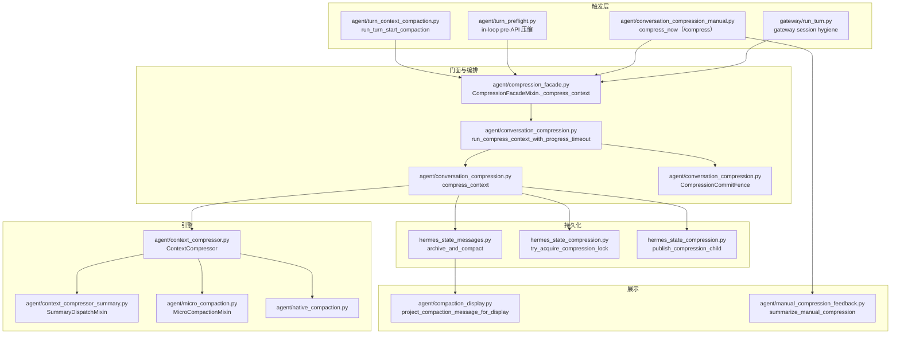
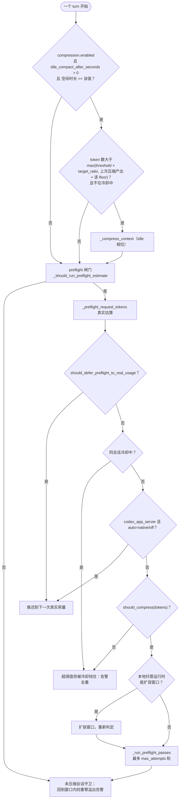
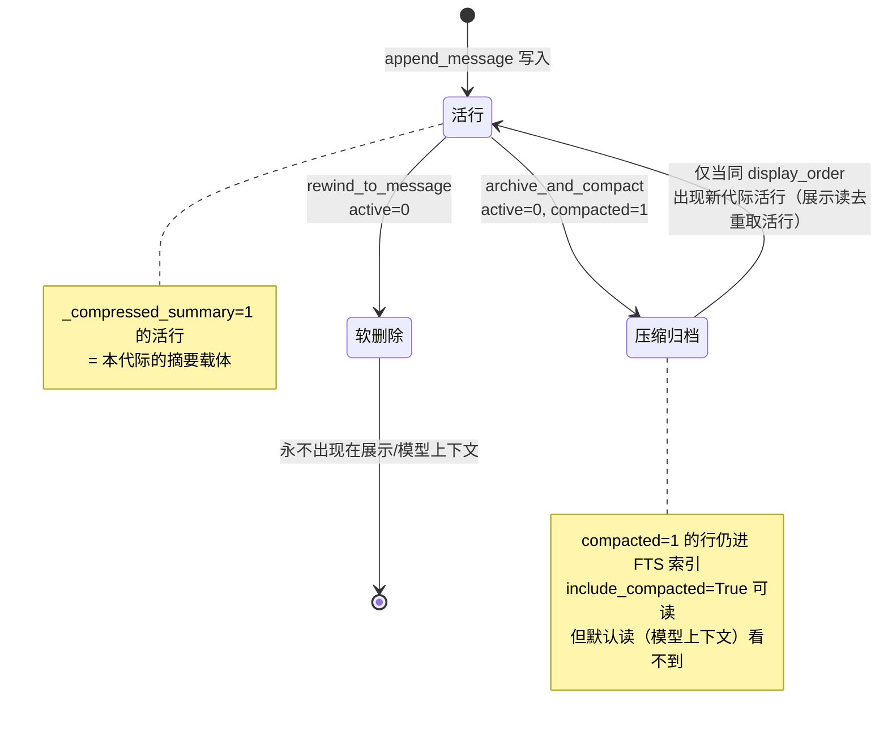

# 17 上下文压缩与缓存保护

> 层：第四层（补齐源码逻辑与技术点）
> 状态：新增（基准 cc0a679f14）
> 编写日期：2026-09-22
> 前置阅读：[16-前端形态与宿主协议](./16-前端形态与宿主协议.md)
> 后续阅读：[README 总目录](./README.md)

> **本版定位记法**：一律「`文件路径` · `符号名` `+N`」，`+0` = 符号定义行，`+N` = 符号体内第 N 行。
> 正文不出现绝对行号。本版基于提交 `cc0a679f14`（2026-09-21）静态分析；**未运行测试套件**，
> 不对「测试是否通过」作声明。所有阈值默认值均读自 `hermes_cli/config_defaults.py` ·
> `Const:DEFAULT_CONFIG` 的 `compression` 段与 `agent/agent_init.py` · `_parse_compression_config`。

## 一、本篇要回答的问题

仓库根 `AGENTS.md` 把「**Per-conversation prompt caching is sacred**」列为「塑造几乎所有设计决策」
的两条不变量之一，并明确写下：

> Anything that mutates past context, swaps toolsets, reloads memories, or rebuilds the system prompt
> mid-conversation invalidates that cache and multiplies the user's cost. We do not do it;
> **the ONE exception is context compression.**

于是本篇要回答三件事：

1. 「缓存前缀」到底是哪些字节？哪些操作会把它打掉？
2. 既然压缩**必然**重写历史，它凭什么被允许？它把破坏控制在了什么范围？
3. 压缩失败、超时、锁竞争时，系统如何做到**宁可停住这一轮也不发超窗载荷**？

`agent/AGENTS.md` 的收尾句是本篇的主线：**"Compression is the sanctioned cache break — keep it the
only one."**

## 二、缓存不变量的准确含义

### 2.1 什么算「缓存前缀」

从 `AGENTS.md`（根）与 `agent/AGENTS.md` 的两处权威表述可以归纳出前缀的三个组成部分：

| 组成 | 权威表述位置 | 约束 |
|---|---|---|
| system prompt | 根 `AGENTS.md`「rebuilds the system prompt mid-conversation」；`agent/AGENTS.md`「The system prompt is **byte-stable for the life of a conversation**」 | 一个会话生命周期内**逐字节稳定** |
| 工具 schema | 根 `AGENTS.md`「swaps toolsets」；`agent/AGENTS.md`「change toolsets」 | 中途换工具集会打掉前缀 |
| 历史消息字节序列 | 根 `AGENTS.md`「mutates past context」 | 历史消息的**已发送字节**不得被改写 |

因此「缓存前缀」= **system prompt + 工具 schema + 历史消息的字节序列**三者的串联。三者中任何一个
字节发生变化，后续所有轮次都要重新按未缓存价计费。

### 2.2 会破坏前缀的操作清单

- 改写历史消息内容（`mutates past context`）；
- 中途切换工具集（`swaps toolsets`）——因为工具 schema 在前缀里；
- 重新加载记忆（`reloads memories`）；
- 重建 system prompt（`rebuilds the system prompt`）。

### 2.3 例外只有压缩；斜杠命令必须「cache-aware」

根 `AGENTS.md` 给这类命令定了唯一合法形态：

> Slash commands that mutate system-prompt state (skills, tools, memory) must be **cache-aware**:
> default to deferred invalidation (takes effect next session) with an opt-in `--now` flag
> (`/skills install --now` is the canonical pattern).

即：**默认延迟失效**（下一次会话才生效），**显式 `--now` 才立即生效**。`/skills install --now`
是 canonical pattern。这条规则不是本篇的展开对象，但它解释了为什么压缩必须「显式、可观测、
可延迟」——它是唯一被批准的前缀改写者，所以它的每一次触发都必须有据可查、有阈值可调、
有失败退路。

### 2.4 压缩凭什么能豁免

因为压缩的目标恰恰是**把前缀变短**：它把旧的历史消息折叠成一条摘要，用一次性的大幅缩短，
换取之后每一轮都更便宜的缓存前缀。破坏是一次性的、显式的；收益是持续的。下面几节说明
这个「一次性破坏」是如何被约束到最小、最可控的。

## 三、压缩模块地图（真实符号）



各模块的真实职责：

| 模块 | 职责 | 代表符号（`+0`） |
|---|---|---|
| `agent/compression_facade.py` | `AIAgent._compress_context` 的宿主侧包装：发布 commit fence、在进度超时下跑快照 worker、把 `_DB_PERSISTED_MARKER` 镜像回活列表、重绑会话上下文 | `CompressionFacadeMixin._compress_context` |
| `agent/conversation_compression.py` | 压缩编排真身：租约/锁、摘要阶段、提交阶段、超时包装、fence、fallback 链、in-place 与 rotation 两条提交路径 | `compress_context`、`run_compress_context_with_progress_timeout`、`CompressionCommitFence` |
| `agent/context_compressor.py` | 默认上下文引擎（`ContextCompressor`）：先无 LLM 剪旧工具结果，再选边界，再用 aux 模型生成结构化摘要 | `class ContextCompressor` |
| `agent/context_compressor_summary.py` | 摘要 LLM 的调用与取消回滚（`SummaryDispatchMixin`） | `SummaryDispatchMixin._summarize_window` |
| `agent/micro_compaction.py` | 逐轮滚动微压缩（默认关） | `MicroCompactionMixin._micro_compact` |
| `agent/native_compaction.py` | Codex / Responses 的服务端原生压缩能力判定 | — |
| `agent/turn_context_compaction.py` | turn 起点的三趟压缩（idle → preflight → 未压缩告警重臂） | `run_turn_start_compaction` |
| `agent/turn_context.py` | 预检纯函数：进度判定、fail-closed、估算闸门、turn boundary 导出 | `compression_made_progress`、`_fail_closed_after_preflight_timeout`、`export_current_turn_boundary` |
| `agent/conversation_compression_manual.py` | 手动 `/compress` 的唯一内核（四个前端共用） | `compress_now` |
| `hermes_state_compression.py` | 状态侧：压缩锁、会话轮租约、冷却/连败计数器、lineage | `SessionCompressionMixin` |
| `hermes_state_messages.py` | 消息侧：`archive_and_compact` 原地归档 | `SessionMessagesMixin.archive_and_compact` |
| `agent/compaction_display.py` | 把「模型可见载体」投影成「客户端可见历史」 | `project_compaction_message_for_display` |
| `agent/manual_compression_feedback.py` | 手动压缩的用户可见文案 | `summarize_manual_compression` |

## 四、触发时机与阈值

### 4.1 真实默认值（读自源码）

`hermes_cli/config_defaults.py` · `Const:DEFAULT_CONFIG` 的 `compression` 段（`agent/agent_init.py` ·
`_parse_compression_config +0` 的默认值必须与之逐项一致，源码注释明写
"Defaults here MUST match DEFAULT_CONFIG"）：

| 配置键 | 默认值 | 含义 |
|---|---|---|
| `enabled` | `True` | 自动压缩总开关（手动 `/compress` 不受它管） |
| `threshold` | `0.50` | 上下文占用超过该比例即触发压缩 |
| `threshold_tokens` | `256_000` | 绝对 token 上限，触发取**比例阈值与该值的较小者**，并按窗口夹紧 |
| `target_ratio` | `0.20` | 保留为「近期尾部」的比例（`tail_mode="legacy"` 时生效） |
| `tail_mode` | `"lean"` | lean 尾部 = `clamp(窗口 × 2.5%, 10_000, 25_000)` 个 token |
| `protect_last_n` | `20` | 至少保留的近期消息条数 |
| `protect_first_n` | `3` | 除 system prompt 外**额外**逐字保留的头部消息数 |
| `min_tail_user_messages` | `1` | 保证存活的真实用户消息数（下限 1） |
| `max_attempts` | `3` | 单轮最多压缩轮次（下限 1、上限 10） |
| `proactive_prune_tokens` | `0` | 主动工具结果剪枝触发点（0 = 关） |
| `proactive_prune_min_result_chars` | `8000` | 剪枝只处理大于该字符数的工具结果 |
| `proactive_prune_min_reclaim_tokens` | `4096` | 一次剪枝至少回收这么多 token 才提交 |
| `abort_on_summary_failure` | `False` | 摘要失败时是否中止而非丢中段 |
| `checkpoint_required` | `False` | 有损压缩前要求记忆 provider 完成 checkpoint |
| `in_place` | `True` | 原地压缩：**不轮换 session id** |
| `idle_compact_after_seconds` | `0` | 空闲压缩（0 = 关，单位秒） |
| `micro_compact` | `False` | 逐轮微压缩（默认关，见第七节） |
| `micro_compact_every_n_turns` | `1` | 微压缩节流：每 N 轮跑一次（下限 1） |
| `micro_compact_defrag_threshold_tokens` | `2000` | 滚动摘要超过该 token 数才重整 |
| `context_timeout_seconds` | `120` | 压缩**空闲**预算（无前进进度即超时） |
| `context_total_ceiling_seconds` | `600` | 压缩**提交前**总上限 |
| `hygiene_hard_message_limit` | `5000` | 网关卫生压缩的消息条数硬限 |
| `hygiene_timeout_seconds` | `30` | 网关卫生压缩空闲预算 |
| `hygiene_total_ceiling_seconds` | `600` | 网关卫生压缩总上限 |
| `hygiene_failure_cooldown_seconds` | `300` | 卫生压缩失败冷却 |
| `hygiene_max_turn_hold_seconds` | `10` | 到达用户轮被卫生摘要占住的最长时间 |
| `codex_gpt55_autoraise` | `True` | Codex gpt-5.4/5.5/5.6 与 gpt-6 Astra 在 ChatGPT Codex OAuth 路由把阈值抬到 **85%** |
| `codex_app_server_auto` | `"native"` | codex app-server 线程压缩由 codex 自己决定 |
| `codex_responses_native` | `False` | 是否启用 Responses 服务端压缩 |

不在用户配置文件里暴露、但写死在源码里的关键数字：

| 常量 | 值 | 位置 |
|---|---|---|
| `MINIMUM_CONTEXT_LENGTH` | `64_000` | `agent/model_metadata.py` · `Const:MINIMUM_CONTEXT_LENGTH` |
| 小窗口阈值下限 | `0.75`（raise-only，窗口 < `512_000` 时生效） | `agent/context_compressor.py` · `Const:_SMALL_CTX_THRESHOLD_PERCENT` / `Const:_SMALL_CTX_WINDOW_LIMIT` |
| 小窗口触发兜底比例 | `0.85` | `agent/context_compressor.py` · `Const:_MIN_CTX_TRIGGER_RATIO` |
| 摘要输出上限 | `min(窗口 × 5%, 10_000)` | `agent/context_compressor.py` · `ContextCompressor.max_summary_tokens +0` |
| lean 尾部下限 / 上限 | `10_000` / `25_000` | `agent/context_compressor.py` · `Const:LEAN_TAIL_FLOOR_TOKENS` / `Const:LEAN_TAIL_CAP_TOKENS` |
| 摘要 token 天花板 | `10_000` | `agent/context_compressor.py` · `Const:_SUMMARY_TOKENS_CEILING` |
| 压缩超时线程池上限 | `4` | `agent/conversation_compression.py` · `Const:_COMPRESS_EXECUTOR_MAX_WORKERS` |
| 压缩锁 TTL | `300.0` 秒 | `hermes_state_compression.py` · `try_acquire_compression_lock` 默认参数 |
| 压缩失败超时预算默认 | `120.0` / `600.0` 秒 | `agent/conversation_compression.py` · `Const:DEFAULT_CONTEXT_TIMEOUT_SECONDS` / `Const:DEFAULT_CONTEXT_TOTAL_CEILING_SECONDS` |
| 网关卫生阈值 | `0.85` | `gateway/run_turn.py`（`threshold_pct=0.85`） |

### 4.2 比例阈值 → token 阈值的真实推导链

`agent/context_compressor.py` · `ContextCompressor.threshold_tokens +0` 是惰性属性，首次访问时依次：

1. 解析窗口：`ContextCompressor._resolve_context_length +0` 调 `get_model_context_length`；
2. **小窗口 raise-only 下限**：`ContextCompressor._effective_threshold_percent +0` ——
   窗口 `< 512_000` 时返回 `max(threshold_percent, 0.75)`，**只抬高不降低**（源码注释：
   "Raise-only small-context threshold floor"）。所以 0.50 的默认值在小于 512K 的模型上
   实际按 75% 触发，避免「半个窗口还空着就压缩」；
3. **换算成 token**：`ContextCompressor._compute_threshold_tokens +0` ——
   基数 = `(context_length − max_tokens) × threshold_percent`，再对 `MINIMUM_CONTEXT_LENGTH`（64_000）
   取 `max`；若地板项生效且超过 `0.85 × 有效窗口`，则回夹到 85%（避免小窗口在 ~98% 才触发）；
4. **绝对上限夹紧**：`ContextCompressor._apply_threshold_tokens_cap +0` ——
   把 `threshold_tokens` 夹到 `min(配置上限, context_length)`，并且**再夹到 aux 摘要模型的窗口**
   （`_aux_context_ceiling`，由可行性探测写入），确保摘要请求本身放得下。

### 4.3 触发点：四个自动入口 + 一个手动入口



- **idle 压缩**：`agent/turn_context_compaction.py` · `_idle_compaction +0`。纯谓词判定在
  `agent/turn_context.py` · `_should_idle_compact +0`：空闲时长 ≥ 阈值、token 数 > 有效 floor、
  不在冷却中，三者缺一不可。有效 floor 会被「上次压缩实际产出」抬高
  （`last_compaction_tokens + floor_tokens`），防止一段已经压过、并未增长的转写每轮空闲都被
  重新摘要一遍（源码注释指 #97239）。
- **turn 起点预检压缩**：`agent/turn_context_compaction.py` · `_preflight_compression +0`。
  先过廉价闸门 `agent/turn_context.py` · `_should_run_preflight_estimate +0`
  （消息条数超过受保护区间，**或**粗糙字符估算已越阈值），再算真实请求压力。
  判定用 `agent/context_compressor.py` · `ContextCompressor` · `should_compress_info +0`，
  其 `reason` 非空即「需要压但被挡」，
  会去重告警（`cooldown:<秒>` / `ineffective` / `structural_backoff:<秒>`）。
- **轮内 pre-API 压缩**：`agent/turn_preflight.py`（在每次真正发请求前）。压缩后若
  `context_compression_timed_out` 为真，则**退还**这次调用计数与预算并结束本轮（`_refund_api_call`）。
- **网关卫生压缩**：`gateway/run_turn.py`，阈值 0.85（刻意高于 agent 的 0.50，作为安全网），
  消息条数硬限 `hygiene_hard_message_limit`。
- **手动 `/compress`**：`agent/conversation_compression_manual.py` · `compress_now +0`，
  传 `force=True`（绕开摘要失败冷却）。四个前端共用同一内核：
  CLI（`hermes_cli/cli_session_mixin.py` · `HermesCLI._manual_compress`）、
  gateway（`gateway/slash_commands_session.py`）、TUI（`tui_gateway/methods_slash.py`、
  `tui_gateway/session_compression.py`）、ACP（`acp_adapter/commands.py`）。
  语法由 `hermes_cli/partial_compress.py` 解析：`/compress [<focus>]`、
  `/compress here [N]`（边界感知，保留最近 N 段）、`--preview`（只预览不压）；
  `--aggressive` 被**显式拒绝**（`Const:AGGRESSIVE_UNSUPPORTED`），因为硬截断没有
  受护栏的持久化路径。最少消息数 `Const:MIN_MESSAGES = 4`。

> **澄清**：当前源码里**没有** `/compact` 这个斜杠命令（`/compact <focus>` 只是
> `compress_context` docstring 里提到的灵感来源）。手动入口是 `/compress`。

## 五、压缩如何保护缓存

### 5.1 原地压缩：不轮换 session id

`compression.in_place` 默认 `True`。`agent/conversation_compression.py` · `compress_context +0`
读出 `agent.compression_in_place`，提交时走原地路径：
**同一个 session id 下**把活行归档、把压缩后的消息作为全新活行插入。因此：

- 没有 `parent_session_id` 链、没有 `name #N` 重编号；
- 压缩前的轮次在同一 id 下被软归档，**仍然可被 `session_search` 搜到**；
- 只有 `in_place=False` 才走旧的 rotation 路径（`publish_compression_child`）。

### 5.2 消息状态位：压缩不是删除

`hermes_state_messages.py` · `SessionMessagesMixin.archive_and_compact +0` 在**一个事务**里：

1. 把当前活行置为 `active = 0, compacted = 1`（「被摘要掉但仍可搜索」）；
2. 把 `compacted_messages` 作为**全新活行**插入；
3. 返回新的活行数（= `message_count`）。

`messages` 表的三个状态位（详见 [08-数据模型与会话存储](./08-数据模型与会话存储.md) 第四节）：

| 状态位 | 取值 | 语义 |
|---|---|---|
| `active` | `1` / `0` | 活行 / 被 rewind 软删除 |
| `compacted` | `1` / `0` | 被压缩归档（摘要掉了但仍可搜索） |
| `_compressed_summary` | `1` / `0` | 该行**本身**是压缩摘要行 |



### 5.3 读侧语义：`get_messages(include_compacted=...)`

`hermes_state_messages.py` · `SessionMessagesMixin._active_clause +0` 定义唯一的三档口径：

| 档位 | 条件 | 用途 |
|---|---|---|
| 审计 | 不加条件（全部行） | 诊断 / 导出 |
| 展示 | `active = 1 OR compacted = 1`（**永不含 rewind 行**） | UI 展示 |
| 默认 | `active = 1` | **模型上下文** |

关键点：**压缩归档的行默认不会进入模型上下文**——这正是「压缩让前缀变短」的落地点。
它们只出现在 `include_compacted=True` 的展示读里，并且展示读会按 `display_order` 分组、
在组内优先取活行去重（否则被保护的尾部会在每个代际里重复出现）。

### 5.4 并发追加安全：watermark

`archive_and_compact` 接受 `watermark`（压缩**开始**时捕获的 `get_active_message_watermark`）：
`id > watermark` 的行是慢速摘要期间新到的追加，**不会被摘要掉**，而是由纯 SQL 列克隆
重新排到压缩集之后。这保证「压缩期间用户/工具仍在写」不会丢数据。

### 5.5 租约与锁：谁有权改写前缀

- `hermes_state_compression.py` · `SessionCompressionMixin.try_acquire_compression_lock +0`：
  按 `session_id` 抢压缩锁；`False` 表示**另一个持有者握着活锁，调用方绝不能压缩**
  （否则会分叉 lineage）。过期锁、或本地 `pid=` 已死的结构化持有者会被透明回收。
  `release_compression_lock +0` 只删自己持有的行（`AND holder = ?`），幂等。
- `refresh_compression_lock +0` 的续期**只看 `holder`，不看 `expires_at`**——这是刻意的：
  一个续期线程短暂卡住的活持有者必须能救活自己仍未被抢走的行。
- 提交时 `archive_and_compact` 会在事务内**再次校验** `lock_holder`；若锁已被抢走，
  抛 `SessionCompressionInProgressError`，**拒绝发布一个过期的压缩**。
- 跨进程的会话串行化另有 `session_turn_leases`（见
  [11-并发模型与生命周期](./11-并发模型与生命周期.md) 第七节），与压缩锁是两个不同层次的保护。

### 5.6 展示投影：模型可见 ≠ 用户可见

压缩后的消息里含「交接脚手架」（handoff），这是给模型看的载体，不该原样给用户看。
`agent/compaction_display.py` · `project_compaction_message_for_display +0` 做投影：
若消息是压缩摘要，则剥掉交接层与内部字段（`tool_calls`、`finish_reason`、`reasoning*`、
`codex_reasoning_items` 等，见 `Const:_COMPACTION_INTERNAL_FIELDS`），只保留真实的前置内容或
活用户请求；纯交接则返回 `None`。消费方包括 `hermes_state_timeline.py`、
`tui_gateway/session_history.py`、`gateway/run_topics.py`、`hermes_cli/web_routers/sessions.py` 等。

## 六、失败时的 fail-closed 语义

这是「压缩是唯一例外」这条豁免的对价：**既然允许破坏缓存，就必须保证破坏不成功时不会
把更坏的东西（超窗载荷）发出去。**

### 6.1 预检超时：宁可停住这一轮

- 异常类型：`agent/turn_context.py` · `class PreflightCompressionTimedOut +0`。
- `agent/turn_context.py` · `_fail_closed_after_preflight_timeout +0`：
  **只有当这次请求模型根本收不下**（`request_exceeds_model_window` 为 `True`，或窗口未知）
  才抛异常停住；若请求只是**高于压缩阈值但仍在窗口内**，则原样发送（源码注释指
  #113646 / #114594——否则一个慢摘要器会把一个本来还能跑的会话变成永远跑不动的会话）。
- `agent/turn_context.py` · `_fail_closed_on_insufficient_progress +0`：
  压缩跑了但没回收（或不到 5%）、请求仍在窗口之上时，带「请 `/new`」的指引停住，
  而不是把必然被拒的请求发给 provider（源码注释指 #116472：131K 窗口上 ~356k tokens）。
  只有 `request_exceeds_model_window` 为 `True` 才 fail closed；被冷却挡住的跳过是
  **defer 而非不可压缩的证据**，保留其 typed cooldown 结果。

### 6.2 进度判定：`compression_made_progress`

`agent/turn_context.py` · `compression_made_progress +0`（`+15` 的 return）：

```python
return new_len < orig_len or (orig_tokens > 0 and new_tokens < orig_tokens * 0.95)
```

即：**行数变少**，或**同样行数但 token 掉了 >5%** 才算有进展。源码注释明确说明理由：
压缩可以靠「摘要内容」而不是「减少行数」取胜，只认行数会对 size-only 的胜利误报
"Can't compress further"（#39548 的实例：220 → 220 条消息、~288k → ~183k tokens
在 1M 窗口模型上仍触发自动重置）。5% 地板与溢出重试路径一致，防止亚 5% 的抖动让多轮循环空转。

### 6.3 是否值得再压一轮：`_compression_warrants_another_preflight_pass`

`agent/turn_context.py` · `_compression_warrants_another_preflight_pass +0`（`+5` 的 return）：
**仍高于阈值** 且 **上一轮 token 削减 >5%** 才继续下一轮。多轮上限由
`agent.max_compression_attempts` 决定（= `compression.max_attempts`，默认 3）：
`agent/turn_context_compaction.py` · `_run_preflight_passes +0` 的 `+30` 处
`max(1, int(agent.max_compression_attempts or 3))`。

### 6.4 超时包装：进度感知，提交不放弃

`agent/conversation_compression.py` · `run_compress_context_with_progress_timeout +0`：

- 预提交阶段受两个预算约束：**空闲预算**（`context_timeout_seconds`，默认 120s，
  以「最后一次前进进度」起算）与**总上限**（`context_total_ceiling_seconds`，默认 600s）；
- **已获准入的提交永不放弃**：越过上限只记 WARNING/ERROR 并通过 `on_commit_overrun`
  告警一次，宿主继续等（`_warn_commit_overrun`，`agent/compression_facade.py`）；
- 若这次请求**本身超窗**（`request_exceeds_window`），则总上限被压到**一个空闲预算**
  （`+34` 处 `ceiling = idle`），避免 600s 涓流把 Desktop 冻 10 分钟；
- 空闲超时会先尝试 `auxiliary.compression.fallback_chain` 上的**一次**重试（`new_fence`
  发布新 fence），失败后才走 `on_timeout`；
- 池满时**拒绝入队**而不是排队（`_try_admit_compression_job`），因为排队任务会耗完自己的
  预算再以陈旧身份运行（#76354）。

### 6.5 压缩失败如何向用户呈现

- 自动压缩超时：`agent/compression_facade.py` · `_report_compression_timeout +0` 发一条
  明确文案——「⚠ Context compression timed out after {N}s with no output from the summary
  model. **No messages were dropped** — continuing without compression. Run /compress to
  retry, /new for a clean session, or check auxiliary.compression.」
- 手动压缩：`agent/manual_compression_feedback.py` · `summarize_manual_compression +0`
  产出 headline / token_line / note，覆盖五种结果：正常压缩、无变化、**中止**（`_last_compress_aborted`）、
  **拒绝**（摘要比被替换内容更大，`_last_compress_refused_would_grow`）、
  **用了 fallback**（`_last_summary_fallback_used`，会报出丢弃了多少条）。
  失败原因经 `redact_sensitive_text(..., force=True)` 强制脱敏后才出到 UI。
- 锁竞争：`describe_compression_lock_skip +0` 区分「另一个压缩确证在跑（带 holder）」与
  「抢锁失败但无法证明有压缩在跑」两种措辞——因为 `try_acquire_compression_lock`
  会吞掉 `sqlite3.Error`，抢锁失败**不等于**有压缩在跑。
- 预检超时：`agent/conversation_loop.py` 返回 typed 恢复结果
  （`turn_exit_reason="context_compression_timeout"`、`failure_reason="context_overflow"`、
  `failure_retryable=False`），文案即异常文本，**不带 `_COMPRESSION_TIMEOUT_FINAL_RESPONSE`**
  ——那是「压缩跑了但压不下去」的另一种状态。

### 6.6 反抖动（anti-thrash）

`ContextCompressor._tripped +0`：**连续两次无效压缩，或连续两次 fallback 摘要**即跳闸，
`should_compress_info` 返回 `(False, "ineffective")`，调用方去重告警。
另有 `_summary_failure_cooldown_until`（同会话摘要失败冷却）与
`_structural_no_op_backoff_until`（结构性空转退避）。冷却与连败计数是**持久化**的
（`hermes_state_compression.py` 的 `record_compression_failure_cooldown` /
`get_compression_fallback_streak` / `get_compression_ineffective_count` 等），
因此跨进程/跨重启都不会失效。

## 七、micro-compaction

### 7.1 它是什么，为什么默认关

`agent/micro_compaction.py` 的模块 docstring 开门见山：

> Rolling per-exchange summarization that folds old user/assistant exchanges into a single
> summary marker between turns. **OFF by default: every pass rewrites the prompt prefix and
> breaks the provider prompt cache.**

`agent/agent_init.py` · `_parse_compression_config` 把 `micro_compact`（默认 `False`）等三项
写入压缩器：`_micro_compact_enabled`、`_micro_compact_every_n_turns`（默认 1）、
`_micro_compact_defrag_threshold_tokens`（默认 2000）。

`hermes_cli/config_defaults.py` 的注释解释了默认关的理由：

> Off by default because every pass rewrites sent history and **breaks the prompt-cache prefix
> EVERY turn**; enable only if the amortized stall beats the cached-prefix discount.

节流门：`MicroCompactionMixin._micro_compact +0` 的 `+9~+14` 处，每 N 轮才跑一次
（每跑一次 = 一次缓存前缀破坏）。

### 7.2 与 turn boundary 标记的顺序关系

这是本篇要核实的第二个概念。真实落点：

- micro-compaction 由 `agent/turn_finalizer.py` · `_micro_compact_after_turn +0` 触发，
  调用在 `+19` 处 `_compressor._micro_compact(messages)`；它**在 `finalize_turn` 内部**、
  **持久化之前**运行，把最旧的未吸收轮次折叠进滚动摘要，并调
  `archive_and_compact` 同步到 DB。
- turn boundary 由 `agent/turn_context.py` · `export_current_turn_boundary +0` 导出。
  调用点在 `agent/conversation_loop.py` · `run_conversation +0` 的 `+43` 处。
  而 `finalize_turn` 的调用在**另一个函数**里：`agent/conversation_loop.py` ·
  `_run_conversation_turn +0` 的 `+146` 处。`run_conversation` 先调
  `_run_conversation_turn`（`+28` 附近），返回后才调 `export_current_turn_boundary`。

因此顺序是 **micro-compaction → `finalize_turn` 落库 → `export_current_turn_boundary`**。
这正是 `export_current_turn_boundary` docstring 强调的：

> Hosts that settle their own transcript by index (hermes-webui) must never guess which row is
> the current user turn after this loop rewrote history (**alternation repair, compaction,
> post-turn micro-compaction**): a guessed index or a text match can relabel an identical
> historical prompt and claim its old answer as this turn's.

即：boundary 导出**必须**在历史改写之后，按最终列表重算 `current_turn_user_idx`，
并只在「被寻址的那一行就是本轮的 verbatim 用户消息」时才写入
`{turn_id, current_turn_user_idx}`，否则省略键、让宿主 fail closed。
预检超时的信封不带本轮用户行，因此**什么都不导出**。

```mermaid
sequenceDiagram
    participant Loop as agent/conversation_loop.py
    participant Fin as agent/turn_finalizer.py
    participant Mic as agent/micro_compaction.py
    participant DB as hermes_state_messages.py
    participant Exp as agent/turn_context.py

    Loop->>Fin: finalize_turn（turn 结束）
    Fin->>Mic: _micro_compact(messages)（默认关）
    Mic->>Mic: 折叠最旧一轮 → 滚动摘要 marker
    Mic->>DB: archive_and_compact + stamp_db_persisted_markers
    DB-->>Mic: 活行数
    Mic-->>Fin: 新消息列表
    Fin-->>Loop: result（messages 已改写）
    Loop->>Exp: export_current_turn_boundary(agent, result, user_message)
    Exp->>Exp: 在最终列表上重算 current_turn_user_idx
    Exp-->>Loop: 写入 {turn_id, current_turn_user_idx} 或省略
```

### 7.3 其他细节

- micro marker 是 `role="assistant"` 的摘要消息，带
  `Const:COMPRESSED_SUMMARY_METADATA_KEY` 与 `Const:MICRO_COMPACT_MARKER_KEY`；
  **用户轮永不被吸收**（保持严格角色交替与用户原文）。
- 累积摘要只保留最新 marker，且只丢**带 `MICRO_COMPACT_MARKER_KEY`**（可证明已被吸收）的旧 marker；
  批量压缩的 marker 承载更多历史，不会被 micro 丢掉。
- 摘要失败在同一游标连续
  `Const:_MICRO_COMPACT_MAX_CONSECUTIVE_FAILURES` 次后**跳过该轮次**（避免每轮 busy-loop）。
- `compression.checkpoint_required` 开启时 micro-compaction 被**强制关闭**
  （`agent/agent_init.py` 的告警分支），因为它没有 pre-compress checkpoint 钩子。

### 7.4 相关文档

`website/docs/developer-guide/micro-compaction.md` **存在**（本版实测），是 micro-compaction 的
长文背景。注意：仓库根 `docs/` 目录下的同名 micro-compaction 文档 **在 HEAD 中已不存在**
——`docs/` 目录已被清空（见更新规范 5.7 节），不要引用那条旧路径。

## 八、与本库其他篇目的关系

| 主题 | 本篇 | 相邻篇目 |
|---|---|---|
| 消息状态位 `active` / `compacted` / `_compressed_summary`、`get_messages` 参数 | 只讲压缩语义（第五节） | [08-数据模型与会话存储](./08-数据模型与会话存储.md) 第四、六节（权威） |
| `compression_locks` 表、`session_turn_leases` 表 | 只讲压缩锁的用途与提交期校验（5.5） | [08-数据模型与会话存储](./08-数据模型与会话存储.md) 第八节、[11-并发模型与生命周期](./11-并发模型与生命周期.md) 第七节 |
| durable turn lease 与压缩的关系 | 一句话带过 | [11-并发模型与生命周期](./11-并发模型与生命周期.md) 第七节（权威） |
| 缓存不变量本身 | 只引用根 `AGENTS.md` 原文（第二节） | 根 `AGENTS.md` |

## 九、本篇结论

1. **缓存前缀 = system prompt + 工具 schema + 历史消息字节序列**，三者逐字节稳定；唯一被
   批准的改写者是上下文压缩（根 `AGENTS.md` 原话），其余修改 system prompt 状态的斜杠命令
   必须 cache-aware（默认延迟失效 + `--now`）。
2. **压缩的破坏被限制在「一次性的、可观测的、可回退的」范围内**：默认 `in_place=True` 不轮换
   session id；被压缩的行是**软归档**（`active=0, compacted=1`）而不是删除，默认读不到、
   展示读与 `session_search` 仍可见；`watermark` 保证慢摘要期间的新追加不丢。
3. **阈值真实默认值**：比例阈值 `0.50`（窗口 < 512K 时 raise-only 抬到 `0.75`），绝对上限
   `256_000` tokens，换算基数对 `MINIMUM_CONTEXT_LENGTH = 64_000` 取 max 并在小窗口回夹到
   `0.85`；保留尾部 `protect_last_n = 20`、额外头部 `protect_first_n = 3`；
   `max_attempts = 3`；压缩超时 `120s` 空闲 / `600s` 总上限；网关卫生阈值 `0.85`。
4. **fail-closed 只在「请求真的收不下」时生效**：超窗（或窗口未知）才抛
   `PreflightCompressionTimedOut` 并停住这一轮、不发未改动的载荷；仅仅高于压缩阈值的请求
   仍原样发送。进度判定要求「行数变少」或「token 降 >5%」。
5. **micro-compaction 默认关**，因为它每轮都重写前缀；开启后它在 `finalize_turn` 内部、
   `export_current_turn_boundary` 之前运行，因此 boundary 索引总是在最终列表上重算。

---

[上一篇 · 16-前端形态与宿主协议](./16-前端形态与宿主协议.md) ｜ [总目录](./README.md) ｜ [下一篇 · 回到总目录](./README.md)
