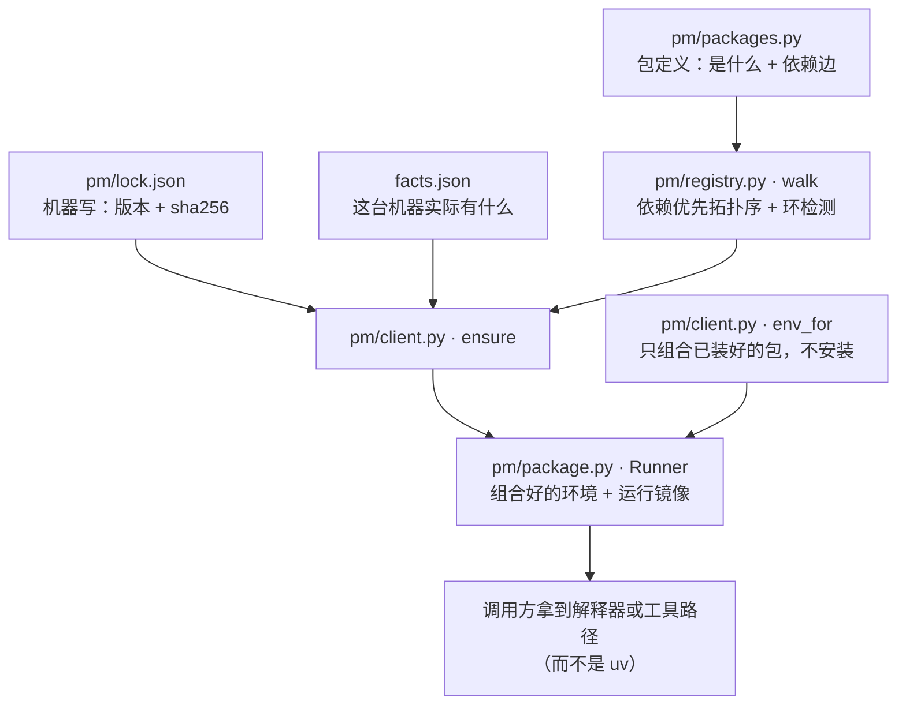
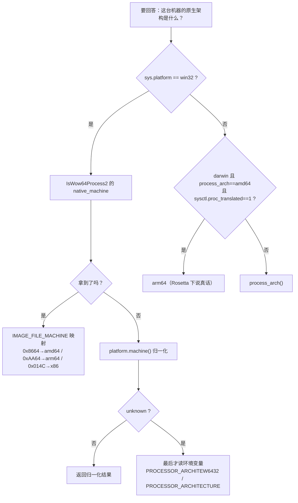

# 18 依赖管理与平台探测

> 层：第四层（补齐源码逻辑与技术点）
> 状态：新增（基准 `e1fdf003a6`）
> 编写日期：2026-10-05
> 前置阅读：[17-上下文压缩与缓存保护](./17-上下文压缩与缓存保护.md)
> 后续阅读：[README 总目录](./README.md)
> **本版定位记法**：一律「`文件路径` · `符号名` `+N`」，`+0` = 符号定义行，`+N` = 符号体内第 N 行。
> 正文不出现绝对行号。本版基于提交 `e1fdf003a6`（2026-10-05）静态分析；**未运行测试套件**，
> 不对「测试是否通过」作任何声明。

## 一、本模块目标

本库前 17 篇覆盖了 Agent 核心、工具、网关、状态、配置、调度、并发、压缩、前端与部署。
**两个一级子系统此前完全没有专篇**，而它们各自都是自带 `AGENTS.md` 的独立领域：

| 子系统 | 规模 | 一句话职责 |
|---|---|---|
| **`pm/`** | 55 文件 / 49 py | **依赖与环境管理器**（Package Manager）：Hermes 依赖的一切——工具二进制、Python venv、`node_modules`、插件——都是**同一棵依赖树里的包** |
| **`hermes_platform/`** | 14 文件 | **机器事实 + 可执行文件查找**：本机是什么机器、某个程序在哪、它能不能跑 |

两者在仓库根 `AGENTS.md` 的 `## Routing Table` 里各占一行，是**官方认可的一级路由目的地**：

```
| `pm/`, `pyproject.toml`   | `pm/AGENTS.md`             | pinning policy, PM-owned environments, plugin quarantine |
| `hermes_platform/`        | `hermes_platform/AGENTS.md` | host facts, resolvers                                    |
```

读完本篇你应能回答：**改依赖该走哪条命令（而不是裸 pip/uv）**、**为什么探测机器架构不能用
`PROCESSOR_ARCHITECTURE`**、**为什么 `hermes_platform` 的查找是分三档的**。

## 二、`pm/`：把「Hermes 依赖的一切」统一成包

### 2.1 三个文件回答三个不同的问题

`pm/__init__.py` 的模块 docstring 给出了整套设计的最短表述，值得逐句读：

| 文件 | 回答的问题 | 谁写 |
|---|---|---|
| `pm/packages.py` | 一个包**是什么**（声明式定义 + 依赖边） | 人手写 |
| `pm/lock.json` | **确切的版本与哈希**是什么 | **机器写** |
| `facts.json`（每次安装一份） | 这台机器上**实际有什么** | 安装过程写 |

三者的关系是本模块的全部内容：`ensure(name)` 的工作就是**让「实际有什么」与「锁文件说该有什么」
一致**，然后返回一个带好环境的 `Runner`。



### 2.2 门面是 **PEP 562 惰性**的，且不能改用 `importlib`

`pm/__init__.py` 不是普通的 re-export 文件，而是一张 `_EXPORTS` 表 + 一个 `__getattr__`：

```python
_EXPORTS = {
    "pm.install": ("activate", "check", "drift", "enabled_extras", "env_for", ...),
    "pm.client":  ("ensure", "sync_venv", "build_environment", "lock_project", ...),
    ...
}
_HOME = {name: module for module, names in _EXPORTS.items() for name in names}

def __getattr__(name: str):
    module = _HOME.get(name)
    if module is None:
        raise AttributeError(f"module 'pm' has no attribute {name!r}")
    # Not importlib.import_module: tests patch that globally and the facade must keep resolving.
    __import__(module)
    value = getattr(sys.modules[module], name)
    globals()[name] = value
    return value
```

**为什么必须惰性**（docstring 原话）：`pm.environments` **在进程启动时运行，早于任何依赖可被 import**，
所以它绝不能把 downloader / ensure 那套机器一起拖进来。

> ⚠️ 代码里那句注释是个**真实陷阱**：门面**故意用内建 `__import__` 而不是
> `importlib.import_module`**，因为测试会全局 patch `importlib.import_module`，而门面必须继续可解析。
> 谁把这里「清理」成 `importlib.import_module`，谁就会让测试挂掉——注释已写明原因，别删。

### 2.3 内置包目录也是惰性注册的

`pm/registry.py` · `_builtins_loaded +0` 的 docstring 说明了同一个权衡：

> Register the built-in definitions on first read, not on `import pm`.
> Process boot imports `pm.environments` before any dependency is importable;
> pulling the whole package catalogue (downloader, network) in with it would
> **cost every launch ~40ms** and break the stripped payloads that ship only the
> pre-import files.

`_BUILTIN_MODULES = ("pm.packages", "pm.security_packages")`。

`walk +0` 是**依赖优先的拓扑序**，并显式检测依赖环（`dependency cycle: a -> b -> a` 直接抛 `ValueError`）。

### 2.4 包的三种形态

`pm/package.py` 里几个类不是随意命名，各自代表一类**根本不同**的东西：

| 类 | 是什么 | 值得注意的设计 |
|---|---|---|
| `Package` | 普通包（「Subclass and register」；常见情况声明式，复杂情况覆写） | 用 `@register` 装饰器注册 |
| `DebPackage` | 由 **`ar` + `tar` 解包**的 `.deb` 制品 | docstring 明写 **never `dpkg`, never package scripts**——不解包不执行包脚本，避免在用户机器上跑发行版安装逻辑 |
| `StatePackage` | **不是制品，而是本次安装的一个「状态」**（就是 Python venv 本身） | `tool_roots +0` 的 docstring 特意提醒「The venv is not one of them」——venv 不该被当成工具根发布 |

`Runner +0` 的 docstring 一句话定义它的角色：**「What `ensure()` hands back: a composed
environment and a run mirror.」**

`compose_env +0` 的合成规则是 **「Dependents win over their dependencies for every key」**——
依赖方的环境变量覆盖被依赖方的。

### 2.5 锁文件格式里藏着的三个决定

`pm/lock.py` 的模块 docstring 是全篇信息密度最高的一段，它记录了三个**用血换来的**决定：

**① 一个 target 的值可能是单个对象，也可能是一个列表。** 当包被拆在多个归档里、而它们必须落到
**同一个目录**时，值就是一个列表。原文举的例子非常具体：

> llama.cpp's engine zip and its cudart zip: **Windows resolves a DLL from the
> loading executable's own directory**.

读回来时两种形状**统一按列表处理**。

**② 锁文件里存的是「已解析的 url」而不是模板。** 原文：

> lock.json artifacts carry the RESOLVED url beside the hash: the lockfile is
> **the complete machine interface (nix reads it as pure data)**, and the python
> url templates are consulted only at `pm lock --bump` time.

还有 `"any"` 这个特殊 target key，覆盖**与 target 无关**的制品（原文例子：npm 的 tarball）。

**③ 一份坏掉的 state 文件是「证据」而不是「垃圾」。** 这是 `pm/lock.py` · `_read +0` 里
一个反直觉的分支，注释写得极好：

```python
# An unparsable-but-nonempty state file is evidence, not garbage:
# the next _write would silently discard every installed-state
# record. Keep the bytes for post-mortem.
```

于是它把内容另存为 `.corrupt` 后缀。**如果这里「顺手清理」掉，你会永久丢掉全部装机记录。**

另外 `facts.json` 的 env 值里存的是 `{{store}}` 模板（`Const:STORE_TOKEN`），
这样**一个在 CI 里构建出来的 facts 文件可以靠字符串替换适配到任意机器**。

### 2.6 包目录现状（实测）

`pm/packages.py` 注册 **19 个**包：

```
dmgbuild  uv  python  venv  node  termux-docker  npm  git  gh  ffmpeg
ripgrep  cua-driver  agent-browser  chromium
llamacpp-cuda  llamacpp-vulkan  llamacpp-hip  llamacpp-metal  llamacpp-cpu
```

`pm/security_packages.py` 另有 **3 个**：`bws`、`tirith`、`iron-proxy`。

注意 `llamacpp-*` 是**同一个东西的五个 GPU 后端变体**（cuda / vulkan / hip / metal / cpu）——
这正是 §2.5 ① 里「同一目录多归档」那套机制的服务对象。

### 2.7 命令面

`pm/cli.py` 注册 **9 个子命令**（经 `hermes pm` 暴露）：

| 子命令 | 用途 |
|---|---|
| `lock` | 重新生成 / 更新 `lock.json`（`--bump` 时才查 python url 模板） |
| `install` | 安装 / 同步（setup 路径） |
| `env` | 环境相关查询 |
| `doctor` | 诊断 |
| `repair` | **修复损坏的依赖** |
| `gc` | 回收 |
| `bundle` | 打包制品 |
| `status` | 状态 |
| `update` | 更新 |

`pm/AGENTS.md` 给出的**权威调用约定**：

- 改 `pyproject.toml` 后：`hermes pm lock` → **重新 `source ./activate`** → 把 `pyproject.toml`
  与 `uv.lock` **一起提交**；
- 声明式运行时 extra 用 `pm.sync_venv(['extra'], explicit=True)`；
- 新构建产物用 `pm.build_environment`；隔离的工具环境用 `pm.ensure_environment`；
- **调用方拿到的是「解释器或工具路径」，不是 uv**；
- 🚫 **禁止用裸 pip / uv 改动 Hermes 环境**（`Do not mutate Hermes environments with raw pip or uv.`）。

### 2.8 钉版策略（为什么每个依赖都有上界）

`pm/AGENTS.md` 开篇就是这条，且给出了**两个真实事故**作为理由（litellm 供应链事件 #2796/#2810；
2026 年 5 月的 Mini Shai-Hulud 蠕虫）：

| 场景 | 要求 |
|---|---|
| PyPI | `>=floor,<next_major`（例：`"httpx>=0.28.1,<1"`） |
| pre-1.0 包 | `<0.(minor+2)`（例：`>=0.29,<0.32`） |
| Git URL | **40 位 commit SHA** |
| GitHub Actions | SHA + `# vN` 注释 |
| 仅 CI 用的 Python 依赖 | `==exact` |

**一个裸的 `>=X.Y.Z` 会被 CI 和 reviewer 拒绝。**

### 2.9 14 天隔离区，以及它为什么只覆盖 core

`pm/AGENTS.md` 记录了一条**容易误传**的规则。`[tool.uv] exclude-newer = "14 days"` 这条隔离
**只覆盖 Hermes 自己的依赖**（core `uv.lock` 里的每个 registry 包）。

插件的 `python_dependencies` 走**插件自己的策略**。机制在
`pm/workspace.py` · `_core_release_quarantine +0`（docstring：「Scope core's `exclude-newer` to the
packages in core's own lock.」）：**PM 生成插件 workspace 时，把全局 cutoff 挪到每个 core 已锁的包上**，
于是纯插件包不被过滤，而**插件依然无法把某个 core 包拖出窗口**。

维护者的原话（`pm/AGENTS.md` 直引）：

> "plugins dont have to abide by our 14 day rule … Only hermes' dependencies themselves have to."

对插件作者是**推荐而非强制**——文档与 `plugin-catalog/README.md` 承载该建议。

## 三、`hermes_platform/`：机器事实与可执行文件查找

### 3.1 一条硬规则

`hermes_platform/AGENTS.md` 的第一句就是命令式的：

> **Machine facts and resource lookup go through `hermes_platform`.**

这不是风格建议，是**有测试兜底的强制**：

> A new bare `shutil.which` or a hand-written known-path table outside
> `hermes_platform/` **fails `tests/test_managed_runtime_resolution.py` unless
> allowlisted with a reason**; resolvers land in `hermes_platform/resolver/`.

同时还有一条同样重要的边界：**Lookup never installs, downloads, or starts anything.**
（查找永不安装、不下载、不启动任何东西——这与 `pm/` 的职责严格分工。）

### 3.2 原生架构探测：一个必踩的坑

`hermes_platform/host/facts.py` · `windows_native_arch +0` 的 docstring 直接点名了陷阱：

> Order matters: **`PROCESSOR_ARCHITECTURE` reads `AMD64` inside an x64-emulated process
> on ARM64 hardware**, so the environment is consulted only when both APIs are unavailable.

也就是说，在 ARM64 机器上跑 x64 模拟进程时，`PROCESSOR_ARCHITECTURE` 会**撒谎说自己是 AMD64**。
正确的优先级是：



macOS 侧有对称的处理：`_darwin_translated +0` 读 `sysctl.proc_translated`，
`native_arch +0` 在「进程自称 amd64 但被翻译」时返回 `arm64`。

### 3.3 事实**不接受环境变量输入**

`hermes_platform/AGENTS.md` 强调了这一点，理由是安全：

> Facts are cached per process and take **no environment-variable input**, so a
> hardware recognizer (`hermes_platform/host/products.py`) **cannot be set from a shell**.

（唯一的例外是 §3.2 里那个**兜底**路径：只在两个 Windows API 都拿不到时才读 env。）

所有事实都是 `@functools.cache`，`clear_caches +0` 一次性清掉全部。`hermes_platform/host/facts.py` 提供：

`os_family` · `process_arch` · `native_arch` · `cpu_model` · `cpu_vendor` · `ram_total_bytes` ·
`gpu_class` · `interactive_session`。

两个值得记的细节：

- **`gpu_class +0` 只读 sysfs / 注册表 / sysctl，绝不 fork 子进程、绝不加载驱动库**
  （docstring 明写）。在混合显卡机器上 `classify_gpu_vendors +0` 让**独显优先于核显**
  （`_GPU_PRIORITY = ("nvidia", "amd", "intel")`）。
- **`hermes_platform/host/products.py` 的识别函数是纯函数**：`looks_like_nvidia_arm_soc(*, native_arch, cpu_model,
  cpu_vendor)` 把事实**当数据传入**，而不是自己去读机器。这正是
  `tests/AGENTS.md` § Don't fake the host OS 要求的形状——可以在一台机器上测所有分支。
  （N1X 靠 **CPU 字符串**识别，因为 docstring 说明**机箱厂商识别不出 SoC**。）

### 3.4 三个「机器」必须分清

`hermes_platform/AGENTS.md` 用一句话划了界：

> Distinguish the **control host** (where this Python runs) from the **terminal execution target**
> (SSH/container) and the **Desktop client** (another machine): **`host.*` answers only the first.**

这是**极容易搞错**的一点：Hermes 可以在一台机器上跑、通过 SSH 在另一台机器上执行命令、
而用户又在第三台机器上看 Desktop 界面。「本机事实」只描述**跑 Python 的这个进程所在的那台机器**。

### 3.5 查找分三档（副作用逐级放大）

`hermes_platform/resolver/base.py` 的 docstring 用三行定义了三个档位，**这是本模块最值得学的设计**：

| 档 | 允许做什么 |
|---|---|
| `locate` | **只读文件元数据** |
| `inspect` | 可以**打开文件、在本进程内调用 OS API** |
| `probe` | **每次都是新鲜的、永不缓存**，且是**唯一**可以开 socket 或起子进程的档 |

配套的 `Effort` 枚举把 `probe` 的权限再分三级，注释写得很精确：

> `NETWORK` **never implies subprocess**; `DIAGNOSTIC` alone may spawn.

即：能联网 ≠ 能起进程；只有 `DIAGNOSTIC` 才允许 spawn。

还有一处**刻意的防御**：`Probe.__bool__ +0` 直接抛异常——

```python
def __bool__(self) -> bool:  # pragma: no cover - the raise is the behavior
    raise TypeError("Probe is not a boolean; read .running/.answering")
```

这样 `if probe:` 不会**静默地恒为真**（一个非空 dataclass 默认是 truthy），
强制调用方去读 `.running` / `.answering`。注释里 `the raise is the behavior` 说明
**「抛出」本身就是被测试断言的行为**，不是防御性代码。

### 3.6 声明式需求：`declaration.py`

`hermes_platform/declaration.py` 解析并注册**应用需求声明**，供 **MCP 与 skill 的
「提供时门控」（offer-time gates）共用**。它把两件事**刻意分开**——`RequiresSpec +0` 的
docstring 给了理由：

> Separate from `app` on purpose: **one is data, one is policy.**

| 类型 | 含义 |
|---|---|
| `AppSpec` | 应用**在哪**（每个可检测的 OS 一个 `AppDef`）——**数据** |
| `RequiresSpec` | 服务被提供**之前需要什么**（`app` / `min_version` / `gpu`）——**策略** |
| `Declaration` | 两者解析后的合并体，满足 `hermes_platform.resolver.availability._HasRequirements` |

校验很严（全部抛 `DeclarationError`），且有几条**跨字段**规则值得注意：

- `app.<os>.version.kind` 必须与其 OS 匹配：`pe_resource` / `uninstall_registry` **只在 win32**，
  `plist` **只在 darwin**；
- `requires.min_version` 必须同时满足：`requires.app: true`，**且**该 app 在对应 OS 上有版本来源
  （`version.kind` 不能是 `none`）；
- `app.<os>.location` 必须是绝对路径或以 `~` / `%VAR%` / `$VAR` 开头，**不得含 `..`、不得是 URL**；
- `requires.gpu` 目前**只接受 `nvidia`**，且代码里写明了为什么：

> Only NVIDIA: `facts.gpu_class()` reports the **highest-priority vendor present**, which answers
> "is an NVIDIA GPU here" exactly and **would not answer it for AMD or Intel on a machine that
> also has an NVIDIA GPU**.

用户可见措辞由 `gpu_label +0` 统一（`GPU_LABELS = {"nvidia": "an NVIDIA GPU"}`）。
注册表是线程安全的（`_REGISTRY_LOCK`），并在每次增删时回调 `on_change`。

## 四、易错点与边界条件

1. **改依赖不许用裸 pip / uv**：`pm/AGENTS.md` 明文禁止；改 `pyproject.toml` 后要
   `hermes pm lock` + 重新 `source ./activate` + 把 `pyproject.toml` 与 `uv.lock` 一起提交。
2. **`pm/__init__.py` 的 `__import__` 不能换成 `importlib.import_module`**——测试会全局 patch 后者，
   门面必须继续可解析（代码注释已写明）。
3. **`pm/registry.py` 的内置包是「首次读取时」注册的**，不是 `import pm` 时。改成 eager 注册会
   让**每次启动多花约 40ms**，并破坏只发「预导入文件」的裁剪版载荷。
4. **`pm/package.py` 的 `DebPackage` 永不用 `dpkg`、永不执行包脚本**——走 `ar` + `tar` 解包。
5. **`StatePackage`（venv）不是工具根**：`tool_roots` 特意把它排除在外。
6. **锁文件里一个 target 的值可能是列表**（同目录多归档），读回来统一按列表处理；
   `"any"` 键表示与 target 无关的制品。
7. **`pm/lock.py` 的 `.corrupt` 分支不是垃圾回收**：无法解析但非空的 state 文件被留作证据，
   因为下一次 `_write` 会**静默丢弃全部装机记录**。
8. **`PROCESSOR_ARCHITECTURE` 在 ARM64 上的 x64 模拟进程里会说自己是 `AMD64`**——
   必须优先用 `IsWow64Process2`（见 §3.2）。
9. **`hermes_platform` 的事实不接受环境变量输入**，因此**硬件识别不能被 shell 影响**。
10. **`host.*` 只描述「跑 Python 的这台机器」**，不描述 SSH/容器执行目标，也不描述 Desktop 客户端。
11. **在 `hermes_platform/` 之外新写裸 `shutil.which` 或手搓 known-path 表会挂测试**
    （`tests/test_managed_runtime_resolution.py`），除非带理由进白名单。
12. **`hermes_platform` 的查找永不安装/下载/启动**——那是 `pm/` 的职责。
13. **`resolver` 的 `probe` 档永不缓存且是唯一能开 socket / 起进程的档**；
    `Effort.NETWORK` **不蕴含**子进程权限。
14. **`Probe` 不能用布尔判断**（`__bool__` 会抛 `TypeError`），必须读 `.running` / `.answering`。
15. **`requires.gpu` 只支持 `nvidia`**，因为 `gpu_class()` 报的是「优先级最高的在场厂商」，
    这个语义只对 NVIDIA 是精确的。

## 五、本模块结论

- **`pm/` 是「Hermes 依赖的一切」的统一包系统**：包定义（人手写）、锁文件（机器写）、装机事实
  （安装时写）三者分离，`ensure()` 负责让后两者一致；门面与内置目录都**惰性**，因为
  `pm.environments` 跑在任何依赖可 import 之前。
- **`hermes_platform/` 是「机器事实 + 查找」的唯一入口**，有测试兜底；它的核心设计是
  **按副作用分档**（locate → inspect → probe），以及**把事实当数据传入**以便测试所有分支。
- 两者的分工是干净的：**`hermes_platform` 只回答「有没有、在哪、能不能跑」，`pm` 才负责「装」**。

---

**导航**：[上一篇 · 17-上下文压缩与缓存保护](./17-上下文压缩与缓存保护.md) ｜ [总目录](./README.md) ｜ [下一篇 · 回到总目录](./README.md)
